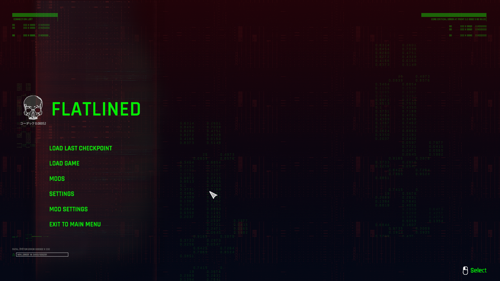
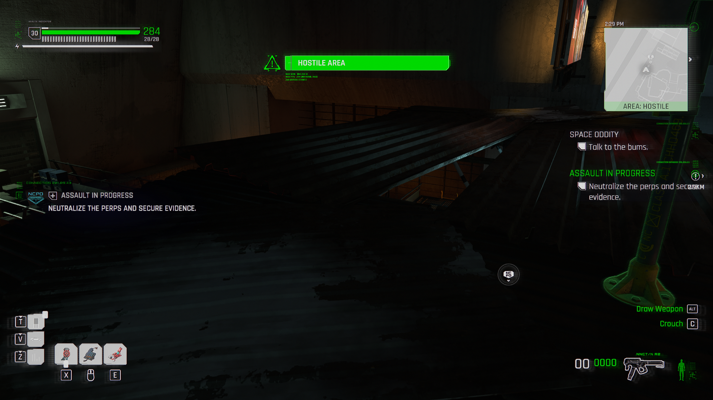
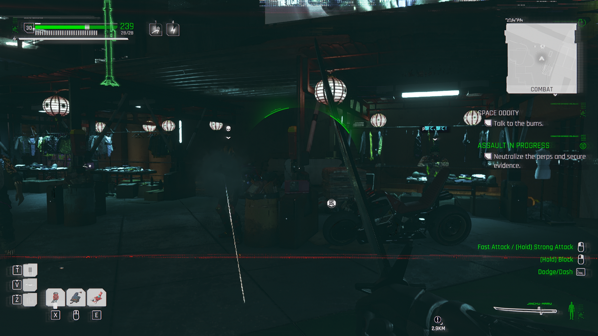
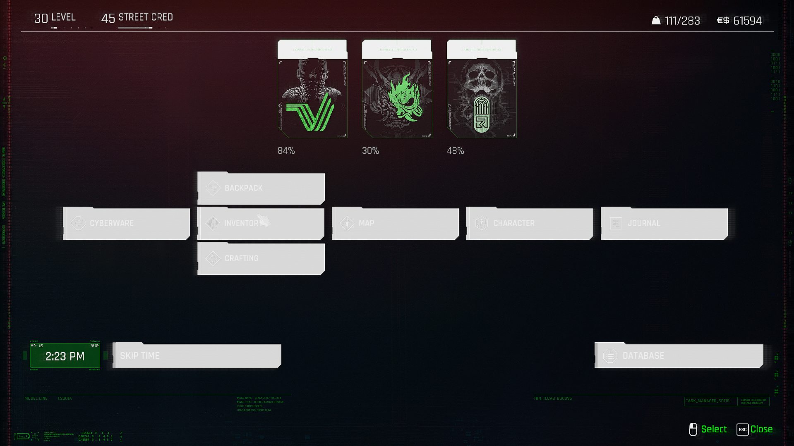
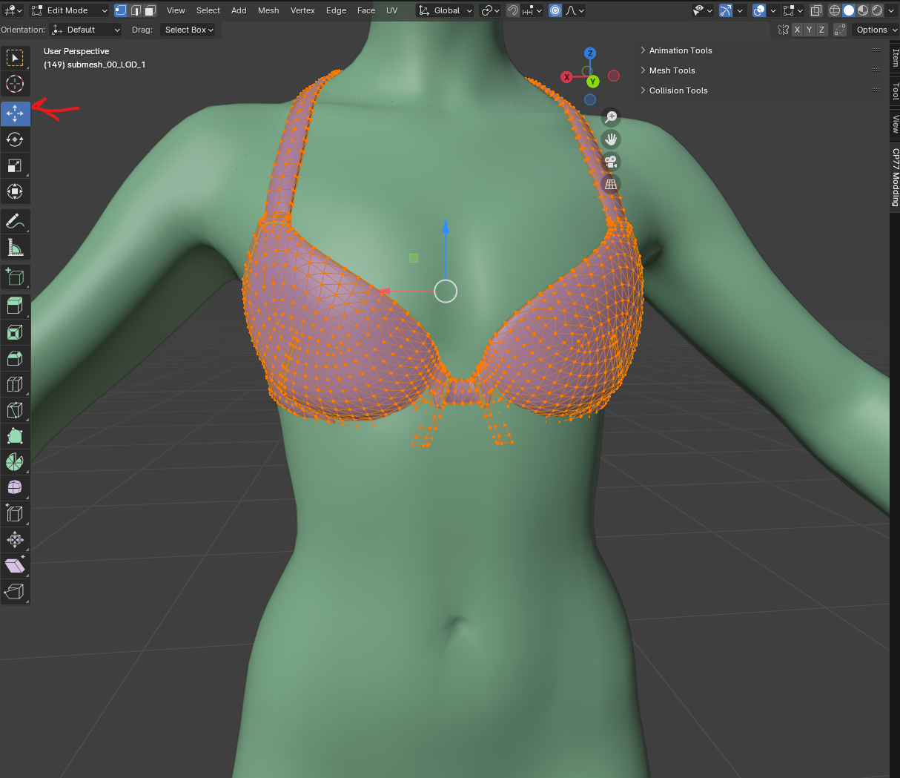
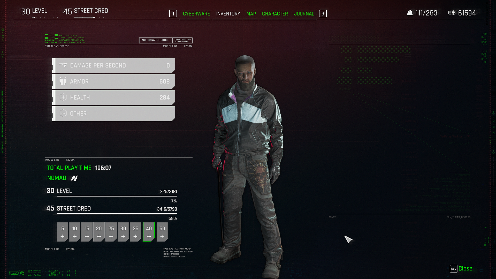

# RIG Swapping Garments - other body conversion

## Summary

**Created:** ??? by  **PinkyDude 🦝**on [Google Docs](https://docs.google.com/document/d/1-hTJJ6eKrA\_kjcRI5hKwiGt4xbzuLhuLZk\_tTthb0Ao/edit#heading=h.kvak42tu0v94)\
**Last documented update:** Jul 05 2024 by [manavortex](https://app.gitbook.com/u/NfZBoxGegfUqB33J9HXuCs6PVaC3 "mention")

> **Pinky's note:** _Thanks to ITzsassha for motivating me in writing this tutorial! 💛_

This tutorial will teach you how to swap a garment to a different rig.&#x20;


This is how you convert items from the male body rig to the female, or vice versa. \
The example will put Mateo's shirt on Placide, but you can use any two body types!


## Prerequisites

<table><thead><tr><th width="155">Tool</th><th>Version</th><th>Explanation</th></tr></thead><tbody><tr><td><a href="https://app.gitbook.com/s/-MP_ozZVx2gRZUPXkd4r/getting-started/eli5-getting-started">Wolvenkit</a></td><td>>= 8.14 (<a href="https://github.com/WolvenKit/Wolvenkit/releases">Stable </a>| <a href="https://github.com/WolvenKit/WolvenKit-nightly-releases/releases">Nightly</a>)</td><td>For modifying game files and packing your mod</td></tr><tr><td><a data-mention href="../../for-mod-creators-theory/modding-tools/wolvenkit-blender-io-suite/">wolvenkit-blender-io-suite</a></td><td>The most recent version (<a href="https://github.com/WolvenKit/Cyberpunk-Blender-add-on/releases">github</a>)</td><td>Importing and exporting from Wolvenkit</td></tr><tr><td><a href="https://www.blender.org/download/releases/4-1/">Blender</a></td><td>As supported by the IO suite. As of August 24, that is <a href="https://www.blender.org/download/releases/4-1/">4.0.1</a></td><td>Doing the actual work</td></tr></tbody></table>

You also need a [Wolvenkit project](https://app.gitbook.com/s/-MP\_ozZVx2gRZUPXkd4r/wolvenkit-app/usage/wolvenkit-projects) with the item that you want to convert.&#x20;

If you don't have one yet, you can check out [adding-new-items](adding-new-items/ "mention") and download the example project.

## Step 0: Getting the file into Blender

You need both **the body you want to refit for** and **the item you want to refit** in Blender.


Find body mesh file paths listed under [cheat-sheet-body.md](../../for-mod-creators-theory/references-lists-and-overviews/cheat-sheet-body.md "mention")



These steps won't be covered here in detail — for a step-by-step guide, see [r-and-r-refitting-step-by-step.md](recolours-and-refits/r-and-r-refitting-step-by-step.md "mention") -> [#step-1-adding-the-meshes-to-your-project](recolours-and-refits/r-and-r-refitting-step-by-step.md#step-1-adding-the-meshes-to-your-project "mention")


Mateo uses the “Man Average” (MA) rig, so all of his garments do as well.&#x20;

Placide uses the “Man Big” (MB) rig!

## Step 1: Refitting


These steps won't be covered here in detail — for a step-by-step guide, see [r-and-r-refitting-step-by-step.md](recolours-and-refits/r-and-r-refitting-step-by-step.md "mention")[#step-4-refitting](recolours-and-refits/r-and-r-refitting-step-by-step.md#step-4-refitting "mention")


Doing a simple mesh refitting wo_n_’t work since the rigs don’t match/the bones don’t align correctly!

## Step 2: Rig swapping

Once the MA garment’s meshes are refitted to the MB body, we need to Rig Swap it. For that, I will import a MB rig mesh! I choose to import Placide’s body, so it has every bone he’d possibly need.

Once imported, I’ll select the first submesh, enter Edit Mode \[TAB], select all of the model \[A] and press \[DELETE] > \[FACES] to empty the submesh! Do that for every submeshes of the MB garment.

Take note that Mateo’s shirt has 3 submeshes (the main shirt, the stitches decal and the buttons decal) Placide’s body, the MB garment that I just imported, only has 2 submeshes.

I will duplicate one of the submesh \[SHIFT+D] to match the numbers of submesh from the refitted MA garment! (In my case, 3!)

Once that’s done, be sure to rename the MB submeshes to match the MA’s garment submeshes names. You can manually rename them or copy/paste the names of both the (orange) submesh and the (green) submesh!

Once renamed, I recommend deleting all of the vertex groups from the MB submeshes you just renamed. For that, select a submesh in Object Mode, go to the Object Data Properties tab, click on the little drop down menu arrow and select \[DELETE ALL GROUP]

You’re now ready to actually transfer your refitted garment to its new rig; you’re ready to “Rig Swap”!

In Object mode, first select the first MA submesh. While pressing \[CTRL], click on the MB submesh of the same name (submesh0 on submesh0) to select it as well. Be sure to have your cursor placed on the viewport (main window, not in the right column, for some reason blender doesn’t like it) and then press \[CTRL+J] to merge your MA submesh into the MB submesh!

Your refitted garment now has the right rig! \O/

## Step 3: Exporting

**⚠ Before Exporting!**

Some NPC garments have a bone called “NeckCollar\_JNT” and cause meshes to collapse around the neck area. An easy way to fix that is to check in the submeshes’s vertex group list if it’s in there, and to rename it simply to “Neck” (even if there’s already a “Neck” vertex group, it will stack!)

Once that’s done, you can export your refitted and rig swapped garment!

You can now test your newly refitted mesh in game :D

And Voila! 🤙

_Don’t mind his missing body parts, I didn’t bother fixing his body mesh and I spawned the regular Placide from AMM_

Same-gender refits are relatively easy (MA to MB, WA to WB…) because, as said earlier, the rig structure are the same and share the same names.

For cross-gender refits (WA to MA, MA to WA) the rigs are different and you will have to export your refitted garment over a same-gendered vanilla garment, to then transfer the mesh render data (mlsetup, mlmask, normal map…) in WolvenKit from the original Mesh to the refitted one!

Hopefully this is easy enough to follow 🤲

As always, have fun and I wish y’all a good modding, chooms! 💛

Thank you for reading -Pkd

