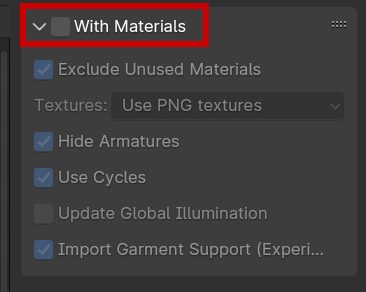
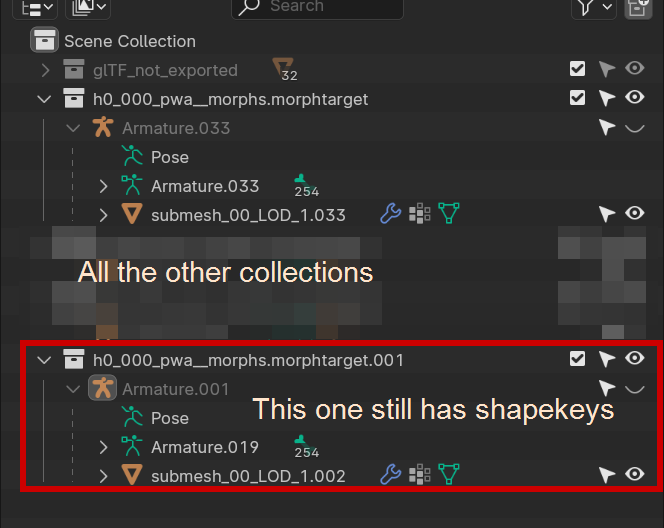
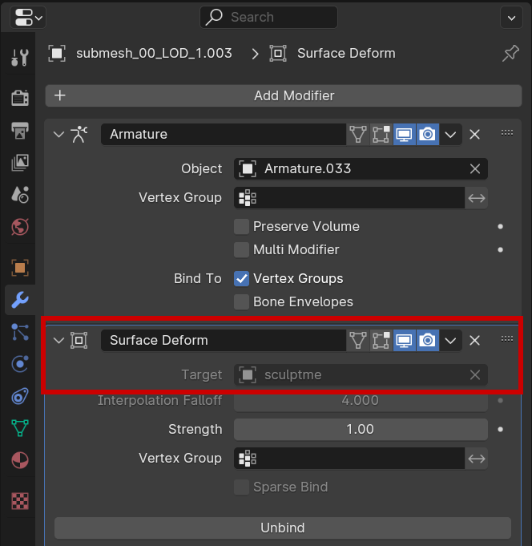
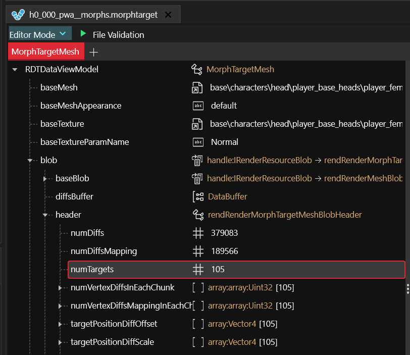

# A new head for V

## Summary

**Published:** September 30 2023 by [manavortex](https://app.gitbook.com/u/NfZBoxGegfUqB33J9HXuCs6PVaC3 "mention")\
Last documented edit: Oct 20 2024 by [manavortex](https://app.gitbook.com/u/NfZBoxGegfUqB33J9HXuCs6PVaC3 "mention")

This guide will teach you how to edit the player head to create custom head shapes. You don't need to understand the complex parts of the process, as long as you **follow the instructions to the letter**.


If you want to edit other files for V, you may be able to find their paths in [cheat-sheet-body.md](../../for-mod-creators-theory/references-lists-and-overviews/cheat-sheet-body.md "mention") or one of the surrounding pages.


## Step 0: Prerequisites

* You have [Blender](https://www.blender.org/download/) installed
* You have [a Wolvenkit project](https://app.gitbook.com/s/-MP\_ozZVx2gRZUPXkd4r/wolvenkit-app/usage/wolvenkit-projects#create-a-new-wolvenkit-mod-project)
* You have the [wolvenkit-blender-io-suite](../../for-mod-creators-theory/modding-tools/wolvenkit-blender-io-suite/ "mention") installed and ready to go


This guide assumes that you'll be starting from 0. If you want to use character creator options, please reference the [npv-preparing-the-head-in-blender.md](npv-v-as-custom-npc/npv-preparing-the-head-in-blender.md "mention") to the point where you apply all shapekeys.


## Step 1: Preparing the files

### 1.1 Exporting from Wolvenkit


You can consult [cheat-sheet-head](../../for-mod-creators-theory/references-lists-and-overviews/cheat-sheet-head/ "mention")-> [#head-file-paths](../../for-mod-creators-theory/references-lists-and-overviews/cheat-sheet-head/#head-file-paths "mention") for more information about head files. This is not necessary for the scope of this guide.


1. [Add](https://app.gitbook.com/s/-MP\_ozZVx2gRZUPXkd4r/wolvenkit-app/editor/asset-browser#adding-files-to-projects) **all** morphtarget files for your body gender to your Wolvenkit project:

<table><thead><tr><th width="147">body gender</th><th>Asset Browser search query</th></tr></thead><tbody><tr><td>fem</td><td><code>base\characters\head\player_base_heads\player_female_average > .morphtarget</code></td></tr><tr><td>masc</td><td><code>base\characters\head\player_base_heads\player_man_average > .morptharget</code></td></tr></tbody></table>


Make sure to include **all** morphtargets in the folder: cyberware, tattoos, scars, and for mascV, beards.


2. Export them all via [Wolvenkit Export Tool](https://app.gitbook.com/s/-MP\_ozZVx2gRZUPXkd4r/wolvenkit-app/tools/tools-import-export#export-tool) (you can find step-by-step instructions in the NPV guide under [#step-2-exporting-head](npv-v-as-custom-npc/npv-preparing-the-head-in-blender.md#step-2-exporting-head "mention"))

### 1.2 Importing into Blender&#x20;

1. Use the [wolvenkit-blender-io-suite](../../for-mod-creators-theory/modding-tools/wolvenkit-blender-io-suite/ "mention") to [import](../../for-mod-creators-theory/modding-tools/wolvenkit-blender-io-suite/wkit-blender-plugin-import-export.md#importing-into-blender) all of your `morphtarget.glb` files. Make sure to un-check `With Materials` in the right sidebar - we won't need them, and they'll only slow down the import process.

<figure><figcaption></figcaption></figure>

2. If there is a collection with the name `glTF_not_exported`, collapse or delete it - we don't need all those things.

## Step 2: Sculpting prep

If you have applied shapekeys

If you come from the NPV guide and have used the script to apply character creator presets, you have **lost all shapekeys** and need to restore them.

For all armatures (collections) in your blend file, do the following:&#x20;

1.  Import the `.morphtarget.glb` again. This will create a collection with the same name and the `.001` suffix:

    <figure><figcaption></figcaption></figure>
2. For each mesh in the collection, repeat the following steps:
   1. Select it
   2. Switch to Edit Mode (Hotkey: `Tab`)
   3. Select all vertices (Hotkey: `A`) and delete them (Hotkey: `X`)
   4. Switch back to Object Mode (Hotkey: `Tab`)
   5. Select the empty mesh, then (Ctrl+click) the corresponding mesh without shapekeys
   6. **Join** into the empty mesh (Hotkey: `Ctrl+J`). You now have a re-shaped mesh with shapekeys.&#x20;

You now have between 32 (femV) and 45 (mascV) collections in Blender. That's a lot of resculpting! Fortunately, we don't have to do everything by hand.

### Sculpting prep: A dedicated mesh

We'll make use of Blender's modifiers, specifically `Surface Deform`, to do the heavy lifting for us. For that purpose, we'll use a **dedicated sculpting mesh**, and make everything else take its shape.

1. In the **Outliner** at the top right of your viewport, find the collection with the name of `h0_000_pXa__morphs.morphtarget` (x being w or m) and **expand** it.
2. Find the mesh starting with submesh\_00\_LOD\_1 (it can have a suffix like .001), and select it by clicking on it
3. Duplicate it (Hotkey: `Shift+D`, `ESC`)
4. Rename your duplicate to e.g. `sculptme`. This is the mesh we'll be editing.
5. Select sculptme, then switch to the `Data` tab of `Properties` (at the bottom right of your viewport), and disable `Shape Key Edit Mode`:

<figure><figcaption></figcaption></figure>

Now, we're ready to hook up the magic.

### Sculpting prep: Modifiers

Each mesh in your .blend file needs a `Surface Deform` modifier that binds it to `sculptme`. Fortunately, you don't have to do that by hand!


Make sure that `sculptme` is still selected in the Outliner - the script will target the wrong mesh if it isn't.


1. The script you need is [add\_surface\_deform.py](https://github.com/manavortex/cyberpunk2077/blob/master/python/sculpting\_convenience/add\_surface\_deform.py) from mana's github.&#x20;
2. Follow the [blender-running-python-scripts.md](../../for-mod-creators-theory/3d-modelling/blender-getting-started/blender-running-python-scripts.md "mention") guide with that script, then come back here.
3. After clicking play, all meshes but `sculptme` will now have a `surface deform` modifier:

<figure><figcaption>
This modifier will deform all your meshes together with <code>sculptme</code>.
</figcaption></figure>

4. You can now **hide** all collections that you don't want to see in the Outliner.
5. I usually only keep `sculptme`, eyes, and eyebrows visible (hiding the original head mesh)

<figure><figcaption></figcaption></figure>

## Step 3: The actual sculpting

This is the part where you [draw the rest of the owl](https://knowyourmeme.com/memes/how-to-draw-an-owl).&#x20;


Save your .blend file before you start with this. In fact, save it twice. You can thank me later.


You can use the **sculpt mode** to change the shape of `sculptme`  until you're satisfied.&#x20;

This guide won't go into details (yet), except to tell you that the `Elastic Deform` tool is your best friend here. Check [mesh-sculpting-techniques](../../for-mod-creators-theory/3d-modelling/mesh-sculpting-techniques/ "mention") for tips and tricks how to go about this.

## Step 4: Exporting from Blender


As of October 2024, Wolvenkit may run into issues exporting edited morphtargets, so make sure to hang onto your .blend file!



This is an **excellent** time for a save, because the script will remove the surface deform modifiers.


Before you can export your sculpt, you need to **apply** the surface deform modifiers, because Wolvenkit (and Cyberpunk) will flat-out ignore them.&#x20;

Fortunately, you can do this by script as well.

### 4.1  Applying the surface deform

1. Find [apply\_surface\_deform.py](https://github.com/manavortex/cyberpunk2077/blob/master/python/sculpting\_convenience/apply\_surface\_deform.py) on mana's github
2. Follow the [blender-running-python-scripts.md](../../for-mod-creators-theory/3d-modelling/blender-getting-started/blender-running-python-scripts.md "mention") guide with that script, then come back here.
3. After clicking the play button, the Surface Deform modifier will now be gone, and your mesh will have changed shape for good.

### 4.2 Exporting the morphtargets from Blender

You can now export the morphtargets.

1. For each armature, select **all** submeshes inside
2.  Use the [wolvenkit-blender-io-suite](../../for-mod-creators-theory/modding-tools/wolvenkit-blender-io-suite/ "mention")'s default settings and **overwrite** the corresponding `.morphtarget.glb`&#x20;

    <figure><figcaption></figcaption></figure>
3. **Import** the files back into Wolvenkit via [Import Tool](https://app.gitbook.com/s/-MP\_ozZVx2gRZUPXkd4r/wolvenkit-app/tools/tools-import-export#import-tool). This **should** simply work! If it does not, you might have to overwrite the mesh file as well - see the [morphtargets](../../for-mod-creators-theory/3d-modelling/morphtargets.md#editing-morphtargets) page for instructions.

## Step 5: Testing

If everything has worked, you should now be able to create a new V with your new head shape. (Loading into an existing V might cause crashes)

Otherwise, the right place to ask for help is `#mod-dev-chat` on the [redmodding Discord server](https://discord.gg/redmodding).&#x20;

Happy modding!

## Step 6 (optional): Disabling the character creator

By turning off character creator slides, you can stop Cyberpunk from crashing.&#x20;

For each `.morphtarget`, you can change this value to **0**:

<figure><figcaption></figcaption></figure>


As of 8.15, this will **break Wolvenkit export**. Before exporting, you need to set the numTargets back to what WKit expects it to be.


## Troubleshooting

### I can't export my morphtarget anymore!

[Known issue](https://github.com/WolvenKit/WolvenKit/issues/1604) as of Wolvenkit 8.15 - future Wolvenkit versions will fix this. It's why you were supposed to hang on to that .blend for dear life. :)

### It crashes when loading into a savegame!

A known risk of custom heads, because custom cyberware/beards/tattoos won't play nice with this. See [#step-6-optional-disabling-the-character-creator](a-new-head-for-v.md#step-6-optional-disabling-the-character-creator "mention") for an (admittedly heavy-handed) solution.
