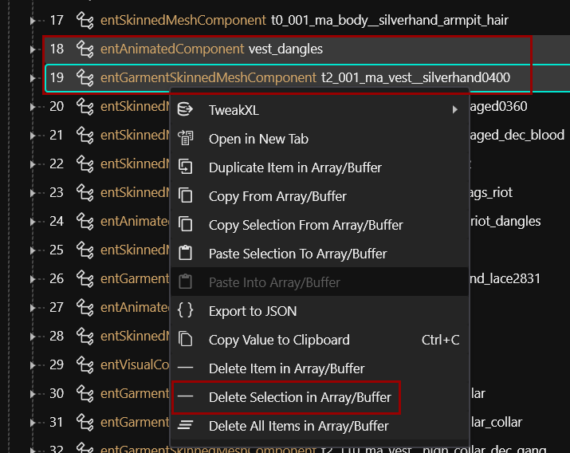
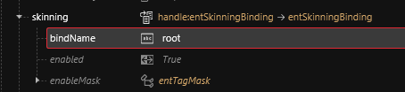

# Appearances: change the looks

## **Summary**

**Published** December 27 2022 by @manavortex \
**Last documented update:** January 06 2024 by @manavortex

This guide will walk you through **editing NPC appearances** for Cyberpunk 2077.

**It uses the following versions:**

* Cyberpunk 2077 game version >= 1.6
* [WolvenKit](https://github.com/WolvenKit/WolvenKit-nightly-releases/releases) >= 8.7.1-nightly.2022-11-04
* (only if you want to add new appearances) [AppearanceMenuMod](https://www.nexusmods.com/cyberpunk2077/mods/790) >= 1.15

## Wait, this isn't what I want!

* For an overview of NPC files, check [people.md](../../for-mod-creators-theory/references-lists-and-overviews/people.md "mention")
* If you want to add custom NPCs to Cyberpunk 2077 with AMM, check [amm-custom-npcs](amm-custom-npcs/ "mention")
* If you want to add AMM appearances to existing NPCs, check [amm-custom-npc-appearances.md](amm-custom-npcs/amm-custom-npc-appearances.md "mention")
* If you want to add V as an NPC, check [npv-v-as-custom-npc](npv-v-as-custom-npc/ "mention")
* If you want a more basic guide that goes into more detail for the basic stuff (including Blender), see [altering-appearances-within-wolvenkit-full-workflow.md](altering-appearances-within-wolvenkit-full-workflow.md "mention")
* If you're after hair colours, check [Broken link](broken-reference "mention") and follow the links from there.

***

## Prerequisites

* [ ] You have [a Wolvenkit project](https://app.gitbook.com/s/-MP\_ozZVx2gRZUPXkd4r/wolvenkit-app/usage/wolvenkit-projects#create-a-new-wolvenkit-mod-project)
* [ ] You know how to read

Links will give you additional context. If you can complete the guide without them, feel free to ignore them.

## Finding the right files

This section will show you how to find an NPC's [.app file](../../for-mod-creators-theory/files-and-what-they-do/appearance-.app-files/), which you will add to your project. We do this by finding the NPC's [.ent file](../../for-mod-creators-theory/files-and-what-they-do/entity-.ent-files/#root-entity), since it will be linked in there.

### The .ent file

The NPC's [root entity file](../../for-mod-creators-theory/files-and-what-they-do/entity-.ent-files/#root-entity) is the entry point for the game. It defines an NPC's appearances, linking them to the actual definitions inside the corresponding [.app file](appearances-change-the-looks.md#the-.app-file).&#x20;


You don't need to add this file to your project (and if you do it by accident, you should delete it later). For details, see [amm-custom-npc-appearances.md](amm-custom-npcs/amm-custom-npc-appearances.md "mention").


You can try finding your NPC's .ent file on [people.md](../../for-mod-creators-theory/references-lists-and-overviews/people.md "mention"). If you can't find your entry, the page has information how you can search for it — **please add it to the page**, this wiki is a community project!

Point your [Asset Browser](https://app.gitbook.com/s/-MP\_ozZVx2gRZUPXkd4r/wolvenkit-app/editor/asset-browser) to the file you have found. We want to find the .app file and add it to our project. You can right-click on the .ent file and select [Find used files](https://app.gitbook.com/s/-MP\_ozZVx2gRZUPXkd4r/wolvenkit-app/editor/asset-browser#find-used-files), or you look up the path in the .ent file:

<figure><figcaption>
If you are using <a href="https://www.nexusmods.com/cyberpunk2077/mods/790">Appearance Menu Mod</a>, this list will look familiar.
</figcaption></figure>

## The .app file

Now that you have found the .app file, let's [add it to your Wolvenkit project](https://app.gitbook.com/s/-MP\_ozZVx2gRZUPXkd4r/wolvenkit-app/editor/asset-browser#adding-files-to-projects) and look inside.

The array **appearances** will contain a list with every appearance that's defined for this NPC, matching the key `appearanceName` in the .ent file.&#x20;


Not all of these have been "published" (as in "hooked up to .ent files"). For an example of this, check `base\characters\appearances\citizen\citizen__children_mc.app`


The only thing you need to care about is the `components` array (learn more about these [here](../../for-mod-creators-theory/files-and-what-they-do/components/)). This is where you add, remove, or modify parts of an NPC's appearance:

<figure><figcaption>
Removing Johnny's head won't make him shut up. Try it out, say "Arasaka".
</figcaption></figure>


The names of components **should** be unique so you can [manipulate them outside of the .app file](../items-equipment/influencing-other-items.md#summary). You should generally stick to CDPR's naming scheme, including the prefixes ([why is this important?](../../for-mod-creators-theory/3d-modelling/garment-support-how-does-it-work/#component-prefixes)).&#x20;

CDPR's style of unique naming allows us to find components and their usage across the game files, which will come on handy when we're trying to add items.


This is where the magic happens.

## Changing and removing components

**Change** items by selecting a [different appearance](../../for-mod-creators/modding-guides/items-equipment/editing-existing-items/changing-materials-colors-and-textures.md) or a [different mesh](../items-equipment/editing-existing-items/replace-a-player-item-with-an-npc-item/):

<figure><figcaption>
Wake up, Johnny! … Follow the white rabbit, Johnny!
</figcaption></figure>

**Remove** items by deleting their entries from the list or by setting their [chunkMasks to `0`](../../for-mod-creators-theory/files-and-what-they-do/3d-objects-.mesh-files/submeshes-materials-and-chunks.md#chunkmasks-partially-hiding-meshes):

<figure><figcaption>
no more ring!
</figcaption></figure>

## (Safely) adding components


For a detailed guide on adding hair, check [npv-creating-a-custom-npc.md](npv-v-as-custom-npc/npv-creating-a-custom-npc.md "mention") - [#hair](npv-v-as-custom-npc/npv-creating-a-custom-npc.md#hair "mention")


If you want to add a new item, first **duplicate an existing one**. After that, you can pretend that it is just another change:

<figure><figcaption>
This is usually safe, as long as you are sticking to <strong>entSkinnedMeshComponent</strong>s.
</figcaption></figure>

And this might work.

Or it might end up leaving them standing in an exploded pixel cloud. In case of **animated components**, editing them will almost certainly break them (see [#animations-if-you-cant-avoid-them-copy-them-as-well](appearances-change-the-looks.md#animations-if-you-cant-avoid-them-copy-them-as-well "mention"))


Anything of the type `entGarmentSkinnedMeshComponent` is prone to breaking unless you copy everything it needs.


Let's do it…

### Step by step: Putting Johnny in Scorpion's vest

You need to find the thing you want to add in the files, check where it is defined, and then copy all of its components.

1. Search for the mesh name of the vest that you want to use (e.g. `ma_vest__high_collar*.mesh`)
2. Select the mesh, then "[find files using this](https://app.gitbook.com/s/-MP\_ozZVx2gRZUPXkd4r/wolvenkit-app/editor/asset-browser#find-files-using-this)": \
   &#x20;
3. If you find an .ent file called `_pwa_` or `_pma_`, that's a player mesh entity, which contains only the components you need — jackpot, use that one. Otherwise, find any .app file that sounds promising - for example Scorpion's.  \
   \
   [Open it without adding](https://app.gitbook.com/s/-MP\_ozZVx2gRZUPXkd4r/wolvenkit-app/editor/asset-browser#open-without-adding-to-project) it to the project (you don't need the file).&#x20;
4. Find and select the components in the other NPC's appearance list:\
   
5. Select "[Copy Selection From Array/Buffer](https://app.gitbook.com/s/-MP\_ozZVx2gRZUPXkd4r/wolvenkit-app/editor/file-editor#copy-selection-from-array-buffer)"
6. Go back to your original .app file and select either the root of the `components` array, or any component inside the array. Now right-click and select "[Paste Selection From Array/Buffer](https://app.gitbook.com/s/-MP\_ozZVx2gRZUPXkd4r/wolvenkit-app/editor/file-editor#copy-selection-from-array-buffer)".\
   &#x20;
7.  If you haven't done that yet, [delete](https://app.gitbook.com/s/-MP\_ozZVx2gRZUPXkd4r/wolvenkit-app/editor/file-editor#delete-selection-from-array-buffer) the original component(s) and its animations/dangles. Skipping this step will give Johnny two vests, and he's not the type to do that.\

    <figure><figcaption></figcaption></figure>


Save the .app file, [install your mod](https://app.gitbook.com/s/-MP\_ozZVx2gRZUPXkd4r/wolvenkit-app/menu/toolbar#install-and-launch), and go testing!


### Animations: if you can't avoid them, copy them as well!

Anything of the type `entAnimatedComponent` means that components are **animated**. That's mostly the case for physics-enabled stuff influenced by gravity, such as coats, jackets, or long hair.&#x20;


Physics gave us the atomic bomb. _(It also gave us computers, but this is besides the point right now.)_


Animations are usually unique to meshes on a by-pixel basis and do not react kindly to edits or swaps. (Try splitting the obi from Saburo's kimono into its own submesh if you don't believe me).&#x20;

If you copy an animated component (e.g. Johnny's vest), then you need to copy the corresponding `entAnimatedComponent` as well, or the mesh won't move.

<figure><figcaption>
Any of these are an indicator that there is TROUBLE
</figcaption></figure>


If you delete a physics-enabled component, you can safely delete the corresponding AnimatedComponent.&#x20;


## Adding new appearances

Adding new appearances to an existing NPC requires you to overwrite that NPC's .ent file (see [amm-custom-npc-appearances.md](amm-custom-npcs/amm-custom-npc-appearances.md "mention")). For that matter, it's recommended that you create a new entity instead. You can find a guide for this under [amm-custom-npcs](amm-custom-npcs/ "mention").

## Troubleshooting

### My new component won't move at all!

You may have forgotten to copy the animation file. Look for an **entAnimatedComponent** inside the .app — they're usually called something like `xxx_dangle(s)` or `collar.`[ (See here)](appearances-change-the-looks.md#animations-if-you-cant-avoid-them-copy-them-as-well)

If it's a clothing item not moving, check the skinning array for the component and make sure the `bindName` is set to `root`. If you swapped out a component for something else, you also might need to update its matching entry in `AppearanceVisualController -> appearanceDependency`. But don't do that unless necessary.

<figure><figcaption></figcaption></figure>

### I added an appearance, but a random one is showing when I select it

That's what happens when the game can't find the appearance you picked. You're probably trying to add an AMM appearance. Check the spelling between your lua file with the appearance name, the mapping entry inside the .ent, and the appearance's name in the .app file.

#### For further troubleshooting steps, see [here](../../for-mod-creators-theory/3d-modelling/troubleshooting-your-mesh-edits.md).
