# Creating facial cyberware

## Summary

**Created:** Jul 18 2025 by [mana vortex](https://app.gitbook.com/u/NfZBoxGegfUqB33J9HXuCs6PVaC3 "mention")\
**Last documented update:** Jul 18 2025 by [mana vortex](https://app.gitbook.com/u/NfZBoxGegfUqB33J9HXuCs6PVaC3 "mention")

This guide will show you how to create custom facial cyberware from scratch.

## What you need

* [ ] A [Wolvenkit project](https://app.gitbook.com/s/-MP_ozZVx2gRZUPXkd4r/wolvenkit-app/usage/wolvenkit-projects#create-a-new-wolvenkit-mod-project)
* [ ] [The Wolvenkit Blender IO Suite](../../for-mod-creators-theory/modding-tools/wolvenkit-blender-io-suite/#compatibility) and the compatible Blender version
* [ ] Optional: an image editing program (you can use [photopea.com](http://photopea.com/), it's free)

## Skipping and skimming

<figure><figcaption></figcaption></figure>

This tutorial has **no fluff**, and you should not skip over parts of it unless they're **clearly marked** as optional. If you do anything differently (using other names or whatever), you add extra complexity which you will have to deal with.

I recommend following the steps **exactly** like a braindead automaton, then creating a **backup copy** of the working project before starting to fuck around.&#x20;

Of course this is a free world, so you can do what you want.

## Step 1: Setting up the files

1. Add the [basehead .mesh and .morphtarget](../../for-mod-creators-theory/references-lists-and-overviews/cheat-sheet-head/) to your Wolvenkit project:

<table data-header-hidden><thead><tr><th width="126"></th><th></th></tr></thead><tbody><tr><td>fem V</td><td><code>base\characters\head\player_base_heads\player_female_average\h0_000_pwa__morphs.morphtarget</code><br><code>base\characters\head\player_base_heads\player_female_average\h0_000_pwa_c__basehead\h0_000_pwa_c__basehead.mesh</code></td></tr><tr><td>mascV</td><td><code>base\characters\head\player_base_heads\player_man_average\h0_000_pma__morphs.morphtarget</code><br><code>base\characters\head\player_base_heads\player_man_average\h0_000_pma_c__basehead\h0_000_pma_c__basehead.mesh</code></td></tr></tbody></table>


If you want to create cyberware for both body genders, you should work on both heads simultaneously. That is much easier than porting the final product!


Currently, your mod is overwriting the player base head. To avoid that, we will [custompath](../items-equipment/custompathing-assets.md) and move both files to a custom folder.&#x20;

2. Select the `.mesh` file and use Wolvenkit's rename function (`f2`) to move it. Make sure to have the "Update in project files" box ticked.

<figure>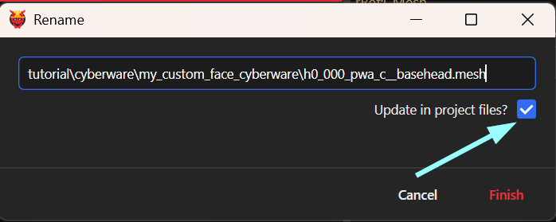<figcaption></figcaption></figure>

3. Do the same for the .morphtarget file.&#x20;
4. Your `archive` tab should now look like this:

<figure>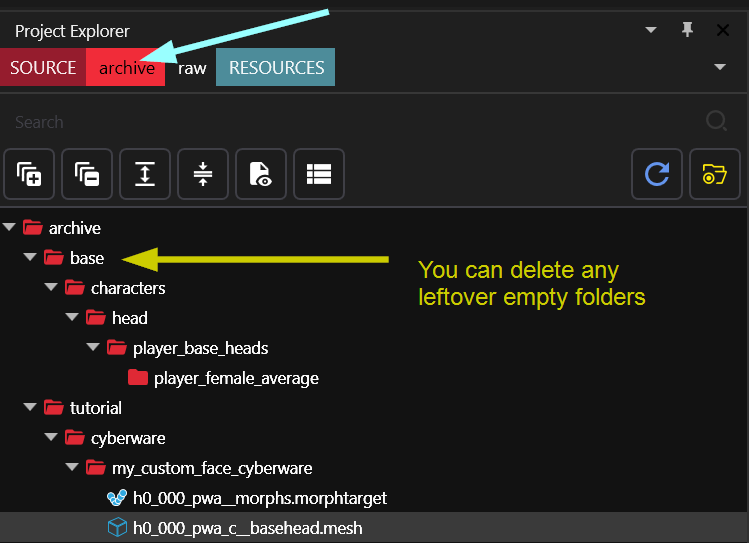<figcaption></figcaption></figure>

5. Now, [export](../../for-mod-creators-theory/modding-tools/wolvenkit-blender-io-suite/wkit-blender-plugin-import-export.md#meshes) the `.mesh` and `.morphtarget` file:\
   In Wkit's [Export Tool](https://app.gitbook.com/s/-MP_ozZVx2gRZUPXkd4r/wolvenkit-app/usage/import-export#exporting), click on the "Export all" button. This will create the files for Blender in your folder.

## Step 2: Creating your new cyberware

1. Open up Blender and [import](../../for-mod-creators-theory/modding-tools/wolvenkit-blender-io-suite/wkit-blender-plugin-import-export.md#importing-into-blender) the .morphtarget file. We will only work on that one!

<details>

<summary>What's the difference?</summary>

The `.morphtarget` contains the 3d data (the **shape** of the cyberware). It will deform with the face sliders from the character creator.

The `.mesh` contains the material data (the **surface appearance** of the cyberware). The `.morphtarget` pulls it in via the `baseMesh` property.

</details>

You should now see something like this:

<figure>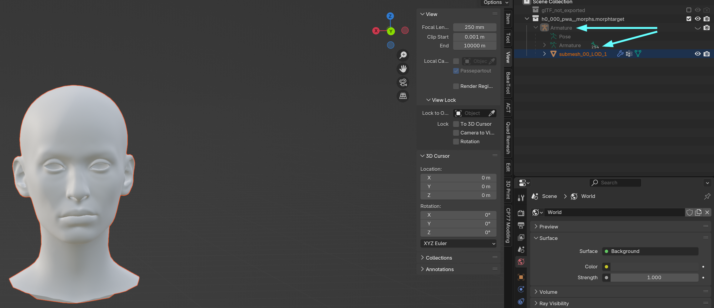<figcaption></figcaption></figure>

2. Select the head mesh by clicking on it in the outliner (blue arrows to the right)
3. Duplicate the head (Hotkey: `Shift+D`), so that you have a reference for resizing.
4. Switch to Edit Mode (`Tab`)

### Step 2.1: Cutting out your cyberware's shape

We will now **cut away** all the **faces** (surface triangles) that are not part of your custom cyberware.&#x20;


If you have never used Blender before, you'll probably want to check out [blender-getting-started](../../for-mod-creators-theory/3d-modelling/blender-getting-started/ "mention")before proceeding.


I'm putting a smiley on V's forehead, so I am cutting away everything but this little part:

<figure>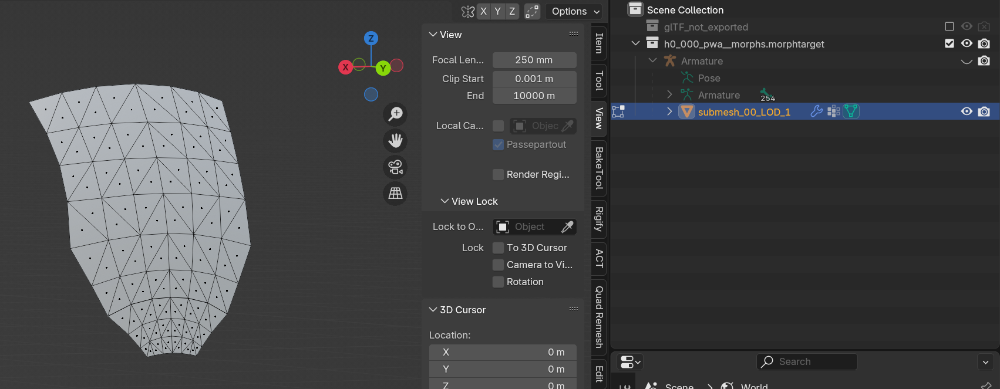<figcaption></figcaption></figure>

### 2.2: Make it a tiny bit larger

We want our cyberware to float above the player head, not clip into it. For that reason, we need to scale it up a little.

1. Select all vertices (Hotkey: `a`)
2. Enter scaling mode (Hotkey: `s`)
3. Upscale it slightly (Hotkey: type `0.02`  and press enter) - you have the original head as a reference

Once it is directly above the surface, you're done here.

## Step 3: Textures

<figure>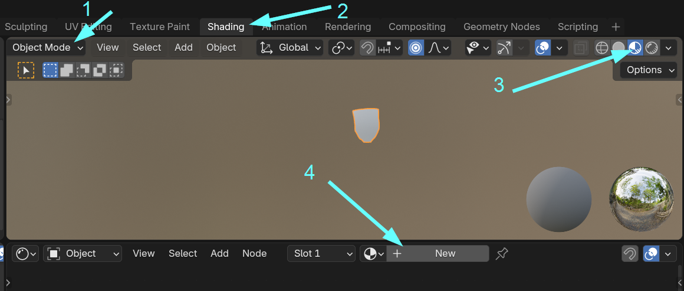<figcaption></figcaption></figure>

1. Switch back to Object mode (hotkey: `Tab`)&#x20;
2. Delete the reference head mesh (select it by clicking, then press `x`)
3. Switch to the Shading perspective
4. Make sure that the viewport is set to "Viewport Shading"
5. Add a new material to your mesh by clicking the "New" button

This creates a new empty material for Blender.

### 3.1: Adding a texture

Now, add a blank texture to your mesh. Move your mouse cursor over the node editor at the bottom, then do the following:

1. Add a new image texture (hotkey: `Shift+A`, type `image`, press enter)
2. Create a new image texture by clicking the `+ New` button
3. Give it a name (for example `my_new_cyberware_d01`)


Leave the resolution at 1k. You might be tempted to go all-in and have insanely detailed textures; however, [most people **won't even see them**](../../for-mod-creators-theory/3d-modelling/on-4k-textures-and-high-poly-meshes.md).


4. Connect the `Color` output of your new node to the `Base Color` input of the `Principled BSDF` shader node
5. Click on the texture node to select it. That will change the texture viewport on the left to black.

<figure>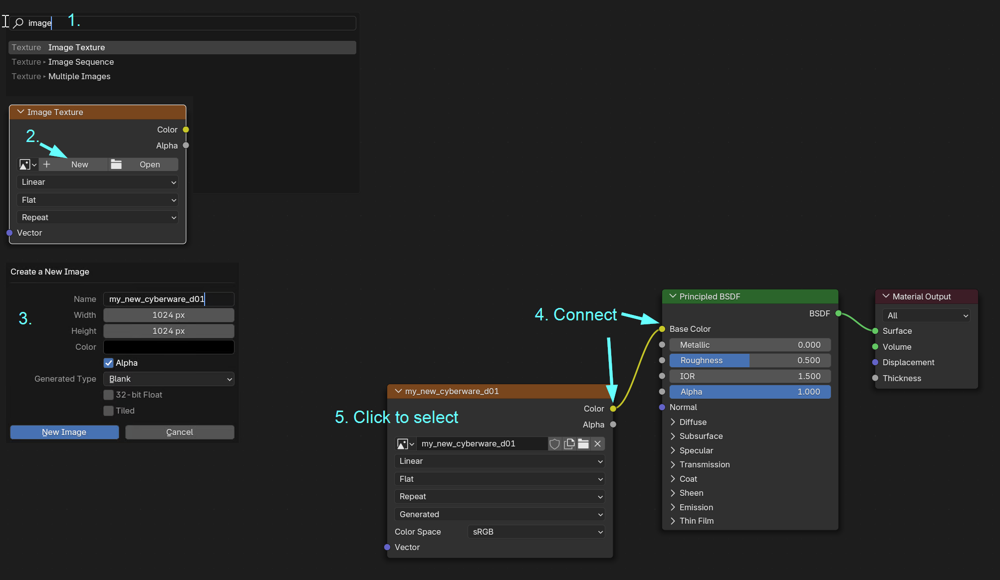<figcaption></figcaption></figure>

### 3.2 UV Mapping


You do not need to know more about [uv-mapping-texturing-a-3d-object.md](../../for-mod-creators-theory/materials/uv-mapping-texturing-a-3d-object.md "mention")for the purpose of this guide.


1. In the top bar where you switched to the Shading perspective in 3.1, switch to `UV Editing`&#x20;
2. Make sure that your viewport (right) is in Edit Mode (Hotkey: `Tab`)
3. Select all vertices (Hotkey: `A`)
4. To prepare for UV unwrapping, we will now merge by distance (Hotkey: `m`):

<figure>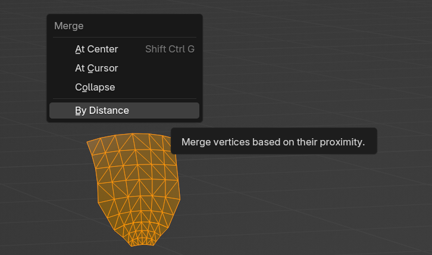<figcaption><p>This will make sure that your cyberware isn't made out of disjointed parts (which the head mesh is for reasons).</p></figcaption></figure>

5. On the UV editor on the left side, also select all vertices (Hotkey: `A`)
6. Unwrap them (Hotkey: `Ctrl+U`)

<figure>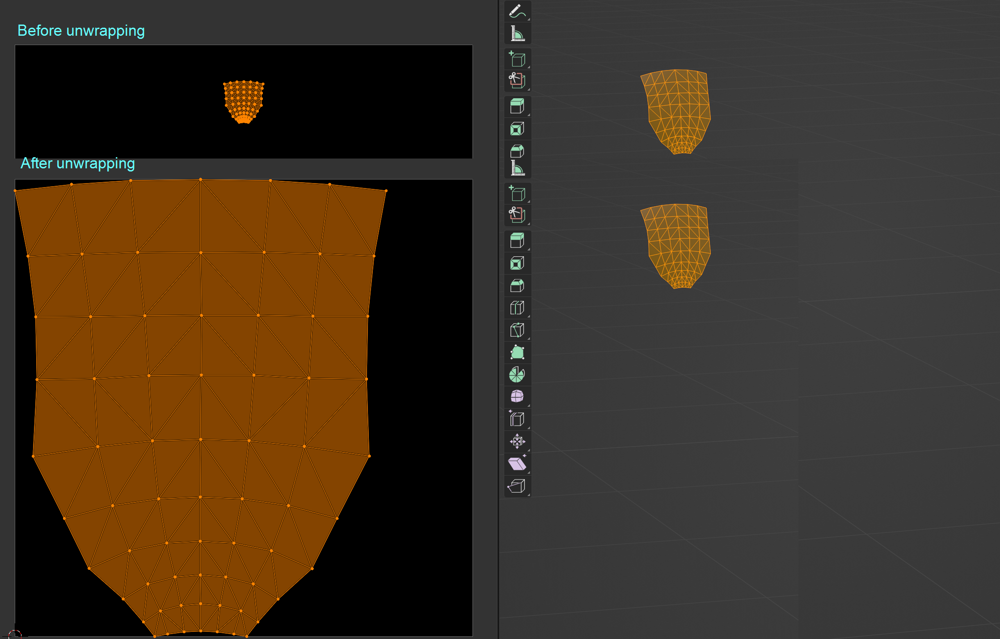<figcaption></figcaption></figure>

Now that our UV map is using the whole texture, it's time to paint our texture.

### 3.3 Texture painting

1. In the top bar where you switched to the Shading perspective in 3.1, switch to `Texture Paint`&#x20;
2. You can now use a brush to paint, either on the texture (left), or on the 3d model (right):

<figure>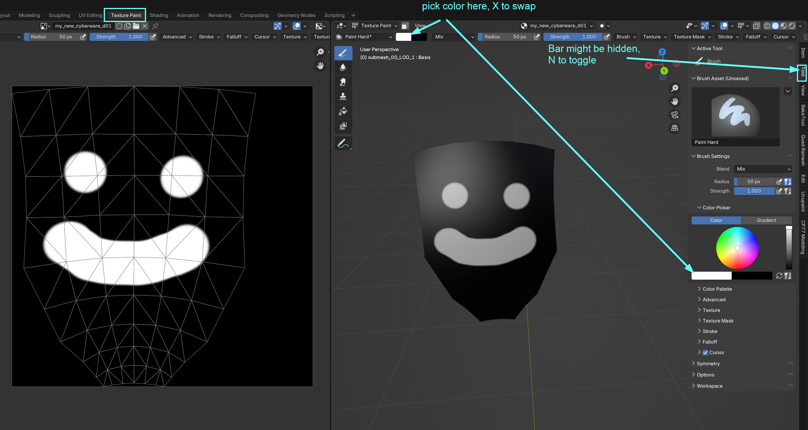<figcaption></figcaption></figure>

3. Draw the rest of the owl.
4. Once you are done painting your texture, save it:
   1. Move the mouse over the texture port on the left and press Ctrl+Alt+S
   2. From the "Recents" dropdown, select the topmost folder (where your mesh and morphtarget are)
   3. Right-click to create a new folder "textures"
   4. Save your texture inside the fodler as `my_new_cyberware_d01.png`&#x20;

## Step 4: Back into Wolvenkit

In this section, we'll get our .mesh and .morphtarget back into Wolvenkit.&#x20;

1. In the top bar, switch back to the `Layout` perspective&#x20;
2. Make sure that your viewport is in Object mode (Hotkey: `Tab`)
3. Select all meshes that you want to export
4. From the menu, select File -> Export -> Cyberpunk GLB (or see the [wiki page](../../for-mod-creators-theory/modding-tools/wolvenkit-blender-io-suite/wkit-blender-plugin-import-export.md#exporting-from-blender))
5. Overwrite **both** `h0_000_pwa_c__basehead.glb` and `h0_000_pwa__morphs.morphtarget.glb`

That was the Blender part. Now, we need to go back to Wolvenkit.

6. On the Import Tool in the bottom left, import **first** the glb that goes into the `.mesh` file:

<figure>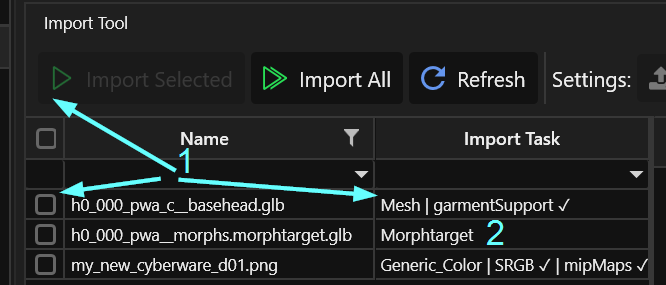<figcaption></figcaption></figure>

7. Now, import the morphtarget and the texture.


You might be unable to export the morphtarget again, so you should keep your `.blend` file!


## Step 5: Materials

1. Open the `.mesh` file in Wolvenkit
2. From the top bar, open the "Clean Up" menu
3. Hold the shift key and click "Clear All Materials":

<figure>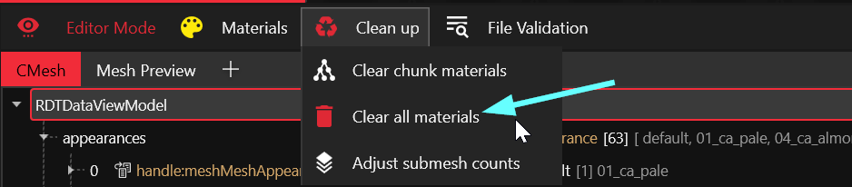<figcaption></figcaption></figure>

4. Save the file.

### 5.1 Creating and configuring a new appearance

Now, we'll create an appearance with materials.

1. Select the `appearances`  node, and click the yellow `+` button on the right:

<figure>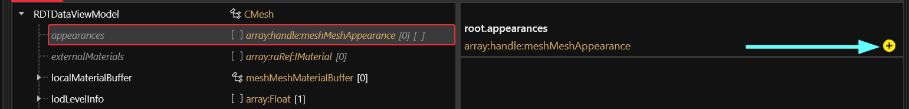<figcaption></figcaption></figure>

2. Expand the `appearances` node on the left&#x20;
3. Expand your new appearance (it is called `default`)
4. Select the `chunkMaterials` node on the left, and click the yellow button again to add an entry
5. Give the chunkMaterial the name of the material that you will create next (e.g. `my_custom_cyberware_material`):

<figure>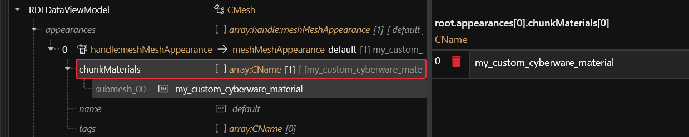<figcaption></figcaption></figure>

### 5.1.1 Adding the material

1. On the left, expand the `localMaterialBuffer` node and select its child `materials`
2. Right-click, then select `Add material and definition` from the context menu
3. In the popup dialogue, enter the name from step 5 in the previous section (e.g. `my_custom_cyberware_material`)
4. Select the new CMaterialInstance

### 5.1.2 Configuring the material

This is where we tell the material how to behave. We'll create a `decal` (something that is projected on top of something else), then tell it to use our texture.

1. Set the `baseMaterial`  depot path to `base\materials\mesh_decal.mt`
2. Expand the node and select the `values` array
3. Click the yellow + button on the right panel
4. In the dialogue that now opens, add a `Texture`&#x20;
   1. Change its `key` to `DiffuseTexture`&#x20;
   2. Change its `value`  to the relative path to your texture (right-click on the texture in the project browser, select `copy relative path`, then paste it into the depot path box)
5. Add another property, this one a `Scalar`
   1. Change its key to DiffuseAlpha
   2. Change its value to 1

<figure>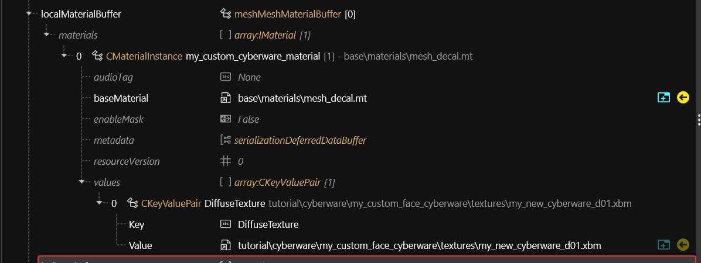<figcaption></figcaption></figure>

The decal will now project your texture on top of V's head, and force it to be completely intransparent.

## Step 6: Connecting everything

So far, we have a .mesh and a .morphtarget in Wolvenkit. If we packed the mod now, nothing would happen, because the game doesn't know what to do with those files.

### 6.1 The .ent file

First, we need an .ent file to hold our component.&#x20;

1. Find `base\characters\head\player_base_heads\appearances\entity\cyberware\hx_000_pwa__cyberware_01.ent`  and add it to your project (`pma` for masc V)
2. Move the file to your folder (tutorial\cyberware\my\_custom\_face\_cyberware) and open it
3. Select the second component and change the following properties:
   1. morphresource's `depotPath` to the path of your custom morphtarget
   2. the name to something unique

<figure>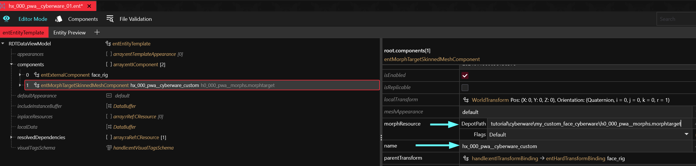<figcaption></figcaption></figure>

4. Save the file.

### 6.2 The .xl file

Now we only need to add our .ent file to the player entity. ArchiveXL can do that for us.

1. In your project's resources folder, create a new .xl file (or an empty text file with the .archive.xl extension)
2. In the text file, paste the following content (delete the gender that you're not using):

```yaml
resource:
  patch:
    # masc V
    tutorial\cyberware\my_custom_face_cyberware\hx_000_pma__cyberware_01.ent:
      - base\characters\entities\player\photo_mode\player_ma_photomode.ent
      - base\characters\entities\player\player_ma_tpp.ent
      - base\characters\entities\player\player_ma_tpp_cutscene.ent
      - base\characters\entities\player\player_ma_tpp_cutscene_no_impostor.ent
      - base\characters\entities\player\player_ma_tpp_reflexion.ent
      - ep1\characters\entities\player\photo_mode\player_ma_photomode_ep1.ent
      - ep1\characters\entities\player\player_ma_tpp_ep1.ent
    # fem V
    tutorial\cyberware\my_custom_face_cyberware\hx_000_pwa__cyberware_01.ent:
      - base\characters\entities\player\photo_mode\player_wa_photomode.ent
      - base\characters\entities\player\player_wa_tpp.ent
      - base\characters\entities\player\player_wa_tpp_cutscene.ent
      - base\characters\entities\player\player_wa_tpp_cutscene_no_impostor.ent
      - base\characters\entities\player\player_wa_tpp_reflexion.ent
      - ep1\characters\entities\player\photo_mode\player_wa_photomode_ep1.ent
      - ep1\characters\entities\player\player_wa_tpp_ep1.ent
```

Now, start the game. If you did everything correctly, you should now see your new cyberware!

<figure>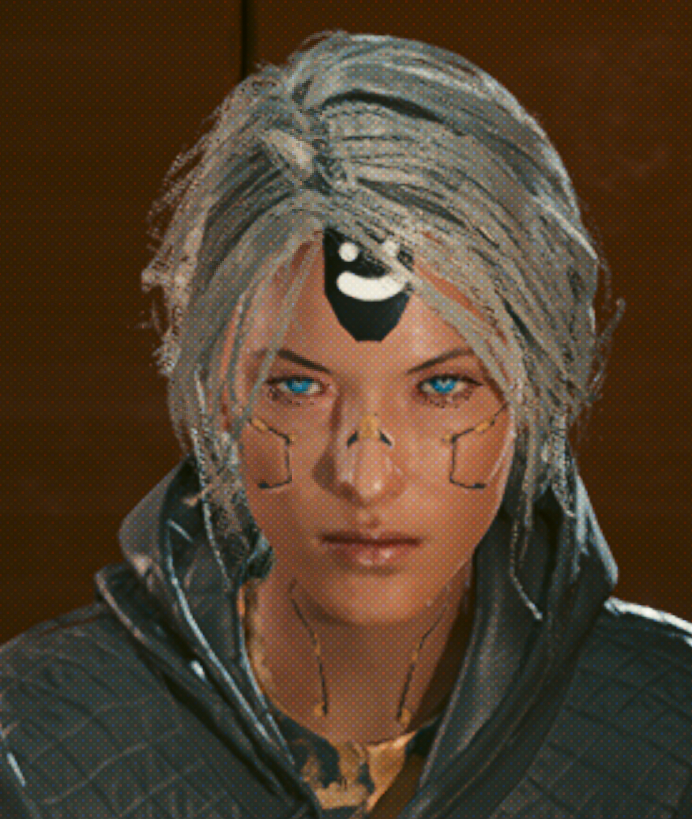<figcaption><p>She doesn't like it</p></figcaption></figure>

