# For V - Custom facial piercings - PRC Framework

## **Summary**

**Created & Published:  July 12 2023 by Mx\_OrcBoi**

PRC Framework was created by **eagul**, he also taught me how to do them, so I'm passing on the knowledge.

**Required:** Blender >= 3.5 & Wkit >= 8.9.1-Nightly

**Level:** If you can read and follow instructions, you should be ok.

**Disclaimer:** The detailed steps show how to place piercings in spots where vanilla ones already are.

For any other location on the face the steps are slightly different, as you will need to create your piercing on the head mesh and import over head mesh.

This is explained in a separate section.

I would suggest trying to create one in an existing location first, so you familiarise yourself with the steps and then play around with different locations.

## Getting started

1. Download and install the below:\
   [https://www.nexusmods.com/cyberpunk2077/mods/8590\
   ](https://www.nexusmods.com/cyberpunk2077/mods/8590)[https://www.nexusmods.com/cyberpunk2077/mods/7179\
   ](https://www.nexusmods.com/cyberpunk2077/mods/7179)
2. In wkit, import the below to your project depending on which V you want to create the piercings for:

<figure>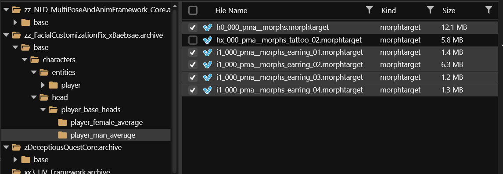<figcaption>
Files for mV
</figcaption></figure>

<figure>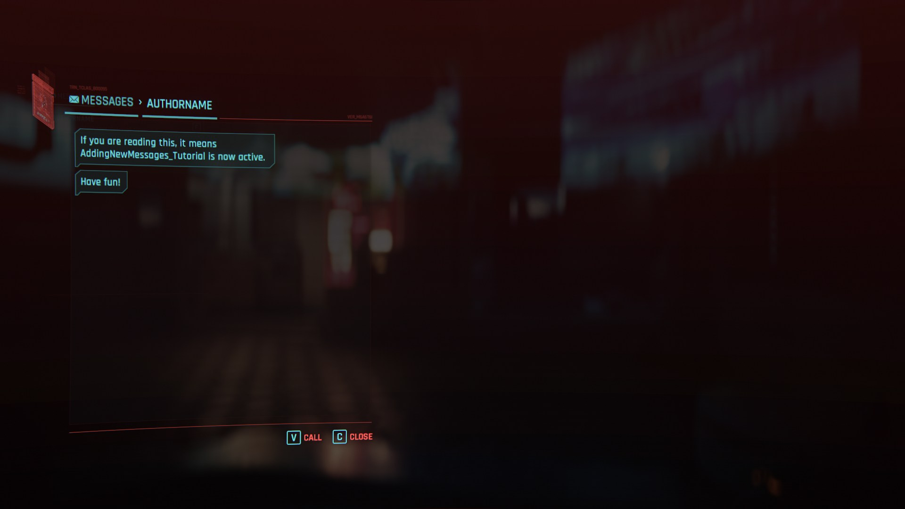<figcaption>
Files for fV
</figcaption></figure>

3. Export to GLB so you end up with those files in the raw folder.

<figure>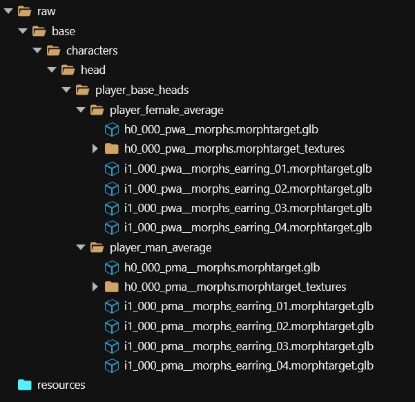<figcaption></figcaption></figure>

4. Import them into Blender using Cyberpunk GLTF import plugin. In this example I will be working on fV. You should end up with files like this and be able to see the head, vanilla piercings and a set of shape keys.

<figure>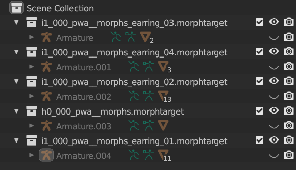<figcaption></figcaption></figure>

<figure><figcaption></figcaption></figure>

<figure><figcaption></figcaption></figure>

Each shape key corresponds with the number on the character creation slider. Basis is 1 on all sliders or no shape keys active. The rest is divided into ears, nose, eyes, mouth and jaw and subsequent numbers correspond to the character creator settings (1x is slider 2, 2x is slider 3 and so on).

You can see the shape keys actually working by selecting one of them and setting Value to 1.\

For easier selection merge head mesh vertices by distance. To do this, select the head mesh, go into edit mode (Tab) and go to Mesh -> Clean Up -> Merge by Distance. Set merge distance to 0.0001.

<figure><figcaption></figcaption></figure>

5. Import your piercing mesh. I’ll use the septum half ring as an example. Make sure the mesh is already UV unwrapped if using custom mesh.

<figure>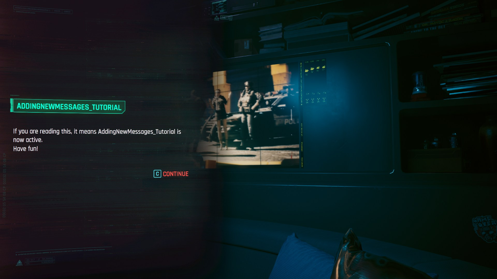<figcaption>
I’ve hidden the rest of the piercings for visibility, only leaving the one that will help me to adjust the position.
</figcaption></figure>

6. Duplicate the vanilla piercing. To do so select it in the viewport (object mode), press shift+D and then click the right mouse button. Hide the original mesh.
7. With vanilla mesh duplicate selected, go to edit mode (TAB) and press Del -> vertices. You will end up with an empty submesh.
8.  Select your piercing mesh, then Ctrl select newly emptied vanilla submesh. Press Ctrl+J to join.

    By doing step 7 and 8 you’ll end up with your mesh having the correct bones for where it is placed.

    The result should be like this:

<figure>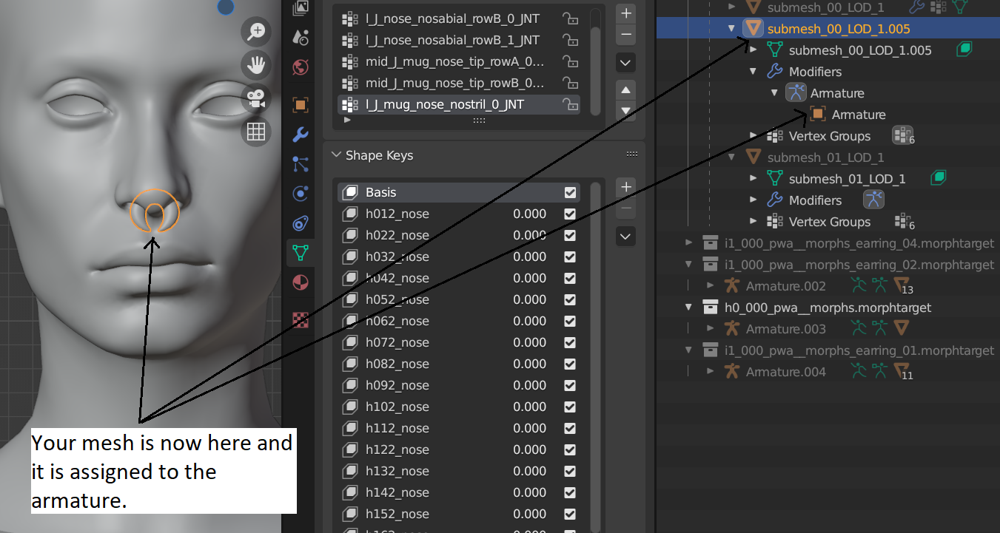<figcaption></figcaption></figure>

## Weight painting


You can do this much more comfortably with the [wolvenkit-blender-io-suite](../../for-mod-creators-theory/modding-tools/wolvenkit-blender-io-suite/ "mention")'s [#transfer-vertex-weights](../../for-mod-creators-theory/modding-tools/wolvenkit-blender-io-suite/#transfer-vertex-weights "mention") button.


Now we need to either weight paint, or **transfer weights** if your new piercing is in the same position as vanilla one. Mine is, so I will go over transferring weights.

You can see the current weights the mesh has in Weight Paint mode.

<figure><figcaption></figcaption></figure>

I’ve selected the vanilla piercing here. By clicking different vertex groups you can see the colour of the mesh changes. This colour denotes how much influence each bone has on the mesh. Red is 100% and dark blue is 0%.

<figure>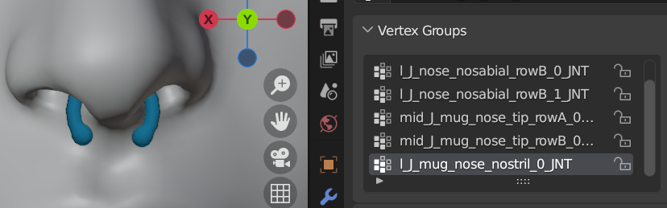<figcaption></figcaption></figure>

<figure>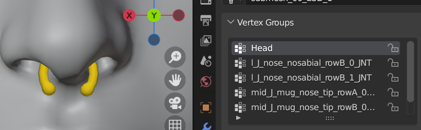<figcaption></figcaption></figure>

<figure>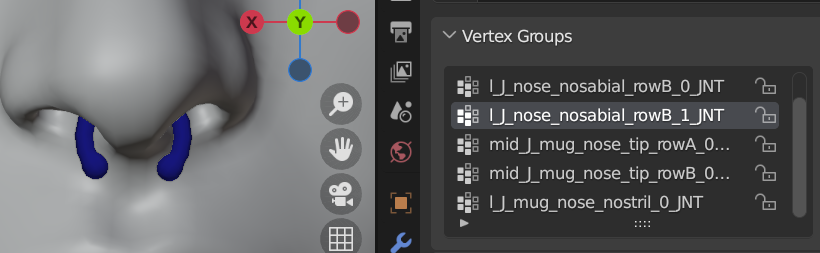<figcaption></figcaption></figure>

1. Go back to object mode if you’re in weight paint mode. Select your mesh and remove all vertex groups.

<figure>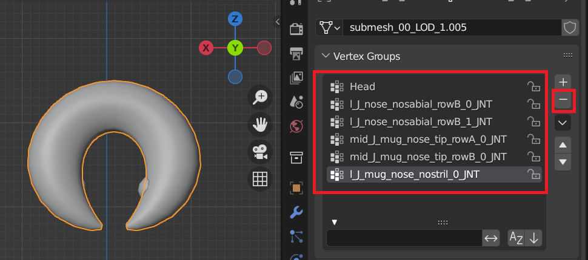<figcaption></figcaption></figure>

2. Go to modifiers (wrench icon) and add Data transfer modifier with below options. The source would be the vanilla piercing submesh that has weights.

<figure>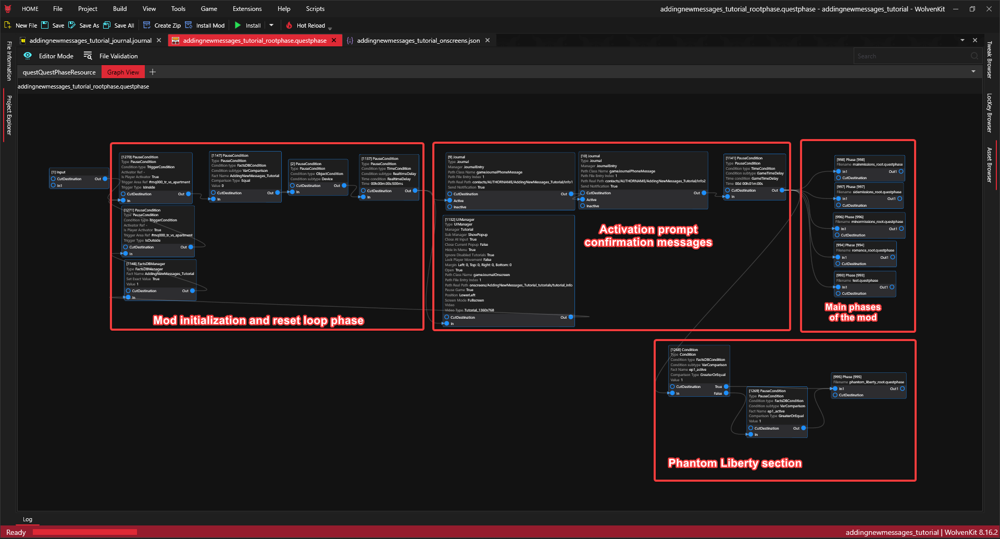<figcaption></figcaption></figure>

3.  Click Generate Data Layers, then apply the modifier.

    You can now see that your mesh has weights the same as vanilla mesh:

<figure>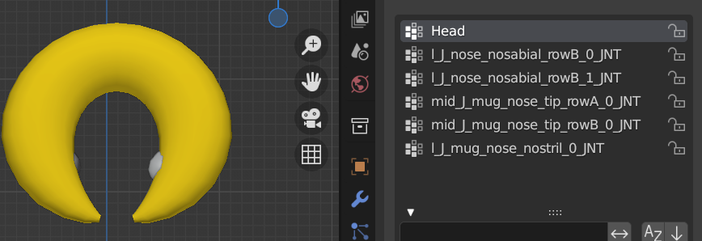<figcaption></figcaption></figure>

<figure>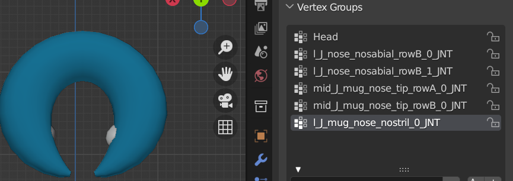<figcaption></figcaption></figure>

## Creating morphtargets (shape keys)

1. Unhide the head mesh if hidden and make sure no shape keys have value other than 0, then select Basis shape key.
2.  Go to edit mode (TAB) and position your mesh where you want it to be. You can keep the vanilla piercing visible for reference.

    I wanted mine to be a bit further back than the vanilla one, otherwise it clipped with the nostrils.

<figure><figcaption></figcaption></figure>

3. Now go through all the nose shape keys and position your mesh in the best position for each. You can set the value of the corresponding shape key on the head and vanilla piercing meshes to 1 for easier positioning (to do that come out of edit mode back to object mode) - if you do that, make sure you’re not setting any shape key to 1 on your new piercing mesh, they all have to stay 0.\
   \
   If creating nose piercing you only need to go through all the shape keys with nose in the name, if creating earring, go through ear shape keys and so on. No need to go through other, like for example eyes for a nose piercing.
4. Delete all unnecessary meshes if you have them, like head reference. Also delete the original piercing submesh, so only yours is left and rename the submesh accordingly (it should be something like `submesh_00_LOD_1` and not something like `submesh_00_LOD_1.005`)

## Exporting the mesh from Blender and importing in Wkit

Once you’re done export your mesh as gltf 2.0 with below settings. Save it over the glb exported in wkit.

<figure>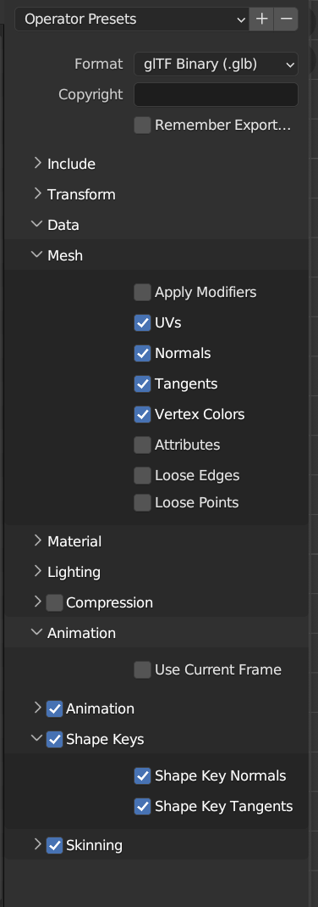<figcaption></figcaption></figure>

If your piercing is influenced by more than 4 bones, also include this option on export.

<figure>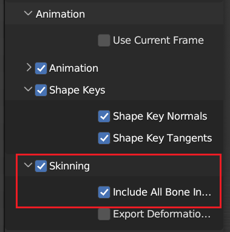<figcaption></figcaption></figure>

Next import it in wkit.

<figure>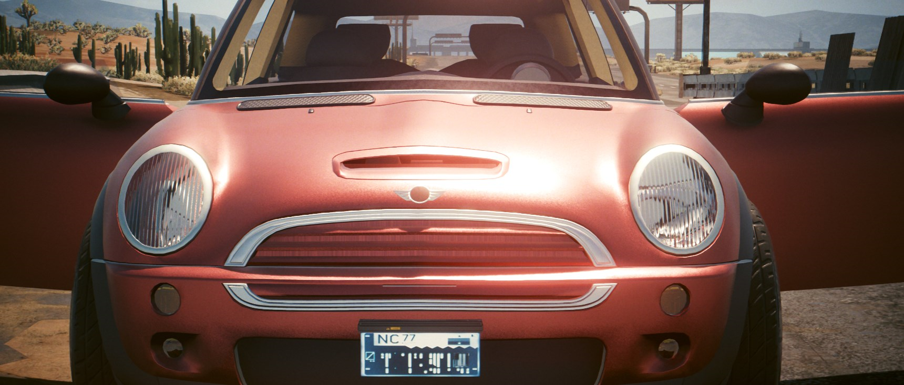<figcaption></figcaption></figure>

## Creating the mod

1. Add to project a morphtarget from PRC or create folder structure manually. They need to be named exactly like this, do not create a custom folder.

<figure>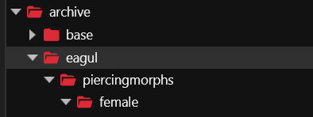<figcaption></figcaption></figure>

<figure><figcaption></figcaption></figure>

2. Now rename the morphtarget you imported from blender to whichever slot you want to use. The number will correspond to the slot. It does not matter which you use really, but if you want your mod to be compatible with any specific set of piercings made by someone else, check what slot they used and use different.
3. Move the file to eagul/piercingmorphs/.. (if you added to project a morphtarget from PRC to create the folder structure, delete it first, just leave empty folder before moving your new renamed morphtarget).

<figure>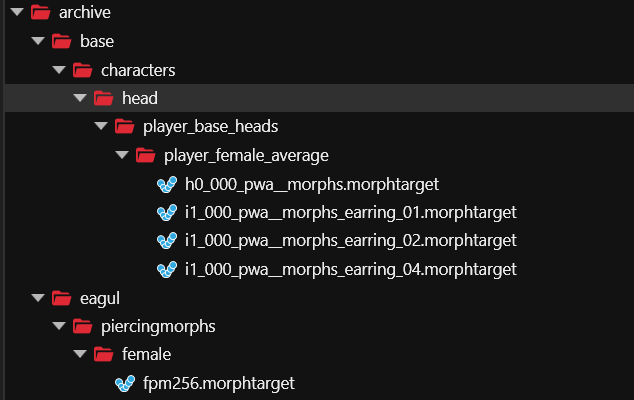<figcaption></figcaption></figure>

4. Now you can delete the character folders in base and install the mod.

**Naming is important**, your mod needs to load before PRC, so it is best to follow PRC’s naming convention: PRC\_f/m\_slot#.

To test your mod, set piercings to slider 12 for fV or 14 for mV and you should see your creation.

<figure>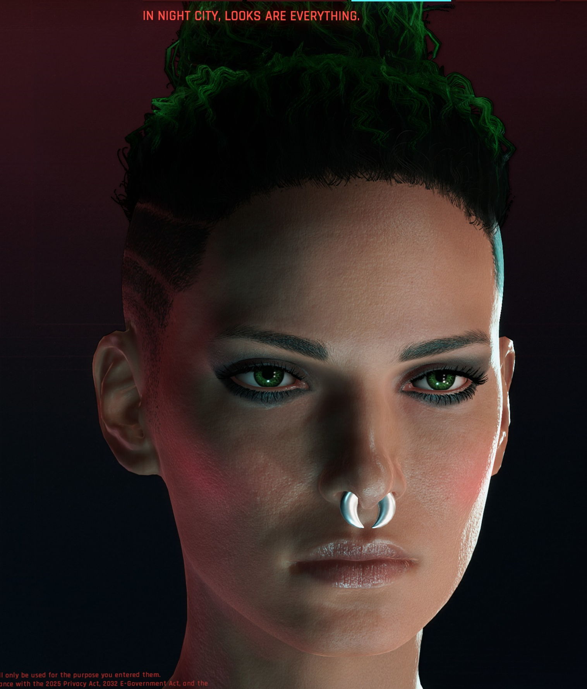<figcaption></figcaption></figure>

## Supplement for creating piercings in non-vanilla locations

1. You can only export the head morphtarget as it is the only one we’ll need.

<figure>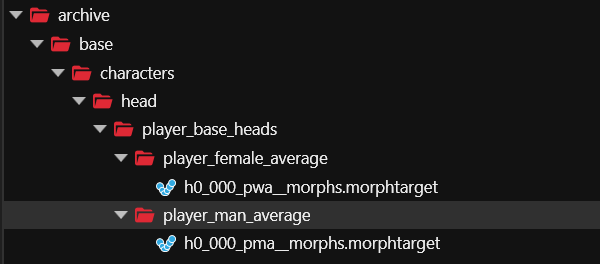<figcaption></figcaption></figure>

2. Import selected one into Blender, merge by distance, duplicate the mesh and delete all vertices from your duplicate in edit mode. This is similar to points 4-8 from the first section of the guide, except we’re working just with head mesh, not piercing meshes.
3. Weight paint your piercing. Since the location is not covered by any vanilla piercing, transfer the weights from your head mesh. Delete unused vertex groups (the ones that do not affect your piercing, ie have 0 weight).\
   Since piercings are solid objects we don't want them to stretch, so go through the vertex groups that affect your piercing in weight paint mode and colour them in one sold weight colour (you can use the picker to pick one from somewhere around the middle of the mesh).
4. Once you’re done with the weight painting proceed to creating your shape keys as in the morphtarget creation section of this guide. You can use your original head mesh as reference.\
   \
   **Tip:** If you want to test if your mesh works ok before going through all shape keys make sure you create at least one, otherwise it will flatline your game. Creating means moving at least one of the shape key positions to where they should be, not at the same position as the basis shape key.\

5. When done, delete the original head mesh and rename your own submesh. It should be called submesh\_00\_LOD\_1.
6. Export your file to gltf with the same settings as in the guide.
7. Import your file in wkit over the existing head file, place in the correct folder and rename to whichever slot you’d like to use.
8. Open your morphtarget and edit the path in this section:

<figure><figcaption></figcaption></figure>

Change the path to: \
`eagul\piercingmorphs\wa_linked.mesh` for fV \
`eagul\piercingmorphs\ma_linked.mesh` for mV

If you ever need to re-export your mesh again for editing you’ll have to change this back to the original path.

Now install your mod and enjoy.

<figure><figcaption></figcaption></figure>

## Textures are showing weirdly on my custom piercing meshes!

While selecting textured piercing colout it shows weirdly, something like this:

<figure>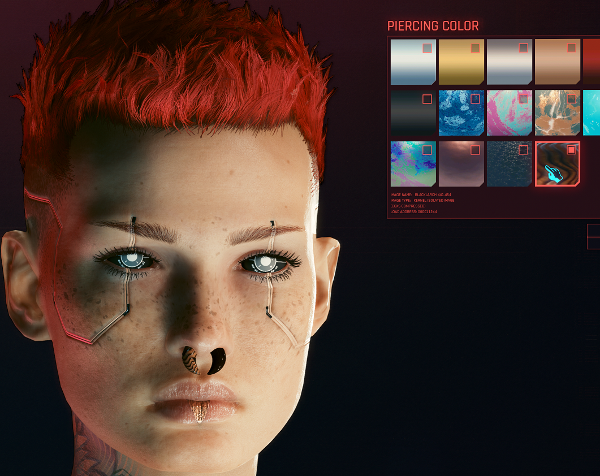<figcaption>
Wood texture doesn't cover the whole mesh.
</figcaption></figure>

This is because piercing materials have a mask designed for vanilla piercings in their .mlmask file, your custom piercing uses the same material so that you're able to use colour picker in character creator.

<figure>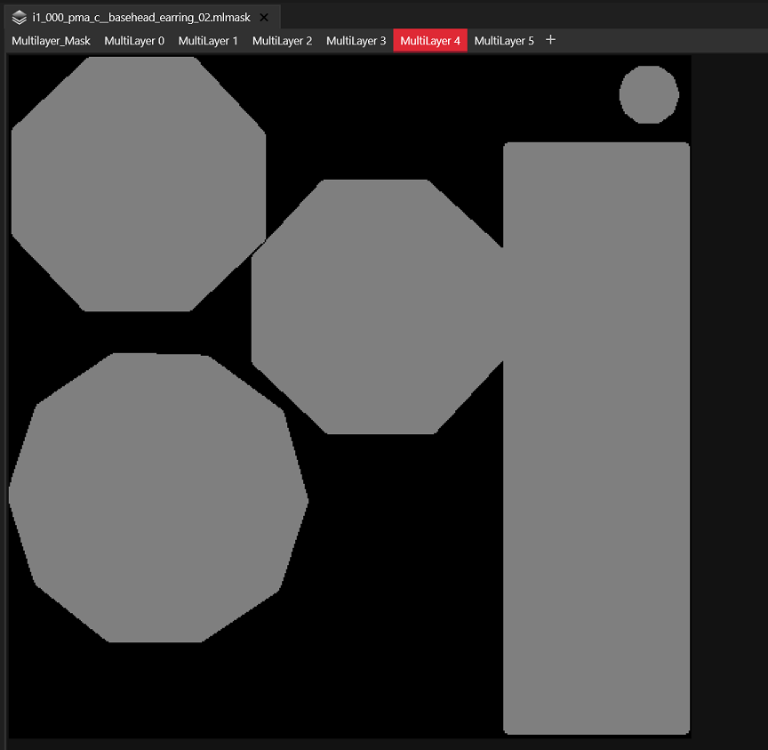<figcaption>
Mask in piercing2 material .mlmask file.
</figcaption></figure>

To fix this, download modified materials from my google drive here: [http://bit.ly/MxOrcBoipiercingmat](http://bit.ly/MxOrcBoipiercingmat)

Unzip them into your project to ../yourmodname/source/archive folder:

<figure><figcaption>
Put files from the zip file into your archive folder.
</figcaption></figure>

Now install your mod. The textures should show properly now.

<figure>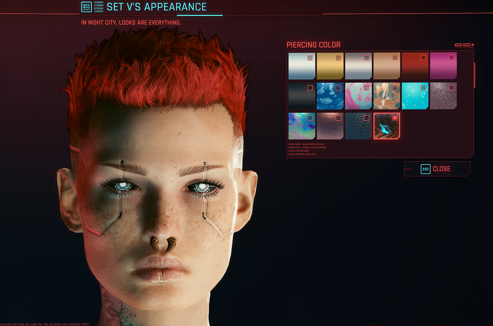<figcaption>
Textures are ok now.
</figcaption></figure>

