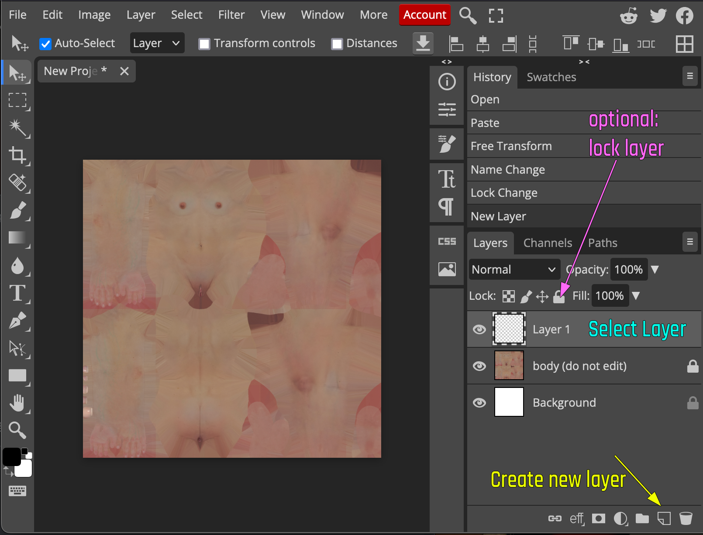
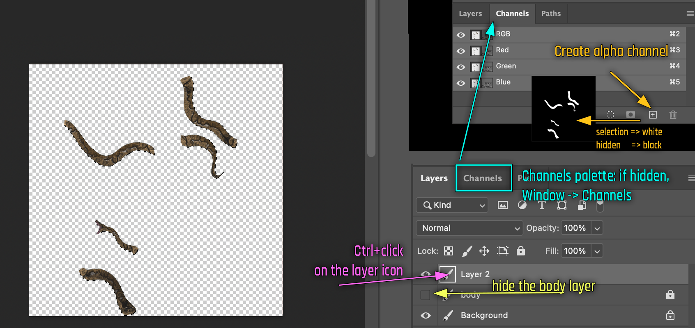

# How to create an overlay tattoo

## **Summary**

**Published**: Apr 11 2024 by Yggnire, initial guide by Yggnire\
**Last documented edit**: Aug 16 2024 by [manavortex](https://app.gitbook.com/u/NfZBoxGegfUqB33J9HXuCs6PVaC3 "mention")

This guide will teach you how to create your own overlay tattoo for either of the texture frameworks, or how to convert a tattoo for a different body mod.

### Wait, this is not what I want!

* If you are looking for the body layouts, check [converting-between-tattoo-frameworks](converting-between-tattoo-frameworks/ "mention") -> [#texture-layouts](converting-between-tattoo-frameworks/#texture-layouts "mention")

### Level of difficulty

**The ability to read**: mandatory, because I'm not gonna lie — this is gonna be difficult otherwise.\
**Knowing how to use a drawing software** : recommended, because this guide will not cover it.   Knowing how to use WolvenKit.&#x20;

### Estimated Time:

<5 minutes to set up everything\
5 minutes - as long as it takes you to create a tattoo that you like\
<5 minutes for the import/install

## Prerequisites

* [ ] You have [Wolvenkit installed](https://app.gitbook.com/s/-MP\_ozZVx2gRZUPXkd4r/getting-started/download)
* [ ] A drawing software like Clip Paint Studio, Photoshop or [photopea.com](https://www.photopea.com/)
* [ ] Some time and patience to create tattoo

## Step 0: Setup

### 1: Create a Wolvenkit Project


Tattoo mods are [load order](../../../for-mod-users/users-modding-cyberpunk-2077/load-order.md) dependent. You don't need to read the load order page, just make sure to name your mod project correctly.


Create a [Wolvenkit project](https://app.gitbook.com/s/-MP\_ozZVx2gRZUPXkd4r/wolvenkit-app/usage/wolvenkit-projects). Use the following naming schema per framework:

| VTK    | `00_my_first_tattoo`  |
| ------ | --------------------- |
| KS\_UV | `005_my_first_tattoo` |

### 2: Add the right files to your mod

You have two ways of getting the correct files:

* download the **modders' resources** from the framework's page
* add the files to your project from the framework you have already installed

The tutorial will walk you through the second:

1. Turn on the [Mod Browser](https://app.gitbook.com/s/-MP\_ozZVx2gRZUPXkd4r/wolvenkit-app/editor/asset-browser#mod-browser)&#x20;
2. Find the name of the texture that you want to edit on the [overlay-list.md](converting-between-tattoo-frameworks/overlay-list.md "mention")  page.
3. Use the [Wolvenkit Search](https://app.gitbook.com/s/-MP\_ozZVx2gRZUPXkd4r/wolvenkit-app/usage/wolvenkit-search-finding-files) to find the texture(s)
4. Add the files to your project by double-clicking on them.&#x20;

#### Optional: Add the base body texture as a reference


If you are trying to **convert** a tattoo, you need to use the body texture from the framework you want to **convert into**


The tattoo frameworks will have the base body texture in the same folder as the overlay files.&#x20;

1. Right-click on your overlay file in Wolvenkit's Project Browser
2. Select **Copy Relative Path** from the context menu
3. **Paste** the relative path into Wolvenkit's [search bar](https://app.gitbook.com/s/-MP\_ozZVx2gRZUPXkd4r/wolvenkit-app/usage/wolvenkit-search-finding-files)
4. Delete the **file name** from the path: you just want to search for the folder
5. Add `> .xbm` to the end of your search (with a space!) to limit your search to texture files.
6. Hit **Enter** and browse through the files inside the folder: one of them will be the base body texture.

## 3: Export the textures

1. Use the Export Tool to  [export](../../textures-and-luts/images-importing-editing-exporting.md) the `.xbm` files to `.png`.&#x20;


Since **tattoos** are independent from body complexion mods, **delete** the body texture xbm if you included it as a reference – you're only editing overlays.


2. Switch the project explorer to the [raw tab](https://app.gitbook.com/s/-MP\_ozZVx2gRZUPXkd4r/wolvenkit-app/editor/project-explorer#project-explorer-tabs) to find the image files.
3. You can right-click on one of the png files to open it in the Windows Explorer

## 4: Edit the textures

It's image editing time! This guide will only give you a rough outline, but make sure to read the red box below.


You need to create an **overlay**, meaning: a transparent layer with **only** your tattoo that is projected **on top** of the body texture.&#x20;

Do **not** draw on the body texture.


You can use an image editing software of your choice, as long as it supports alpha transparency. If you don't have one, use [photopea.com](https://www.photopea.com/) – it's free and in your browser!

1. **Optional:** Import the body texture as reference
2. Import the overlay texture that you want to edit

### Resizing the textures


Many people default to 4k or even 8k textures, but consider: **this is madness**! How often do you press your nose against your V on a 4k monitor?&#x20;

2k (2048x2048) is **almost always** enough.&#x20;

If you insist on making high-resolution textures, please remember people with older GPUs (who suffer from a lack of VRAM), and offer them as an **optional download.**


1. Create a new layer above the skin texture and start drawing your tattoo :&#x20;

<figure><figcaption></figcaption></figure>

## Making changes

You can now draw on the transparent layer (again, do **not** draw on the body texture).

If you are **converting** a tattoo, you will have move individual parts around instead.&#x20;


If you split off parts on a different layer, you don't need to worry about mistakes - you can always merge layers later!


### Exporting from your graphic editor

When your tattoo is complete, uncheck the eye on the skin layer

<figure><figcaption></figcaption></figure>

Your project should look like this: Your tattoo and no background

<figure><figcaption></figcaption></figure>

Let's export the tattoo. A detailed tutorial can be found under [#editing-a-texture](../../textures-and-luts/images-importing-editing-exporting.md#editing-a-texture "mention").


It's important that you **overwrite** the exact file that you exported from Wolvenkit (the `.png` file in your project's raw folder from step 3).


<figure><figcaption></figcaption></figure>

## 5: Reimporting the texture

Now you need to import your file back into Wolvenkit. You have two ways to do that:

### Import Tool

1. Overwrite the png that you created in step 3.1
2. Open the [Import Tool](../../textures-and-luts/images-importing-editing-exporting.md#importing-a-texture) and import your png
3. You're done

### Texture View

1. Save your new tattoo anywhere on your PC as a `.png` file.
2. In Wolvenkit, open the .xbm file by either double-clicking the file, or clicking the blue icon
3.

    <figure><figcaption></figcaption></figure>
4. Switch to the "**Texture Preview**" tab
5. Right click on it and select `Replace Texture`. Choose the file you have saved.

.png>).png>)

## Time to test!

[Install your mod](https://app.gitbook.com/s/-MP\_ozZVx2gRZUPXkd4r/wolvenkit-app/menu/toolbar#install-and-launch) by clicking the green Play button in the toolbar. Time to go in-game and admire your new tattoo!
