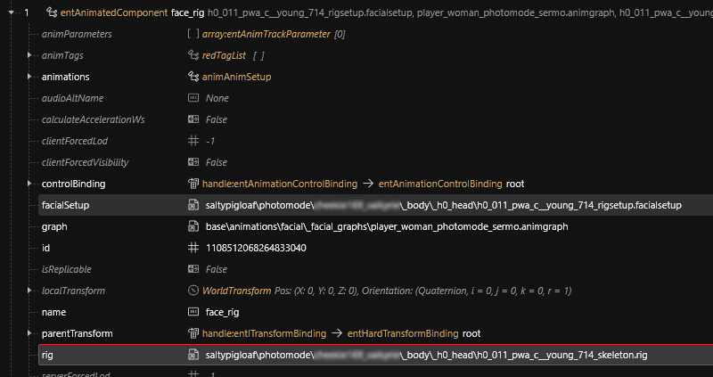

# NPV - Fixing Eye Clipping in NPVs

**Created:** August 11, 2025 by [saltypigloaf](https://app.gitbook.com/u/yM6HClAkcKNdJsz4fmRLM7qDIKL2 "mention")\
**Last documented update:** January 10, 2026

***

### **Overview**

In vanilla _Cyberpunk 2077_, V’s face only ever uses **Rig 000 and it's associated bone structure**, no matter what facial sliders you pick in Character Creation. This is a **known bug** and it causes serious visual problems.

> ❗ **Why it matters:**
>
> * There are **22 female /** **21 man** facial rigs in the game.
> * Each rig corresponds to a set of morph slider values: for example, Rig 000 = “all sliders at 1,” Rig 001 = “all sliders at 2,” etc.
> * These rigs exist so that every facial feature aligns correctly to your custom CC choices.
> * Using the wrong rig leads to _eyeballs clipping through eyelids or cheeks_ when looking sideways in Photo Mode.
> * For V, this can be corrected using mods like [Facial Customisation\[sic\] Rig Fix](https://www.nexusmods.com/cyberpunk2077/mods/7179) & [Facial Customization Fix - ArchiveXL](https://www.nexusmods.com/cyberpunk2077/mods/22849) but does not apply to NPVs.

***

### **Before You Start**

This guide assumes you have already followed this guide: [npv-preparing-the-head-in-blender.md](npv-v-as-custom-npc/npv-preparing-the-head-in-blender.md "mention")

***

## **Fixing the bones with a script**

The same way we apply character creator morph targets to meshes with a script in blender, we need to get the correct bones for our rig.

In your NPV **WolvenKit** project:

* Find your NPV's **head folder**. <mark style="color:$info;">(that contains all the head meshes)</mark>

> - _(the folder should have files like:_ `h0_000_pwa_c__basehead.mesh`, `he_000_pwa_c__basehead.mesh`, `heb_000_pwa_c__basehead.mesh`, _or_ `h0_000_pma_c__basehead.mesh`, `he_000_pma_c__basehead.mesh`, `hx_000_pma_c__basehead_cyberware_01.mesh`, _etc...)_
> - Make sure you didn't rename these files.

* We are going to **re-import** these meshes later, so **export** them if you don't have them exported already.
* Go to: **Tools** > **Script Manager** and add a new script:

<figure><figcaption></figcaption></figure>

* **Copy** this script into the editor, you just opened:


```javascript
import * as Logger from 'Logger.wscript';
import * as TypeHelper from 'TypeHelper.wscript';


/* = = = = = = = = = = = = = = = = = = = = = = = = = = = = = = = = = = = = = = = = = = = = = */

// ↓ YOUR NPV'S FOLDER, THAT CONTAINS HEAD MESHES
var npv_head = "tutorial\\npv\\your__character\\head\\"

// ↓ YOUR NPV'S CHARACTER CREATOR PARAMETERS
const cc_params_input = {
	eyes:  '22', // 01 = first appearance in character creator
	nose:  '22',
	mouth: '22',
	jaw:   '22',
	ears:  '22',
};

/* = = = = = = = = = = = = = = = = = = = = = = = = = = = = = = = = = = = = = = = = = = = = = */


function main() {

if (!npv_head.endsWith('\\')) npv_head = npv_head + '\\';

const cc_params_int = { // convert character creator string nubmers to integer indexes
	eyes:  parseInt( cc_params_input.eyes  ) - 1,
	nose:  parseInt( cc_params_input.nose  ) - 1,
	mouth: parseInt( cc_params_input.mouth ) - 1,
	jaw:   parseInt( cc_params_input.jaw   ) - 1,
	ears:  parseInt( cc_params_input.ears  ) - 1,
};

const cc_path = "base\\characters\\head\\player_base_heads\\";

function shorten_cc_path(filepath) {return filepath.startsWith(cc_path) ? '...\\'+filepath.slice(cc_path.length) : filepath; } // for logs

const cc_pwa_path = cc_path + "player_female_average\\";
const cc_pma_path = cc_path + "player_man_average\\";

const cc_pwa_folders = [
"h0_000_pwa_c__basehead\\",
"h0_001_pwa_b__middle_043\\",
"h0_002_pwa_a__young_096\\",
"h0_003_pwa_c__middle_701\\",
"h0_004_pwa_c__young_731\\",
"h0_005_pwa_c__young_703\\",
"h0_006_pwa_c__young_752\\",
"h0_007_pwa_c__middle_747\\",
"h0_008_pwa_c__middle_712\\",
"h0_009_pwa_a__young_041\\",
"h0_010_pwa_b__young_076\\",
"h0_011_pwa_c__young_714\\",
"h0_012_pwa_c__middle_738\\",
"h0_013_pwa_c__middle_721\\",
"h0_014_pwa_c__middle_777\\",
"h0_015_pwa_c__middle_707\\",
"h0_016_pwa_c__middle_720\\",
"h0_017_pwa_a__middle\\",
"h0_018_pwa_a__middle\\",
"h0_019_pwa_b__middle\\",
"h0_020_pwa_b__middle\\",
"h0_021_pwa_c__young_demovicky\\"
];

const cc_pma_folders = [
"h0_000_pma_c__basehead\\",
"h0_001_pma_a__middle_724\\",
"h0_002_pma_b__middle_047\\",
"h0_003_pma_c__middle_768\\",
"h0_004_pma_a__middle_749\\",
"h0_005_pma_a__middle_742\\",
"h0_006_pma_a__middle_740\\",
"h0_007_pma_c__middle_704\\",
"h0_008_pma_c__middle_783\\",
"h0_009_pma_c__young_727\\",
"h0_010_pma_c__middle_758\\",
"h0_011_pma_c__middle_763\\",
"h0_012_pma_c__middle_723\\",
"h0_013_pma_b__older_046\\",
"h0_014_pma_c__middle_776\\",
"h0_015_pma_b__middle_049\\",
"h0_016_pma_b__young_002\\",
"h0_017_pma_a__middle\\",
"h0_018_pma_a__middle\\",
"h0_019_pma_b__middle\\",
"h0_020_pma_b__middle\\"
];

const cc_bodies = [
{ code: "_pwa_", path: cc_pwa_path, folders: cc_pwa_folders },
{ code: "_pma_", path: cc_pma_path, folders: cc_pma_folders }
];


const PROJ_FILES = [...wkit.GetProjectFiles('archive')];

Logger.Info('loading game files...');

const GAME_FILES = [...wkit.GetArchiveFiles()].map(f => f.Name);
// const GAME_FILES = PROJ_FILES; //DEBUG

const output_subfolder = "#script_output\\"; // set to "" to override original files


// basically detects whether the input filename includes "_pwa_" or "_pma_"
function detect_cc_body(filename) {

	let cc_body;

	for (let b of cc_bodies) {
		if (filename.includes(b.code)) {
			cc_body = b;
			break;
		}
	}

	if (!cc_body) {
		let allcodes = cc_bodies.map(b => b.code).join(' or ');
		Logger.Error(filename + '  <<  file name includes no ' + allcodes);
		return null;
	}

	return cc_body;
}

// finds a matching mesh based on input file name and a character creator parameter.
// returns a file with the same prefix if there is only one (like 'h0_' / 'he_' / 'heb_' ..)
// else returns a file with the same postfix (get_mesh_type())
function get_cc_match(filename, cc_index) {

	let cc_body = detect_cc_body(filename); if (!cc_body) { return null; }

	let cc_folder_name = cc_body.folders[cc_index];

	let files = GAME_FILES
	.filter((f) => f.startsWith( cc_body.path + cc_folder_name ))
	.filter((f) => f.endsWith('.mesh'))
	.filter((f) => /[^\\]*$/.exec(f)[0].split('_')[0] === filename.split('_')[0])
	
	if (files.length == 1) {
		return files[0];
	}
	
	let identity = cc_folder_name.split(cc_body.code)[1].slice(0, -1); // 'c__basehead' / 'c__middle_747' / 'c__young_714'
	
	const get_mesh_type = (f, identity) => {
		return f.slice(f.lastIndexOf(identity) + identity.length); // '_cyberware_01.mesh' / '_personal_slot_dec.mesh' / '_earring_01.mesh' ..
	};
	
	files = files.filter((f) => filename.endsWith( get_mesh_type(f, identity) ));
	
	if (files.length > 1) {
		Logger.Warning("get_cc_match() matched files len > 1");
		Logger.Warning("returning first one:");
		Logger.Warning(files);
	}
	else if (files.length < 1) { return null; } // no match found
	
	return files[0];

}

function construct_mesh(filepath) {
	
	let json = TypeHelper.JsonParse(wkit.GameFileToJson(wkit.GetFileFromProject(filepath, OpenAs.GameFile)));
	
	let current_npv_mesh_name = /[^\\]*$/.exec(filepath)[0]; // 'h0_000_pwa_c__basehead.mesh'
	
	Logger.Info('constructing: ' + current_npv_mesh_name);
	
	let done_anything = false;
	
	const transfer = (cc_param, cc_type) => {
	
		let cc_match_filepath = get_cc_match( current_npv_mesh_name, cc_param );
		
		if (!cc_match_filepath) { Logger.Warning('couldnt find a matching donor file... (' + cc_type + ')'); return false; }

		Logger.Debug('transfering bones from:  [' + shorten_cc_path(cc_match_filepath) + ']  with "' + cc_type + '" in the name');
		
		let cc_json = TypeHelper.JsonParse(wkit.GameFileToJson(wkit.GetFile(cc_match_filepath, OpenAs.GameFile)));
		// let cc_json = OPEN_GAME_FILE(cc_match_filepath);
	
		for ( const [cc_index, b] of cc_json["Data"]["RootChunk"]["boneNames"].entries() ) {
			
			let s = b.value;
			
			if (!s.includes(cc_type)) continue;
			
			let i = json["Data"]["RootChunk"]["boneNames"].findIndex(b => b.value === s);
			
			if (i == -1) continue;
			
			json["Data"]["RootChunk"]["boneRigMatrices"][i] =                                       cc_json["Data"]["RootChunk"]["boneRigMatrices"][cc_index];
			json["Data"]["RootChunk"]["boneVertexEpsilons"][i] =                                    cc_json["Data"]["RootChunk"]["boneVertexEpsilons"][cc_index];
			json["Data"]["RootChunk"]["renderResourceBlob"]["Data"]["header"]["bonePositions"][i] = cc_json["Data"]["RootChunk"]["renderResourceBlob"]["Data"]["header"]["bonePositions"][cc_index];
			
			//Logger.Success(i);
			//Logger.Success(s);
			
		}
		
		done_anything = true; return true;

	};

	transfer(cc_params_int.jaw  , "_jaw_" );
	transfer(cc_params_int.ears , "_ear_" );
	transfer(cc_params_int.nose , "_nose_");
	transfer(cc_params_int.mouth, "_mug_" );
	transfer(cc_params_int.eyes , "_eye_" );

	if (done_anything) {

		let outpath = npv_head + output_subfolder + current_npv_mesh_name;
	
		Logger.Success('saving to: ' + outpath);
		wkit.SaveToProject( outpath, wkit.JsonToCR2W(TypeHelper.JsonStringify(json)) );

	}
	else { 

		Logger.Warning('done nothing, skipping ' + current_npv_mesh_name + '...'); return; 

	}
	
}


function get_cc_match_rig(cc_body, cc_index) {

	let cc_donor_dir = cc_body.path + cc_body.folders[cc_index];
	
	let files = GAME_FILES.filter(f => f.startsWith(cc_donor_dir) && f.endsWith('_skeleton.rig'));

	files = files.filter((item, index) => { return files.indexOf(item) === index; }); // deduplicate

	if (files.length > 1) { Logger.Warning('multiple rigs found in: ' + cc_donor_dir + '. Picking first one...'); Logger.Debug(files); }
	else if (files.length < 1) { Logger.Error('_skeleton.rig not found in: ' + cc_donor_dir); return null; }
	
	return files[0];

}

function construct_rig(cc_body) {

	Logger.Info('constructing a rig for ' + cc_body.code);
	
	let base_rig_filepath = get_cc_match_rig(cc_body, cc_params_int.eyes);

	let json = TypeHelper.JsonParse(wkit.GameFileToJson(wkit.GetFile(base_rig_filepath, OpenAs.GameFile)));
	
	const transfer = (cc_param, cc_type) => {
		
		let donor_rig_filepath = get_cc_match_rig(cc_body, cc_param);

		let cc_json = TypeHelper.JsonParse(wkit.GameFileToJson(wkit.GetFile(donor_rig_filepath, OpenAs.GameFile)));
		
		Logger.Debug('transfering bones from:  [' + shorten_cc_path(donor_rig_filepath) + ']  with "' + cc_type + '" in the name');
		
		for ( const [cc_index, b] of cc_json["Data"]["RootChunk"]["boneNames"].entries() ) {
			
			let s = b.value;
			
			if (!s.includes(cc_type)) continue;
			
			let i = json["Data"]["RootChunk"]["boneNames"].findIndex(b => b.value === s);
			
			if (i == -1) continue;
			
			json["Data"]["RootChunk"]["boneTransforms"][i] = cc_json["Data"]["RootChunk"]["boneTransforms"][cc_index];
			
		}
		
	};
	
	transfer(cc_params_int.jaw  , "_jaw_" );
	transfer(cc_params_int.ears , "_ear_" );
	transfer(cc_params_int.nose , "_nose_");
	transfer(cc_params_int.mouth, "_mug_" );
	transfer(cc_params_int.eyes , "_eye_" );
	
	let outpath = npv_head + output_subfolder + cc_body.code + 'skeleton.rig';
	
	Logger.Success('saving rig to: ' + outpath);
	wkit.SaveToProject( outpath, wkit.JsonToCR2W(TypeHelper.JsonStringify(json)) );
	
}


let any_files_found = false;

for (let filepath of PROJ_FILES
.filter((fp) => fp.slice(0,fp.lastIndexOf('\\')) === npv_head.slice(0,npv_head.lastIndexOf('\\')) ) // only files in the npv_head folder (without subfolders)
//.filter((file) => file.startsWith( npv_head )) // only files in the npv_head folder (with subfolders)
.filter((fp) => fp.endsWith('.mesh'))
) {
	construct_mesh(filepath);

	any_files_found = true;
}

if (!any_files_found) { Logger.Warning('set the npv_head variable of this script to your npv folder with head meshes. (no meshes found in: ' + npv_head + ' )'); }


for (let cc_body of cc_bodies) {
	// basically check if there are any files in the npv_head folder, with "_pwa_" or "_pma_" in the name
	if (PROJ_FILES
	.filter((fp) => fp.slice(0,fp.lastIndexOf('\\')) === npv_head.slice(0,npv_head.lastIndexOf('\\')) )
	.filter((fp) => fp.endsWith('.mesh'))
	.filter((fp) => /[^\\]*$/.exec(fp)[0].includes(cc_body.code))
	.length == 0 ) { continue; }

	construct_rig(cc_body);

}


}

main();

```


* At the top of the script:
  * Set the **npv\_head** variable to the path of your npv's **head folder**.
  * Set the **cc\_params\_input** to your character creator parameters (the same way you did in blender)

> Make sure to replace `\` backslashes with `\\` double backslashes when pasting any paths into scripts.

* Save & **Run the script**. <mark style="color:$info;">(Make sure you have log opened to see when its done.)</mark>

If there are no errors in the logs:

* Move everything out the `#script_output` folder. <mark style="color:$info;">(backup your files, replace them with the new ones)</mark>
* **Re-import** the meshes using the **Import Tool**.

> Re-importing is crucial for allowing WolvenKit to correctly calculate the new bone values.

After replacing the skeleton in the mesh, you need to update the **`face_rig`** component:

* Open the `.app` or `.ent` file that contains your NPV’s head setup.
* Locate the **`face_rig`** component.
  * Set **`rig`** to the new `_skeleton.rig` file
* **Done.**


If the script didn't work correctly, don't be scared to figure out what the logs are saying.&#x20;

This code is not complicated and should be easy enough to edit.


***

## **Fixing the bones manually:**

#### **The Trade-Off** <a href="#the-trade-off" id="the-trade-off"></a>

> ⚠ **Heads up:** This changes the _entire_ head skeleton, not just the eyes.
>
> * **Pro:** Eyes track correctly; no clipping.
> * **Con:** The rest of the head inherits _slight_ positional changes from the donor rig.
> * For most NPVs this is worth it.
>
> If you want to avoid this - use the script. Fixing the rig properly manually is too much work.

### **Workflow Overview**

1. Identify donor rig for your NPV’s face/eye shape.
2. Export target mesh to GLB.
3. Copy skeleton data from donor to target in WolvenKit.
4. Re-import target mesh into WolvenKit.
5. Update the face\_rig component

***

### **Step-by-Step Guide**

#### 1. Prepare Files

* Identify your donor mesh, based on the Character Creation chosen for the Eye
  * Navigate to `base\characters\head\player_base_heads\player_{body}_average\`
  * Find the subfolder with the numeric value of your Eye choice. The number will be offset by 1 because the rig 000 is associated with Character Creation choice of 01.

> 📄 **Example:**
>
> If your eye selection was 12, your rig/bones will be found in the 011 folder, either:
>
> * `h0_`**`011`**`_pwa_c__young_714`
> * `h0_`**`011`**`_pma_c__middle_763`

* Import the necessary files into WolvenKit:
  * **Source mesh** (donor head with correct rig, identified above)
  * New **facialsetup** and **rig** files
  * **Target mesh** (NPV head you want to fix)
* Duplicate the target mesh to keep an untouched backup.

> ⚠ **Warning:** Never work directly on your final NPV mesh! Always duplicate for edits.

***

#### 2. Export target mesh to GLB

* Export your target mesh using the Export Tool in WolvenKit.

> ⚠ **Note:** You won't need to edit this GLB directly, but the step of exporting and importing is absolutely necessary.

***

#### 3. Copy Skeleton Data

* Open both both the target and donor meshes in WolvenKit.
* Change the **Editor Mode** to **Advanced** in both
* In the target mesh, delete the following arrays:
  * `"boneNames"`.
  * `"boneRigMatrices"`.
  * `"boneVertexEpsilons"`
  * `"renderResourceBlob/header/bonePositions"`
* In donor mesh, copy each of these arrays, one at a time, and paste them into the target mesh:

***

#### 4. Re-import target mesh into WolvenKit

* Save your changes.
* Using the **Import Tool**, import your target mesh from GLB.

> ⚠ **Important:** This step is crucial for allowing WolvenKit to correctly calculate the new bone values. Without it, your NPVs face will droop and sag.

***

#### **5. Update the `face_rig` Component**

After replacing the skeleton in the mesh, you need to update the **`face_rig`** component so the game points to the correct donor rig and facial setup.

1. In WolvenKit, open the `.app` or `.ent` file that contains your NPV’s head setup.
2. Locate the **`face_rig`** component.
3. Update:
   * **`rig`** → point this to the donor `.rig` file you imported in Step 1.
   * **`facialSetup`** → point this to the donor `.facialsetup` file you imported in Step 1.
4. Leave the **`animGraph`** value _unchanged_ — this stays as it is.

<figure><figcaption></figcaption></figure>

> ⚠ **Important:** If you don’t update both `.rig` and `.facialsetup` to match the donor, the facial bones will not behave correctly in-game.

### **Credits**

* **Original JSON Method:** [xBaebsae](https://xbaebsae.jimdofree.com/cyberpunk-2077-guides/cp2077-transferring-and-expanding-skeletons-in-meshes/)
* @eagull, [mana vortex](https://app.gitbook.com/u/NfZBoxGegfUqB33J9HXuCs6PVaC3 "mention") , and @scorpiontank for their invaluable input
* [Zwei Valerie](https://app.gitbook.com/u/YvPrbtYFcff1iVuhhxhlJJEYw8l1 "mention") and [lLorion](https://app.gitbook.com/u/PBj6mVsHrzUk8L79wwGi1JC8qnp2 "mention") for trials/testing
