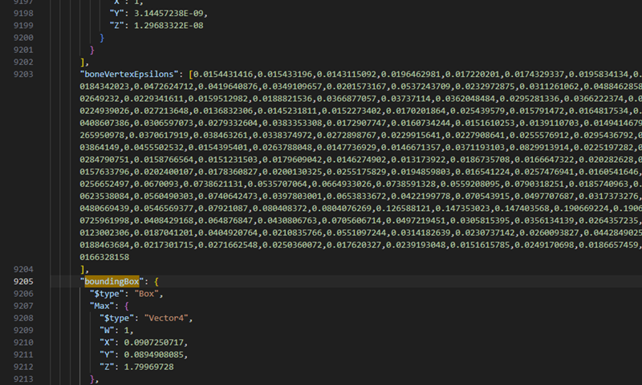
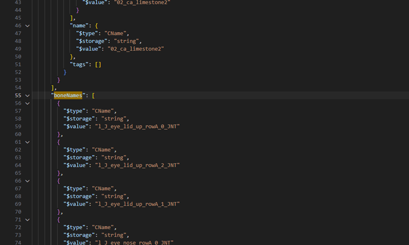

# Fixing Eye Clipping in NPVs by Replacing Facial Rigs

**Created:** August 11, 2025 by [@saltypigloaf](https://tinyurl.com/spl-server)\
Adapted from xBaebsae’s [skeleton transfer method](https://xbaebsae.jimdofree.com/cyberpunk-2077-guides/cp2077-transferring-and-expanding-skeletons-in-meshes/)\
**Last documented update:** N/A&#x20;

***

### **Overview**

In vanilla _Cyberpunk 2077_, V’s face only ever uses **Rig 000 and it's associated bone structure**, no matter what facial sliders you pick in Character Creation.  This is a **known bug** and it causes serious visual problems.

> ❗ **Why it matters:**
>
> * There are **22 facial rigs** in the game.
> * Each rig corresponds to a set of morph slider values: for example, Rig 000 = “all sliders at 1,” Rig 001 = “all sliders at 2,” etc.
> * These rigs exist so that every facial feature aligns correctly to your custom CC choices.
> * Using the wrong rig leads to _eyeballs clipping through eyelids or cheeks_ when looking sideways in Photo Mode.
> * For V, this can be corrected using mods like [Facial Customisation\[sic\] Rig Fix](https://www.nexusmods.com/cyberpunk2077/mods/7179) & [Facial Customization Fix - ArchiveXL](https://www.nexusmods.com/cyberpunk2077/mods/22849) but does not apply to NPVs.

***

### **Before You Start**

This guide assumes you already know how to:

* Import/export meshes with WolvenKit
* Work with JSON files in a text editor without breaking syntax

> 💡 **If you’ve built NPVs before, you already meet these requirements.** This guide focuses on the **rig replacement** process, not general WolvenKit navigation.

***

### **The Fix**

We replace the head skeleton in your mesh with one from the correct donor rig that matches your NPV’s eye shape.

> ✅ **Result:** Restores correct bone positions for eyes and facial features. Eye tracking works again; no more “eyeballs escaping through your face.”

***

### **The Trade-Off**

> ⚠ **Heads up:** This changes the _entire_ head skeleton, not just the eyes.
>
> * **Pro:** Eyes track correctly; no clipping.
> * **Con:** The rest of the head inherits _slight_ positional changes from the donor rig.
> * For most NPVs this is worth it.

***

### **Tools Needed**

<table><thead><tr><th width="180">Software</th><th width="193">Version</th><th>Notes</th></tr></thead><tbody><tr><td>Wolvenkit <a href="https://github.com/WolvenKit/Wolvenkit/releases">Stable</a> | <a href="https://github.com/WolvenKit/WolvenKit-nightly-releases/releases">Nightly</a></td><td>>= 8.6 recommended </td><td>You can't make mods without Wolvenkit</td></tr><tr><td>Text editor</td><td>N/A</td><td>Notepad, Notepad++, VS Code, etc</td></tr></tbody></table>

> 💡 **Tip:** Use a text editor with JSON syntax highlighting (VS Code recommended); it makes spotting bracket mismatches much easier.

***

### **Workflow Overview**

1. Identify donor rig for your NPV’s face/eye shape.
2. Export both donor and target meshes.
3. Copy skeleton data from donor JSON to target JSON.
4. Copy linked renderChunk data for bone positions.
5. Re-import edited JSON into WolvenKit.
6. Update your **face\_rig**.

***

### **Step-by-Step Guide**

#### 1. Prepare Files

* Identify your donor mesh, based on the Character Creation chosen for the Eye
  * Navigate to `base\characters\head\player_base_heads\player_{body}_average\`&#x20;
  * Find the subfolder with the numeric value of your Eye choice.  The number will be offset by 1 because the rig 000 is associated with Character Creation choice of 01.

> 📄 **Example:**
>
> If your eye selection was 12, your rig/bones will be found in the 011 folder, either:
>
> * `h0_`**`011`**`_pwa_c__young_714`
> * `h0_`**`011`**`_pma_c__middle_763`

* Import the necessary files into WolvenKit:
  * **Source mesh** (donor head with correct rig, identified aboveve)
  * New **facialsetup** and **rig** files
  * **Target mesh** (NPV head you want to fix)
* Duplicate the target mesh to keep an untouched backup.

> ⚠ **Warning:** Never work directly on your final NPV mesh! Always duplicate for edits.

***

#### 2. Export to JSON

* Right-click both meshes → **Export to JSON**.
* Using the **Export Tool**, export the target mesh to GLB.

***

#### 3. Copy Skeleton Data

1. Open both JSONs in your text editor.
2. In **source JSON**:
   * Search for `"bound"`.
   * Scroll up to `"Bone Names"`.
   * Select everything from `"Bone Names"` down to just before `"boundingBox"`.
   * **Copy** this block.
3. In **target JSON**:
   * Make the same selection.
   * **Paste** to replace it.

<figure><figcaption></figcaption></figure>

<figure><figcaption></figcaption></figure>

> 💡 **Tip:** Keep both files open side-by-side so you can verify matching selection points.

***

#### 4. Copy RenderChunk Data (same procedure as before)

1. In **source JSON**:
   * Search for `"customData": []`.
   * Select from the line above it down to `"bonePositions"`.
   * **Copy**.
2. In **target JSON**:
   * Select the same section.
   * **Paste** to replace it.

***

#### 5. Save & Re-Import

* Save your changes.
* In WolvenKit, right-click the target mesh JSON → **Import from JSON**.
* Using the **Import Tool**, import your target mesh from GLB.

> ⚠ **Important:** If you see errors on JSON import, check for missing commas or extra brackets from the copy-paste step.

***

#### **6. Update the `face_rig` Component**

After replacing the skeleton in the mesh, you need to update the **`face_rig`** component so the game points to the correct donor rig and facial setup.

1. In WolvenKit, open the `.app` or `.ent` file that contains your NPV’s head setup.
2. Locate the **`face_rig`** component.
3. Update:
   * **`rig`** → point this to the donor `.rig` file you imported in Step 1.
   * **`facialSetup`** → point this to the donor `.facialsetup` file you imported in Step 1.
4. Leave the **`animGraph`** value _unchanged_ — this stays as it is.

<figure><figcaption></figcaption></figure>

> ⚠ **Important:** If you don’t update both `.rig` and `.facialsetup` to match the donor, the facial bones will not behave correctly in-game.

### **Credits**

* **Original Method & Screenshots:** [xBaebsae](https://xbaebsae.jimdofree.com/cyberpunk-2077-guides/cp2077-transferring-and-expanding-skeletons-in-meshes/)
* @eagull, @manavortex, and @scorpiontank for their invaluable input&#x20;
