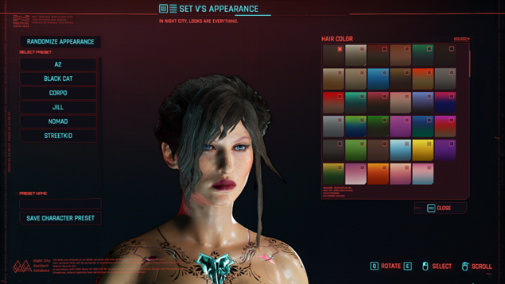
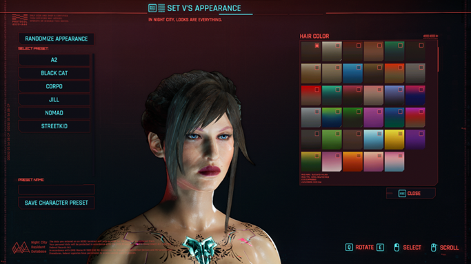
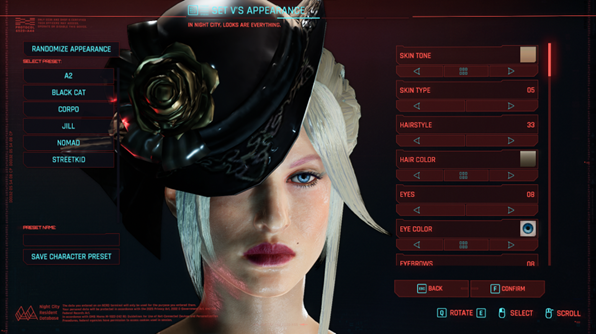

# Basic Hairstyle Replacement Tutorial

**Published:** March 15 2024 by D.I.S.C.O\
**Last documented update**: March 18 2024 by [manavortex](https://app.gitbook.com/u/NfZBoxGegfUqB33J9HXuCs6PVaC3 "mention")

This guide will teach you how to&#x20;

* port a hair mesh from a different game to Cyberpunk
* add physics ("dangle bones") to parts of it&#x20;
* use the UUH4V framework to avoid conflict with NPCS

### Wait, this is not what I want!

* For an overview of existing hair files and -colours, check [hair.md](../../../for-mod-creators/references-lists-and-overviews/cheat-sheet-head/hair.md "mention")
* For a more detailed guide on hair physics, check [dangle-bones](../../../for-mod-creators-theory/3d-modelling/dangle-bones/ "mention") or [moving-a-dangle-chain.md](../../../for-mod-creators-theory/3d-modelling/dangle-bones/moving-a-dangle-chain.md "mention")

You can find a video tutorial by eagul on youtube:



## Requirements

* [WolvenKit](https://github.com/WolvenKit/WolvenKit-nightly-releases/releases) >= 8.13.0 (you should have it [installed and onfigured](https://app.gitbook.com/s/-MP\_ozZVx2gRZUPXkd4r/getting-started/download))
* [Blender](https://www.blender.org/download/releases/4-0/) >= 4.0
* the [wolvenkit-blender-io-suite](../../../for-mod-creators-theory/modding-tools/wolvenkit-blender-io-suite/ "mention") (most recent version)
* [UUH4V Framework](https://www.nexusmods.com/cyberpunk2077/mods/7181) (To avoid conflicts with spawned NPCs)

## Introduction

You first need to understand the files you need for hair to work in CP2077. There are three type of files: the Mesh, the Texture and the Physics.

## The Mesh

### Adding the head

Begin by importing the player’s head. This will allow you to adjust your mesh more accurately and to avoid clipping.

1. Use the [Asset Browser](https://app.gitbook.com/s/-MP\_ozZVx2gRZUPXkd4r/wolvenkit-app/editor/asset-browser) to [find](https://app.gitbook.com/s/-MP\_ozZVx2gRZUPXkd4r/wolvenkit-app/usage/wolvenkit-search-finding-files) the correct mesh and [add it to your project](https://app.gitbook.com/s/-MP\_ozZVx2gRZUPXkd4r/wolvenkit-app/editor/asset-browser#adding-files-to-projects).

<table><thead><tr><th width="151">body gender</th><th>mesh path</th></tr></thead><tbody><tr><td>m</td><td><code>base\characters\head\player_base_heads\player_man_average\h0_000_pma_c__basehead\h0_000_pma_c__basehead.mesh</code></td></tr><tr><td>w</td><td><code>base\characters\head\player_base_heads\player_female_average\h0_000_pwa_c__basehead\h0_000_pwa_c__basehead.mesh</code></td></tr></tbody></table>

2. [Export the mesh](../../../for-mod-creators-theory/modding-tools/wolvenkit-blender-io-suite/wkit-blender-plugin-import-export.md#export-from-wolvenkit) from Wolvenkit
3. [Import the mesh](../../../for-mod-creators-theory/modding-tools/wolvenkit-blender-io-suite/wkit-blender-plugin-import-export.md#importing-into-blender) into Blender

### Adjusting the hair

1. Import your hairstyle mesh. \
   This tutorial is using the Festive Hunter’s hairstyle from Nier Reincarnation, since a future version of this tutorial will also cover the addition of ornaments to your hair

2. The modded hair will come with its own armature (bones), modifiers and materials. Delete all those, since you don't need them:&#x20;
   * Bones: The "armature" object in the Outliner (top right panel)
   * Vertex groups: In the "data" tab (green triangle) under object properties (bottom right panel)
   * Modifiers: In the "modifiers" tab (orange wrench)

 

3. Reposition and refit the hairstyle to fit V's head.&#x20;


Be sure to check around the edges of the hairstyle to avoid clippings with the head.


### Rigging the hair

Unlike clothes, most head meshes only have one bone: `Head`. More complex designs and physics will involve more bones, but we'll stick to the easy version for now.

1. Select your hair
2. Switch to Edit mode (Hotkey: `Tab`)
3. Select all vertices (Hotkey: `A`)
4. In the `Data` tab of the Properties panel (green triangle), create the `Head` entry (see screenshot below)
5. Click on `Assign`&#x20;

<figure><figcaption></figcaption></figure>

If you were to add this mesh in-game, it would stay on your character's head like a helmet.

### Submeshes and materials


This will blow the scale of this guide and you can ignore it for now. Once you're done with your hair, come back here and look at the links below if your hair mesh includes ornaments.


You can check the [#splitting-off-submeshes-mildly-advanced](../../textures-and-luts/textured-items-and-cyberpunk-materials.md#splitting-off-submeshes-mildly-advanced "mention") guide, or read up on material assignment in Wolvenkit under [submeshes-materials-and-chunks.md](../../../for-mod-creators-theory/files-and-what-they-do/3d-objects-.mesh-files/submeshes-materials-and-chunks.md "mention").

## The Physics


For more detes about physics, check [dangle-bones](../../../for-mod-creators-theory/3d-modelling/dangle-bones/ "mention") or [moving-a-dangle-chain.md](../../../for-mod-creators-theory/3d-modelling/dangle-bones/moving-a-dangle-chain.md "mention"). This is not necessary for the scope of this guide!


Remember when I said “like a helmet”? That also means your hair will not have any physics. Some short hair won’t have physics to wave around to begin with, but if you want your bangs and ponytails to wave when you open the character editor, get ready for some trial and error.

1. First of all, understand which part of your hair you want to have physics first, and separate them into a submesh:
   1. In edit mode, select the part that you want to split off (You can use "Select Linked", Hotkey `Ctrl+L`, to speed this up)
   2. Once you're content with your selection, `separate` the selection into a new submesh (Hotkey: `P` -> `S`)
2. Repeat the previous step on the submeshes that you don’t want to move. In this case, only the bangs will move:

### Finding vanilla hair to replace


You always have to do this, even if you want to add your hair via ArchiveXL as a wig.


Search for a vanilla hairstyle from the game that resembles your physics part the most, and export them with Wolvenkit.&#x20;


You can find overviews of all existing hair styles under [hair.md](../../../for-mod-creators/references-lists-and-overviews/cheat-sheet-head/hair.md "mention")


What you want to look for is how much the vanilla hairstyle overlaps with your mod hairstyle. The closer their shape resembles, the better. In this case, I find hairstyle 05 to be the most suitable, so I export that mesh, as well as their rig and animgraph.

If you want your hair to have physics, be sure to include the `.animgraph` and `.rig` into the project. They are the physic components for the hair.

I've done this enough time to have some experience regarding which mesh should I use for weight transfer. For Front and Right Bang, use components from `hh_081_wa__buns_02`, for Left Bangs, use `hh_040_wa__pixie_bob` , for hair on shoulder, use `hh_118_wa__gillean` or `hh_115_wa__alanah`, for ponytails use `hh_083_wa__ponytail_01`.

\-Import the mesh into the game and transfer the weights from vanilla mesh to your mesh. Watch this [video](https://youtu.be/bR\_Vke\_\_voU?si=UWTVLX6\_eWCfR8Uh) if you don’t know how to transfer weights.

\-Parent the hair meshes under the vanilla mesh’s armature, as well as add the armature modifier.

_While you can put your ornaments and hairstyle together, I recommend keeping them separate. You can import any head item and use its armature instead. This is my personal preference to keep things tidy, to avoid confusion when we handle hair’s material and texture later. It’s best that you keep the hair and ornament in two separate mesh files._&#x20;

\-And we are now done with the Mesh Section, but we can’t export it just yet. We need to make sure that our hair will actually show up as hair in the game, so we shall move on to the next part.

## The Texture

If you are porting a hairstyle from another game, it is highly recommended that you just adapt the UV of your hairstyle to fit CP2077’s shared hair texture instead of using the original texture. This will allow your hair to use the game’s hair color system, as well as saving you a lot of hassle when handling the materials.

Excluding beards, caps and private hairs, CP2077 has 5 types of hair textures. Export them from Wkit and add them into Blender so that you can use it as reference for UV editing.

**Curly hair strands** - `base\characters\common\hair\textures\hh_curly01_alpha01_r.xbm`

**Dreadlocks** - `base\characters\common\hair\textures\hh_dread01_alpha01_r.xbm`

**Kinky hair strands** - `base\characters\common\hair\textures\hh_kinky01_alpha01_r.xbm`

**Long straight strands** - `base\characters\common\hair\textures\hh_long01_alpha01_r.xbm`

**Short straight strands** - `base\characters\common\hair\textures\hh_short01_alpha01_r.xbm`

Most hairstyles I see use long straight strands, but don’t be afraid to use other types of hair and experiment with them.&#x20;

Keep in mind that no matter what type you choose, you will always need three accompanying texture files for the hair texture to work properly. These files are `gradient`, `id` and `flow`. You can find them by replacing `alpha` in the file name with any of the terms above.

\-Open UV Editing and edit the UV to fit the white parts of the alpha texture. The black parts of the alpha map are where the mesh will be transparent, thus creating the image of strands of hair. Keep in mind that the hair root is pointing upwards, while the hair tip is pointing downwards. The direction is important for gradient handling. Scale and rotate the UV to fit the alpha.

This is how your UV should ideally look like. Everything is where the alpha will work.&#x20;

You can preview how your hair will look in Blender by creating a material and importing all the textures mentioned above. This part is optional, but it's nice to check for gaps before you export.

\-Create a material and assign it on your mesh before opening the Shading tab.

\-Connect alpha texture to Alpha slot of Principled BDSF.

\-Create a mix node, set to color and multiply. Connect id texture to slot A and gradient texture to slot B, and connect the output of the multiply node to a Gamma node and set the value to 2.4. Connect the output of the Gamma node to Base Color of Principled BDSF.

\-Connect flow texture to Rebuild Normal Z to Normal Map to Tangent of Principled BDSF.

\-Turn on Viewport Shading.

This is what your mesh should look like. The black and white represents how hair color gradients will show itself on your hairstyle. Black is the root color., white is the tip color.

\-Now you can export your mesh.

## Wolvenkit

Create a project and copy the framework file from UUH4V Framework. I want to replace FemV hairstyle 33, so I chose file 33 for FemV.

Remember this? Copy and replace one of the sets of three files. For example, you need to rename your imported mesh to `fhair33_pt1.mesh`. If that’s the case, you need to rename the `.animgraph` and `.rig` to `fhair33_pt1.animgraph` and `fhair33_pt1.rig`. Move them into the uuh4v\_framework folder and replace the original file.. Having the wrong names will cause your mesh to morph weirdly.

\-Open your mesh to check the materials. You want the materials to actually be what you want. Unless you have multiple submeshes, only the first entry in the material matters.

I want to use `cards`, not `cards_top`. I can manually change every instance of `cards_top` in the appearance, or find another mesh that uses cards in the first entry and copy the materials over instead. Since I joined my meshes into one mesh, only the first material entry matters for every appearance. This is the easy way to do it, because there are 35 appearances for 35 hair colors that you need to check over and edit. Copying the materials from another working hairstyle is the simplest way to do it.

Now you can install the mod and see how it looks in the game!

<figure><figcaption>
You call that thing hair?
</figcaption></figure>

_Oof. The color looks about right, but…_

If you’re wondering why the hair is warping weirdly like that, it’s because of the physics. It is important to understand that the method taught in this tutorial is the easiest and fastest method, but also the most unreliable. Advanced modders can weight paint and edit rigs by themselves instead of relying on vanilla hair weights, but I know neither of those so I can’t teach you how. If you can’t get your hair physics to look right, it’s perfectly fine to leave it static instead. A good looking hairstyle is better than a glitchy wavy mess like this.

<figure><figcaption>
Static, but no weird morphing.
</figcaption></figure>

_Static hair mesh, but no weird morphing._

Oh right, we got a hat, don’t we?

The hat’s texture is the same as any other item in the game. You can use MultilayerSetup files or metal\_base.remt, it’s all up to you. Check [here](https://wiki.redmodding.org/cyberpunk-2077-modding/for-mod-creators/materials/configuring-materials) if you don’t know how to do that.

\-Replace another mesh other than what you have for your hairstyle, and install the mod.

_**Tadaa! A simple hairstyle replacement with a fancy hat.**_

<figure><figcaption>
A complete hairstyle replacement, just like what I wanted.
</figcaption></figure>

\
