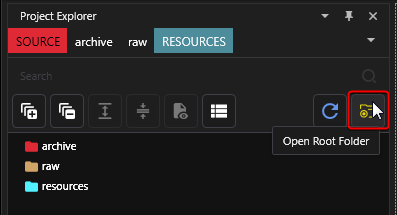
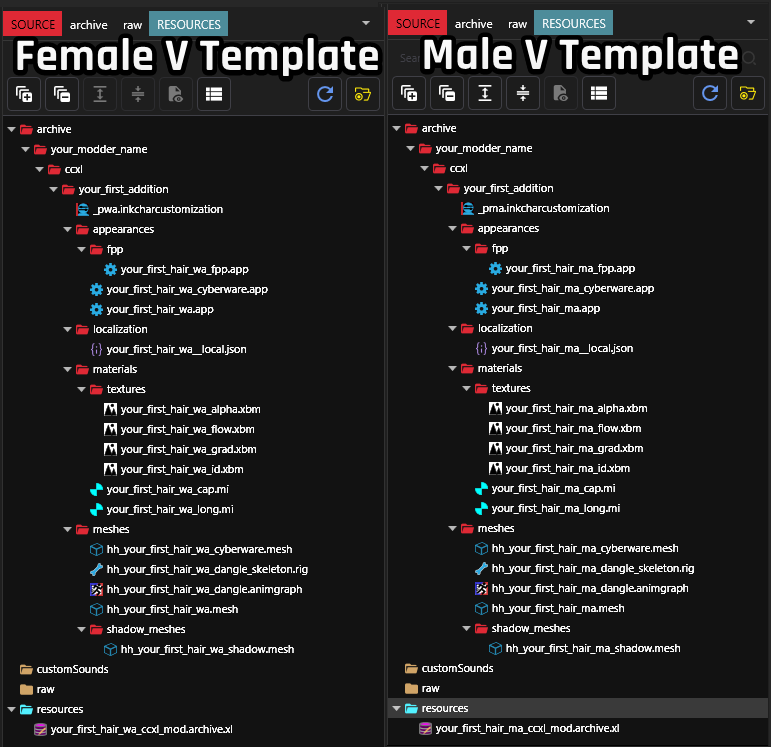
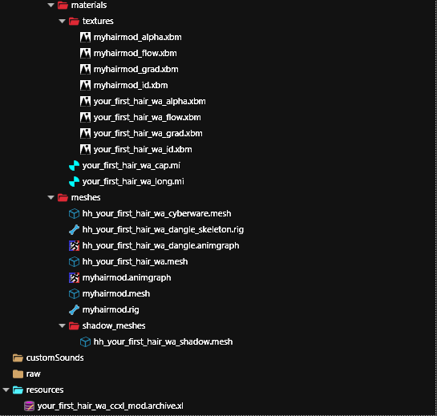

# Convert a hair mod to hair CCXL mod

## Summary 

Published: Jan 29 2025 by [Silverlags](https://app.gitbook.com/u/3GmqMieZ5BZ87uRqI3Y1Uj7tEHy1 "mention")

Updated: April 6 2025 by [Silverlags](https://app.gitbook.com/u/3GmqMieZ5BZ87uRqI3Y1Uj7tEHy1 "mention")

CCXL is a way of adding new slots into character customization menus. the benefit is that you won't have to change or replace the vanilla game files to do add your own! this guide is related to adding new hair slots from an already-done mod.


This guide is a simplification of the [CCXL: Hairs](../../../for-mod-creators-theory/core-mods-explained/archivexl/archivexl-character-creator-additions/ccxl-hairs.md) page. Some parts of that page might be omitted from this guide to make the process simple, otherwise you can check the page for more detailed information.



This guide is for a normal hair replacer (direct mesh replace) mod and single-mesh UUH4V hair mods.


## Requirements

* You have downloaded the hair CCXL modders' resource template for the V that you want from [Nexus](https://www.nexusmods.com/cyberpunk2077/mods/19228)
* You have the mod that you want to convert the hair from.
* [Wolvenkit](https://github.com/WolvenKit/WolvenKit/releases) to analyze mod, work on your mod, and pack mod.


ArchiveXL 1.20 or later is required for hair CCXL mods to work.



A [Wolvenkit project](https://wiki.redmodding.org/wolvenkit/wolvenkit-app/usage/wolvenkit-projects) will be **required** for this guide. if you don't know how to make one check out [R\&R: Your own WolvenKit project](https://wiki.redmodding.org/cyberpunk-2077-modding/modding-guides/items-equipment/recolours-and-refits/r-and-r-your-own-wolvenkit-project#creating-your-wolvenkit-project).


Steps will be demonstrated using the Female V template, but the process is exactly the same with the Male V template so you can follow along just fine!

## Step 1: Adding the template

### 1.1: Adding to WolvenKit

1\. Open the root folder of your WolvenKit project, this can be done by clicking on the yellow folder icon called "Open Root Folder" to open the project's folder in Explorer.

<figure><figcaption>
Open Root Folder button
</figcaption></figure>

2. Now open the template that you've downloaded from Nexus. Click on "source" and drag the contents inside the zipped file into your WolvenKit project folder.

<figure><figcaption>
Drag and drop the files in the zipped template into the project folder
</figcaption></figure>

Your project should look like this, depending on what V hair CCXL template you've chosen.

<figure><figcaption>
Hair CCXL Template Structure
</figcaption></figure>

Once you've verified the file structures, confirm that the template initially works by clicking on install and launch.

### 1.2: Verify that the mod works

To make sure that the initial template mod works we'll need to install and see it in game:

1. In WolvenKit, click on the arrow next to "Install" and select "Install and Launch". click on "Install and Launch" to install and run the game
2. Go to "New Game" and reach the character customization screen, click back(A on keyboard or the Right button on the D-pad) on "Hair Styles". The hair style name should be **your\_first\_hair\_wa** with Songbird's hair or **your\_first\_hair\_ma** with Saul's hair, depending on the template you chose.

Now that's done you can exit the game and continue, otherwise update ArchiveXL.

## Step 2: add your already-done hair mod files

To convert a hair mod we'll need the main hair `.mesh` file. This is the most important file as this whole mod [revolves around ](#user-content-fn-1)[^1]. There are other files that we'll need, but if your mod doesn't have you can continue with the guide without any issues as the template has placeholders that you can use.

The files are:

* Hair physics files (`.rig` and `.animgraph`)
* Shadow hair mesh file (`_shadow.mesh`)
* Custom hair texture files (`.xbm`)

Wait! I don't use a custom hair texture

Some mods utilize the material instance files that's in the game itself to make their own hairs.

No worries, this will be thoroughly detailed later.


Use **unique names** for your mod files before starting on the project, this prevent conflicts with any other mod out there.

For the sake of simplicity, the files in this guide will use the name `myhair` and will make appended variations of it, Do **not** use it in your project.


Start with putting the files in your project by:

1. Add the files aforementioned from your own hair mod archive to the project.


A detailed process of this step can be found in [here](https://wiki.redmodding.org/cyberpunk-2077-modding/modding-guides/npcs/guides-all-about-hair/replace-a-hair-mods-slot#step-0-get-the-modded-files). but the TL;DR is to flip the switch to asset browser to mod browser and add the files that is in there.


2. Move the files into their own appropriate locations. The table below will help

<table data-full-width="false"><thead><tr><th width="296">File</th><th>Move to folder named:</th></tr></thead><tbody><tr><td><code>.mesh</code>, <code>.rig</code> and <code>.animgraph</code></td><td><code>your_modder_name\ccxl\your_first_addition\meshes</code></td></tr><tr><td><code>_shadow.mesh</code></td><td><code>your_modder_name\ccxl\your_first_addition\meshes\shadow_meshes</code></td></tr><tr><td><code>.xbm</code></td><td><code>your_modder_name\ccxl\your_first_addition\materials\textures</code></td></tr></tbody></table>

3. [Rename the mesh and physics files ](#user-content-fn-2)[^2]to something that you would follow with for the whole project.

At the end of this step you should have a file structure that looks like this.

<figure><figcaption></figcaption></figure>

We've successfully done our file structures. Now we'll do the Hair CCXL part of this guide.

## Step 3: Edit the .mi file

This step will diverge into two paths, depending on if you have a custom hair mesh texture or not.

### I use custom hair textures

Your hair mod was done with a custom texture that you've brought along for the ride. If this applies the steps below are for you!

1. Open the `your_first_hair_wa_long.mi` file.
2. Edit the `CKeyValuePair` values of Flow, Strand\_Alpha, Strand\_Graident, and Strand\_ID. This can be done by first right clicking on the fitting name (for flow you would select the file that ends with \_flow), click copy relative path to game file (**1**), then click on the fitting `CKeyValuePair` value name then paste the path to the DepotPath of the `CKeyValuePair`.

<figure><figcaption></figcaption></figure>

(If you have Nightly version of WolvenKit you can skip right clicking by clicking on the orange button next to the files themselves)

<figure><figcaption></figcaption></figure>

At the end of this step your textures have been successfully pathed to the .mi that's in the template, the `your_first_hair_wa_long.mi` file should look like this. If so save, delete the template hair texture files, and move on ahead with the next step.

<figure><figcaption></figcaption></figure>

### I use base game ("vanilla") textures

You've used the game's default hair textures to make your hair mod.

if you happen to use the `_long` .mi for your mod then good news!, you've used the textures that's in the template, so you don't have to do anything about the \_long.mi file, [you can keep it as it is!](#user-content-fn-3)[^3]

If you've used something else, [no worries](#user-content-fn-4)[^4]. follow along this part:

1. Open your mesh and expand the `externalMaterials` item(1), then open one of the mi files that are not cap (2).

<figure><figcaption></figcaption></figure>

2. Add the mi's`baseMaterial` master .mi file to the project and move it to the materials folder:

<figure><figcaption></figcaption></figure>

Keep an eye on what the appended name of the material instance, you will use it in the next step. I suggest that you keep the appended name in the mi file, So if the material instance name ends with `__short` then keep that name around, you will use it in the next step.

### I use custom caps, what about me??

Don't worry we got you :)[^5]

You'll be doing a combination of both steps in that you'll add your cap's `.xbm` textures into the project then edit the cap mi file which is `your_first_hair_wa_cap.mi` to include your cap textures inside them.

When you're finished from this step completely, rename your material instance file names to the one you chose before.


I recommend you to click on "Update in Project Files" as shown below, this helps with renaming paths in this whole guide and especially with the file that's in resources.


<figure><figcaption></figcaption></figure>

## Step 4: Edit the .mesh file

Here comes the interesting part of this guide as its the cornerstone of the hair mod itself.

This process can be done either by WolvenKit's Convert hair to CCXL Material button or manually by deleting and editing sections of the mesh itself

### Edit automatically with WolvenKit

if you happen to have the WolvenKit with the version 8.16.1-nightly.2025-02-11 or later you can do this step entirely automatically by clicking on the Materials button, click on Convert hair to CCXL materials button, then select the .mi files that you want with their style material from the dropdown menus then click Finish. You can also choose if you want to include a cap or not. Once you're done just rename the files and go to the Rename section of this step.

<figure><figcaption></figcaption></figure>

### Edit manually

I want you to follow with me **step by step** as you might encounter some problems with how the hair is shown if you skip a step.

In this step we'll remove all references of the old materials and their appearances before letting way of the new order of materials, much simplified way of having one appearance and letting ArchiveXL do the rest of them.

1. Open your mesh and the template mesh (which is `hh_your_first_hair_wa.mesh)`, collapse all items open in your file, and put them side by side by dragging one of the tabs to the right. This helps to see the whole process for what we'll do.

<figure><figcaption></figcaption></figure>

It should look like this:

<figure><figcaption></figcaption></figure>

2. In your mesh, right click on `appearances` and click on "Reset Object", do the same step for `externalMaterials`, `localMaterialBuffer`, and `materialEntries`. After doing this you should see a number zero or a "\[0]" next to the aforementioned items. This step removes all reference of materials that the mesh used before.

Now your mesh will be devoid of any reference of materials (for now..)

<figure><figcaption></figcaption></figure>

3. Select `materialEntries` in the template mesh file and right click on "Copy Array Contents", then right click on your mesh's `materialEntries` and click "Paste Selection into Arrary/Buffer". This makes it so that it copies over the needed entries of materials from the template mesh.

Note for non <code>_long</code> material instance files.

You will have to change the `@long` name and replace it with the name of your own appended base game material instance, for example if your material instance's name ends with `_short` you'll have to rename the material entry to `@short` .

4. Expand the template mesh file's `localMaterialBuffer` and right click on `materials`, then click on "Copy Array Contents", go to your mesh, expand its localMaterialBuffer, and right click on materials and click on "Paste Selection into Arrary/Buffer". You should see `@context`, `@long` (or the name you've put), and `@cap` .
5. Expand `@context` then its `values` propety, click on `LongBaseMaterial`and paste the relative path of your main mesh material instance. Do the same process for the `CapBaseMaterial`.


If you've changed the materialEntries' name of `@long` you'll have to rename the `LongBaseMaterial`'s key to the name that fits your renamed material entry, this can be found in [ArchiveXL: Character Creator additions](../../../for-mod-creators-theory/core-mods-explained/archivexl/archivexl-character-creator-additions/) . So for example if you've had `@short` material entry you'll rename the key to `ShortBaseMaterial` .


6. Click on the second item named @long (or the name you've changed), in baseMaterial's DepotPath paste the relative path of the material instance that has the same name (so `myhair_long.mi` to the `@long`'s `DepotPath)` and make sure that the Flags are set to soft, do the same process for the `@cap` item.
7. In the template mesh's `appearances`item,, right click on black\_carbon and click on "Copy Array Content". RIght click on your `appearances` item and click "Paste into Array/Buffer". If you've changed the material entry name of @long then reflect that in the appeareance by expanding `chunkMaterials` and replace the `long` text to the material entry you've had. (So it becomes `black_carbon@short` ).

### Rename

Now save your mesh file, rename it to the name that you want. Duplicate the mesh and add the `_cyberware` at the end of the name of the duplicated mesh.

While you're at it, rename the `animgraph`, `rig`, and the mesh in the shadow\_meshes folder to the name you wanted. At the end of this step, your mesh folder structure should look something like this:

<figure><figcaption>
that was *quite* the step, no? (don't worry the next ones are much simpler)
</figcaption></figure>

## Step 5: Edit the .json file

This step is about the name of your hair slot in the character menu, so make sure you pick a nice name for it :)

1. Rename the`your_first_hair_wa__local.json` to your mod's name (preferably to something like `myhair__local.json`) and open it, click on the item that has the text `UI-Customization-your_first_hair_wa` .
2. In `femaleVariant` property, type the name that you want to be shown in the character creation menu (for example: `my hair`) then replace the `your_first_hair_wa` part of the key with your unique mod name (`myhair`), do the same process for the `_cyberware` item below it, then rename the file.


For Male V you don't need to fill the maleVariant key, as the game defaults to using whatever value in femaleVariant if a male one doesn't exist.


In the end the items should be named `UI-Customization-myhair` and `UI-Customization-myhair_cyberware`,and your json file will look like this. Save the file but don't close it yet.

<figure><figcaption>
As easy as it gets :D
</figcaption></figure>

## Step 6: Edit the .app files

This step is about editing the .app file which is responsible for which mesh and physics file appear.

1.  Open `your_first_hair_wa.app` file, and:

    1. Expand components then click on `hair_dangle` , copy relative path of your `.animgraph` file and paste it into the `graph` 's `DepotPath` field on the right of the window, do the same step for `rig` 's `DepotPath`field by copying relative path of `.rig` file.
    2. Click on the `hh_your_first_hair_wa` item n and copy the relative path of your `.mesh` file and paste it in the `mesh` 's `DepotPath` field. Rename the `name` field to your mod's name.
    3. Click on hh\_your\_first\_hair\_wa\_shadow item, and copy ther relative path of the `.mesh` file in shadow\_meshes folder and paste it in `mesh` 's `DepotPath` field.
    4. Click on the `resolvedDependencies` property of the .app file and replace the index number 3's DepotPath field with the relative path of your `.mesh` file and index number 4's `DepotPath`'s `field` with the relative path of your \_`shadow.mesh` file

    Once that's done you can save and close the file.
2. Open `your_first_hair_wa_cyberware.app` and replicate the same steps above with the only difference is to copy relative path of the your `.mesh` file that ends with `_cyberware` instead of the normal .mesh file in both `hh_your_first_hair_wa_cyberware` item and the `resolvedDependencies`property. Save and close the file.
3. Open `your_first_hair_wa_fpp.app` and expand components to select the only item in there which is called `hh_your_first_hair_wa_shadow` , copy the `_shadow.mesh` file's relative path to the `mesh`'s `DepotPath`'s field, then in resolvedDependencies property , paste the same path in its `DepotPath`'s field. Save and close the file.

Once you're done from all the steps above rename the files and keep their appended name `(_fpp` and `_cyberware`) intact.

You've almost reached the finish line! next step is the last file that you'll have to (somewhat) meticulously edit and put paths in, pay attention as it has bit more than the last step.

## Step 7: Edit the inkcc file

### What am I going to do here?


TL;DR: Keep the names consistent across the .inkcc file.


The `.inkcc`, short for `.inkcharcustomization` file is the link between what we've done so far and the character customization menu. In this file we'll link our .app file and put the name of the .json file we've had opened two steps ago.

This file has two main items: `headCustomizationGroups` and `headGroups`.`headCustomizationGroups` is mainly split into two parts:

1. The empty item and the `hairstyle_cyberware` item at items numbered 0 and 1.

These two files are responsible for getting the name that will be displayed in the in-game slot, and to get the item names below it. Below is a visual demonstration of what needs to be done in this section.

<figure><figcaption></figcaption></figure>

2. The `your_first_hair_wa`, `your_first_hair_wa_cyberware`, and `your_first_hair_wa_fpp`items numbered 2, 3, and 4.

These three items takes the relative paths of their respective .app files names.

Finally, the `headGroups` main items will have the names that we'll assign for the items numbered 2,3, and 4.

### Alright, show me the steps.

Open `_pwa.inkcharcustomization` (or `_pma`) and do the following:

Expand `headCustomizationOptions` , in there you will see five items . Now:

1. Expand the no-name item that has number 0 to the left of it, expand its `options` property and expand its item as well.
   1. Go to the `.json` file and copy the first item's`secondaryKey` property value and paste it in the `localizedName` field. So the localizedName field now has the value`UI-Customization-myhair` This tells the hair slot file that we'll use the name set in the .json file as its display name in-game.
   2. Now expand the `names` property and rename both `your_first_hair_wa` and `your_first_hair_wa_fpp` to a name that you would use, like `myhair` and `myhair_fpp`.
   3. Do the same steps for the second item which is named `hairstyle_cyberware`, with the only difference being to rename `your_first_hair_wa_cyberware` to `myhair_cyberware` and the `names` values to `myhair_cyberware` and `myhair_fpp`.
2. Click on the third item named `your_first_hair_wa`, `and:`
   1. On the right of the view's guide , rename the `name` field to the name you've put in the `names` fields of the previous items , then copy the appropriate `.app` file's relative path into `resource`'s `DepotPath`'s field.
   2. Do the same steps but for `your_first_hair_wa_cyberware` , and `your_first_hair_wa_fpp`.

Now expand headGroups, and expand each item in there, then replace the names in there with the names of `headCustomizationOptions`'s items.

In the end, the name consistency should look like this (hairstyle\_cyberware handle collapsed for view)

<figure><figcaption>
<em>pheew</em> that was something, yeah?
</figcaption></figure>

Now that's done, save the file and close it.

## Step 8: Custompath, .archive.xl editing

We've reached at the custom pathing and .archive.xl file editing part. This step doesn't have anything complex in it, just simple path rename here and there, and aligning the .archive.xl file to complete this whole setup together neatly.

Since we've been renaming the files since the start of step 3, that means we won't get deeper into all files and do renaming and pathing for every file.

Right click on the folder named `your_first_addition` and click rename, then replace `your_modder_name`and `your_first_addition` with a name unique to you and to your files.

When you're finished check the "Update in project files?" box then click Finish.

<figure><figcaption>
John WolvenKit, in the flesh 🗣️🗣️
</figcaption></figure>


As a good measure, check WolvenKit's Log for any issues regarding project file rename update.

Sometimes you might face an issue auto-updating with a file or two. If that happens go back to the problematic file and fix the paths within it.


Now open the `your_first_hair_wa_ccxl_mod.archive.xl` file in any edtior program like Notepad++ or Visual Studio Code,

This is the file that will tell ArchiveXL on what to do for the hair mod as a whole.

Now we'll need to copy relative paths of files to the needed locations in the `.xl` file. The visual guide below can help you in knowing which file relative path goes to where.

<figure><figcaption></figcaption></figure>


Make sure there's a leading space when putting the paths in the .archive.xl file.


When you're done save the .archive.xl file and rename it according to your project mod name, which can be found in the "Project" button in the toolbar, then "Project Configuration" , then check Mod Name's field.

Make sure that everything is connected correctly click on "Project" on WolvenKit's toolbar and click "Scan project for broken file references" to check if there are incorrect paths in files. If there's only the .mi file and has a file path that starts with `archivexl\` that means you're good to go.

Finally, delete the temporary files by going to "Project" then click on "Delete empty files".

## Step 9: Pack 'n' Go

Confirm that work and mod works by clicking on the down arrow next to the "Launch" button and select "Install and launch", then click "Install and launch".

<figure><figcaption></figcaption></figure>

If the mod works you should see it in the character creation screen by going a step back on the hair style slots in the game.

## Troubleshooting

### Hair Profile color CCXL mod's hair colors hides my mesh away

This is due to improper pathing in the `localMaterialBuffer` item in your .mesh file, go back to step 4 and check in the `localMaterialBuffer` part of the guide.

[^1]: (and come on, its a hair mod of course we'll need the hair)

[^2]: I recommend that you rename your texture files, but pay attention to their appended type (like alpha, id.. etc)

[^3]: plus a cookie from me :cookie:

[^4]: two cookies just to this step easier :) :cookie::cookie:

[^5]: you're getting three cookies :cookie::cookie::cookie:
