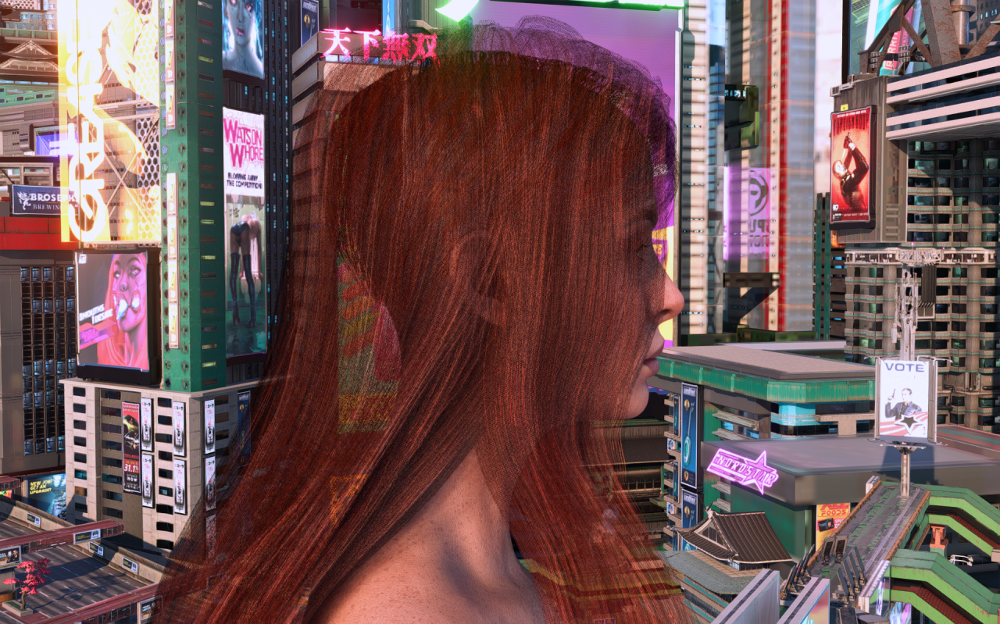
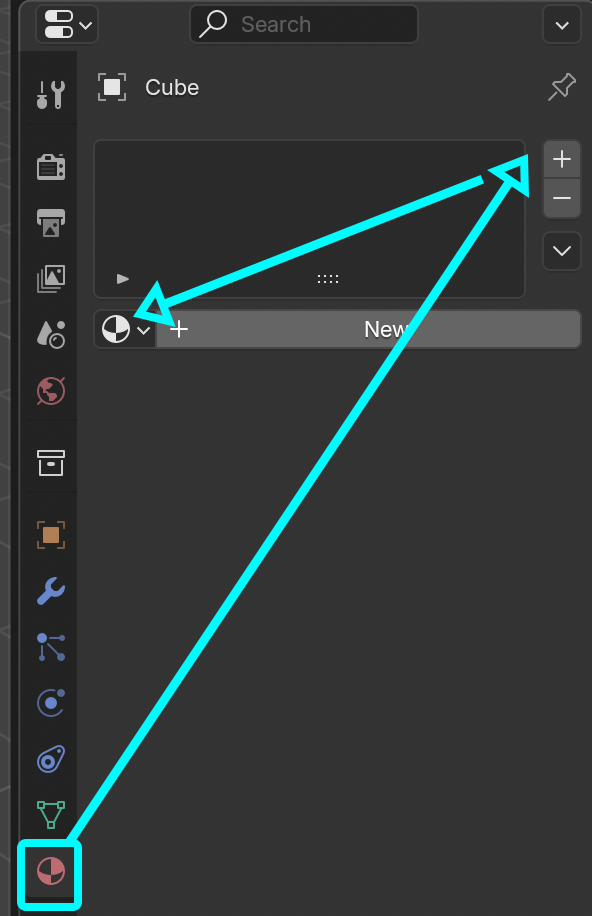
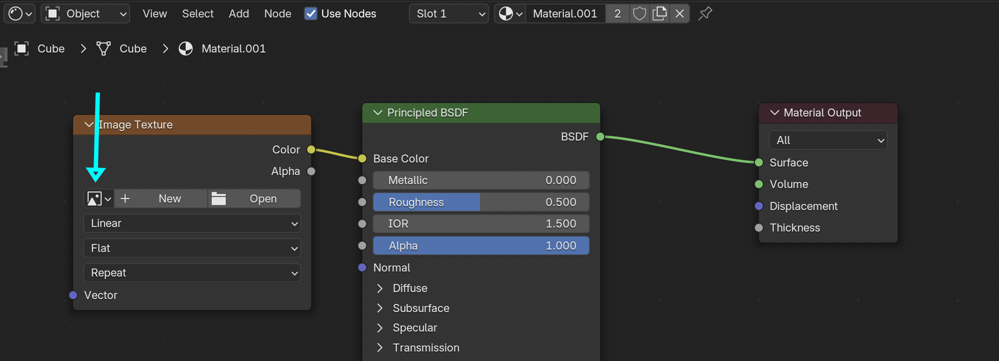
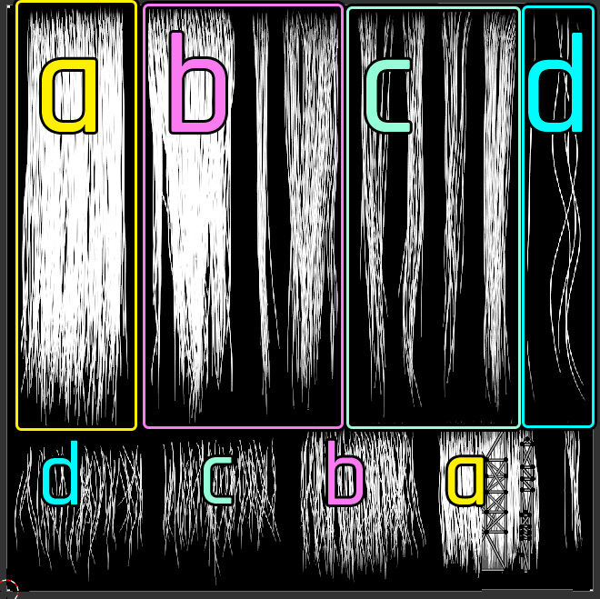
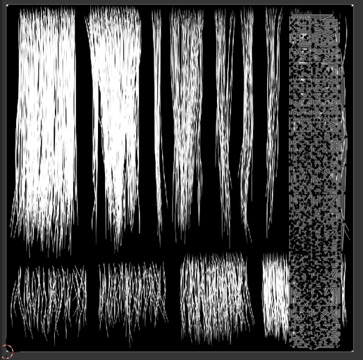
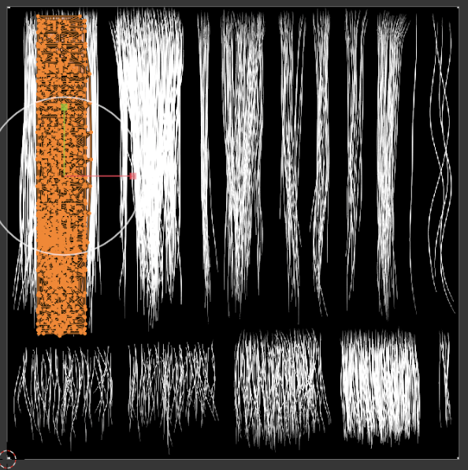

# Hair: Use Cyberpunk's materials

## Summary

**Created:** Jul 31 2026 by [mana vortex](https://app.gitbook.com/u/NfZBoxGegfUqB33J9HXuCs6PVaC3 "mention") (split out from original page created by Eagul – research mostly done by IslandDancer)\
**Last documented edit:** Jul 31 2027 by [mana vortex](https://app.gitbook.com/u/NfZBoxGegfUqB33J9HXuCs6PVaC3 "mention")

This page will show you how to make ported hair compatible with Cyberpunk's texture layout.&#x20;


You can find a video in the expendable box below (thanks to IslandDancer for making it)!


Video by IslandDancer

{% embed url="https://files.gitbook.com/v0/b/gitbook-x-prod.appspot.com/o/spaces%2F4gzcGtLrr90pVjAWVdTc%2Fuploads%2F5yS4EYZF3CcJ4Bu0xmE0%2Fhair_card_uvs_islanddancer.mp4?alt=media&token=cb95ab20-744b-4bec-ac5c-5a9624889fe3" %}

#### Assumed skill level

You should be able to select and move things in Blender without panicking. If you aren't, head to [blender-getting-started](../../../for-mod-creators-theory/3d-modelling/blender-getting-started/ "mention") and play around until you are.

#### Estimated time

Someone who knows what they're doing can usually do this in <30minutes. If it's your first time, you'll need an hour or to (more if you have to start over).&#x20;

## Why do I need this?

If you're already committed, you can skip this section and read on at [#how-do-i-do-this](hair-use-cyberpunks-materials.md#how-do-i-do-this "mention").

### Quality

Cyberpunk's hair material is extremely high-quality. However, it is using a set of four textures, some of which we don't have the tooling to generate yet (`strand` and `id`, which control how the light is reflected from individual hairs).

By using Cyberpunk's original materials, you can get the maximum quality for the minimum effort!

### Mod file size

Packing additional textures will increase the file size of your mod – unnecessarily so, if you complete this guide. Depending on [your resolution](../../../for-mod-creators-theory/3d-modelling/on-4k-textures-and-high-poly-meshes.md), you can save dozens of megabytes.&#x20;

### Compatibility

If your hair texture is too high-resolution or if the strands are too fine, the hair will appear transparent. Even if yours doesn't, there is an edge case with AMD graphics cards, which might be affected anyway.

<figure><figcaption>
Image credit: ladylea
</figcaption></figure>

## How do I do this?

### Step 0: picking a hair texture

Excluding beards, caps and private hairs, CP2077 has 5 types of hair textures.&#x20;

Pick one of them, then add it to your Wolvenkit project and export it as png. You can then import this into Blender as a reference for UV editing.

<table><thead><tr><th width="129.55305371343275">Hairstyle</th><th>Alpha texture</th></tr></thead><tbody><tr><td>Curly</td><td><code>base\characters\common\hair\textures\hh_curly01_alpha01_r.xbm</code></td></tr><tr><td>Dreads</td><td><code>base\characters\common\hair\textures\hh_dread01_alpha01_r.xbm</code></td></tr><tr><td>Kinky</td><td><code>base\characters\common\hair\textures\hh_kinky01_alpha01_r.xbm</code></td></tr><tr><td>Straight long</td><td><code>base\characters\common\hair\textures\hh_long01_alpha01_r.xbm</code></td></tr><tr><td>Straight short</td><td><code>base\characters\common\hair\textures\hh_short01_alpha01_r.xbm</code></td></tr></tbody></table>

Most hairstyles I see use long straight strands, but don’t be afraid to use other types of hair and experiment with them.

1. Right-click on the texture in the asset browser, and select "find files using this"
2. If you don't have .mesh files in the list, right-click on a .mi file and search again until you have one
3. Add the .mesh file to your project and import it (you need it for the next step)

### Step 1: Blender Setup

#### 1.1: reference screenshots

First, let's grab reference screenshots so you have an easier time remapping.

1. Select your hair mesh
2. Switch to edit mode (hotkey: tab), then select all vertices (hotkey: a)
3. Switch to the "UV Editing" perspective and take a screenshot of the texture on the left
4. Deselect all vertices again and take another screenshot. You will use these as reference.

#### 1.2: Changing the material

Now, we change the hair in Blender to use Cyberpunk's material.

1. [Import](../../../for-mod-creators-theory/modding-tools/wolvenkit-blender-io-suite/wkit-blender-plugin-import-export.md#meshes) the mesh file from step 0.3 with the [Wolvenkit Blender Addon](../../../for-mod-creators-theory/modding-tools/wolvenkit-blender-io-suite/)
2. Delete it again (hotkey:x - we only wanted the material)
3. Click on your hair mesh again to select it
4. Find the "Material" tab in the right-hand sidebar

<figure><figcaption></figcaption></figure>

5. Find the list near the top. You should have a material there; if not, click the + button
6. From the dropdown on the bottom left of the list, select the hair material that came with the import of the hair mesh

Your hair should now show Cyberpunk's hair material (and probably looks terrible).

#### 1.3 (optional): use the alpha texture as base texture

It will be easier to see your hair if you assign the alpha texture instead of the base hair colour.&#x20;

The fastest way to do that:

1. Create a new material by clicking the "New" button below the list
2. Switch to the Shading perspective (top of the viewport)
3. Optional: look at the node editor and panic
4. Add a new "Image texture" node (Hotkey: shift+a, texture, image texture)
5. connect it to the Principled BSDF's "Base Color"

<figure><figcaption></figcaption></figure>

6. From the dropdown menu, select either `_alpha` or `_grad` .

You should now see something like this:

 

In the next step, we'll re-map the UV clusters to Cyberpunk's hair layout (basically, we're pushing a bunch of squares across the texture). But for that, let's understand it first.

### Step 2: Theory

If you don't care about this, you can skip ahead to [#step-3-changing-the-layout](hair-use-cyberpunks-materials.md#step-3-changing-the-layout "mention"). You'll have an easier time if you don't, though!

This is cyberpunk's alpha texture for long straight hair: the black parts are transparent, the white ones are visible. There are different kinds of hair strand mapped out, which I'll explain below the screenshot.

<figure><figcaption></figcaption></figure>

<table><thead><tr><th width="60.679072281094705">.</th><th width="195.17463862423028">What is it</th><th>Explanation</th></tr></thead><tbody><tr><td>a</td><td>cover strand</td><td>The yellow chunk has next to no transparency and will look kind of flat. Its intended purpose is to cover up visible bits of the scalp via hair cap - if you use this on hair strands, the result might look ass.</td></tr><tr><td>b</td><td>load-bearing strand (3 options)</td><td>This kind of strand should make up most of the lower levels of your hair. It's dense and has little transparency.  I usually try to avoid gaps in this layer, as they lead to poor coverage.</td></tr><tr><td>c</td><td>thinner strand (4 options)</td><td>We're getting to the upper layers of the hair. Unless V just left the hair stylist, the topmost hair strands will be lighter and less dense - so they will also be more reflective. You can use two strands on one card if you're okay with the gap - this can add variety.</td></tr><tr><td>d</td><td>flyhair</td><td>Frizz: what fashion magazines pretend you shouldn't have. This adds the final touch of realism to any hair.</td></tr></tbody></table>

### Step 3: Changing the layout


Before you start moving anything, read [#additional-tips](hair-use-cyberpunks-materials.md#additional-tips "mention")  to do future you a favour!


Now that we've understood how this works, we can actually change our mapping. Here are some essential keyboard shortcuts that you'll need (courtesy of  [IslandDancer](https://www.nexusmods.com/profile/IslandDancer/mods)):

**Blender Shortcuts:**

**H** = hide\
**Alt + H** = unhide\
**S** = scale\
**S X** = scale (constrain to x-axis)\
**S Y** = scale (constraint to y-axis)\
**L** = select all contiguous geometry (select an entire single hair card)\
**A** = select all

Now, let's get started.

1. Switch to the UV editing perspective (above the viewport)
2. If you don't see Cyberpunk's alpha texture in the texture editor on the left, make sure to load it (select it from the dropdown).
3. If it's not turned on yet, enable viewport shading (at the top right of the viewport, click the third orb in the list - you might have to scroll).

What we need to do now is to **scale** and **rotate** the hair cards so that they fit Cyberpunk's texture. Make sure that the roots are at the top and the tips are at the bottom, or the hair colours will look weird.

We'll select the whole cluster, then move it across the map to the densest hair strand (you might get better results if you use **b**, but this is an example):

| Before                                                                                          |                                                                                                |
| ----------------------------------------------------------------------------------------------- | ---------------------------------------------------------------------------------------------- |
|  |  |

Now there will no longer be gaps across the hair. However, you're not making the most out of the texture. Scale the hair cards so that they cover the entire strand, with a tiny bit of transparency at the edges:

## Additional tips


This is fully optional, you can not do this and make more work for future you :)


### Preserve hair stacks

Your original hair will have **stacks of hair cards** assigned to the **same part of the texture**. Once you've moved your hair strands around, these stacks will be **irretrievably merged**, and if you want to come back later to tweak your hair mesh (because some parts of it look bad in the Afterlife or whatever), you will have a hard time teasing them apart.&#x20;

Fortunately, the UV layout **tiles** (imagine an infinitiely big repeated image) - which means that you can put a stack into place and then move it to a different UV tile (hotkey: g -> x -> 1, or g -> y -> 1, can be >1 or negative as well).&#x20;

This lets you preserve your hair card stacks for future edits.
