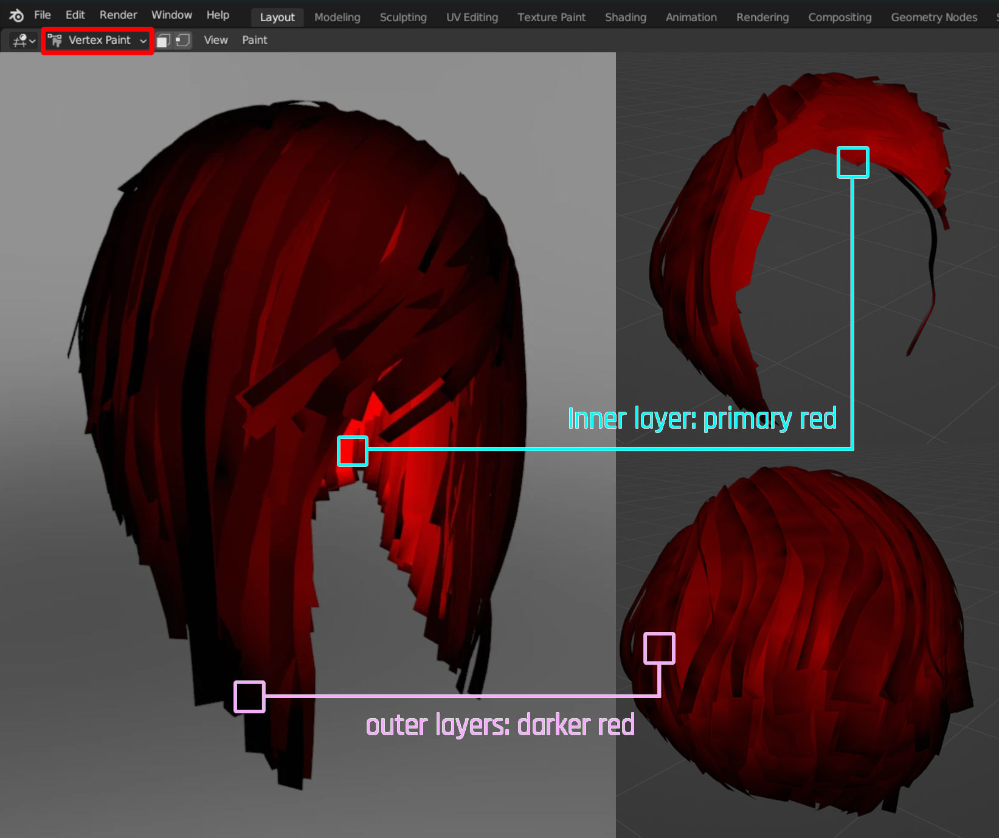

# Hair: Vertex paint for transparency

## Summary

**Published:** Jan 18 2025 by [mana vortex](https://app.gitbook.com/u/NfZBoxGegfUqB33J9HXuCs6PVaC3 "mention") based on research by [IslandDancer](https://app.gitbook.com/u/s8gktWvqEZWGRxQIsePwOnEI2Mo2 "mention")\
**Last documented edit:** Jan 18 2025 by [mana vortex](https://app.gitbook.com/u/NfZBoxGegfUqB33J9HXuCs6PVaC3 "mention")&#x20;

This page explains how to use Blender's **Vertex Paint** mode to make better and more natural-looking hair.

### Wait, this is not what I want!

* Check out [hair-modeling-beginner-tutorial](../../../for-mod-creators-theory/3d-modelling/hair-modeling-beginner-tutorial/ "mention") for how to create hair from scratch in Blender
* Browse [.](./ "mention") in the left submenu to find all of our hair guides

## Do I want this?

The difference between hair with and without vertex paint is **notable**. The quality of vertex painted hair will be significantly higher.

However, not going to lie to you — it's a lot of work. Whether or not it's worth it is your decision.

## What does it do?

In Cyberpunk, vertex paint colour is used to **fake ambient occlusion** (as in, the closer to the scalp you get, the darker and less reflective hair strands are).

The two ends of the spectrum are:

* Red: Dark, not shiny (for base hair clumps)
* Black: Bright, shiny (for flyhairs)

Theory

As of January 2025, we haven't decompiled or fully reversed Cyberpunk shaders, so we don't know what exactly these colours control.

However, it's likely that vertex paint color gets mapped onto shader attributes like anisotropyStrength.

## How should it look?

* The inner layers close to the scalp should be painted in bright **primary red** (255, 0, 0)
* Strands get darker as they are further away from the scalp
* Individual strands get darker towards the tip

<figure><figcaption>
Exhibit A: <a href="https://www.nexusmods.com/cyberpunk2077/mods/19096">Faith's Hair</a> by Island Dancer
</figcaption></figure>

## Video

