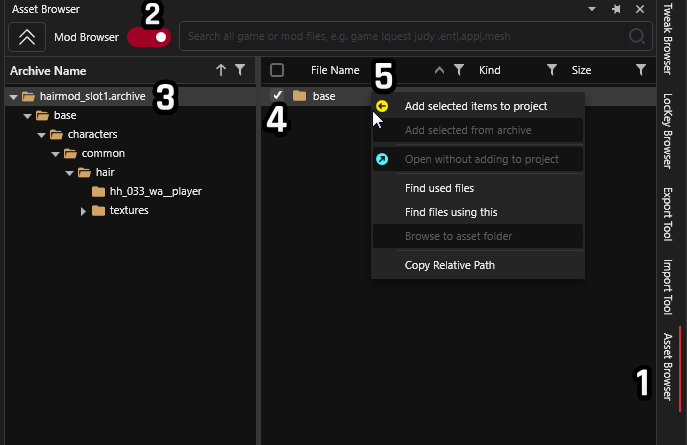

# Replace a hair mod's slot

## Summary 

**Created:** Sep 22 2024 by **Silverlags**\
**Last documented update:**&#x20;

This guide will walk through the basic steps of how to change a hair mod to correspond to a different slot.

## Requirements:

* [ ] Hair mod to replace
* [ ] [Wolvenkit](https://github.com/WolvenKit/WolvenKit/releases) to analyze mods, replace names, and pack mod


Replacing hair slot for mods will require you to analyze them. As such, getting a proper understanding of how to analyze mods is highly recommended.



[analysing-other-mods](../../analysing-other-mods/)



You will need a [Wolvenkit Project](https://wiki.redmodding.org/wolvenkit/wolvenkit-app/usage/wolvenkit-projects) to search and edit files. If you don't know how to make one check out [R\&R: Your own Wolvenkit project](https://wiki.redmodding.org/cyberpunk-2077-modding/modding-guides/items-equipment/recolours-and-refits/r-and-r-your-own-wolvenkit-project)


[For the sake of simplicity, we'll simulate changing the slot of a hair mod that is in slot number 01 for female V body type to slot number 04 for female V body type.](#user-content-fn-1)[^1]

### Step 0: Figuring out the slot to replace to

Start by getting the name of the hair slot, this can be easily found by going to [Cheat Sheet: Hair](../../../for-mod-creators/references-lists-and-overviews/cheat-sheet-head/hair.md) page and cross-reference the slot number and V build type with the mesh name to go on with the process.

In this case, slot number 01 is called `hh_033_wa__player` while slot number 04 is `hh_089_wa__thompson_common`.

### Step 1: Get the files out using Wolvenkit

Locate your hair mod in the Asset Browser by enabling the Mod Browser toggle and add the "base" folder of the mod to your project.

<figure><figcaption>
Adding files to project
</figcaption></figure>

Your Project Explorer should look something like this.

<figure><figcaption>
<em>My hair mesh brings em all to the yard</em>
</figcaption></figure>


Your mod project could have only one .MESH file instead of two and may be without the text "cyberware\_01" appened to it. **This is normal behavior** as CDPR have changed how certain hair models interact with cyberware since some modders did their hair mods.

Check section "Slots that have alternate cyberware meshes" in the Cheat Sheet: hair guide.

If applicable, you may want to duplicate your file in File Explorer and use the name in there.


### Step 2: Locate your desire slot's mesh path

With Mod Browser disabled search for the wanted slot's mesh name, in this case `hh_089_wa__thompson_common.mesh` and add it to your project.

**(Optional)**  If your slot number is in the cyberware mesh section you'll need to add it. Since slot number 04 the cyberware version (called `hh_089_pwa__thompson_common_cyberware_01)` will be added as well.

Project Explorer should look like this now

<figure><figcaption></figcaption></figure>

### Step 3: Rename your mesh file

To rename your meshes right click on a mesh and click on rename (can be done using shortcut key F2) and type the desired slot's mesh name along with its cyberware version

<figure><figcaption>
Type your desired mesh name in your mesh!
</figcaption></figure>

Your files will look like this!

<figure><figcaption></figcaption></figure>

Now drag **your files** into your new mesh slot's folder, you will get a dialog asking you if you want to confirm overwrite, click on **Yes.** And delete the now empty folder.

<figure><figcaption></figcaption></figure>

### Step 4: Pack 'n' go

Now that you've done replacing the mesh files, confirm that your mod worked by clicking on "Install Mod" (or Install as REDMod) and Launch Game.&#x20;

You can also click on the down arrow next to install and set to "Install and Launch" to do these two steps for you!

<figure><figcaption>
Life is so fun when you have something like WolvenKit!
</figcaption></figure>

The quickest way to check if your hair slot change has worked is by making a new game and see the changes in hair style selection.

Annnnnd that's it!

[^1]: You can do the same steps for Male V body type and also Male V body type to Female V body type and vice versa.
