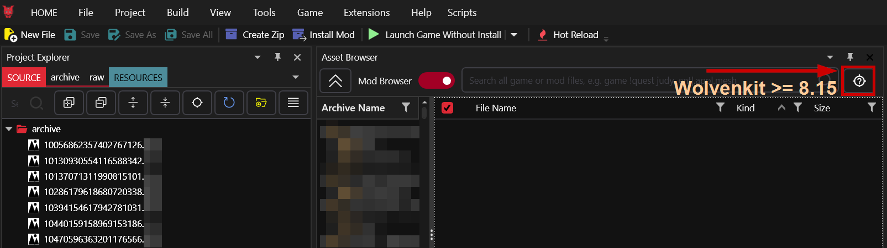
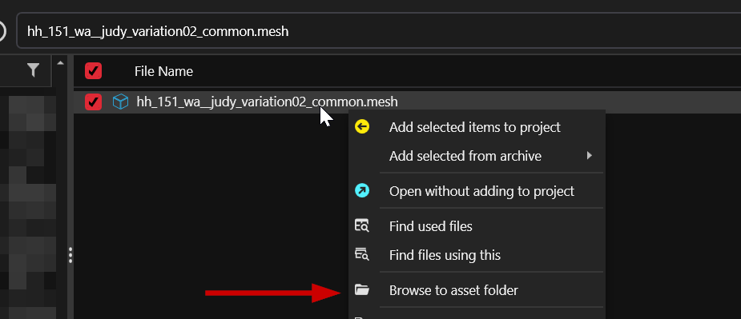
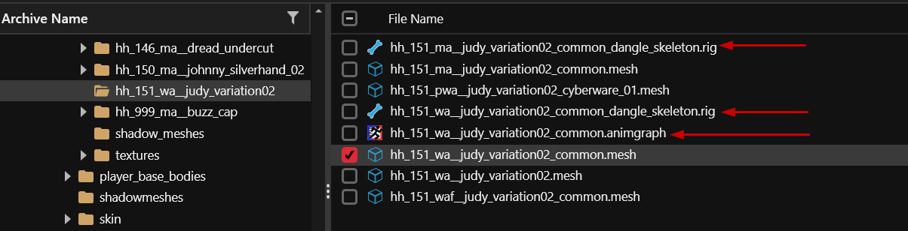

# Replace a hair mod's slot

## Summary <a href="#required-wolvenkit" id="required-wolvenkit"></a>

**Created:** Sep 22 2024 by [Silverlags](https://app.gitbook.com/u/3GmqMieZ5BZ87uRqI3Y1Uj7tEHy1 "mention")\
**Last documented update:** Sep 22 2024 by [Silverlags](https://app.gitbook.com/u/3GmqMieZ5BZ87uRqI3Y1Uj7tEHy1 "mention")

This guide will walk through the basic steps of how to change a hair mod to correspond to a different slot, showing you how to change a hair mod from slot 01 to a different slot for female V.

## Requirements:

* [ ] Hair mod to replace
* [ ] [Wolvenkit](https://github.com/WolvenKit/WolvenKit/releases) to analyze mods, replace names, and pack mod


You will need a [Wolvenkit Project](https://wiki.redmodding.org/wolvenkit/wolvenkit-app/usage/wolvenkit-projects) to search and edit files. If you don't know how to make one check out [R\&R: Your own Wolvenkit project](https://wiki.redmodding.org/cyberpunk-2077-modding/modding-guides/items-equipment/recolours-and-refits/r-and-r-your-own-wolvenkit-project)



## Step 0: Get the modded files


TL;DR: You need to add all files from the hair mod to your project. If you don't know how to do that, check [analysing-other-mods](../../analysing-other-mods/ "mention"), or keep reading.


1. Switch the Asset Browser to the Mod Browser by flipping the switch (2) on the image below
2. Locate your hair mod


You can find files by mod by searching for `archive:hairmod_slot_1`,  or by finding the mod in the mod browser's list.


3. Add all files inside the mod to your project. These files will be called "your hair" in the rest of this guide.

<figure><figcaption><p>Adding files to project</p></figcaption></figure>

## Which files does your hair have?

Does your hair have any files with the extension `.app` under the following path?

```
base\characters\head\player_base_heads\appearances\hairs
```

* Yes (left): Proceed to [#files-with-an-.app-file](replace-a-hair-mods-slot.md#files-with-an-.app-file "mention")
* No (right):  Proceed to [#files-without-an-.app-file](replace-a-hair-mods-slot.md#files-without-an-.app-file "mention")
* Everything is in the root, and you have no idea which is which:[#files-a-bunch-of-borked-files-in-your-projects-root](replace-a-hair-mods-slot.md#files-a-bunch-of-borked-files-in-your-projects-root "mention")

<figure><figcaption></figcaption></figure>

### Files: A bunch of borked files in your project's root

Happens when a mod has been packed with incompatible Wolvenkit versions.&#x20;

1. Delete all files - we'll start over
2. Starting with Wolvenkit 8.15, you can find a scan button in the Asset Browser. If you do not have it, install a [Nightly](https://github.com/WolvenKit/WolvenKit-nightly-releases/releases).
3. Click the scna button and try adding these files again.
4. If the file names do not resolve themselves, you will have to mix and match. Read on with Case 2.

<figure><figcaption></figcaption></figure>

### Files: Without an .app file

The modder has taken and overwritten original game assets, and you'll have to do the same.

<figure><figcaption><p><em>My hair mesh brings em all to the yard</em></p></figcaption></figure>

&#x20;In this section, we'll do the following things:

* Find a compatible hair in the files
* Move your hair to overwrite that one instead

Let's get started:

1. Open [hair.md](../../../for-mod-creators-theory/references-lists-and-overviews/cheat-sheet-head/hair.md "mention") -> [#name-of-meshes-by-index](../../../for-mod-creators-theory/references-lists-and-overviews/cheat-sheet-head/hair.md#name-of-meshes-by-index "mention")
2. Find the mesh file for the slot that you want to replace. We now need to check if it is **compatible**.

#### Can I use this hair?

1. Switch the Mod browser back to the Project Browser
2. Use the Wolvenkit search with its full name, for example, hair mesh 34:\
   `hh_151_wa__judy_variation02_common.mesh`
3. Select `Browse to Asset Folder` from the context menu:

<figure><figcaption></figcaption></figure>

3. You will see the hair meshes from the cheat sheet, among with a bunch of other files:

<figure><figcaption></figcaption></figure>

4. This hair has  `.rig` and `.animgraph` files, which means that it has physics. Does your hair have those files included?
   * **Yes:** You can use this hair. Continue to #5&#x20;
   * **No:** You can't use this hair. Go back to the previous section and pick a different hair slot from the list.


For this guide, we will fall back to 04, `hh_089_wa__thompson_common.mesh`


5. If your hair has **more** submeshes than the hair you are replacing, you can't use it either (not without [#files-with-an-.app-file](replace-a-hair-mods-slot.md#files-with-an-.app-file "mention")). Go back to 1 and pick a hair with more submeshes, such as one of the braids or the sumo hair.
6. OK, so you can use the hair. Add it to your project.
   * If it has a `_cyberware_01.mesh` and your mesh does not, you can simply create a copy (hold ctrl while dragging)

#### Re-slotting the hair

You will reassign the hair to a different slot by **overwriting different game files**. We do this as follows:

1. Right-click on a mesh and click on rename (can be done using shortcut key F2) and type the desired slot's mesh name along with its cyberware version

<figure><figcaption><p>Type your desired mesh name in your mesh!</p></figcaption></figure>

2. Repeat this with all files for your hair.&#x20;
3. Your project browser will now look like this:

<figure><figcaption></figcaption></figure>

4. Drag each of the files to the new mesh's folder (`hh_089_ma_thompson`)
5. You will see a dialogue asking you to overwrite. Select "Yes":

<figure><figcaption></figcaption></figure>

6. Delete the now empty folder `hh_033_wa_player`.  We don't need it anymore.


You're done here! Proceed to [#pack-n-go](replace-a-hair-mods-slot.md#pack-n-go "mention")



### Files: With an .app file

The modder has overwritten the hair's **control files**. It should look like this (subfolder names can vary):

<figure><figcaption></figcaption></figure>

This is good news, because it's the easy case. You only need to do two things:

* Pick a new hair slot&#x20;
* Move your .app files to overwrite the ones from that hair.

Let's get started.

1. Open [hair.md](../../../for-mod-creators-theory/references-lists-and-overviews/cheat-sheet-head/hair.md "mention") -> [#hair-control-files-by-index](../../../for-mod-creators-theory/references-lists-and-overviews/cheat-sheet-head/hair.md#hair-control-files-by-index "mention")
2. Pick any hair by slot - we will use slot 04 and search for all its `.app` files:\
   `hh_003_pwa__hairs_89 > .app`
3. Add all these files to your project:

<figure><figcaption></figcaption></figure>

Now, we need to overwrite all these files with the ones from our other mod.

1. Select the first `.app` and press `f2`, or select "rename" from the context menu
2. Change its number from `059` to 89
3. You will get a file overwrite confirmation. Select "yes"!

#### Wait, we're missing a file!

1. Your mod didn't have `hh_003_pwa__hairs_89_cyberware_01.app`.&#x20;
2. _Optional: Take a moment to curse these incompetent guide writers, or yell very loud._
3. Select `hh_003_pwa__hairs_89.app` in the mod browser
4. Hold the ctrl key down and drag it on itself
5. You will get a file overwrite confirmation. Select "no" to create a copy.
6. Overwrite `cyberware_01.app` with your copy.


You're done here! Proceed to [#pack-n-go](replace-a-hair-mods-slot.md#pack-n-go "mention")


## Pack 'n' go

Now that you've done replacing the mesh files, confirm that your mod worked by clicking on "[Install and launch game](https://app.gitbook.com/s/-MP_ozZVx2gRZUPXkd4r/wolvenkit-app/menu/toolbar#install-and-launch)":

You can also click on the down arrow next to install and set to "Install and Launch" to do these two steps for you!

<figure><figcaption><p>Life is so fun when you have something like WolvenKit!</p></figcaption></figure>


The quickest way to check if your hair slot change has worked is by making a new game and see the changes in hair style selection.


That's it! You can now test your new hair mod.

## Troubleshooting

### You are missing a file

#### An `.app` file

Go up to [#files-with-an-.app-file](replace-a-hair-mods-slot.md#files-with-an-.app-file "mention") -> [#you-are-missing-a-file](replace-a-hair-mods-slot.md#you-are-missing-a-file "mention")

A `.mesh` file

If your mod does not have any `.app` files, you have the following options:

* Overwrite it with a duplicate: just duplicate one of the existing files, and add it a second time. This may cause clipping.
* You can overwrite it with a shadow mesh:
  * &#x20;Search for `base\characters\common\hair\shadow_meshes\hh_ > wa` (`> ma` for a masc V)
  * Find something that looks vaguely similar
  * overwrite
* You can find a different hair to overwrite

#### A .rig or .anim file

You need to find a different hair to overwrite.


