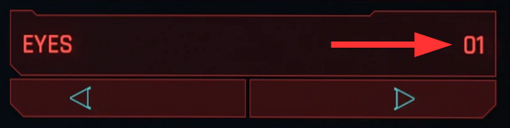

# NPV - V as custom NPC

## Summary

**Created & Published: May 13 2023 by @manavortex**

This guide will show you how to do the following things:&#x20;

* Setting up a Wolvenkit project with the prepared example files (this section)
* Creating your V's head in Blender ([npv-preparing-the-head-in-blender.md](npv-preparing-the-head-in-blender.md "mention"))
* Customizing their appearance and clothes ([npv-creating-a-custom-npc.md](npv-creating-a-custom-npc.md "mention"))
* Making sure that they are unique so that you can share them ( [npv-cleanup-and-troubleshooting.md](npv-cleanup-and-troubleshooting.md "mention"))
* Creating a Photomode NPV ( [npv-amm-nibbles-replacer.md](npv-amm-nibbles-replacer.md "mention"))

### Wait, this is not what I want!

* If you want to change the player head, see [a-new-head-for-v.md](../a-new-head-for-v.md "mention")
* You can find more guides and resources for NPCs outside of the wiki. They are linked on the [community-guides](../../community-guides/ "mention") page.

#### Difficulty:

Easy, but not trivial: you don't need any prior knowledge, but the process is complex, and if you miss steps or deviate from the instructions, things will end up not working for you.


If you run into issues with this guide, the right place to ask for help is `#mod-dev-chat` on the [redmodding Discord server](https://discord.gg/redmodding).&#x20;


**This guide uses the following versions:**

* Cyberpunk 2077 game version >= 2.3
* Wolvenkit >= 8.15 ([Nightly](https://github.com/WolvenKit/WolvenKit-nightly-releases/releases) | [Stable](https://github.com/WolvenKit/Wolvenkit/releases))
* The 3d editing tools  ( see [wkit-blender-plugin-current-version.md](../../../for-mod-creators-theory/modding-tools/wolvenkit-blender-io-suite/installing-the-wolvenkit-blender-plugin/wkit-blender-plugin-current-version.md "mention") for the currently supported version):
  * [Blender](https://www.blender.org/download/)
  * [wolvenkit-blender-io-suite](../../../for-mod-creators-theory/modding-tools/wolvenkit-blender-io-suite/ "mention")
* [AppearanceMenuMod](https://www.nexusmods.com/cyberpunk2077/mods/790) >= 2.1

### Credit

None of this would have been possible without **NoraLee**, who pioneered the process and taught me everything that I needed to know to set up these tools. This guide doesn't use any of their resources, but a lot of their knowledge. For the full guide with all edge-cases, bells, whistles and context, see their [Google Drive](https://drive.google.com/drive/folders/1R-knopKMhHDZuokPKaTt0nIDArXcQdrb).&#x20;

This is the speedrun version. If you want extra details and context, **please check Nora's Google Doc**.

<figure><figcaption></figcaption></figure>

## Preparation: The character preset

Due to the complexity of V's head mesh, you have to do a little bit of prep work here.

Don't worry, I'll walk you through it step by step.

To create a face, we need to know your character's values. For that, you need to have [AppearanceChangeUnlocker](https://www.nexusmods.com/cyberpunk2077/mods/3850) installed, or you won't see them:

* Eyes
* Eyebrows
* Nose
* Mouth
* Jaw
* Ears

Find the mirror in V's apartment and note down the **numerical values**.

<figure><figcaption></figcaption></figure>

## Preparation: Setting up the project

1. Create [a Wolvenkit project](https://app.gitbook.com/s/-MP_ozZVx2gRZUPXkd4r/wolvenkit-app/usage/wolvenkit-projects#create-a-new-wolvenkit-mod-project)
2. Download the example files from [Nexus](https://www.nexusmods.com/cyberpunk2077/mods/8328)
3. Merge the `source` folder in the download with the `source` folder in your Wolvenkit project directory
4. Switch to Wolvenkit and toggle the [project explorer](https://app.gitbook.com/s/-MP_ozZVx2gRZUPXkd4r/wolvenkit-app/editor/project-explorer) to the [source tab](https://app.gitbook.com/s/-MP_ozZVx2gRZUPXkd4r/wolvenkit-app/editor/project-explorer#source).
5. We will have **one NPC per Wolvenkit project** (I mean this!), so we'll delete the files for the body gender that we won't be using (find a table after the image)

<figure><figcaption></figcaption></figure>

<table><thead><tr><th width="179">body gender</th><th>file path</th></tr></thead><tbody><tr><td>female</td><td><ul><li><code>archive\tutorial\npv\your_female_character</code></li><li><code>raw\tutorial\npv\your_female_character</code></li><li><code>resources\bin\x64\plugins\cyber_engine_tweaks\mods\AppearanceMenuMod\Collabs\Custom Entities\tutorial\tutorial_custom_female_character.lua</code></li></ul></td></tr><tr><td>male</td><td><ul><li><code>archive\tutorial\npv\your_male_character</code></li><li><code>raw\tutorial\npv\your_male_character</code></li><li><code>resources\bin\x64\plugins\cyber_engine_tweaks\mods\AppearanceMenuMod\Collabs\Custom Entities\tutorial\tutorial_custom_male_character.lua</code></li></ul></td></tr></tbody></table>


This tutorial assumes that you will rename and re-path your files **at the very end**, because the prepared files rely on a certain file structure. We'll get to it!


## Check if it works

This is a working Wolvenkit project — let's make sure that it works.&#x20;


You can do this at any time during the tutorial to check your progress!


1. On the Wolvenkit toolbar, you'll find a button to [install the project](https://app.gitbook.com/s/-MP_ozZVx2gRZUPXkd4r/wolvenkit-app/menu/toolbar#install-and-launch)
2. Click it
3. When the game starts, load a savegame
4. Open the CET overlay
5. Switch AMM to the "Spawn" tab
6. Search for `Tutorial`
7. Spawn `Tutorial Woman` or `Tutorial Man`

You should now see a person in front of you.

<figure><figcaption>
You'll be editing these two
</figcaption></figure>

## Get cracking

Now it's time to do the actual work.&#x20;

* If you want to create your V's head for Cyberpunk, go to [npv-creating-a-custom-npc.md](npv-creating-a-custom-npc.md "mention")
* If you just want to set up the file structure, go to [npv-creating-a-custom-npc.md](npv-creating-a-custom-npc.md "mention")


Please remember that before sharing your NPV, you _**have**_ to change the paths! We will do this at the very end of the project, as the tooling requires the paths to be set up in a certain way.

