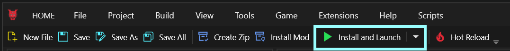

# How to add a new appearance to an NPV

## Summary

Created: Jul 3 2025 by [ratstick](https://app.gitbook.com/u/OX4mIc9xYzR97rBe1QUOsmixekJ2 "mention")\
Last documented update Jul 3 2025 by [mana vortex](https://app.gitbook.com/u/NfZBoxGegfUqB33J9HXuCs6PVaC3 "mention")

This page will show you how to add an appearance to an already-existing NPV.

## Introduction

Commissioned an NPV or had someone make one for you and want to add new appearances yourself? It’s easy! Well, sort of. All the hard work has been done, but there are still some things you’ll want to consider. Here’s a guide walking you through it, step by step.

Don’t hesitate to DM me on Discord or Nexus (`ratstick` on both)  if you need help, or if the guide is unclear! You can find me in the [modding community discord](https://discord.gg/redmodding), the AMM server, the KS server, and Veegee’s server. <3

### Disclaimer

I love subfolders and organizing my NPVs. The screenshots I’ll be sharing are from a mostly vanilla fem V NPV that I was commissioned to make. You’ll see my stupidly detailed folder organization for clothing meshes and textures. If you want to use this in your own projects, you can [download it here](https://drive.google.com/file/d/1McSM228BlsY-4HRoe-lGqPQUGybtkBpT/view?usp=sharing)!

These steps will be the same for adding new hairstyles, tattoos, cyberware, that is only on a new appearance and not the base appearance.

### The Mr. Potato Head and Barbie Dress-Up Metaphor

The `.ent` file tells the game what file to reference for a given entity to load its appearances. You can elarn more about it on its own page ([entity-.ent-files](../../../for-mod-creators-theory/files-and-what-they-do/file-formats/entity-.ent-files/ "mention")), but don't have to.

The `.app` file tells the game what to load when spawning the character entity. You can learn more about it on its own page ([appearance-.app-files](../../../for-mod-creators-theory/files-and-what-they-do/file-formats/appearance-.app-files/ "mention")), but don't have to.

The `.app` file is where most of the work takes place. It’s where we’ll start. You can think of it like a Mr. Potato Head doll. The components are the eyes, nose, ears, mouth, hats, bowtie of the Mr. Potato Head doll. When we add items to the .app file, we’re playing dress up with our Mr. Potato Head or Barbie.


An NPV is not the player, so many scripts and mechanics don’t apply to it and many frameworks like More Head Meshes or More Body Meshes are absolute overkill for us. You want to add additional cyberware? You can just add the mesh!

You may still need files from certain texture frameworks, but you’ll find that out when you’re beginning to custom path textures.


### What does “custom pathing” mean, and why do we do it?

Custom pathing is changing the folder structure or the name of a file so that vanilla or other modded files don’t overwrite what you’re putting together. This means that if I have Arkhe’s Universal Skin Tone mod installed, but your NPV uses a different skin file, then your file wouldn’t be overwritten by me having that mod installed.


You can find more information about this on the [custompathing-assets.md](../../items-equipment/custompathing-assets.md "mention") page, but you don't need that for this guide.


I take a broad approach to custom pathing and path nearly everything that isn’t an engine file or file type not commonly edited. I still recommend doing this for vanilla clothing items, as replacers are still used for some clothing items. In general, I recommend custom pathing the following file types:

* .mesh
* .mi
* .xbm
* .mlsetup
* .mlmask

## Adding new appearances

### Step 1: The project

If you already have a Wolvenkit project for your NPV, you can skip this step and go straight to [#step-2-duplicating-an-existing-appearance](how-to-add-a-new-appearance-to-an-npv.md#step-2-duplicating-an-existing-appearance "mention").

1. Open WolvenKit and select “create a new project”.&#x20;
2. Fill out the stuff. Make sure you use underscores instead of spaces. WolvenKit will freak out, and your shit may not work if you use spaces in folders and such.

<figure><figcaption></figcaption></figure>

3. Follow the guide for [analysing-other-mods](../../analysing-other-mods/ "mention") on how to add your NPV's files from the `.archive` you have installed. Add every file in the archive.
4. Find your NPV's **control files** - there should be an `.xl` and (maybe) a `.lua`.
5. The `.xl` file goes directly into your project's `resources/` folder
6. The `.lua` file goes into the folder `bin\x64\plugins\cyber_engine_tweaks\mods\AppearanceMenuMod\Collabs\Custom Entities` . You can use Wolvenkit's Create Folder button to create the entire thing in one go, then move the .lua file there.

### Step 2: Duplicating an existing appearance

Since all the hard work has been done for you with the base appearance, you can duplicate an existing appearance. Personally, I usually duplicate one with the same t0 submeshes hidden because I frequently forget to unhide them. (We’ll get to this in a later step).

1. Find your .app file and click the blue button to open it (you’ll see it when you hover the file).

<figure><figcaption>
You can also double-click the file
</figcaption></figure>

2. Right-click on the appearance you want to duplicate and select “Duplicate in Array/Buffer”.

<figure><figcaption></figcaption></figure>

3. After duplicating, make sure the new appearance is selected. In the right pane, you’ll see a field that says “name”, that’s where you can change the appearance name. Remember!! You must use underscores, no spaces!

<figure><figcaption>
You <strong>have</strong> to change the name of the appearance, as duplicates will confuse the game.
</figcaption></figure>

### Step 3: Playing Barbie Dress-Up (Adding items)

1. Once the name has been changed, click the carat next to the appearance to expand it
2. Click the carat next to `components`
3.  In most NPV .app files, clothing has its own section. Scroll down to find it.

    <figure><figcaption></figcaption></figure>

#### A brief explanation on .app file component names

Your .app file may look different. Modded items will usually have their own mesh names. For vanilla appearances, you will find the items that start with the following:

* t1 (inner torso)
* t2 (outer torso)
* s1 (shoes)
* h1 and h2 (headwear)
* l1 (legs)
* g1 (gloves)
* i1 (items, e.g., pouches and bags)


Most uses for those prefixes don't apply for an NPV (e.g. EquipmentEx layering via [Garment Support](../../../for-mod-creators-theory/3d-modelling/garment-support-how-does-it-work/)). However, you **should still keep them**, since they are used to sort items into the correct categories in [ACM](https://www.nexusmods.com/cyberpunk2077/mods/10795).


#### 3.1 Delete the components you don't want

I don’t want the sunglasses in this appearance, so I’m going to delete it. Right-click on the item and select “Delete Item in Array/Buffer”.

<figure><figcaption></figcaption></figure>

Now it's time to play some dress-up with our barbie.

#### Finding shoes&#x20;

I want to use a different pair of shoes.&#x20;

1. First, let's start by finding our mesh. You can either
   * Search for the item's file name (if you don't know it, [here's](../../../for-mod-creators-theory/references-lists-and-overviews/equipment/spawn-codes-baseids-hashes.md) how you can find out)
   * Go through the asset or mod browser to find it in the folder structure
   * Use the [Wolvenkit Search](https://app.gitbook.com/s/-MP_ozZVx2gRZUPXkd4r/wolvenkit-app/usage/wolvenkit-search-finding-files)


With the [Toggle Mod Browser](https://app.gitbook.com/s/-MP_ozZVx2gRZUPXkd4r/wolvenkit-app/editor/asset-browser#mod-browser) button, you can switch the Asset Browser to search only in modded files.


<figure><figcaption></figcaption></figure>

I want to use the converse.&#x20;

2. Right-click on the .mesh \
   &#xNAN;_(p)ma = (player) male average; (p)wa = (player) woman average_
3. Click “Add selected items to the project”. \
   This will duplicate the folder structure in your project as well.

Remember, we generally want to custom path most items.&#x20;

<figure><figcaption></figcaption></figure>

I’m going to add a new subfolder (right click on one of the folders) to “feet” for the converse and add another subfolder inside that for the textures. You can also rename the mesh, however I prefer a more organized file structure as I find it easier to navigate, especially if I ever need to change textures!

4. Drag and drop the .mesh into the new subfolder.

<figure><figcaption></figcaption></figure>

#### Updating the boots component

I’m going to swap the existing boot component in the .app file for the converse.&#x20;

1. Change the path to the `.mesh:` \
   Right-click on the mesh and select “copy relative path to game file”.&#x20;

<figure><figcaption></figcaption></figure>

3. Paste it into the “DepotPath” section on the right pane.&#x20;
4. The component can be renamed to whatever you want. I’m going to put “converse”.

<figure><figcaption></figcaption></figure>

#### Finding mesh appearances

Now we need to find the mesh appearance and clean up any unused mesh appearances. This just keeps it nice and tidy and easy to find the materials you actually need to change. Just like we did when opening the .app file, hover over the mesh and click the blue button to open it.

The first section you see contains the mesh appearance names, and these are what we’ll put in the `meshAppearance` field. I like the look of the black converse, so I’m going to choose the “black” `meshAppearance`.

<figure><figcaption></figcaption></figure>

The component in the .app should now have the mesh appearance, component name, and path to the mesh changed.

<figure><figcaption></figcaption></figure>

#### Optional, but recommended: Cleanup


Throwing out all appearances that you aren't using will make things easier for the next person touching this NPV. Most likely, that'll be Future You - they will thank you for doing this.


Now, it’s time to clean up the mesh appearances! If you use more than one appearance in the mesh, it’s fine to keep those entries in the mesh file. I only want to use the black appearance, so I’m going to delete the rest of the material entries. WolvenKit has a very handy tool that will do this part for you.&#x20;

1. Select the appearance entries you don’t want, then right click and hit “Delete Item in Array/Buffer”. Alternatively, you can also select the entry you want, hold shift, and click "Delete everything but selection".

<figure><figcaption></figcaption></figure>

2. Click on “Clean up” and then “Delete unused materials”.

<figure><figcaption>
Now, we can use a function in WolvenKit to clean up the entries we don’t need in the localMaterialBuffer and materialEntries.
</figcaption></figure>

Everyone say “thank you WolvenKit devs.”

#### Custompath the material files


Mods that change base game files are increasingly frowned upon, but this is how you can keep your NPV clean no matter what ancient mods your friends are running.


Now to edit the path of the textures. Find the localMaterialBuffer and click the carat on the left to expand it. Do the same thing for materials, CMaterialInstance and the values. These contain the paths to the textures we’re going to change.

<figure><figcaption></figcaption></figure>

Click the yellow arrow to add the texture to your project. We can ignore the baseMaterial because that’s an engine\materials file and I don’t think those are ever changed in any mod.

Just like when we added the mesh to our project, the textures will replicate the folder structure.&#x20;

<figure><figcaption></figcaption></figure>

And just like we did with the mesh, we want to drag and drop those into the “textures” subfolder.

<figure><figcaption></figcaption></figure>

Just like we did the mesh path, right-click on the texture, select “copy relative path” and paste it into the corresponding field in the .mesh. Then save it. Do this for all the textures that need to be pathed.

<figure><figcaption></figcaption></figure>

This guide is getting hella long already, so I won’t bore you with adding more clothes. The process will be the same no matter what you add.

One thing you may want to do is hide some of the body submeshes to prevent clipping through clothes. Find the t0 mesh component in your appearance and toggle off or on the chunkmasks. You can also open the mesh and switch to the preview tab to see which submeshes you may want to hide.

<figure><figcaption></figcaption></figure>

### Step 4: The Paperwork

Save the `.app` file after you’re done updating and adding your clothing. This can take a while sometimes depending on a few different factors. But just wait until it’s done.

Now, we need to tell the game that there’s a new appearance that can be used for the entity. That means we have to update the .ent file. Find that file in your project and click the blue icon to open it.

Right click on any one of the .ent entries and select “Duplicate in array/buffer.” Just like we did when we duplicated the .app appearance, we’ll need to rename it. Rename it to the same name you used for the appearance. Pay close attention to the formatting of the “name” field. You only need to append the new name to the end of the NPV name.=

This is what it should look like.

<figure><figcaption></figcaption></figure>

<figure><figcaption></figcaption></figure>

Save the `.ent` file now.

#### Optional: Add the appearance to AMM

If you don't want to use AMM, you can skip straight ahead to [#step-5-the-finish-line](how-to-add-a-new-appearance-to-an-npv.md#step-5-the-finish-line "mention")

If you also want it to spawn in AMM, we’ll need to add the appearance to the `.lua` too. You can do this in any text editor, I use notepad++

Pay close attention to the formatting of these names!

<figure><figcaption></figcaption></figure>

And don’t forget the comma!

<figure><figcaption></figcaption></figure>

If you also want the NPV to show up in photomode, you’ll need to regenerate the photomode files. Thankfully, WolvenKit has a way to do this automatically too! [You can find the guide to do that on the wiki.](https://wiki.redmodding.org/cyberpunk-2077-modding/modding-guides/npcs/npv-v-as-custom-npc/npv-amm-nibbles-replacer#step-1-create-photo-mode-files)

### Step 5: The Finish Line

This guide assumes you’ve never opened WolvenKit in your life so I’m going to show you how to pack the project.

In the top bar, you can click on "Install and launch":

<figure><figcaption></figcaption></figure>

This will pack your mod, install it to the game directory, and then launch the game for you.&#x20;

The long way (and what the steps do, and where the files are)

In the top bar, click “Build” then “Pack Project”.

<figure><figcaption></figcaption></figure>

The log will show you when the packing is complete.

You can click Build and Install or you can click the yellow folder in the Project Explorer to open the project folder.&#x20;

<figure><figcaption></figcaption></figure>

Go up a level and you’ll find a .zip file with the packed mod, ready to install.

<figure><figcaption></figcaption></figure>


If you made a new project and aren’t using the one the modder did, make sure you **uninstall** the old NPV by deleting all of its files.


And that’s it! Install and go, test it out!

### Final Notes

Garment support doesn’t work on NPVs. You can hide submeshes in ACM or in WolvenKit. You can also edit the mesh(es) in Blender to cut out or [resize](../../items-equipment/recolours-and-refits/r-and-r-refitting-step-by-step.md) the parts that clip with other items. I’m too lazy for that and just edit out the clipping in Photoshop lol.

This process should work for NPC+ too. And again, please don’t hesitate to reach out to me (`ratstick`) if you need help!
