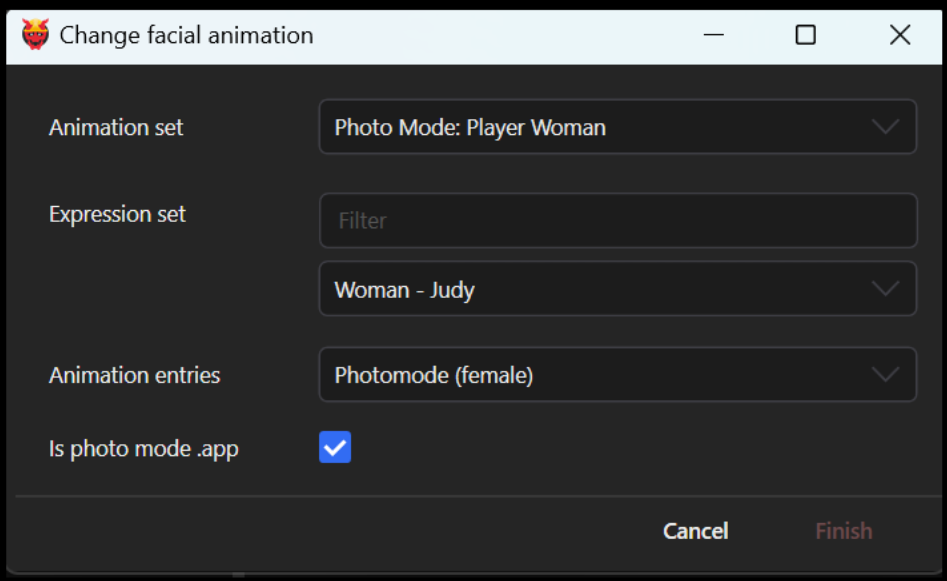

# NPV: AMM Nibbles Replacer

This guide is part of the guide for creating an [.](./ "mention"). It will teach you how to make your NPV compatible with xBaebsae's awesome [Nibbles to NPCs 2.0](https://www.nexusmods.com/cyberpunk2077/mods/8125) mod, letting you use your NPV in the game's photo mode.

## Requirements:

<table><thead><tr><th width="253.5"></th><th>minimum version</th></tr></thead><tbody><tr><td><a href="https://www.nexusmods.com/cyberpunk2077/mods/790">AppearanceMenuMod</a></td><td>the latest version compatible with your game</td></tr><tr><td><a href="https://www.nexusmods.com/cyberpunk2077/mods/8125">Nibbles to NPCs 2.0</a></td><td>>= 3.5</td></tr><tr><td>an NPV as per <a href="./">the tutorial</a></td><td></td></tr><tr><td>Wolvenkit</td><td>newer than December 02 2024 (8.16 or <a href="https://github.com/WolvenKit/WolvenKit-nightly-releases/releases">Nightly</a>)</td></tr></tbody></table>


You can find the original instructions in the [mod description](https://www.nexusmods.com/cyberpunk2077/mods/8125) under **Creating an NPC+/NPV Replacer** inside the spoiler tags. If you stick to this guide, you won't need them.



If you experience floating clothes, try **switching appearances**. Often, that resolves the issue. If not, you can check [appearances-change-the-looks](../appearances-change-the-looks/ "mention") for how to copy the correct components.


## Step 1: Copy your .app file

Create a copy of your .app file. It doesn't matter much where you put it - simply hold down `ctrl` and drag it anywhere in your project browser.

<figure><figcaption></figcaption></figure>

Open your copied file.&#x20;


Do **not** do this with your NPV `.app` file, as it will be destroyed.


## Step 2: Convert your file

1. From the `Appearances` menu, select `Convert to Photo Mode .app`
2. In the dialogue, select which file you want to use:

<figure><figcaption></figcaption></figure>

3. Check the box under "Convert appearance names".
4. When you click "Finish", Wolvenkit will move your file and convert the appearance names.

## Step 3: Picking animations


You need a Wolvenkit version released **after** Nov 29 2024 for this. If yours is older (e.g. stable 8.15), you need to [download a Nightly](https://github.com/WolvenKit/WolvenKit-nightly-releases/releases).


Wolvenkit now has a dialogue that will do all the hard work for you. Open your photo mode .app file, and let's get specific.


To keep the values currently in your .app file, simply leave the fields blank.


1. From the `appearances` dropdown, pick `Select Facial Animation`
2. You will now see a dialogue. Keep reading for which values you need to select.

<figure><figcaption></figcaption></figure>

3. From the **Animation set** dropdown, select one of the **first two** entries (the ones starting with `Photo Mode`)
4. From the **Animation Entries** dropdown, pick a set of animations to load.&#x20;


Photo mode expressions won't work if you pick the NPC entry, and vice versa!


6. Check the box **Is photo mode .app** to automatically re-name your appearances.&#x20;
7. **Optional:** You can use the **Expression Set** dropdown (and the text filter) to select any NPC expressions. They might or might not work - fuck around and find out!\
   To be on the safe side, pick `Player Woman` or `Player Man` for photo mode.


That's it! You're done! \
Only read on here if you care for the theory. Otherwise, go to [#step-4-pack-and-test](npv-amm-nibbles-replacer.md#step-4-pack-and-test "mention").&#x20;


***

### Theory about the photo mode .app file

#### What's with the appearance names?

The photo mode replacer assumes that your appearances will be named like this:

```
appearance_01
appearance_02
…
appearance_20
```

For the sake of clarity, the NPV appearances are not named this way. Open the photo mode .app that you copied in the previous step, and change the names of your appearances.

<details>

<summary>I don't want the numbers, can I keep my names?</summary>

In theory, yes. In practice, you'd have to edit both AMM and the Nibbles Replacer, so the answer is probably no.

</details>

#### What does the animation set do?

## Step 4: Pack and test

After you have changed the appearance names and saved the file, you can [install and launch](https://app.gitbook.com/s/-MP_ozZVx2gRZUPXkd4r/wolvenkit-app/menu/toolbar#install-and-launch) your Wolvenkit project.&#x20;

Before entering photo mode, select the correct replacer in AMM:&#x20;

1. Open the AMM overlay
2. Switch to Settings -> Photomode Nibbles Replacer
3. Select the correct replacer corresponding to your file

## Step 5 (optional): Edit pose packs


The paths that you need to replace are in the [mod description](https://www.nexusmods.com/cyberpunk2077/mods/8125) under **Adding your Pose Packs to Nibbles Replacer** inside the spoiler tags. For your convenience, there's a duplicate in the expandable box below. If that's not working, please check the mod description!


To add more compatibility to a pose pack, you only have to edit the mod's .xl file, which you can do with a text editor. An entry looks like this:

```yaml
  - entity: base\characters\entities\photomode_replacer\photomode_npc_woman_average.ent
    set: manavortex\animations\quality_time\pwa.anims
```

There might be one or multiple entries for each supported `.ent` file. Find out which entry or entries belong together, then **duplicate** them and replace the paths with the one to your NPV replacer's .ent file.


Make sure that you keep the indent at the beginning (the number of spaces) exactly the same as it is for the other entries, or the file will break. If that happens, you'll see an entry in the [ArchiveXL log file](#user-content-fn-1)[^1] .

To make sure that your file is okay, run it through [yamllint](https://www.yamllint.com/).


<details>

<summary>.ent file paths</summary>

This is **a copy** for your convenience. If the paths below aren'Ät working, please check the [mod description](https://www.nexusmods.com/cyberpunk2077/mods/8125) under **Adding your Pose Packs to Nibbles Replacer** inside the spoiler tags.

```
base\characters\entities\photomode_replacer\photomode_npc_woman_average.ent
base\characters\entities\photomode_replacer\photomode_npc_man_average.ent
base\characters\entities\photomode_replacer\photomode_npc_man_big.ent
base\characters\entities\photomode_replacer\photomode_npc_npv_fem1.ent
base\characters\entities\photomode_replacer\photomode_npc_npv_fem2.ent
base\characters\entities\photomode_replacer\photomode_npc_npv_masc1.ent
base\characters\entities\photomode_replacer\photomode_npc_npv_masc2.ent
base\characters\entities\photomode_replacer\photomode_npc_npv_big1.ent
base\characters\entities\photomode_replacer\photomode_npc_npv_big2.ent
```

</details>

## Troubleshooting

### (Most of) my NPV isn't moving in photo mode!

Force a refresh - select a different pose.&#x20;

If that isn't working, refresh the appearance:&#x20;

1. Open the AMM overlay
2. Switch to the Tools tab
3. Click the `Target Replacer` button
4. In the `scan` tab or the target tools, assign a different appearance. You can switch back right away.

### My NPV has no facial expressions!

Repeat [#step-3-picking-animations](npv-amm-nibbles-replacer.md#step-3-picking-animations "mention"). Make sure to pick the correct options in the **first** and the **last** dropdown.

### The pose packs weren't added!

You made a mistake when editing your yaml file. Go back and read the yellow box.

[^1]: Cyberpunk 2077\red4ext\plugins\ArchiveXL\ArchiveXL.log

