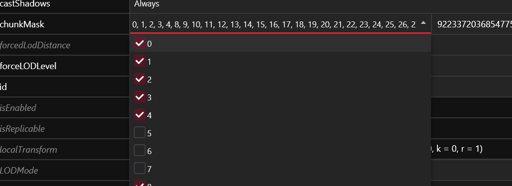

# NPV: Cleanup and troubleshooting

## Summary

**Published**: May 13 2023 by @manavortex\
**Last documented edit**: Mar 02 2023 by @manavortex

## Re-path your folder

Why are we doing this?

When **packing** a mod, Wolvenkit generates an .archive file with the files in your project's `source` folder. The problem here is that each file can only be **modified once**.&#x20;

Assume both you and your friend make an NPV. They made Alice, you are making Bob. And because your friend was lazy, they didn't complete this step. And since their project is called `Alice_NPV.archive`,  none of your changes will even show!

That's why you'll have to re-path your folder. If you don't, you will ruin someone's day.

You need to **re-name the template folders**. Unless you want to make more NPVs, it will be enough to re-name `tutorial` to `your_username`. Find a full guide to the process under [moving-and-renaming-in-existing-projects.md](../../items-equipment/moving-and-renaming-in-existing-projects.md "mention").

## Troubleshooting

### My NPV breaks AMM!

That's how you know that you have syntax errors in your NPV's `.lua` file. Copy the contents of the file into a [lua validator](https://www.tutorialspoint.com/execute\_lua\_online.php), then run the code and make sure to fix all errors.&#x20;


It's usually missing quotation marks or commas. The tool above will give you a line number. Compare the line with the working template and fix the differences.

If you feel stuck, you can ask ChatGPT – just tell it that you're trying to fix LUA code, or it won't know the syntax.


### My NPV doesn't spawn!

#### You can't select them in AMM

The error is with your `.lua` file – either it's not in the correct folder, or AMM fails to load it.

#### If you can select the NPV in AMM

If you click on the button, but nothing happens, that means that the game can't find your `.ent` file. The error is between your `.lua` and your `.ent`.&#x20;

Most likely, the path to the .ent file is not correct. If it is, make sure that it has **no upper-case characters**.&#x20;

### My NPV turns into someone else if I walk away from them!

That is due to **appearance proxies**, which are how the game saves performance. If you're using the most recent [NPV template project](https://www.nexusmods.com/cyberpunk2077/mods/8328?tab=files\&file\_id=45042), you shouldn't have any, but if you set up your files from scratch, you'll have to [disable the proxy appearance](../../../for-mod-creators-theory/files-and-what-they-do/appearance-.app-files/proxy-appearances.md#i-hate-it-how-do-i-kill-it).

### Clothes are floating!

For each of the mesh components that aren't moving, expand it and find the `skinning` entry. Make sure that the `bindName` points at `root`:

<figure><figcaption></figcaption></figure>

### My feet are wrong for the shoes!

You need to **manually enable** the correct foot mesh.

Hide [chunks](../../../for-mod-creators-theory/files-and-what-they-do/3d-objects-.mesh-files/submeshes-materials-and-chunks.md) 5-7 of the base body (original component name is `t0_000_pXa_base__full`):

<figure><figcaption></figcaption></figure>

Add an extra component and point the `depotPath` to the mesh for the correct feet. This is either `l0_000_pXa_base__cs_flat` or `l0_000_pXa_base__cs_heels`.


If you don't have these meshes (they should be included in the sample project), you can extract them from the [Toggleable Feet mod](https://www.nexusmods.com/cyberpunk2077/mods/7049).


### My NPV loads, but I'm getting a random appearance!

That happens when you're loading an appearance that the game doesn't know about — the problem is between your .lua file and your root entity. The names must match exactly, and must contain not typos or leading/trailing spaces.

<figure><figcaption></figcaption></figure>

If that was not it, double-check the `path` in your lua file and make sure that it points to the correct .ent file, and not to a backup or backup project.&#x20;


This particular problem is **always** between those two files. Other mistakes will have other effects.


### Another NPV is showing!

This is the reason for the [#re-path-your-folder](npv-cleanup-and-troubleshooting.md#re-path-your-folder "mention") section in this guide. If you want more information, read  [#why-are-we-doing-this](npv-cleanup-and-troubleshooting.md#why-are-we-doing-this "mention"). Otherwise, you can temporarily remove all other NPVs or make sure to complete the re-pathing.

### I'm getting errors in Wolvenkit!


You can check the [Troubleshooting](https://app.gitbook.com/s/-MP\_ozZVx2gRZUPXkd4r/getting-started/troubleshooting "mention")page on the Wolvenkit wiki.


#### It installs, but doesn't launch

Just install the mod via WKit, launch Cyberpunk the way you normally do.

