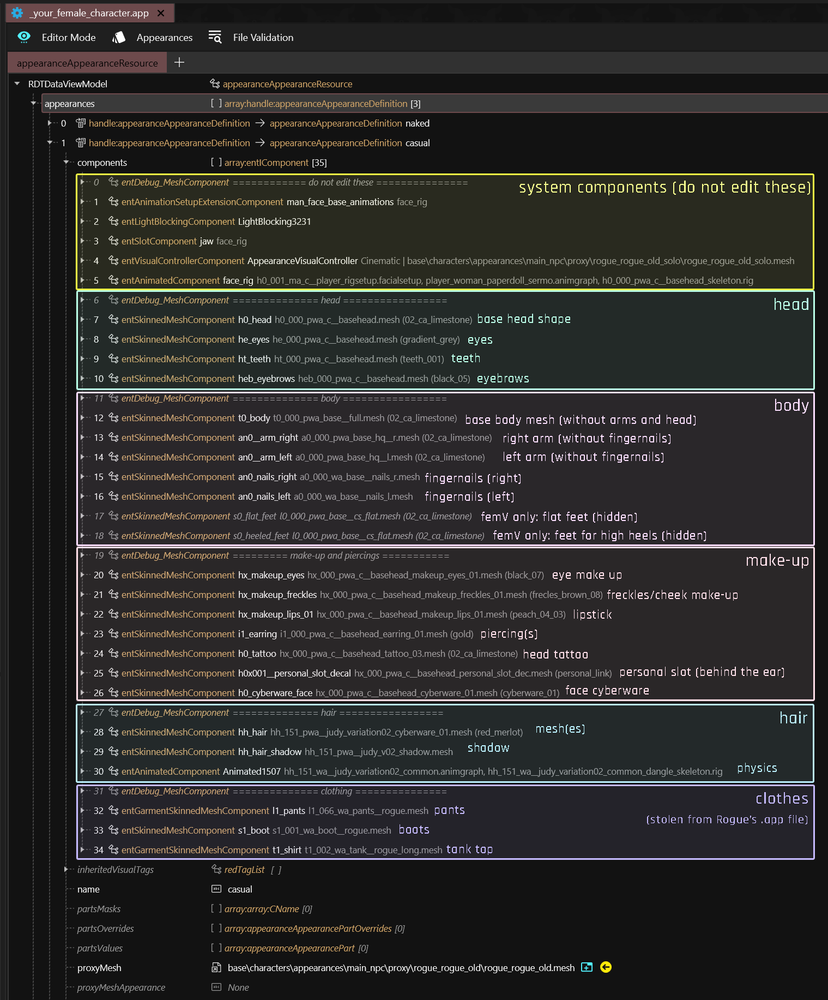
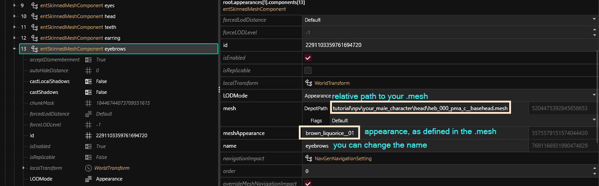

# NPV: Creating a custom NPC

## Summary

**Created by @manavortex**\
**Published May 13 2023**


As much of the information here has been documented in [other guides](../appearances-change-the-looks.md), the information below will be kept initially brief. Might write more to a later point, but there is a lot of [documentation](../../../developers/vehicles/archive/.app-file-appearanceresource.md) already.


This page is a part of the [NPV guide](./). It will show you how to use the [provided example project](./#preparation) to create a custom NPC for Cyberpunk 2077, whom you can then spawn with AppearanceMenuMod.


This guide assumes that&#x20;

* you already have a head mesh (see [this section](npv-preparing-the-head-in-blender.md) otherwise)
* that you're using a set of default paths (if not, read the last paragraph of this box)
  * the corresponding files are in either of these folders\
    `tutorial\npv\your_female_character\head` \
    `tutorial\npv\your_male_character\head`
  * the meshes are named like their in-game equivalents, e.g. `h0_000_pwa_c__basehead.mesh`


It's not a problem if you use your own custom paths. You just need to keep that in mind when changing the provided .ent and .app file, as your paths will be different from those in the examples.


## The .lua file

We're registering our NPC with AppearanceMenuMod via a .lua file, which needs to end up in AMM's `Custom Entities` folder. The full path in the Cyberpunk directory will be this:

`bin\x64\plugins\cyber_engine_tweaks\mods\AppearanceMenuMod\Collabs\Custon Entities`

I have prepared two example files in the Wolvenkit's project's `resources`. Delete the one that you aren't using, then let's take a look at the other one:

`tutorial_custom_female_character.lua`

`tutorial_custom_male_character.lua`

### The file structure

This is the file content for the female example:

```lua
return {
  -- Your beautiful name :)
  modder = "tutorial",

  -- This must be UNIQUE so be creative!
  -- NO SPACES OR SYMBOLS ALLOWED
  unique_identifier = "tutorial_female_character",

  -- This is the info about your new entity
  entity_info = {
  -- name: The name that will be shown in the Spawn tab
    name = "Tutorial Woman",
  -- path: The path to your entity file. Must use double slash bars \\
    path = "tutorial\\npv\\your_female_character\\ops\\your_female_character.ent",
  -- record: This is the TweakDB record that will be used to add your character. More information below.
    record = "Character.afterlife_merc_fast_melee_w_hard",
  -- type: Character or Vehicle
    type = "Character",
  -- customName: Set this to true if you want the name you set here to appear in AMM Scan tab.
    customName = true
  },

  appearances = {
    "tutorial_woman_casual", 
    "tutorial_woman_business", 
  },  

  -- Here you can pass a list of attributes from different records to be copied to your new character.
  -- More information below.
  attributes = {
  },
}
```

It loads our [root entity](npv-creating-a-custom-npc.md#the-root-entity) from  `tutorial\npv\your_female_character\ops\your_female_character.ent`. That's the file which tells the game what to load.

You can and should change this file — see the inline documentation for how to do that.

## The root entity

You find the root entity for your character here:

```
tutorial\npv\your_female_character\ops\your_female_character.ent
tutorial\npv\your_male_character\ops\your_male_character.ent
```


[Would you like to know more?](../../../modding-know-how/files-and-what-they-do/entity-.ent-files/#root-entity)


The root entity hooks up your .app file and the appearance names in the .lua file, and that's about everything there is to say about it. Here's how it looks:

<figure><figcaption><p>Adjust entries as needed. If you want to </p></figcaption></figure>

If you want to add more appearances:

* duplicate an existing entry
* change the last key `name` to match the one in your .lua
* change the first key `appearanceName` to the one you want to put in your `.app`

Let's look at the .app file now.

## The app file


[Would you like to know more?](../../../developers/vehicles/archive/.app-file-appearanceresource.md)


This is where all of your NPC's components are defined — stuff like which rig they use, their facial expression set, the shadow they cast, but also their hair and equipment. For details, see the .app file's [overview page](../../../developers/vehicles/archive/.app-file-appearanceresource.md), for another guide on this, see [here](../appearances-change-the-looks.md).

It looks like this:

<figure><figcaption></figcaption></figure>

Each of the prepared .app files has two appearances, `casual` and `business`. I tried hooking up all the components for you (might have forgotten some). In that case, you simply duplicate any of the entSkinnedMeshComponents and change `depotPath` and `apperance`:

<figure><figcaption></figcaption></figure>

… and that's about it, go forth and create custom apperances!&#x20;

You can [check this guide](../appearances-change-the-looks.md), or look through the .app files for other NPCs for ideas. If you need further details, I highly recommend checking out NoraLee's [much more detailed tutorial](https://docs.google.com/document/d/1clFJhpi7H5jk73vUQPnjIwjkuQV6VnYkKMoXt1eYMb0/edit), which will also give you all the context you could possibly need.
