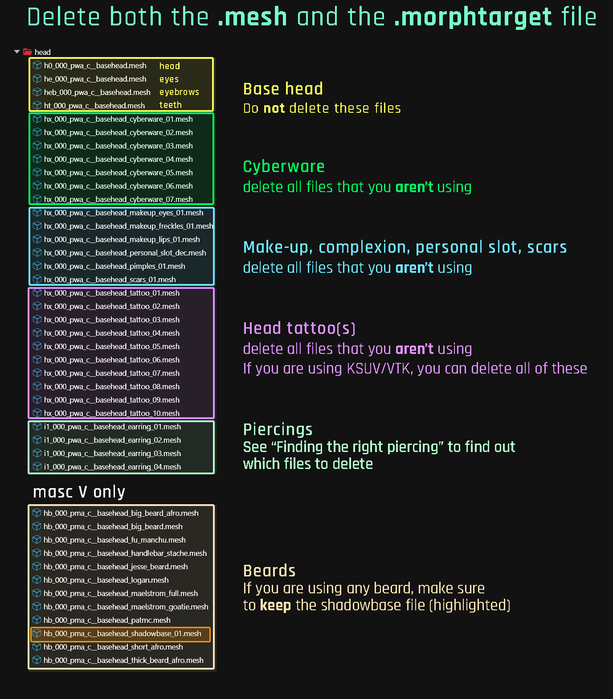

# NPV: Preparing the head in Blender

## **Summary**

**Published: May 13 2023 by @manavortex**\
**Last documented update: Dec 19 2024 by** [mana vortex](https://app.gitbook.com/u/NfZBoxGegfUqB33J9HXuCs6PVaC3 "mention")

This page is a part of the [NPV guide](./). It will show you how to

* change the **head** to your V's custom head shape in Blender
* import the changed head back into Cyberpunk

This section will **not** deal with the following (that comes in [npv-creating-a-custom-npc.md](npv-creating-a-custom-npc.md "mention")):

* Changing V's body
* Changing anything that is not the head shape (e.g. colours or materials)

If you want a 3d model, you probably know what you're doing; in that case, make sure to run the script and get the shape right, then go wild. If you want to export a body, you can still complete this guide, then follow the [entity export workflow](https://app.gitbook.com/s/-MP_ozZVx2gRZUPXkd4r/modding-community/exporting-to-blender) to get everything into Blender.

### Video tutorial


IWouldiwas Sh00kspeared made a video tutorial for visual learners (Nov 2024). You can find it on [youtube](https://www.youtube.com/watch?v=f9KWa_qJDUo\&t=743s), or check out the box below.


### Prerequisites

* [ ] You have downloaded the prepared Wolvenkit Project from [Nexus](https://www.nexusmods.com/cyberpunk2077/mods/8328)
* [ ] You have [Blender](https://www.blender.org/download/) installed
* [ ] You have the Wolvenkit Blender Plugin (check [installing-the-wolvenkit-blender-plugin](../../../for-mod-creators-theory/modding-tools/wolvenkit-blender-io-suite/installing-the-wolvenkit-blender-plugin/ "mention") if you don't)
* [ ] Blender and the plugin are on the current compatible versions [wkit-blender-plugin-current-version.md](../../../for-mod-creators-theory/modding-tools/wolvenkit-blender-io-suite/installing-the-wolvenkit-blender-plugin/wkit-blender-plugin-current-version.md "mention")
* [ ] You have completely read this entire section

### Worth noticing

In this section, we will be moving/deleting files. You can complete these steps in Wolvenkit or in the Windows File Explorer.


It's important that you leave the file structure **as it is**. Moving or renaming files will confuse Wolvenkit and break the example project.

The final section of [npv-creating-a-custom-npc.md](npv-creating-a-custom-npc.md "mention") tells you how to safely move files.


## Step 1: Getting head

1.  Open the `head` folder in your project's `archive` section.

    1. **Optional:** Be confused and/or panic about why there are [over 9000](#user-content-fn-1)[^1] files

    <figure><figcaption></figcaption></figure>
2.  Look into the `head/morphtargets` folder

    1. **Optional:** Be confused and/or panic about why there are [over 9000](#user-content-fn-1)[^1] files **again**.

    <figure><figcaption></figcaption></figure>
3. Delete all those files that you aren't using (read on as for how)


**It's too many of them!**

True! That's because I included **all** options for any given V. But don't worry: after you have deleted the ones that you won't be using, you should be left with a maximum of 13 `.morphtarget` files for female V and 14 files for male V.


I have included **all** meshes and morphtargets from the game files. We'll now thin out the options, deleting those parts that your NPV won't be using.

### Deleting unused files: the convenient option


The best and most convenient tool for the job is [NoraLee's NPV picker](https://noraleedoes.neocities.org/npv/npv_part_picker). It will give you a list of files that you need to keep.

The list will give you a number of **Source Mesh** entries like `h0_000_pwa_c__basehead.mesh`.

You need to keep these files inside the `head` folder and the `.morphtarget` file in the subfolder `morphtargets`. If you want to understand why, keep reading; otherwise, you can proceed to [Deleting Files](npv-preparing-the-head-in-blender.md#deleting-files).


<details>

<summary>What the actual fuck are all those files?</summary>

**Meshes vs Morphtargets**

The `.mesh` files are the 3d files making up your NPV's head. I've taken them from the game files and prepared them for you (by making them use the player animations and -expressions).

The `.morphtarget` files are the character creator options (a direct game export). You can safely overwrite them with the most recent version by searching Wolvenkit for the file name – you need to put it into the correct folder, though, or it won't be picked up by the scripts.

We only need the .morphtargets to generate the actual meshes by duplicating the character creator process.

**Okay, and all those numbers?**

The different variants in the character creator correspond to the different meshes. For example, if you select cyberware 3 in the character creator, the mesh that will get loaded is `cyberware_03`. Not so difficult, is it?

To learn what the prefixes mean, check [#head-file-prefixes](../../../for-mod-creators-theory/references-lists-and-overviews/cheat-sheet-head/#head-file-prefixes "mention").

</details>

### Finding the right piercing


If your V isn't using any piercings, you can skip this step and go directly to [Deleting Files](npv-preparing-the-head-in-blender.md#deleting-files).


In the files, you will see four files for jewelry:

```
tutorial\npv\your_female_character\head\i1_000_pwa_c__basehead_earring_01.mesh
tutorial\npv\your_female_character\head\i1_000_pwa_c__basehead_earring_02.mesh
tutorial\npv\your_female_character\head\i1_000_pwa_c__basehead_earring_03.mesh
tutorial\npv\your_female_character\head\i1_000_pwa_c__basehead_earring_04.mesh
```

… none of which is your V's exact piercings. Instead, there are full sets of jewelry, most of which will be **hidden**.

You have to look at the meshes and find the file that **includes your set of piercings**. We will delete the ones you don't need later.

### Deleting files


Number in file name <=> Number in character creator



Do not delete any files if you're [editing the player head](../a-new-head-for-v.md) (Ignore this hint if you aren't).


Many of the files are **variants** and your V will be using **one or none of them.** That means you have a bunch of files to delete.

* If you have chosen [the convenient option](npv-preparing-the-head-in-blender.md#the-convenient-option), you should already have a list of files that you need to keep.
* Otherwise, you need to refer to [#what-the-actual-fuck-are-all-those-files](npv-preparing-the-head-in-blender.md#what-the-actual-fuck-are-all-those-files "mention") and use the table below for some oversight.


When deleting files that you aren't using, make sure to remove both the `.mesh` file in the `head` folder and the `.morphtarget` file in the `head/morphtargets` folder.


The following table will show you examples on what to **keep** (as in, you **delete everything else**):

<table><thead><tr><th width="247">Body gender/variant</th><th>Files not to delete from variants</th></tr></thead><tbody><tr><td>female V, cyberware 03</td><td><pre><code><strong>tutorial\npv\your_female_character\head\hx_000_pwa_c__basehead_cyberware_03.mesh
</strong>tutorial\npv\your_female_character\head\morphtargets\hx_000_pwa__morphs_cyberware_03.morphtarget
</code></pre></td></tr><tr><td>male V, scars 01</td><td><pre><code>tutorial\npv\your_male_character\head\hx_000_pma_c__basehead_scars_01.mesh
tutorial\npv\your_male_character\head\morphtargets\hx_000_pma__morphs_scars_01.morphtarget
</code></pre></td></tr><tr><td>male V, big beard</td><td><pre><code>tutorial\npv\your_male_character\head\hx_000_pma_c__basehead_scars_01.mesh
tutorial\npv\your_male_character\head\hb_000_pma_c__basehead_big_beard.mesh
</code></pre></td></tr><tr><td>female V, tattoo 09</td><td><pre><code>tutorial\npv\your_female_character\head\hx_000_pwa_c__basehead_tattoo_09.mesh
tutorial\npv\your_female_character\head\morphtargets\hx_000_pwa__morphs_tattoo_09.morphtarget
</code></pre></td></tr><tr><td>male V, no earring</td><td><p>Files to delete (0* means "01 - 04"):</p><pre><code>tutorial\npv\your_male_character\head\i1_000_pma_c__basehead_earring_0*.mesh
tutorial\npv\your_male_character\head\morphtargets\i1_000_pma__morphs_earring_0*.morphtarget
</code></pre></td></tr></tbody></table>

<figure><figcaption></figcaption></figure>

#### Expected result

After deletions, both `head` and `head/morphtargets` should hold only the files that your V is actually using.

For a list, see the [table above](npv-preparing-the-head-in-blender.md#okay-and-all-those-numbers).

Once you're done, you should have between 4 and 13/14 files:

<table data-header-hidden><thead><tr><th width="281"></th><th></th></tr></thead><tbody><tr><td>minimum number of files</td><td>4</td></tr><tr><td>maximum number of files</td><td><p>13 (female body gender)</p><p>15 (male body gender)</p></td></tr></tbody></table>

## Step 2: Exporting head

Now, we will export all `.morphtarget` files from Wolvenkit so that we can edit them **in Blender**.


You will complete most of these steps in Blender, only the import/export happen in Wolvenkit.



If you run into any **errors**, check [#step-5-optional-troubleshooting](npv-preparing-the-head-in-blender.md#step-5-optional-troubleshooting "mention")


1.  Find the Export Tool (Tools -> Export)

    1. To filter, click into the empty row under "name" and write "`morphtarget`"
    2. Check the box in the header to select everything
    3. Click "Export Selected"

    <figure><figcaption><p>Export all your morphtargets. Mesh files will be auto-generated for you.</p></figcaption></figure>
2. Switch to your project's [`raw` folder](https://app.gitbook.com/s/-MP_ozZVx2gRZUPXkd4r/wolvenkit-app/editor/project-explorer#raw) or Wolvenkit's `raw` perspective. You will find the entire file structure mirrored there.
3. In `head` folder, find the file `head_import.blend`.\
   This file is a **utility file** which will automatically import and export the files for you. For that reason, it needs to be in a certain relative path.


If you have already changed your structure (by re-naming your folders), you need to make sure that `head_import.blend` is in the folder `head` right next to the folder `morphtargets.`


4. Open it in Blender. It will take you to the **scripting** perspective, where you'll see something like this:

<figure><figcaption><p>Looks scary, but you don't have to do anything here!</p></figcaption></figure>

5. Press the **play ▶️▶**&#x62;utton.
6. The script will now import a bunch of armatures from the `morphtargets` folder. You will see them showing up in the topright corner (see the next screenshot under 7. for how it should look)
7. Switch to the next script in the file, but **don't run it yet**:

<figure><figcaption><p>select "01_apply_shapekeys.py" from the dropdown menu</p></figcaption></figure>


If you've been previously afraid of scripting: This is a good place to stop! :))


8. Find line 26 and following in the script, and alter the values to those of your V (which you get from **the character preset**, see [here](npv-preparing-the-head-in-blender.md#the-character-preset) for further explanation).

<figure><figcaption></figcaption></figure>


You don't need to select the eyebrows here, as those are "painted on" later via mesh appearance. The mesh only needs to have the right shape, which is what we're doing here.


9. After you've changed the values to those of your V, click the "play" button again. This will apply the morphs to your V's face:

<figure><figcaption></figcaption></figure>


Some shapekeys don't correspond 1:1 with their numbers in the character creator. If a part of V's head is shaped subtly wrong or looks weird in the game, **undo** your changes (Ctrl+Z), add or subtract 1 from the corresponding shape key, and run the script again.


#### Can I have that with textures?

Yes, you absolutely can! Once you have completed Step 3, you can re-export the `.mesh` files. Importing those into Blender will give you materials!

## Step 3: Importing head

### Exporting from Blender

Now that your head looks the way you want, it's time to run the final script, which will export your changed head to .glb for you:

<figure><figcaption><p>Select and run it</p></figcaption></figure>

This will overwrite already existing files, leaving you with a set of import-ready mesh files.

Now it's time to get them back into Wolvenkit.


Before you import and apply these changes to your .mesh files, it's a good moment to go through:[fixing-eye-clipping-in-npvs-by-replacing-facial-rigs.md](../fixing-eye-clipping-in-npvs-by-replacing-facial-rigs.md "mention"), but this can be done later, if you are not sure.


1. Find the Import Tool (Tools -> Import Tool)
2. Click "Import All". You shouldn't see any errors.
3. You're done!


At this point of the guide, you should see your NPV's head in Wolvenkit (re-select the mesh to refresh the preview).

If everything works, you're done with Blender (unless you want to get fancy).


If the head mesh has **not changed**, you ran into a problem — check the Log View and/or make sure that you completed all steps in the right order. Especially **changing any paths** will break things.

## Step 4: Make sure that it works

Spawn your NPV and check that they look like they should.

* If they don't, check [#step-5-optional-troubleshooting](npv-preparing-the-head-in-blender.md#step-5-optional-troubleshooting "mention")
* If they do,
  1. create a **full backup** of your project (copy the entire folder in Windows Explorer)
  2. delete all `.morphtarget` files from your project — we don't need them anymore (do not delete them if you are editing the player head)
  3. then, proceed with [npv-creating-a-custom-npc.md](npv-creating-a-custom-npc.md "mention")

## Step 5 (optional): Troubleshooting

Optimally, this process just runs with no hitches. However, during beta testing and troubleshooting, people ran into a few issues, so I'm listing them here.

### Blender won't export

You **need** to use the [wolvenkit-blender-io-suite](../../../for-mod-creators-theory/modding-tools/wolvenkit-blender-io-suite/ "mention") for export. Make sure that it is installed and up-to-date.

### Blender script errors

You can check if Blender has run into errors by opening the **Blender console window** - from the menu, select Window -> Toggle System Console.

As of December 2023, **any** script errors have been because the person encountering them has been using the wrong [Blender](https://www.blender.org/download/) version. You can see which version is currently running either [via UI](https://blenderartists.org/t/what-blender-version-am-i-using/1327264) or by checking the path in the system console window's title:

<figure><figcaption><p>This is using Blender 2.93, which is definitely not compatible.</p></figcaption></figure>

The supported versions are:

### A component I want is not showing!

Check the following:

* The component's shape looks okay in Blender
* The component's shape looks okay in Wolvenkit's .mesh preview

If both of these things are true, then you can fix this problem in the next step of the tutorial, [npv-creating-a-custom-npc.md](npv-creating-a-custom-npc.md "mention").

### V was imported, but they're unsettlingly, subtly _wrong_

If you had the example project lying around for a very long time, please try and redownload it ([Nexus link](https://www.nexusmods.com/cyberpunk2077/mods/8328)), as the first version had been using an NPC animationgraph for facial expressions.

If that's not it, then you ran into the shapekey offset issue: some shapekeys don't correspond 1:1 with their numbers in the character creator. If a part of your shape is shaped wrong or looks weird in the game, **add or subtract 1** from the corresponding shape key, and run the script again.

### My pupils are fucked!

Check [a-new-head-for-v.md](../a-new-head-for-v.md "mention") -> [#troubleshooting](../a-new-head-for-v.md#troubleshooting "mention")

[^1]: not literally
