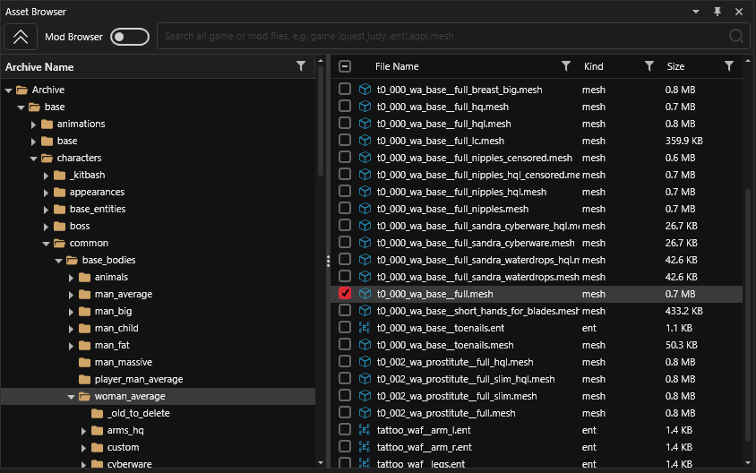
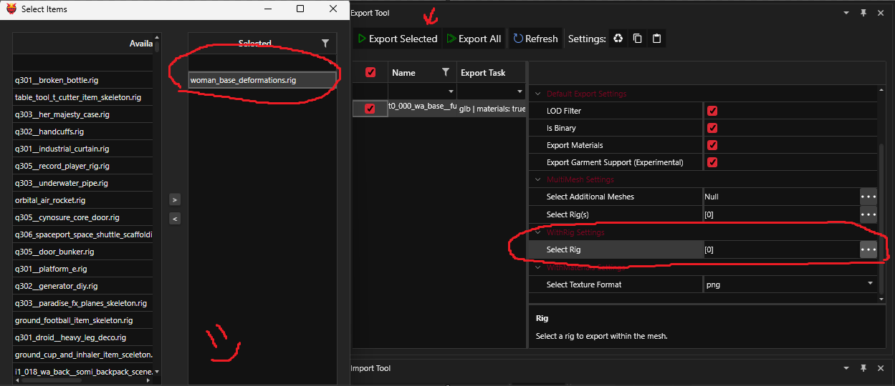
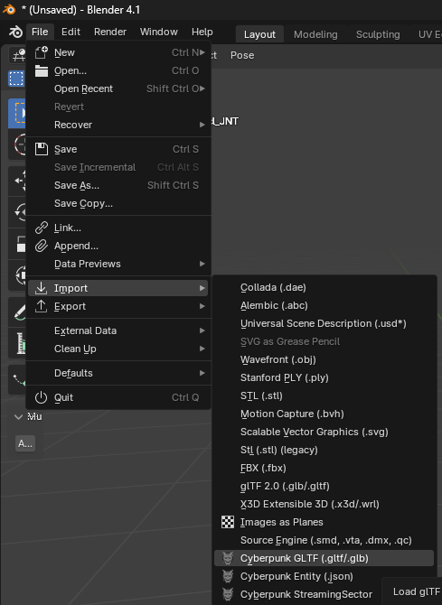
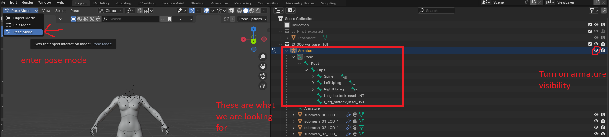
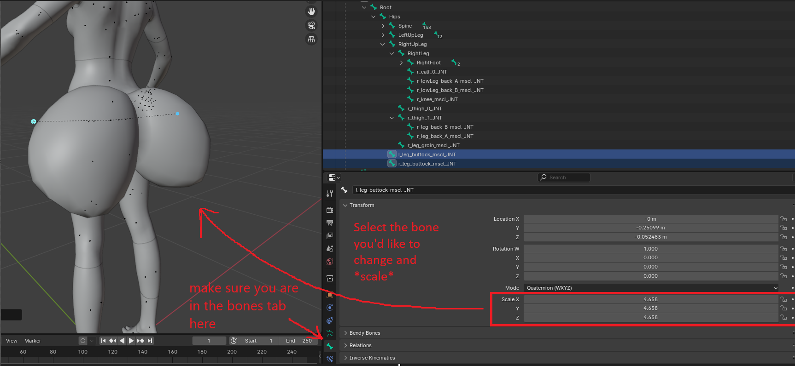
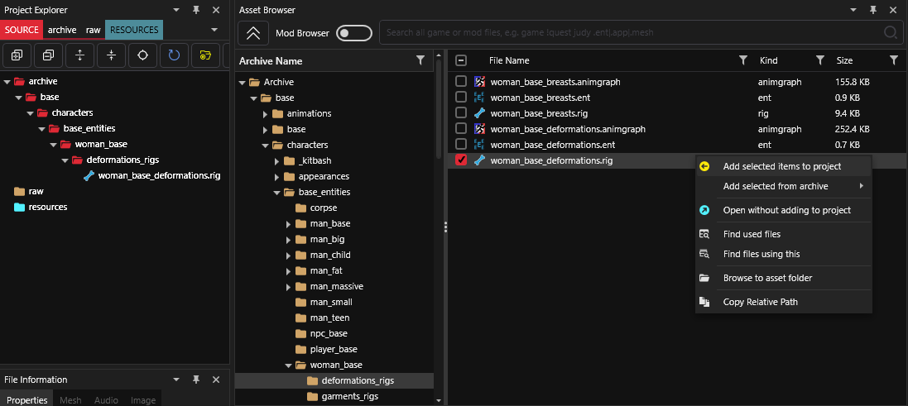
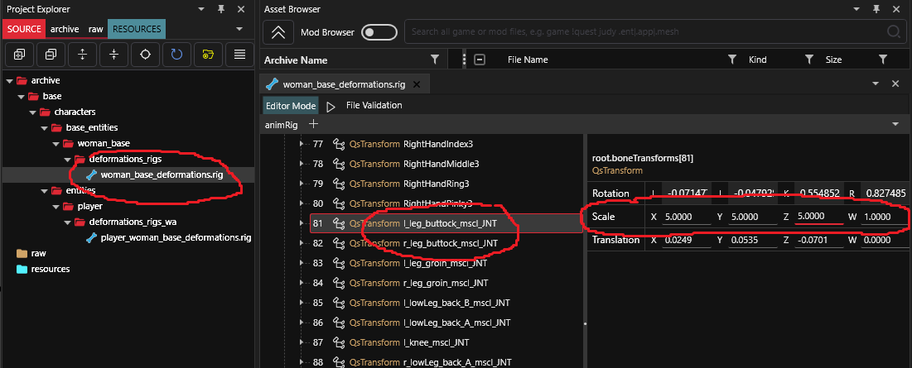
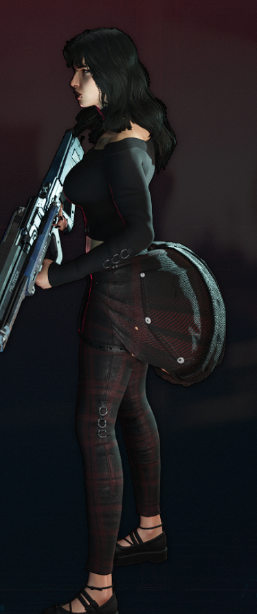

# Rig deforming for V

## Summary:

**Published**: Oct 12 2024 by @chris\
**Last edited:** Oct 12 2024 by [manavortex](https://app.gitbook.com/u/NfZBoxGegfUqB33J9HXuCs6PVaC3 "mention")

This guide will show you how to create a **custom rig** for V, based on [**BODY SHAPING - Tutorial**](https://www.nexusmods.com/cyberpunk2077/mods/2884)

### **Wait, this is not what I want!**

* If you want to learn what a rig even does, check [armatures-.rig-files.md](../../for-mod-creators-theory/files-and-what-they-do/file-formats/armatures-.rig-files.md "mention")
* If you want to create custom poses instead, check [poses-animations-make-your-own](../animations/animations/poses-animations-make-your-own/ "mention")

## Requirements:

<table><thead><tr><th width="155"></th><th width="232"></th><th></th></tr></thead><tbody><tr><td>Wolvenkit</td><td>latest >= 8.14</td><td> <a href="https://github.com/WolvenKit/WolvenKit-nightly-releases/releases">Nightly</a> | <a href="https://github.com/WolvenKit/Wolvenkit/releases">Stable</a> | <a href="https://app.gitbook.com/s/-MP_ozZVx2gRZUPXkd4r/getting-started/download">Install guide (wiki</a>)</td></tr><tr><td>Blender</td><td>latest (>= 4.2)</td><td><a href="https://www.blender.org/download/">blender.org</a></td></tr><tr><td><em>Optional</em></td><td><em>Unique V Body Framework</em></td><td><a href="https://www.nexusmods.com/cyberpunk2077/mods/3725"><em>get it from Nexus</em></a></td></tr></tbody></table>

### Level of difficulty:&#x20;

Medium - you should have some general knowledge of Blender and Wolvenkit

## Setting up

1. Create a [new Wolvenkit project](https://app.gitbook.com/s/-MP_ozZVx2gRZUPXkd4r/wolvenkit-app/usage/wolvenkit-projects#create-a-new-wolvenkit-mod-project)
2. Find an add one of the following files (the correct one for your body gender):&#x20;

```
femV:  base\characters\common\base_bodies\woman_average\t0_000_wa_base__full.mesh
mascV: base\characters\common\base_bodies\man_average\t0_000_ma_base__full.mesh
```

<figure><figcaption><p><mark style="color:red;">Add it to your project</mark></p></figcaption></figure>

3. Export it from Wolvenkit. Use the following settings:
   * **Mesh Export Type**: WithRig
   * **WithRig settings:** Select Rig -> woman\_base\_deformations.rig

<figure><figcaption></figcaption></figure>

## Blender

1. Import the `.glb` that you [just exported](../../for-mod-creators-theory/modding-tools/wolvenkit-blender-io-suite/wkit-blender-plugin-import-export.md#export-from-wolvenkit) into Blender:

<figure><figcaption><p><br></p></figcaption></figure>

2. You will see V's body: this is your immediate preview.
3. Enable and select the armature in the side bar panel:

<figure><figcaption></figcaption></figure>

4. Switch the viewport to to `Pose Mode` ( at the top left)
5. You can now select and **scale** individual bones.&#x20;

.png>)

<figure><figcaption><p><mark style="color:red;">Select the bones tab, select the bone you want to edit, and scale.</mark></p></figcaption></figure>

* Generally you want to scale bones that do not effect other bones. Joints, or those parenting other bones can break the mesh in game. Rotation and location generally breaks things.
* In my testing, Thigh\_1\_JNT isn't worth the hassle, looks fine in blender but always broke for me in game. _<mark style="color:red;">(if someone has a solution for this please let me know)</mark>_
* Since you are simply using blender to get a visual on what you are changing, you technically only need to edit one half of the body.

## Importing the changes into Wolvenkit


This is currently a manual process. In the future, the toolchain will let you do this automatically — but we aren't there yet.


1. Add the required `.rig` files to your project (the second file is for first person perspective):

femV:

```
base\characters\base_entities\woman_base\deformations_rigs\woman_base_deformations.rig
base\characters\entities\player\deformations_rigs_wa\player_woman_base_deformations.rig
```

mascV:

```
base\characters\base_entities\man_base\deformations_rigs\man_base_deformations.rig
base\characters\entities\player\deformations_rigs_ma\player_man_fpp_deformations.rig
```

<figure><figcaption></figcaption></figure>

2. Open one of the files in the CR2W editor and find the BoneTransforms array
3. Find the bone that you scaled in Blender:

<figure><figcaption></figcaption></figure>

4. Here, we copy the values from Blender' s `BoneTransforms` tab.


X and Y is **flipped** inside of Wolvenkit compared to blender, so flip those values.


5. You need to do this for both sides of the body, so find the corresponding bone\
   &#xNAN;_&#x49;f the name of your bone ends with `_r`, the corresponding bone ends with `_l`, and vice versa_
6. Save your changes
7. Open the other file in Wolvenkit, and repeat steps 2-6.
8. If you are not using [Unique V Body Framework](https://www.nexusmods.com/cyberpunk2077/mods/3725), proceed to the next section - otherwise, read on.

### Unique V Body Framework: Compatibility

To ensure compatibility, you need to re-name any files you edited:&#x20;

| Before                              | After                               |
| ----------------------------------- | ----------------------------------- |
| `woman_base_deformations.rig`       | `female_plr_deformations.rig`       |
| `woman_base_deformations.animgraph` | `female_plr_deformations.animgraph` |

## Testing

1. Before packing your mod, **delete** the `.mesh` file that you exported in step 1. Your mod should only contain files with the extension `.rig`.
2. Hit the [Install and Run](https://app.gitbook.com/s/-MP_ozZVx2gRZUPXkd4r/wolvenkit-app/menu/toolbar#install-and-launch) button on the Wolvenkit toolbar
3. Start up the game

***

<mark style="color:blue;">**Tada!**</mark>**&#x20;if you did everything right then you can now cosplay as your favorite ant.**

<figure><figcaption><p>Peak female form.</p></figcaption></figure>

Thanks for reading hope it worked -<mark style="background-color:purple;">Chris</mark>

## **Troubleshooting**

### **My rig edit isn't showing up!**

* Disable (remove) any other rig edits
* Check if your mod's `.archive` file has been installed to the correct folder: \
  [`Cyberpunk 2077`](../../for-mod-users/users-modding-cyberpunk-2077/the-cyberpunk-2077-game-directory/)`\archive\pc\mod`
* Make sure that it comes first in the load order by prefixing its name with a `#`
