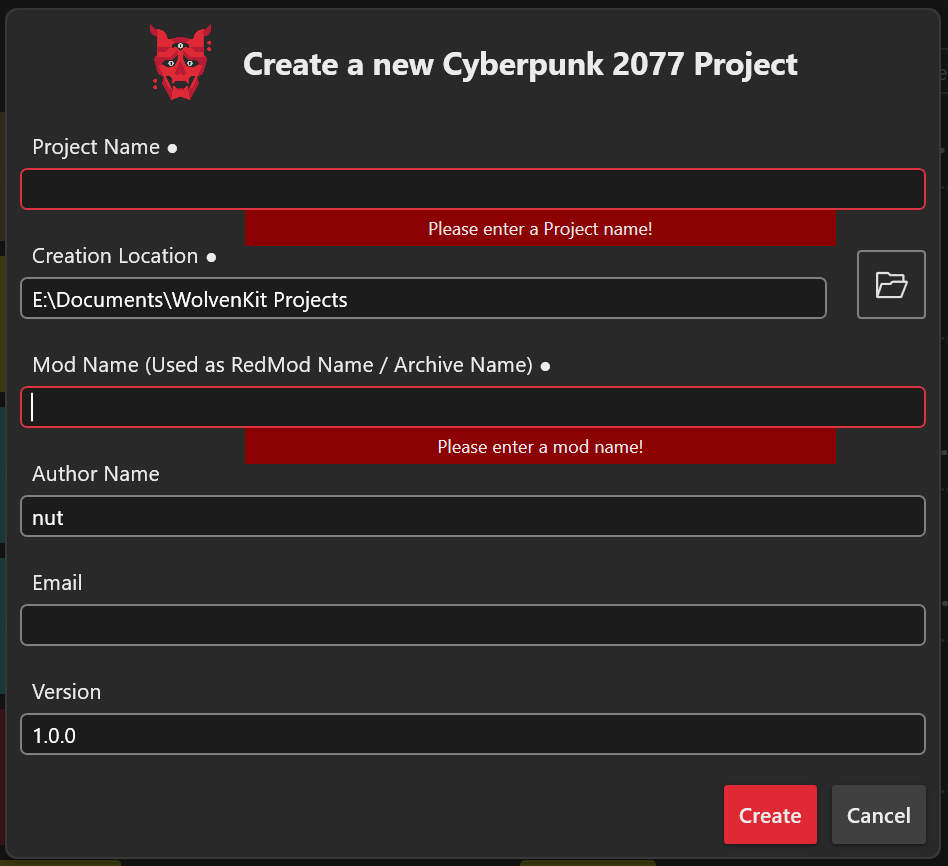
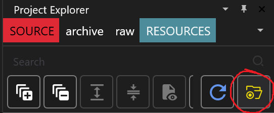
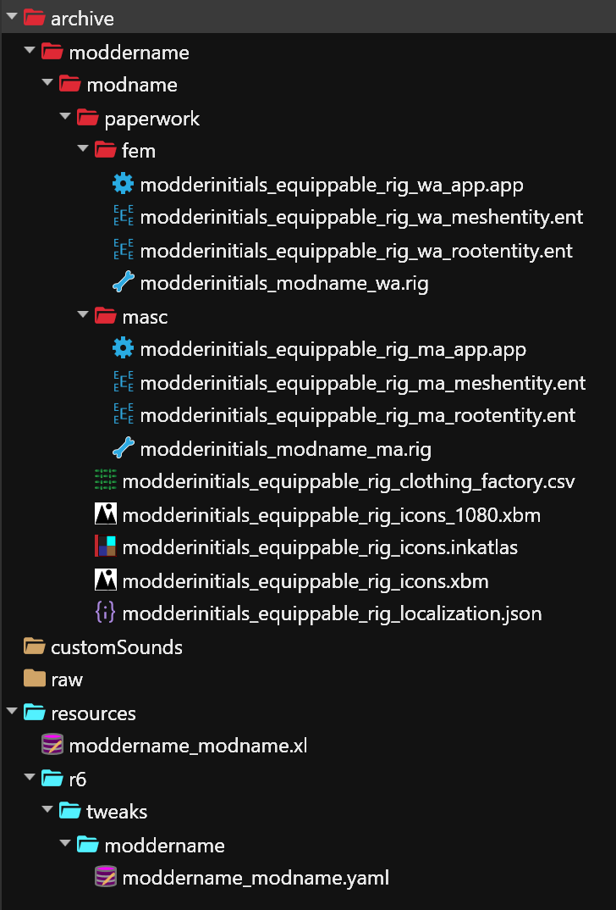
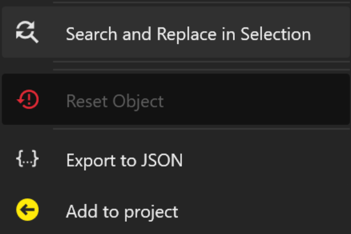

# For V - How to make equippable rig mods

## Summary:

**Published**: May 24 2026 by [nutboy](https://app.gitbook.com/u/y772Qw4Ul9cmqXiuTKkTpLxDVzQ2 "mention")\
**Last edited:** May 24 2026 by [nutboy](https://app.gitbook.com/u/y772Qw4Ul9cmqXiuTKkTpLxDVzQ2 "mention")

This tutorial will show you how to make a rig mod that is an equippable inventory item for player masc or fem V.&#x20;

A benefit of making a rig an equippable item is that you can have multiple installed at once.&#x20;

### **Wait, this is not what I want!**

* If you want to edit a rig [.](./ "mention")
* If you want to make an always-equipped rig for V or a specific NPC [for-v-or-npc-how-to-make-a-rig-mod.md](for-v-or-npc-how-to-make-a-rig-mod.md "mention")
* If you want to learn what a rig even does, check [armatures-.rig-files.md](../../../for-mod-creators-theory/files-and-what-they-do/file-formats/armatures-.rig-files.md "mention")

## Requirements:

* You made an edited .rig file using the [For V and NPC - Rig deforming](https://app.gitbook.com/o/-MP5ijqI11FeeX7c8-N8/s/4gzcGtLrr90pVjAWVdTc/~/edit/~/changes/2291/modding-guides/npcs/rig-deforming-for-v) tutorial.
* You have downloaded the [template project from Nexus](https://www.nexusmods.com/cyberpunk2077/mods/29957).

<table><thead><tr><th width="155">Mod / Tool</th><th width="232">Version</th><th>Links</th></tr></thead><tbody><tr><td>Wolvenkit</td><td>latest >= 8.17.1 Stable</td><td><a href="https://github.com/WolvenKit/WolvenKit-nightly-releases/releases">Nightly</a> | <a href="https://github.com/WolvenKit/Wolvenkit/releases">Stable</a> | <a href="https://app.gitbook.com/s/-MP_ozZVx2gRZUPXkd4r/getting-started/download">Install guide (wiki</a>)</td></tr><tr><td>ArchiveXL</td><td>latest</td><td><a href="https://www.nexusmods.com/cyberpunk2077/mods/4198">NexusMods</a></td></tr><tr><td>TweakXL</td><td>latest</td><td><a href="https://www.nexusmods.com/cyberpunk2077/mods/4197">NexusMods</a></td></tr><tr><td>EquipmentEX  (optional)</td><td>latest </td><td><a href="https://www.nexusmods.com/cyberpunk2077/mods/6945">NexusMods</a></td></tr></tbody></table>

## Step 0: Preparing your WolvenKit Project


This template is the same for both V and NPC rig mods.


Start by making a new project in WolvenKit. Name your project.&#x20;

I recommend using a format such as "moddername\_modname" or "modderinitials\_modname" to match the template's .xl file.

<figure><figcaption></figcaption></figure>

Open your new project's root folder by clicking the yellow folder button on the top right of the project explorer.&#x20;

<figure><figcaption></figcaption></figure>

In your computer's file explorer, unzip the template project. Open and drag the template files into your project. The template archive/resources folders will merge with the project folders.&#x20;

Go back to WKit. It will show the new files in the project explorer. If it does not, hit the blue refresh 🔄 button next to the yellow root folder button.&#x20;

Here's what the template project should look like:&#x20;

<figure><figcaption></figcaption></figure>

## Step 1: Replace template folder & file names


Check [this page](https://wiki.redmodding.org/cyberpunk-2077-modding/modding-guides/items-equipment/moving-and-renaming-in-existing-projects) on how to update file and folder paths inside the structure.


First, we need to replace all placeholders of "moddername" and "modderinitials" and "modname" in the project.


The entire template in a nutshell:

"**moddername**" — change this to YOUR NAME

"**modderinitials**" — change this to YOUR INITIALS\
(or a shortened version of your name, less than 3-4 letters ideally)

"**modname**" — change this to a UNIQUE NAME for your mod\
Do not use the same name for multiple mods.

Do this for file names and then open each file and do the same search and replace for all paths and names inside each file.&#x20;


Here are the full steps:

1. Locate the Archive section of your project explorer.
2. Select the first folder, then right click and click Rename (or press F2).
3. Change folder "moddername" to **YOUR OWN** modder name, and check the box "**update in project files**".
4. Change the next folder "modname" to **a unique project name** for this project, and check the box "**update in project files**"
5. WolvenKit's logs will print a list of places it updated the names.
6. Next, find the **Resources** folder in project explorer, at the bottom.
7. Rename the following:
   1. .xl and .yaml file - "`moddername_modname`" to the same as what you just named your project. make sure to update the folder name for the .yaml as well


**HELP!!! I goofed and didn't check the box to "update in project files!"**

Don't worry. Rename your folder back to the placeholder name and do **not** check the update in project files box. Then, rename it again to your new replacement name.

Remember to check the box this time before confirming.


#### If you are making a rig mod for **masc V**:

* Delete the **fem** folder from the project
* open the .yaml, CTRL+F and search "`_wa`". Replace all instances of "`_wa`" with "`_ma`", then save your .yaml

#### If you are making a rig mod for **fem V**:

* Delete the **masc** folder from the project.

## Step 2: Update renamed paths inside files 

#### The .xl and .yaml

Open your **.xl** file in your text editor of choice, such as Notepad++ or Visual Studio Pro.

In WolvenKit, copy the path to the clothing\_factory.csv file by hovering it and clicking the orange 🟧 button (or right click > "Copy relative path to game file").

Update the template clothing factory path in the .xl to your new clothing factory path. Save your .xl file.

Repeat for the localization.json file, copying and pasting it over the template localization.json path.

Next, open the **.yaml** file.&#x20;

CTRL+F all instances of "moddername" "modname" "modderinitials" and replace them with your details.

#### The archive project files

Next, open the first file in your project **fem** or **masc** folder. Right click the `RDTDataViewModel` header.

Select "Search and Replace in selection" and set the search for "modderinitials" and the replacement to **your initials**. Click Finish.&#x20;

Repeat the right click search and replace for all instances of "moddername" "modname" "modderinitials" and replace them with your details.

<figure><figcaption></figcaption></figure>

Save the file.&#x20;

Repeat this process for all other files in the project:

* the mesh .ent
* the root .ent
* the clothing factory.csv
* the localization.json
* the .inkatlas

### (optional) Install mod and test 

After renaming files, you should be able to install and test the mod as is on the player.\
Using the template rig that came with this project, you should be able to tell right away that it works, as your V's chest will have transformed horrifically.&#x20;

## Step 3: Add your .rig to the project  

Copy/paste or add your edited .rig file into your project if you don't already have one. Anywhere is fine, it doesn't have to be in the existing folders.&#x20;

Copy the path of the template .rig.

Delete the template .rig.&#x20;

Rename your new rig file, but highlight everything in the box including the folder names. Paste the path of the template rig and save.

Install mod and test.&#x20;

Your new rig should have successfully replaced the template one!&#x20;

## Step 4: Custom Icon(s)

Last step is updating the template icon. Using Wolvenkit's exporter, export the two .xbm files in the project. One is simply a smaller version of the main icon.

Edit the files it generated in the raw folder with a photo/design editor of your choice. Do **not** resize them.&#x20;

Save over these files.&#x20;

Import them back over the .xbm in WolvenKit.&#x20;


If you know how to use Wolvenkit's Inkatlas Generator, you can also use that.&#x20;

Just make sure you name your icon .png "equippable\_rig\_icon" before converting, and tell it to replace the existing .inkatlas


Install mod and test.&#x20;

If everything works as it should and you're seeing your rig equip properly in inventory, you can pack your mod and it's good to go!

## Troubleshooting

#### My icon is white! 

* Reimport your icons .xbms with compression settings set to `TCF_None`

#### My rig doesn't load when I equip my item / equipping makes my inventory character glitch for a long time then nothing happens!

* A path is wrong in your project or was not updated properly. Use WolvenKit's "Scan files for broken references" to check which paths need to be updated.&#x20;

#### I don't want the rig item to be in the left toes slot in EquipmentEx! 

* Change it to another slot by editing `placementSlots` section of the .yaml\
  There is a list of slot options [here on the EquipmentEX github](https://github.com/psiberx/cp2077-equipment-ex#outfit-slots)

