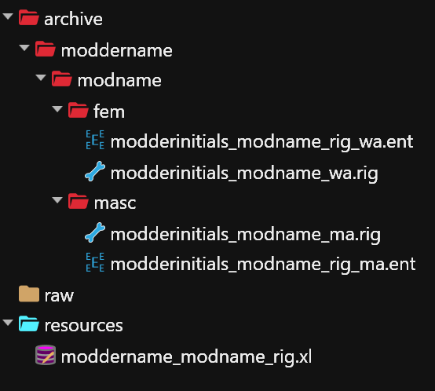
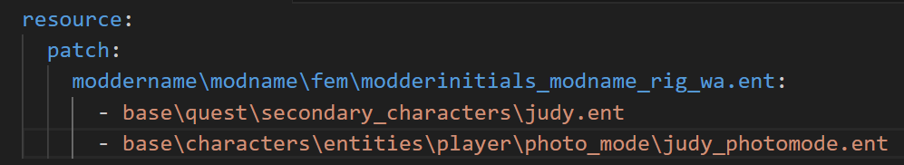

# For V or NPC - How to make a rig mod

## Summary:

**Published**: May 24 2026 by [nutboy](https://app.gitbook.com/u/y772Qw4Ul9cmqXiuTKkTpLxDVzQ2 "mention")\
**Last edited:** May 24 2026 by [nutboy](https://app.gitbook.com/u/y772Qw4Ul9cmqXiuTKkTpLxDVzQ2 "mention")

This tutorial will show you how to make a rig mod that changes player V's body and/or a specific NPC's body. Rigs can be used with or without body mods.&#x20;

This method uses ArchiveXL to patch the deformations component. It does not require load order management and is compatible with all other non-rig mods.&#x20;

### **Wait, this is not what I want!**

* If you want to edit a rig [.](./ "mention")
* If you want to learn what a rig even does, check [armatures-.rig-files.md](../../../for-mod-creators-theory/files-and-what-they-do/file-formats/armatures-.rig-files.md "mention")

## Requirements:

* You made an edited .rig file using the [For V and NPC - Rig deforming](https://app.gitbook.com/o/-MP5ijqI11FeeX7c8-N8/s/4gzcGtLrr90pVjAWVdTc/~/edit/~/changes/2291/modding-guides/npcs/rig-deforming-for-v) tutorial.
* You have downloaded the [template project from Nexus](https://www.nexusmods.com/cyberpunk2077/mods/29957).

<table><thead><tr><th width="155">Mod / Tool</th><th width="536.6666259765625">Version</th></tr></thead><tbody><tr><td>ArchiveXL</td><td><a href="https://www.nexusmods.com/cyberpunk2077/mods/4198">latest</a></td></tr><tr><td>Wolvenkit version</td><td>>= 8.17.1 <a href="https://github.com/WolvenKit/WolvenKit/releases/tag/8.15.0">stable</a> | <a href="https://github.com/WolvenKit/WolvenKit-nightly-releases/releases">nightly</a> (<a href="https://app.gitbook.com/s/-MP_ozZVx2gRZUPXkd4r/getting-started/download#downloading-wolvenkit">install guide</a>)</td></tr></tbody></table>

## Step 0: Preparing your WolvenKit Project


This template is the same for both V and NPC rig mods.


Start by making a new project in WolvenKit. Name your project.&#x20;

I recommend using a format such as "moddername\_modname" or "modderinitials\_modname" to match the template's .xl file.

<figure><figcaption></figcaption></figure>

Open your new project's root folder by clicking the yellow folder button on the top right of the project explorer.&#x20;

<figure><figcaption></figcaption></figure>

In your computer's file explorer, unzip the template project. Open and drag the template files into your project. The template archive/resources folders will merge with the project folders.&#x20;

Go back to WKit. It will show the new files in the project explorer. If it does not, hit the blue refresh 🔄 button next to the yellow root folder button.&#x20;

Here's what the template project should look like:&#x20;

<figure><figcaption></figcaption></figure>


For rig modders adding rigs to multiple NPC: I suggest making a separate/new project with this template for every NPC you want to apply a rig to, that way you can provide each NPC option as a separate download on your mod page.


## Step 1: Replace template folder & file names


Check [this page](https://wiki.redmodding.org/cyberpunk-2077-modding/modding-guides/items-equipment/moving-and-renaming-in-existing-projects) on how to update file and folder paths inside the structure.


First, we need to replace all placeholders of "moddername" and "modderinitials" and "modname" in the project.


The template in a nutshell:

"**moddername**" — change this to YOUR NAME

"**modderinitials**" — change this to YOUR INITIALS\
(or a shortened version of your name, less than 3-4 letters ideally)

"**modname**" — change this to a UNIQUE NAME for your mod\
Do not use the same name for multiple mods.


Here are the full steps:

Locate the Archive section of your project explorer.

Select the first folder, then right click and click Rename (or press F2).

Change folder "moddername" to **YOUR OWN** modder name, and check the box "**update in project files**".

Change the next folder "modname" to **a unique project name** for this project, and check the box "**update in project files**"

WolvenKit's logs will print a list of places it updated the names.

Next, find the **Resources** folder in project explorer, at the bottom.

Rename the following:

* .xl file - "`moddername_modname`" to the same as what you just named your project.


**HELP!!! I goofed and didn't check the box to "update in project files!"**

Don't worry. Rename your folder back to the placeholder name and do **not** check the update in project files box. Then, rename it again to your new replacement name.

Remember to check the box this time before confirming.


#### If you are making a rig mod for **masc V**:

* Delete the **fem** folder from the project
* Open the .xl, delete these lines:

```
    moddername\modname\fem\modderinitials_modname_rig_wa.ent:
      - player_wa.ent
```

* Save your .xl

#### If you are making a rig mod for **fem V**:

* Delete the **masc** folder from the project
* Open the .xl, delete these lines:&#x20;

```
    moddername\modname\masc\modderinitials_modname_rig_ma.ent:
      - player_ma.ent
```

* Save your .xl

On the line under `patch`, there is a path to the placeholder template ent. Delete this line, but keep the indents and colon `:` at the end of the line.

Copy and paste the relative path to your project's .ent file before the colon, making sure not to mess up the indenting or add any extra spaces.&#x20;

Save your .xl

### (optional) Install mod and test <a href="#step-2-update-renamed-paths-inside-files" id="step-2-update-renamed-paths-inside-files"></a>

After renaming files, you should be able to install and test the mod as is on the player.\
Using the template rig that came with this project, you should be able to tell right away that it works, as your V's chest will have transformed horrifically.&#x20;

## Step 2: Add your own .rig to the project  <a href="#step-2-update-renamed-paths-inside-files" id="step-2-update-renamed-paths-inside-files"></a>

Copy/paste or add your edited .rig file into your project if you don't already have one.&#x20;

Copy the full path of the template .rig.&#x20;

Delete the template .rig.&#x20;

Rename your rig file, but highlight everything in the box including the folder names. Paste the path of the template rig and save.

Install mod and test.&#x20;

Your new rig should have successfully replaced the template one, and you're done! You can pack your mod and share it.&#x20;

## (optional) Step 3: Applying the rig to a specific NPC by editing the .xl&#x20;

First, you need to find your character's .ent files. There is a resource here: [people](../../../for-mod-creators-theory/references-lists-and-overviews/people/ "mention")

Make sure you made edits to the correct body rig for the NPC. Male Big NPC for example would require you to edit the male big rig.&#x20;

Delete "`player_wa.ent`" or "`player_ma.ent`" from the .xl but preserve indents, dashes, and spaces on that line.

Copy and paste the .ent(s) of the character(s) you want to give the rig to after the `-`&#x20;

Only one .ent per line. Use a line break, matching indents, and dash for each .ent. Example below.&#x20;

If you want to give the rig to multiple NPC, or if your NPC has multiple .ent files, you must list each one.

<figure><figcaption><p>Example: we are giving Judy the rig and including her photomode .ent as well</p></figcaption></figure>

## (Legacy) Unique V Rig Framework

If you want to make your rig utilize the existing Unique V framework instead of using the template, you can simply use your custom rig file and add the base game animgraph file to your project.&#x20;

Rename both files to the following paths and pack the archive with only those two files.&#x20;

Masc V:

```
base\characters\base_entities\man_base\deformations_rigs\male_plr_deformations.rig
base\characters\base_entities\man_base\deformations_rigs\male_plr_deformations.animgraph
```

Fem V:

```
base\characters\base_entities\woman_base\deformations_rigs\female_plr_deformations.rig
base\characters\base_entities\woman_base\deformations_rigs\female_plr_deformations.animgraph
```

Remember to list the Unique V Framework Mod as a dependency on your mod page.&#x20;

## Troubleshooting

**My rig shows up, but it's not the rig I expected?**

* If your mod was originally for the unique V framework, make sure you **uninstall** the framework while testing.&#x20;
* Ensure you have no other rigs or rig mods installed.
* If the rig that shows up horribly morphs V's boobs, then you're using the rig that came with the project template. Replace this file with your own custom rig.&#x20;

**No rig shows up in game!**

* Go to Project > Scan for broken file references. If anything shows up, fix the path in that file.

**My rig doesn't work on an NPC in photomode!**&#x20;

* Some NPC have special .ents for Photomode. Find them in Wolvenkit's asset browser.&#x20;
