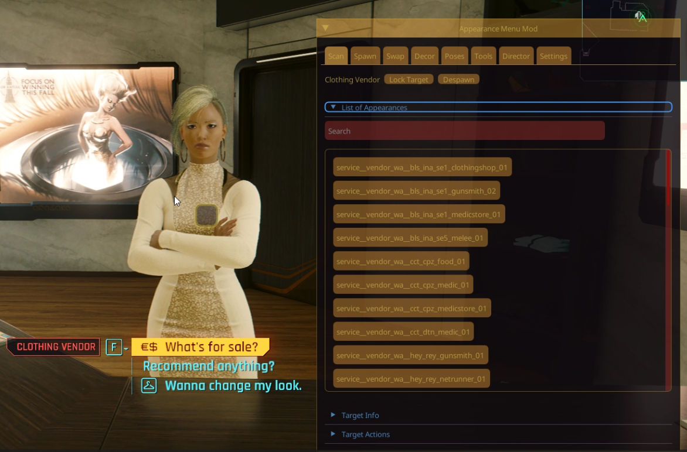
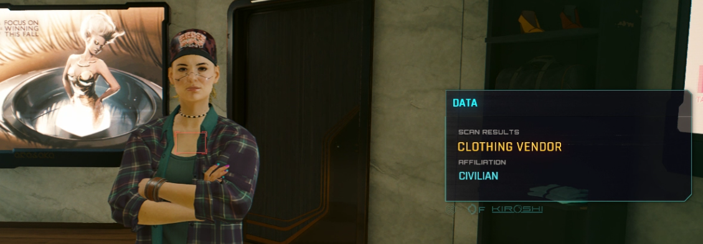
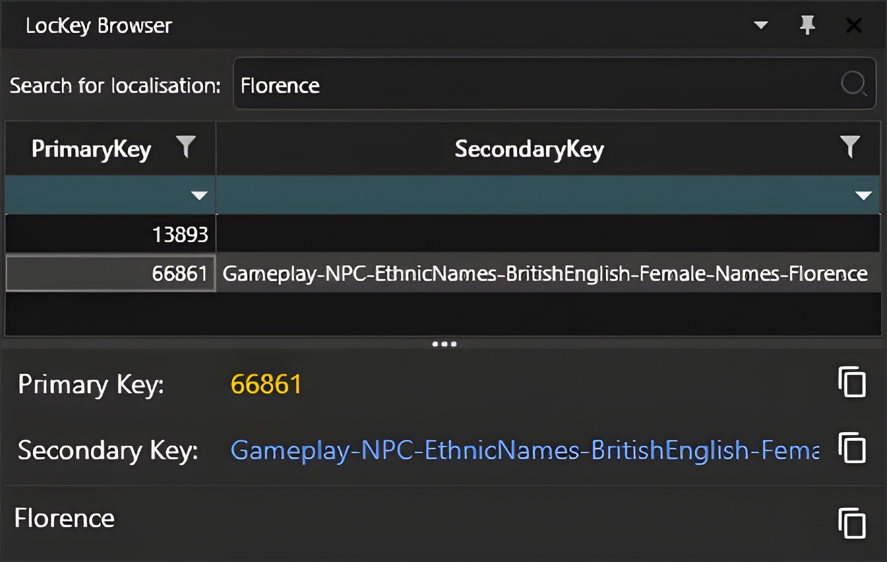
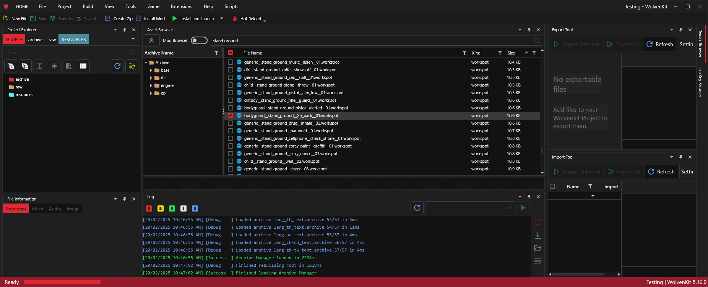
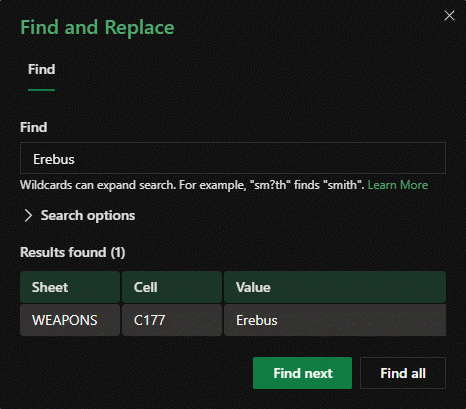
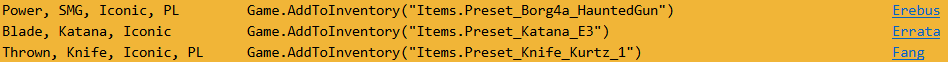
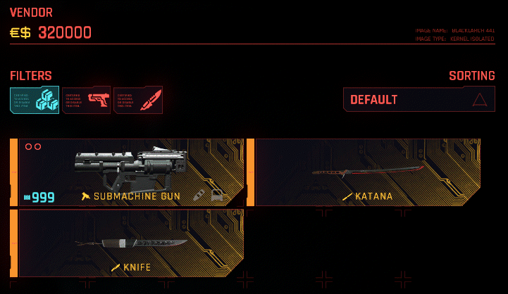
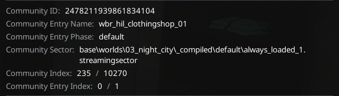

# VendorsXL: Custom Vendors

**Published:** February 2025 by [Florence](https://app.gitbook.com/u/4gvVbWNknqVssW8cldGav2LGi4W2 "mention")


Thank You to [manavortex](https://app.gitbook.com/u/NfZBoxGegfUqB33J9HXuCs6PVaC3 "mention") & [keanuWheeze](https://app.gitbook.com/u/WBUIHettvKP7ke8K6KFd7L9ZTtG2 "mention") for helping  me with this page.


## What is [VendorsXL](https://www.nexusmods.com/cyberpunk2077/mods/19679?tab=description)

[VendorsXL](https://www.nexusmods.com/cyberpunk2077/mods/19679?tab=description) is a mod by [<mark style="color:yellow;">deceptious</mark>](https://www.nexusmods.com/cyberpunk2077/users/4035601). It lets you create your own vendors in night city by altering or creating vendor entities .

**Custom vendors features:**

* _Customisable workspot - the animation/idle that the vendor has_
* _Customisable character/appearance - who the NPC is and what they look like_
* _Customisable vendor name - what they appear as when scanned and on their prompt_
* _Customisable stock - can either be a list of items (Vanilla or Modded), or a predefined Vendor._
* _Customisable position/rotation - where in the world the NPC will be found_
* _Customisable map/minimap icon - 8 icons to choose from_

### Requirements:

<table data-header-hidden data-full-width="false"><thead><tr><th width="130">Mods:</th><th width="469">Nexus Mods Link:</th></tr></thead><tbody><tr><td>TweakXL</td><td><a href="https://www.nexusmods.com/cyberpunk2077/mods/4197">https://www.nexusmods.com/cyberpunk2077/mods/4197</a></td></tr><tr><td>ArchiveXL</td><td><a href="https://www.nexusmods.com/cyberpunk2077/mods/4198">https://www.nexusmods.com/cyberpunk2077/mods/4198</a></td></tr><tr><td>RED4ext</td><td><a href="https://www.nexusmods.com/cyberpunk2077/mods/2380">https://www.nexusmods.com/cyberpunk2077/mods/2380</a></td></tr><tr><td>Codeware</td><td><a href="https://www.nexusmods.com/cyberpunk2077/mods/7780">https://www.nexusmods.com/cyberpunk2077/mods/7780</a></td></tr><tr><td>Redscript</td><td><a href="https://www.nexusmods.com/cyberpunk2077/mods/1511">https://www.nexusmods.com/cyberpunk2077/mods/1511</a></td></tr></tbody></table>

### **Introduction:**

Simply include with your mod a new tweak, based on the template, with a unique name and customised values This can even be included in existing .yaml files.

The name of the tweak must be unique, but all the other values can be shared (try not to put your vendors on top of each other, though...) Make sure your yaml file/folder is named such that it doesn't load before '##########VendorsXL' or your tweak won't load correctly.

Display Name can be any existing, or new, LocKey - but you would have to create the new LocKey yourself as part of your mod. Workspot can be any workspot, but it is your responsibility to pick one that your character/entity supports. It doesn't have to be standing, either. Entity and appearance can be any existing, or modded, entity and appearance - these values can be found in the same variables in existing Character records in the tweak database. (Mod is only assumed to work with humanoid characters, non humanoids may not work - I couldn't get base game Brendan to work...)

### **.YAML Template:**


```yaml
Character.<your unique atelier/mod/id name>:
  $base: Character.vendorsxl_base
  #Entity and appearance setup for your vendor/npc [default is the Kabuki Gun Vendor]:
  appearanceName: None
  entityTemplatePath: base\open_world\characters\vendors\wat_kab_gun_trainer_01.ent
  
  #Faction [default is Factions.Civilian]
  affiliation: Factions.Civilian
  
  #Naming [default is 'Vendor']:  
  displayName: LocKey#15525
  
  #Workspot file [default is standing using a tablet]:
  holocallInitializerPath: base\workspots\common\ground\generic__stand_ground_tablet__use__01.workspot
  
  #Location data [REQUIRED]
  bossHealthBarThresholds: [<x>, <y>, <z>, <i>, <j>, <k>, <r>]
    #Position data           x,   y,   z, 
    #and Rotation data (quaternions)        i,   j,   k ,  r
    #Example: [-1286.9, -1686.1, 44.2, 0.0, 0.0, -0.615, -0.787]
    #CET Command to get these values where V is standing:
    #   print(GetPlayer():GetWorldPosition()) print(GetPlayer():GetWorldOrientation())
  
  #Your vendors items, edit and expand:
  items:
    - Items.<first>
    - Items.<second>
    - Items.<third>
    #Example: - Items.CasualShoes_07_rich_02
  
  #Existing Vendor ID; change if you wish to use an existing game vendor inventory, NOT your own.
  #Do not edit if using custom stock/items above.
  vendorID: Vendors.vendorxl_custom
  
  #Mappin icon on maps, default: Clothing
  forcedTBHZOffset: 1
  # 0: No mappin /  hidden
  # 1: Clothing
  # 2: Guns
  # 3: Food
  # 4: Bar
  # 5: Melee
  # 6: Medical
  # 7: Junk
  # 8: Netrunner
  # 9: AutoFixer
```


## **Making Your Own NPC**

Creating your own entity & appearance can take more work than using existing ones from the game, however it is a great way to add uniqueness and personality to your mods.

Check out this template created by Manavortex: [Modders Resource - Custom NPC Template](https://www.nexusmods.com/cyberpunk2077/mods/11268)\
Other Resources: [Appearance: .app files](https://wiki.redmodding.org/cyberpunk-2077-modding/for-mod-creators-theory/files-and-what-they-do/appearance-.app-files) & [Appearances: change NPC looks](https://wiki.redmodding.org/cyberpunk-2077-modding/modding-guides/npcs/appearances-change-the-looks#the-.app-file)\
\
<mark style="color:yellow;">If using manavortex's template, you do not need to make the .ent specifically for AMM, but the concept is still the same & it will allow you to use your entity and appearances in the VendorsXL .YAML file.</mark>

Once you have completed editing in wolvenkit, make sure it is packed into an WolvenKit archive file.\
The "custom\_vendor.archive" then goes in to the `Cyberpunk 2077/archive/pc/mods folder.`

## Using An Existing NPC

To begin, you should have a text editor like Notepad++ or VSCode available on your computer.\
If you don't know what this is you can find options here: [Text Editor Software](https://www.google.com/search?q=Text+editor+Software)\
\
Now that you have your editor open, copy and paste the VendorXL template into it.

If you want to use an existing vendor, you will need to find out their entity path. To do this, I personally like to use [RedHotTools](https://github.com/psiberx/cp2077-red-hot-tools): World Inspector.



<mark style="color:yellow;">If you want to learn more about RedHotTools, you can find out more here:</mark> [RedHotTools Wiki](https://wiki.redmodding.org/cyberpunk-2077-modding/for-mod-creators-theory/modding-tools/redhottools)\
\
Once you have RedHotTools Installed, In Cyberpunk 2077 visit the location of whichever vendor you want to edit. (For this example I will be editing the vendor at Avante Clothing Store).\
\
Look directly at your chosen vendor (NPC) and open the [Cyber Engine Tweaks](https://wiki.redmodding.org/cyber-engine-tweaks) overlay.\
\
<mark style="color:yellow;">If its your first time using CET it should ask you to select a key-bind of your choice.</mark>

### entityTemplatePath:

With CET open, you should now see a tab on your screen called '[World Inspector](https://wiki.redmodding.org/cyberpunk-2077-modding/for-mod-creators-theory/modding-tools/redhottools/rht-the-world-inspector)', In the settings tab of World Inspector, I recommend changing the 'Targeting Mode' to Game Physics, this will make it easier for the tool to identify the vendor entity. You should be seeing something like this:

<figure><figcaption><p>Use the RHT World Editor to locate the .ent file</p></figcaption></figure>

Looking at the third block of text in the World Inspector, we can see the entity template. In your .yaml file replace the existing entity path "base\open\_world\characters\vendors\example\_vendor.ent" with your desired entity path. It should look like this:


```yaml
  entityTemplatePath: base\characters\entities\service\service__vendor_wa.ent
```


### appearanceName:

Choose an appearance, you can either use the current NPC appearance or you can choose an existing appearance from the entity, to view alternative appearances I recommend using  as it will allow you to preview the different appearances in your game.\
\
If you do not already have Appearance Menu Mod installed, you can download it on Nexus Mods.\
\
<mark style="color:yellow;">Links for all requirements can be found at the top of this page</mark>

Now that you have 'AMM' installed, launch your game & open it using the CET overlay.

Once again look directly at the NPC & you should see a list of appearances.

Cycle through the appearances and choose the one you want to use.

I will be using the first appearance on the list for this tutorial.

<figure><figcaption><p>Use the AMM overlay to select an appearance.</p></figcaption></figure>

Once you have decided on an appearance, you can now copy the appearanceName into your .yaml e.g.


```yaml
  appearanceName: service__vendor_wa__bls_ina_se1_clothingshop_01
```


### affiliation:

Deciding what affiliation we want our vendor to have, by default it is set to 'Civilian.'\
Affiliation is what is shown when scanning the NPC, e.g.

<figure><figcaption><p>Appearance Has Been Changed To 'service__vendor_wa__bls_ina_se1_clothingshop_01'</p></figcaption></figure>

<table data-header-hidden data-full-width="false"><thead><tr><th width="179"></th><th width="183"></th><th width="170"></th><th></th></tr></thead><tbody><tr><td><em><strong>Arasaka</strong></em></td><td><em><strong>KangTao</strong></em></td><td><em><strong>Militech</strong></em></td><td><em><strong>NCPD</strong></em></td></tr><tr><td><em><strong>TraumaTeam</strong></em></td><td><em><strong>NetWatch</strong></em></td><td><em><strong>Biotechnica</strong></em></td><td><em><strong>News54</strong></em></td></tr><tr><td><em><strong>Aldecaldos</strong></em></td><td><em><strong>Animals</strong></em></td><td><em><strong>Maelstrom</strong></em></td><td><em><strong>MaelstromAndroid</strong></em></td></tr><tr><td><em><strong>Scavengers</strong></em></td><td><em><strong>ScavengersAndroid</strong></em></td><td><em><strong>SixthStreet</strong></em></td><td><em><strong>SixthStreetAndroid</strong></em></td></tr><tr><td><em><strong>TheMox</strong></em></td><td><em><strong>TygerClaws</strong></em></td><td><em><strong>Valentinos</strong></em></td><td><em><strong>VoodooBoys</strong></em></td></tr><tr><td><em><strong>Wraiths</strong></em></td><td><em><strong>WraithsAndroid</strong></em></td><td><em><strong>Barghest</strong></em></td><td><em><strong>AfterlifeMercs</strong></em></td></tr><tr><td><em><strong>CityCouncil</strong></em></td><td><em><strong>SSI</strong></em></td><td><em><strong>Unknown</strong></em></td><td><em>R<strong>ecordingAgency</strong></em></td></tr><tr><td><em><strong>Unaffiliated</strong></em></td><td><em><strong>SouthCalifornia</strong></em></td><td><em><strong>UnaffiliatedCorpo</strong></em></td><td><em><strong>Zetatech</strong></em></td></tr><tr><td><em><strong>NUSA</strong></em></td><td><em><strong>Classified</strong></em></td><td><em><strong>OA</strong></em></td><td><em><strong>Corpbud</strong></em></td></tr><tr><td><em><strong>Crimson_Harvest</strong></em></td><td><em><strong>Private_Press</strong></em></td><td><em><strong>Growl</strong></em></td><td><em><strong>Highriders</strong></em></td></tr></tbody></table>

If you want to change your affiliation to something different, take a look at the list of available options. Now that you know your vendors new affiliation, make sure that it looks like this in the .yaml. For this example I will change the affiliation to Zetatech:


```yaml
  affiliation: Factions.Zetatech
```


### displayName:

By default the name will be 'Vendor' although you can change this by finding or creating a new [LocKey](https://wiki.redmodding.org/wolvenkit/wolvenkit-app/editor/lockey-browser).\
If you want to find an existing LocKey you can use the LocKey Browser in [WolvenKit](https://wiki.redmodding.org/wolvenkit) or alternatively you can choose one from this selection of LocKeys that I've prepared:



<details>

<summary>LocKey Names List</summary>

Doyle • 76916\
Stokes • 76915\
Fitzgerald • 76914\
Gross • 76913\
Tyler • 76912\
Gibbs • 76911\
Sandoval • 76910\
Estrada • 76909\
Lindsey • 76908\
Guerrero • 76907\
McCarthy • 76906\
Paul • 76905\
Osborne • 76904\
Floyd • 76903\
Honkler • 76902\
Pope • 76901\
Maxwell • 76900\
Blake • 76899\
Quinn • 76898\
Moody • 76897\
Cobb • 76896\
Flowers • 76895\
Hammond • 76894\
Malone • 76893\
Norman • 76892\
Webster • 76891\
Adkins • 76890\
Conner • 76889\
Rios • 76888\
Hodges • 76887\
Erickson • 76886\
Becker • 76885\
Yates • 76884\
Maldonado • 76883\
Darkholme • 76882\
Goodman • 76881\
Francis • 76880\
Joseph • 76879\
Swanson • 76878\
Patton • 76877\
Ortega • 76876\
Hampton • 76875\
Rowe • 76874\
Walton • 76873\
Goodwin • 76872\
Potter • 76871\
Townsend • 76870\
Strickland • 76869\
Cannon • 76868\
Reese • 76867\
Ingram • 76866\
Higgins • 76865\
Blair • 76864\
Todd • 76864\
Newton • 76862\
Robbins • 76861\
Rodgers • 76860\
Harmon • 76859\
Cohen • 76858\
Manning • 76857\
Glover • 76856\
Vega • 76855\
Aguilar • 76854\
Delgado • 76853\
Farmer • 76852\
McGee • 76851\
Dennis • 76850\
Thornton • 76849\
Moss • 76848\
Mack • 76847\
Mann • 76846\
Garner • 76845\
Cross • 76844\
Tate • 76843\
Santos • 76842\
Burgess • 76841\
Stevenson • 76840\
Warner • 76839\
Reeves • 76838\
Salazar • 76837\
Hubbard • 76836\
Valdez • 76835\
Griffith • 76834\
Baldwin • 76833\
Hines • 76832\
Cummings • 76831\
Barber • 76830\
Daniel • 76829\
Bowen • 76828\
Sharp • 76827\
Benson • 76826\
Mullins • 76825\
Schneider • 76824\
Wolfe • 76823\
Ramsey • 76822\
Lyons • 76821\
Walsh • 76820\
Leonard • 76819\
Weber • 76818\
Chandler • 76817\
Keller • 76816\
Ball • 76815\
Munoz • 76814\
Page • 76813\
Guzman • 76812\
Barker • 76811\
Schultz • 76810\
Powers • 76809\
Curry • 76808\
Steele • 76807\
Love • 76806\
Hardy • 76805\
Norris • 76804\
Santiago • 76803\
Dawson • 76802\
Parks • 76801\
Vaughn • 76800\
\
<mark style="color:yellow;">FYI: This list barely scratches the surface of names available in the LocKey browser.</mark>

</details>

If you want to use [WolvenKit](https://wiki.redmodding.org/wolvenkit) to find a LocKey open or create a new project then navigate to the 'View' tab and select LocKey Browser. Once open you can either scroll through the list of available LocKeys or you can use the search function to find something specific. For this example I will search for 'Florence',

<figure><figcaption></figcaption></figure>

<mark style="color:yellow;">If you are unable to find the name you want, there is always the option to create your own.</mark>

Now that I have found the name that I want to use "Florence" I will copy & paste the Primary Key "66861" into my .yaml file.


```yaml
  displayName: LocKey#66861
```


### holocallInitializerPath:

Deciding what pose you want your vendor to have, the pose is applied via .workspot, if you are unhappy with the default '.workspot' you can search in WolvenKit to find alternatives.\
\
Open a WolvenKit project and navigate to the Asset Browser, You can type different things to find '.workspots, some useful examples are, 'stand', 'lean', 'sit', 'kneel', 'dirt', 'ground' etc. \
\
For this example I found a workspot by searching 'stand ground':

<div data-full-width="true"><figure><figcaption><p>bodyguard__stand_ground__2h_back__01.workspot</p></figcaption></figure></div>

Once you've found a '.workspot' that sounds suitable,  update your .yaml with the '.workspot' path.\
For this tutorial we are going to use the default '.workspot' however you can change it for your vendor.\
\
&#xNAN;_<mark style="color:yellow;">You can get the '.workspot' path by right clicking the file in WolvenKit and clicking 'Copy Relative Path'</mark>_


```yaml
  holocallInitializerPath: base\workspots\common\ground\generic__stand_ground_tablet__use__01.workspot
```


### bossHealthBarThresholds:

This is arguably one of the most imprtant steps as this data provides the location for which your vendor will appear, any mistakes here could make it difficult to find your vendor, so make sure to accuratley record the location data.\
\
To record the location data of where you want your vendor to be, you will need to stand in the location & face the direction that you would want the vendor to be doing.\
\
<mark style="color:yellow;">If you are unable to access the location that you want your vendor to be in,</mark> [FreeFly (Noclip)](https://www.nexusmods.com/cyberpunk2077/mods/780) <mark style="color:yellow;">can help!</mark>

Open the CET overlay, open the console & paste this command prompt into the console:


print(GetPlayer():GetWorldPosition()) print(GetPlayer():GetWorldOrientation())


You should see a result that looks similar to this in the console:


```yaml
ToVector4{ x = -237.9411, y = -37.574867, z = 1.1647644, w = 1 }
ToQuaternion{ i = 0, j = 0, k = -0.6527144, r = 0.7576041 }
```


Now transfer this data from the console to your .yaml. Once completed it should look like this:


```yaml
  bossHealthBarThresholds: [237.9411, -37.574867, 1.1647644, 0, 0, -0.6527144, 0.7576041]
```


Note: x, y, and z are proper world coordinates for where our object will be placed.\
i = Entity rotation on relative y-axis (ranges from -0.999 to +1.000)\
j = Entity tilt on relative x-axis (ranges from -0.999 to +1.000)

### items:

Adding items to your vendors catalogue is simple, you just update the .yaml with an items Base ID.\
\
To find Base ID's for vanilla items you can refer to the [Equipment Databases](https://wiki.redmodding.org/cyberpunk-2077-modding/for-mod-creators-theory/references-lists-and-overviews/equipment/equipment-databases) page. For this tutorial I will be using the [Cyberpunk 2077 Item Hash List](https://onedrive.live.com/view.aspx?resid=EF6891140DE637B3%21221903\&authkey=!AE_n4RTzwmVHwy8) to find the items I want.




I have chosen to add 'Erebus', 'Errata' & 'Fang' to my vendors catalogue.\
\
Filter your search in the [Cyberpunk 2077 Item Hash List](https://onedrive.live.com/view.aspx?resid=EF6891140DE637B3%21221903\&authkey=!AE_n4RTzwmVHwy8) to find the items you're looking for.\
\
<mark style="color:yellow;">Keep in mind that there are tabs for different categories, so you may need to switch tabs.</mark>

<figure><figcaption></figcaption></figure>

<figure><figcaption><p>Press [Ctrl] + [F] in the <a href="https://onedrive.live.com/view.aspx?resid=EF6891140DE637B3%21221903&#x26;authkey=!AE_n4RTzwmVHwy8">Cyberpunk 2077 Item Hash List</a> to filter your search.</p></figcaption></figure>

<figure><figcaption><p>You only need to copy the text inside the quotation e.g. Items.Preset_Borg4a_HauntedGun</p></figcaption></figure>

Once you have found the item/s that you want, copy the BaseID's from the spreadsheet.

Updating the .yaml with the BaseID's should now look like this:


```yaml
  items:
    - Items.Preset_Borg4a_HauntedGun
    - Items.Preset_Katana_E3
    - Items.Preset_Knife_Kurtz_1
```


Once your .yaml is updated, the items will be availible in the vendors catalogue:

<figure><figcaption><p><mark style="color:yellow;">If you want to learn more about Spawn Codes (BaseIDs/Hashes)</mark> [<a href="https://wiki.redmodding.org/cyberpunk-2077-modding/for-mod-creators-theory/references-lists-and-overviews/equipment/spawn-codes-baseids-hashes"> Click Here</a> ]</p></figcaption></figure>

### vendorID:

Before starting the game to view the '.workspot' ( Appearance / Pose ), The VendorID needs to be updated as the .ent in this example is using an existing vendor & their inventory.\
\
&#xNAN;_<mark style="color:yellow;">If you are using a custom '.ent' you can skip this step.</mark>_\
\
To find a specific VendorID you can use cheat sheet made by [<mark style="color:yellow;">manavortex</mark>](https://next.nexusmods.com/profile/manavortex): [Cheat Sheet: Vendor ID's](https://wiki.redmodding.org/cyberpunk-2077-modding/for-mod-creators-theory/references-lists-and-overviews/cheat-sheet-tweak-ids/cheat-sheet-vendor-ids)\
Find out what location the vendor is from, you can either do this by looking at the map, or you can refer back to the World Inspector overview to see what district & area the vendor is from.\
\
In this example, we can see that the Avante Clothing Store vendor is located in Westbrook, _Charter Hill_

<figure><figcaption><p>Community Entry Name: wbr_hil_clothingshop_01</p></figcaption></figure>

Now that we know the location, refer to the [Vendor ID's](https://wiki.redmodding.org/cyberpunk-2077-modding/for-mod-creators-theory/references-lists-and-overviews/cheat-sheet-tweak-ids/cheat-sheet-vendor-ids) [Cheat Sheet](https://wiki.redmodding.org/cyberpunk-2077-modding/for-mod-creators-theory/references-lists-and-overviews/cheat-sheet-tweak-ids/cheat-sheet-vendor-ids) to confirm the Community Entry Name matches the VendorID, Once confirmed you can update the .yaml with the known VendorID:


```yaml
  vendorID: Vendors.wbr_hil_clothingshop_01
```


### forcedTBHZOffset:

The final step, and a simple one. You can now choose from 10 options as to how you'd like your vendor to appear on the world map. Currently the Icons available are limited to those used by existing vendors.




```
  # 0: No mappin /  hidden
  # 1: Clothing
  # 2: Guns
  # 3: Food
  # 4: Bar
  # 5: Melee
  # 6: Medical
  # 7: Junk
  # 8: Netrunner
  # 9: AutoFixer
```




Choose an Icon for your vendor and update the .yaml with the corresponding number. e.g.

```yaml
  forcedTBHZOffset: 5
```

***

<div align="center" data-full-width="true"><figure><figcaption><p><strong>✨ You're Finished! Congrats on creating your first custom vendor! ✨</strong></p></figcaption></figure></div>

***

### .YAML Example


```yaml
Character.Example_VendorsXL:
  $base: Character.vendorsxl_base
  #Entity and appearance setup for your vendor/npc [default is the Kabuki Gun Vendor]:
  appearanceName: service__vendor_wa__bls_ina_se1_clothingshop_01
  entityTemplatePath: base\characters\entities\service\service__vendor_wa.ent
  
  #Faction [default is Factions.Civilian]
  affiliation: Factions.Zetatech
  
  #Naming [default is 'Vendor']:  
  displayName: LocKey#66861
  
  #Workspot file [default is standing using a tablet]:
  holocallInitializerPath: base\workspots\common\ground\bodyguard__stand_ground__2h_back__01.workspot
  
  #Location data [REQUIRED]
  bossHealthBarThresholds: [-238.17978, -37.657776, 1.2408142, 0, 0, -0.65037763, 0.75961107]
    #Position data           x,   y,   z, 
    #and Rotation data (quaternions)        i,   j,   k ,  r
    #Example: [-1286.9, -1686.1, 44.2, 0.0, 0.0, -0.615, -0.787]
    #CET Command to get these values where V is standing:
    #   print(GetPlayer():GetWorldPosition()) print(GetPlayer():GetWorldOrientation())
  
  #Your vendors items, edit and expand:
  items:
    - Items.Preset_Borg4a_HauntedGun
    - Items.Preset_Katana_E3
    - Items.Preset_Knife_Kurtz_1
    #Example: - Items.CasualShoes_07_rich_02
  
  #Existing Vendor ID; change if you wish to use an existing game vendor inventory, NOT your own.
  #Do not edit if using custom stock/items above.
  vendorID: Vendors.vendorxl_custom
  
  #Mappin icon on maps, default: Clothing
  forcedTBHZOffset: 5
  # 0: No mappin /  hidden
  # 1: Clothing
  # 2: Guns
  # 3: Food
  # 4: Bar
  # 5: Melee
  # 6: Medical
  # 7: Junk
  # 8: Netrunner
  # 9: AutoFixer
```

