# Creating custom shards

## Summary

Created: Apr 17 2025 by Bill\
Last documented update: Sep 16 2025 by [curricle](https://app.gitbook.com/u/9ssJJTOr5xYZWLvY6yE8CLtoKmw1)

This page will teach you how to create custom shards for Cyberpunk 2077 using [WolvenKit](../../for-mod-creators-theory/modding-tools/wolvenkit.md) and [World Builder](../world-editing/object-spawner/).

## Requirements

* [WolvenKit](../../for-mod-creators-theory/modding-tools/wolvenkit.md)
* [Cyber Engine Tweaks](https://app.gitbook.com/s/-MP5jWcLZLbbbzO-_ua1-887967055/)
* [World Builder](../world-editing/object-spawner/)
* [Hot Reload](../../for-mod-creators-theory/modding-tools/redhottools/rht-hot-reload.md) (optional)
* A text editor

## Video tutorial:



_The following is a write-up of the steps taken in the video above, with a little bit of extra information thrown in._

## 0. Creating a new WolvenKit project

You should probably know how to do this already. If you want to familiarize yourself with WolvenKit before jumping in, check out the [documentation](../../for-mod-creators-theory/modding-tools/wolvenkit.md).

## 1. Setting up the project folder structure

The final project structure will wind up looking like the following:

<figure>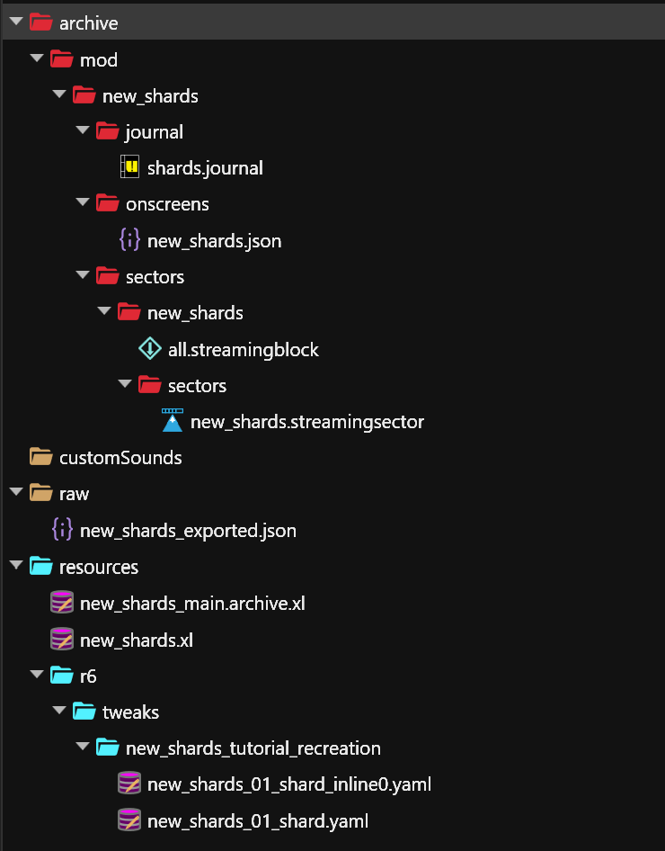<figcaption></figcaption></figure>

For now, though, we're going to start with these folders:

* `archive`
  * `mod`
    * `new_shards`
      * `journal`
      * `onscreens`
      * `sectors`

## 2. Creating `shards.journal`

In the `journal` folder, create a new gameJournalResource file and name it `shards.journal`. You can find the gameJournalResource file type quickly by typing it into the filter search while the CR2W files category is selected.

Next, we're going to populate `shards.journal`. To do this correctly, select each subsequent _entry/entries_ and click the plus sign next to the last item in the window on the right (sometimes this is the second item, sometimes there is only one item shown so it's the first).

<figure>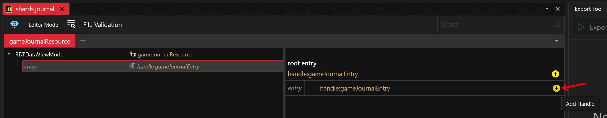<figcaption><p>Where to click</p></figcaption></figure>

For most of these entries, we're just going to be changing the _id_. Each id is listed next to the corresponding entries below.

### `shards.journal` layout:

RDTDataViewModel

* gameJournalRootFolderEntry
  * gameJournalPrimaryFolderEntry (_id:_ onscreens)
    * gameJournalFolderEntry (_id:_ emails)
      * gameJournalFolderEntry (_id:_ quests)
        * gameJournalFolderEntry (_id:_ minor\_quest)&#x20;
          * gameJournalFolderEntry (_id:_ new\_shards)&#x20;
            * gameJournalOnscreenGroup (_id:_ shards)&#x20;
              * gameJournalOnscreen (_description:_ Value: LocKey#9999999999999999998, _id_: 01\_shard, _tag:_ articles, _title:_ Value: LocKey#9999999999999999999)

That's a lot of nesting, so summarize, you should add the following to `shards.journal`:

* 1 root folder entry
* 1 primary folder entry
* 4 folder entries
* 1 onscreen group
* 1 onscreen

As you can see, the final gameJournalOnscreen entry has a few more custom values:

| key         | value                    |
| ----------- | ------------------------ |
| description | LocKey#99999999999999998 |
| id          | 01\_shard                |
| tag         | articles                 |
| title       | LocKey#99999999999999999 |

<details>

<summary>What do these values mean?</summary>

You can think of a `.journal` file like a directory. The actual content of your shard doesn't go here (we'll get to that in the next step); instead, references to the content of your shard go here. The LocKey is essentially a look-up value that we'll be using to point to a specific piece of text that lives elsewhere. In our case, it's super long so that there's no chance we're accidentally using a value that already exists in the game.

Primary LocKeys are numerical, while secondary LocKeys can contain other characters.


To look up existing LocKeys and for a more technical explanation of what they are, check out [this page on the WolvenKit wiki](https://wiki.redmodding.org/wolvenkit/wolvenkit-app/editor/lockey-browser).


We'll be using the _id_ here to refer to _this specific shard_, which shouldn't come as a surprise, and the _tag_ will be used to categorize the shard. These are the preexisting tags in the base game:

* world
* poetry
* notes
* literature\_fiction
* philosophy\_religion
* others
* technology
* night\_city\_people
* articles
* leaflets

Shards are grouped by these tags in your journal.

<figure><figcaption><p>See: tags as category folders on the left</p></figcaption></figure>

</details>


Remember to save after editing your files!


## 3. Creating `new_shards.json`

Now we're going to add the actual content of your shard.

First, create a new JsonResource file called `new_shards.json` in the `onscreens` folder. Like the gameJournalResource file type, you can find the JsonResource file type by searching for it.

Next, we're going to populate `new_shards.json`.

### `new_shards.json` layout:

RDTDataViewModel

* root
  * entries
    * localizationPersistenceOnScreenEntry
    * localizationPersistenceOnScreenEntry

Click on _root_ and add **localizationPersistenceOnScreenEntries**. Then click the plus sign to create an entry.

Click on _entries_ and add the following values to the first entry:

| key           | value             |
| ------------- | ----------------- |
| femaleVariant | Shard Title       |
| primaryKey    | 99999999999999999 |
| secondaryKey  | 01\_shard\_title  |

Right click the entry 0 and select 'duplicate in array buffer.' Change the values of this new item in the array to the following:

| key           | value                  |
| ------------- | ---------------------- |
| femaleVariant | Shard Description      |
| primaryKey    | 99999999999999998      |
| secondaryKey  | 01\_shard\_description |


We're adding values to _femaleVariant_ because it's the default key used in the game's code. There's no need to duplicate information for _maleVariant_ — but if you want different text to appear for each V, then fill both out.


<figure>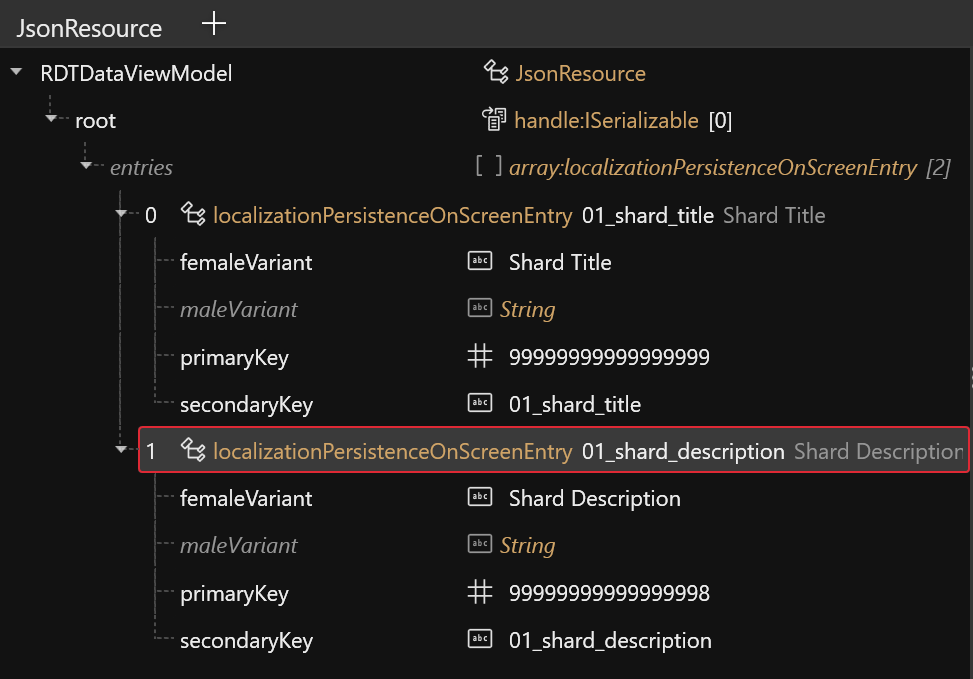<figcaption><p>What it should look like after doing the above</p></figcaption></figure>


"Shard Title" and "Shard Description" are just example placeholders. You can and should change those to whatever you want — this is the text that's going to be displayed in-game!

Check out [How to Translate a Mod](../everything-else/how-to-translate-a-mod.md) to see some ways you can format text.


## 4. Spawning a shard case and adding it to the project

Now, we're going to use World Builder to spawn our shard case. For detailed information on how to use World Builder, [check out the guide on the wiki](../world-editing/object-spawner/quick-start.md).

Open up Cyberpunk 2077 and spawn a `shard_case_container.ent`. The correct one is the one that glows in the preview.

<figure>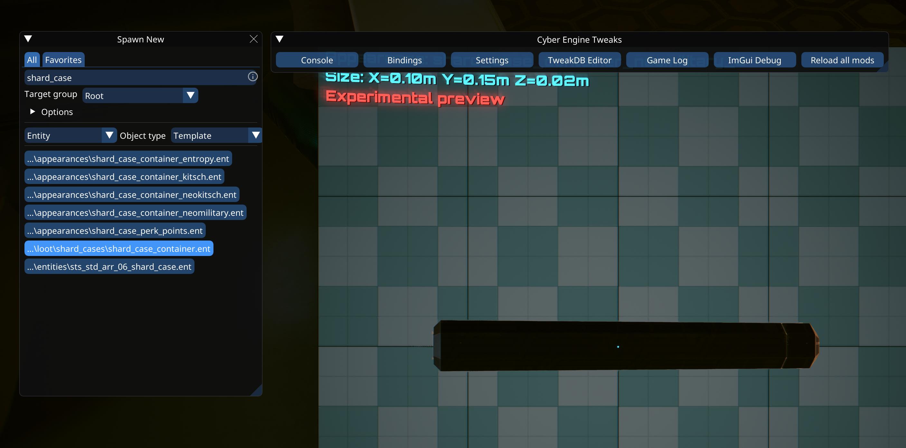<figcaption><p>You can kind of see the glow at the edge of the shard case in this screencap. It's much more obvious in motion.</p></figcaption></figure>

Position the shard case where you like, and then add it to a group called `new_shards`. You can change the appearance of the shard under 'Entity Template.'&#x20;

<figure><figcaption></figcaption></figure>

Save the group by pressing the floppy disk icon across from its name. Switch over to the Saved tab and find the group, expand it, and click Add to Export. Then, under the Export tab, type `new_shards` into the Project Name field. Finally, hit export.

<figure>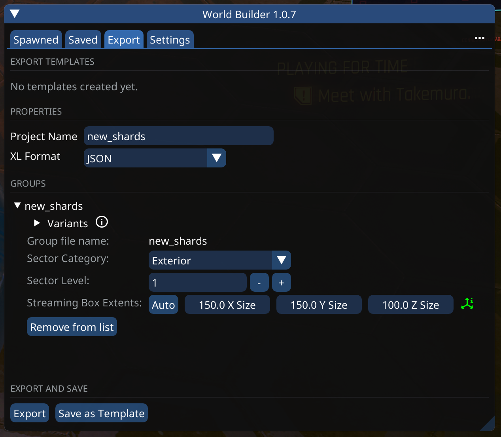<figcaption></figcaption></figure>

Now, we're going to take the exported `.json` file and add it to our WolvenKit project's `raw` folder. It should be in your game's base folder under `bin/64x/plugins/cyber_engine_tweaks/mods/entSpawner/export`. The file should be called `new_shards_exported.json`.

Back in WolvenKit, go to **Tools** -> **Script manager**. Delete import\_object\_spawner under User if it's there. Then double click import\_object\_spawner under System (do not press the green arrow) and click yes to make a local copy, which will then open in the WolvenKit editor.&#x20;

In this script, change the `const inputFilePathInRawFolder` value to `new_shards_exported.json` and then click run.&#x20;

<figure>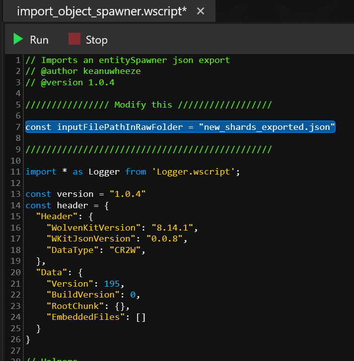<figcaption></figcaption></figure>

This will generate a folder called `new_shards` that contains `all.streamingBlock` and a `sectors` subfolder. Finally, move the above `new_shards` folder into `archive/mod/new_shards/sectors`.

<figure><figcaption><p>What the project folder structure should look like at this stage</p></figcaption></figure>

## 5. Linking up the spawned shard case

Copy the data path of the `shards.streamingsector` by either right clicking on it and selecting 'Copy relative path to game file' or clicking the orange button next to its name. Double click `all.streamingblock` to open it and find the _descriptors_ field. Select the first entry and the value of the _data_ DepotPath field to the path you just copied.&#x20;

Now, double click `new_shards.xl` in your resources folder. This will open up the file in your default text editor. Change the _blocks_ path to the **relative path of `all.streamingblock.`**&#x20;

### `new_shards.xl` contents:

```
streaming:
  blocks:
    - mod\new_shards\sectors\new_shards\all.streamingblock
```

Back in WolvenKit, double click `new_shards.streamingsector` to open it up. Select the first entry under _nodes_ and change the _debugName_ to 01\_shard\_case.&#x20;

Now find _instanceData_ in this same entry. Click the plus sign and add entEntityInstanceData. Expand _instanceData_, select _buffer_, and add ShardCaseContainer.

Finally, change the value of the _itemTDBID_ field in ShardCaseContainer to `Items.new_shards_01_shard`.

<figure>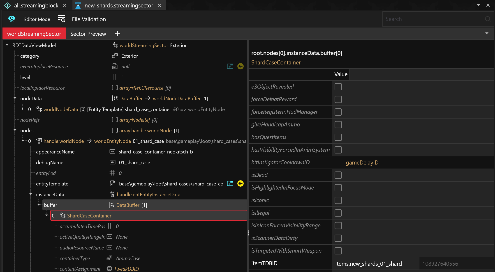<figcaption><p>What <code>new_shards.streamingsector</code> should look like after the above</p></figcaption></figure>

## 6. Creating new `.yaml` files

Create a new TweakXL file and call it `new_shards_01_shard`. The TweakXL file type is listed under the TweakDB category. The resulting file path will be `r6\tweaks\new_shards\new_shards_01_shard.yaml`.&#x20;

Add the following to `new_shards_01_shard.yaml`:

### `new_shards_01_shard.yaml` file contents:

```yaml
Items.new_shards_01_shard:
  $type: gamedataItem_Record
  animFeatureName: ItemData
  animName: ui_garment_pose
  animSetResource: ""
  canDrop: True
  crosshair: Crosshairs.None
  deprecated: False
  dropObject: defaultItemDrop
  enableNpcRPGData: False
  friendlyName: ""
  garmentOffset: 0
  icon: UIIcon.ItemIcon
  iconPath: ""
  isCached: False
  isCoreCW: False
  isCustomizable: False
  isGarment: False
  isPart: False
  isSingleInstance: True
  itemCategory: ItemCategory.General
  itemSecondaryAction: Items.new_shards_01_shard_inline0
  itemType: ItemType.Gen_Readable
  localizedName: ""
  mass: 1
  minigameInstance: minigame_v2.DefaultItemMinigame
  powerLevelDeterminedByParent: False
  quality: Quality.Common
  qualityRestrictedByParent: False
  replicateWhenNotActive: False
  upgradeCostMult: 1
  useHeadgearGarmentAggregator: False
  useNewSpawnMethod: False
  usesVariants: False
  savable: False
  animationParameters: []
  appearanceSuffixes: []
  appearanceSuffixesOwnerOverride: []
  attachmentSlots: []
  buyPrice:
    - Price.BasePrice
    - Price.BuyMultiplier
    - Price.ItemQualityMultiplier
    - Price.BuyPrice_StreetCred_Discount
    - Price.Junk
  cameraForward: { x: 0, y: 0, z: 0 }
  cameraUp: { x: 0, y: 0, z: 0 }
  connections: []
  equipAreas: []
  equipPrereqs: []
  gameplayRestrictions:
    - GameplayRestriction.VehicleCombatNoInterruptions
  hairSkinnedMeshComponents: []
  OnAttach: []
  OnEquip: []
  OnLooted: []
  parts: []
  placementSlots: []
  previewBBoxOverride: []
  requiredSlots: []
  sellPrice:
    - Price.BasePrice
    - Price.SellMultiplier
    - Price.ItemQualitySellMultiplier
    - Price.CraftingTraitMultiplier
    - Price.SellPriceIntrinsicModMult
    - Price.Junk
  slotPartList: []
  slotPartListPreset: []
  tags:
    - Readable
    - Shard
    - SkipActivityLog
    - HideInBackpackUI
    - HideAtVendor
  variants: []
  visualTags: []
  effectors: []
  objectActions:
    - ItemAction.Drop
    - ItemAction.Disassemble
  statModifierGroups: []
  statModifiers: []
  statPools: []
  weakspots: []
```

Next, create a new TweakXL file and call it `new_shards_01_shard_inline0`. The resulting file path will be `r6\tweaks\new_shards\new_shards_01_shard_inline0.yaml`.

Add the following to `new_shards_01_shard_inline0.yaml`:

### `new_shards_01_shard_inline0.yaml` file contents:

```yaml
Items.new_shards_01_shard_inline0:
  $type: gamedataItemAction_Record
  isDefaultLootChoice: False
  removeAfterUse: True
  actionName: Read
  hackCategory: HackCategory.NotAHack
  objectActionType: ObjectActionType.Item
  priority: 0
  activationTime: []
  completionEffects: []
  costs: []
  durationTime: []
  instigatorActivePrereqs: []
  instigatorPrereqs: []
  interruptionPrereqs: []
  rewards: []
  startEffects: []
  targetActivePrereqs: []
  targetPrereqs: []
  journalEntry: onscreens/emails/quests/minor_quest/new_shards/shards/01_shard
```


Double check to make sure that the path listed as the value for _journalEntry_ is correct and that the spelling of all your files, folders, and key values are consistent throughout.


## 7. Creating `new_shards_main.archive.xl`

Create a new ArchiveXL file, which can be found under the ArchiveXL category. Name it `new_shards_main.archive.xl`. Double click it to open it in your text editor and add the following:

### `new_shards_main.archive.xl` file contents:

```
journal:
  - mod\new_shards\journal\shards.journal
localization:
  onscreens:
    en-us: mod\new_shards\onscreens\new_shards.json
```

## 8. Install the mod and check for errors

Make sure all your files have been saved and install the mod by clicking the Install button in the toolbar. If you have Hot Reload, click that, too.

<figure>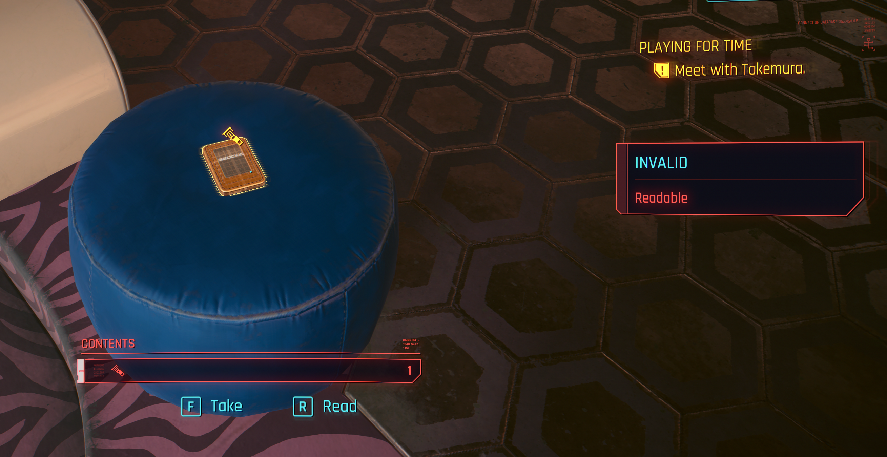<figcaption></figcaption></figure>

Back in the game, if you approach your shard and get something that looks like the above, there might be an issue with your LocKey values. One way to solve this is by leaving your `new_shards.json` entries' primaryKeys as 0, and instead, using the secondaryKeys to link the information.

<figure>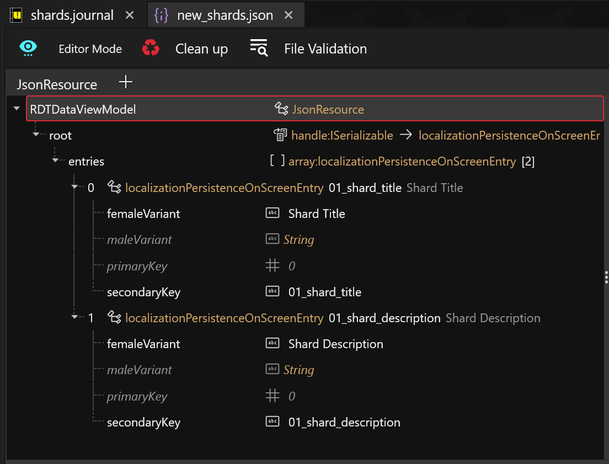<figcaption><p>The updated <code>new_shards.json</code> entries</p></figcaption></figure>

<figure>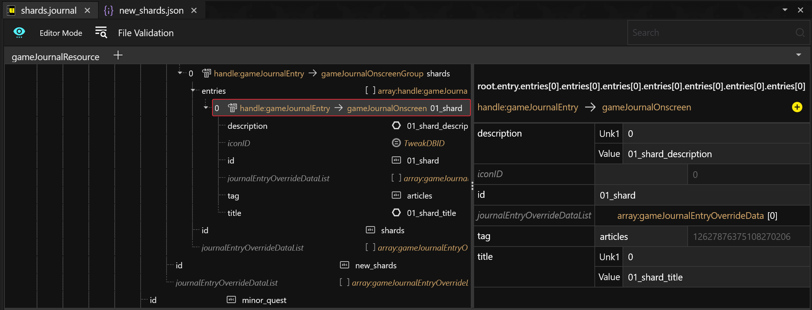<figcaption><p>The updated <code>shards.journal</code> entry</p></figcaption></figure>

Once you make the above changes, you should be met with this:

<figure><figcaption></figcaption></figure>

<figure>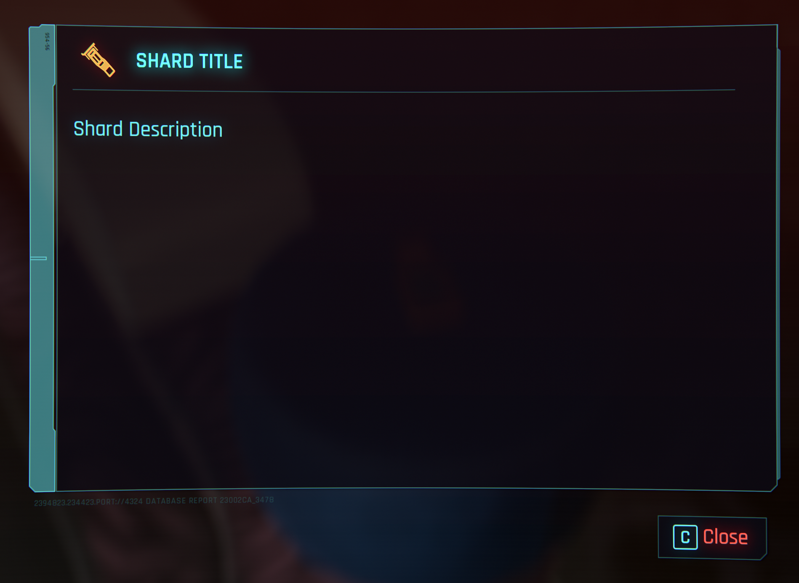<figcaption><p>Reading the shard</p></figcaption></figure>

<figure><figcaption><p>The shard in your journal</p></figcaption></figure>

Congrats! You've successfully added a shard to the game.
