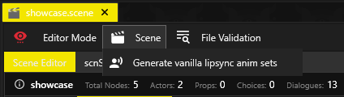

# Generating vanilla lipsync animation sets

## Summary

**Created:** Sep 14 2026 by [Akiway](https://github.com/Akiway)\
**Last documented update:** Sep 14 2026 by [Akiway](https://github.com/Akiway)

This guide explains how to use WolvenKit's Scene Editor to generate the files that make vanilla facial lipsync work in a custom `.scene`.

The tool copies matching lipsync animations from the game into your project, creates or updates a `.lipmap` for each installed voice-over language where it finds them, registers the lipmaps through ArchiveXL, and connects the generated animation sets to the scene actors.

#### Wait, this is not what I want!

* To add custom recorded audio to a scene, see [adding-a-custom-voiceline-to-a-scene.md](adding-a-custom-voiceline-to-a-scene.md "mention").
* To connect animation sets to scene actors manually, see [adding-animations.md](adding-animations.md "mention").
* For lipsyncs combined with custom audio, see [Audioware's guide](https://cyb3rpsych0s1s.github.io/audioware/SCENE_DIALOG_LINES.html).


This tool **does not create facial animation from a custom audio file**. It copies facial animations that already exist in the installed base-game voice-over data. A dialogue line must therefore name an existing vanilla lipsync animation.


### Requirements

#### Tools :&#x20;

* WolvenKit Nightly 9.0.2-nightly.2026-09-09 or newer

#### You need :

* A project with a `.scene` .
* At least one base-game voice-over language installed.
* ArchiveXL installed when you test the mod in game.

The scene must also contain correctly configured dialogue lines and actors. For each NPC voice that needs lipsync :

* The speaker must be present in the scene's `actors` array.
* The actor's `voicetagId` must identify the vanilla character whose recorded dialogue is being used.
* The dialogue line's `speaker` must point to that actor's ID.
* The line needs a non-zero `locstringId.Ruid`, or its `femaleLipsyncAnimationName` and `maleLipsyncAnimationName` must already be set.

***

## Before generating


**V has no lipsync.** So nothing will be generated for the player.

Lines spoken by entries in `playerActors` are ignored. The generator handles NPC actors from the `actors` array.



The generator replaces `resouresReferences.lipsyncAnimSets` and recalculates every actor's `lipsyncAnimSet` assignment. Any lipsync animation sets connected to the scene before generation are removed from that list.


For dialogue lines without animation names, WolvenKit derives both names from the line's locstring RUID:

```
f_<16-digit hexadecimal RUID>
m_<16-digit hexadecimal RUID>
```

Names already present in the scene are preserved.


#### How to find lipsync animation names ?

You can find them using [SoundDB](https://sounddb.redmodding.org/) or the [Dialogue Browser](https://www.nexusmods.com/profile/Akiway/mods) mod.


## Generate the lipsync files

1. Open the project and then open the `.scene` from the **Project Explorer**.
2. Check the actor, voicetag, speaker, and locstring values described under Requirements.
3.  In the scene document's menu bar, select **Scene > Generate vanilla lipsync anim sets**.<br>

    <figure><figcaption></figcaption></figure>
4. Wait for the operation to finish. WolvenKit loads the game archives if necessary and searches every installed voice-over language. A large search can take a couple of minutes.
5. Read the **Log** panel. It reports every generated file and warns about lines for which no compatible animation was found.
6.  **Save the `.scene`.** The generated project files are written immediately, but the new animation names and scene references are not kept until the scene is saved.<br>

    <figure><figcaption></figcaption></figure>
7. Build and install the project as usual.

### Generated files and scene changes

When no suitable project file exists yet, WolvenKit uses these paths:

<table><thead><tr><th width="251">Item</th><th>Default path or change</th></tr></thead><tbody><tr><td>Actor animation set</td><td><code>archive\mod\&#x3C;project>\localization\&#x3C;language>\lipsync\&#x3C;scene>\&#x3C;actor>.anims</code></td></tr><tr><td>Language lipmap</td><td><code>archive\mod\&#x3C;project>\localization\&#x3C;language>\&#x3C;project>.lipmap</code></td></tr><tr><td>ArchiveXL registration</td><td><code>resources\&#x3C;project>_lipsync.archive.xl</code></td></tr><tr><td>Open scene</td><td>Updates <code>resouresReferences.lipsyncAnimSets</code> and each NPC actor's <code>lipsyncAnimSet</code> ID</td></tr></tbody></table>

There is up to one generated `.anims` per speaking voicetag and language. The file name comes from the actor name; WolvenKit adds the voicetag hash if it needs to avoid a duplicate name.

The generated ArchiveXL file registers each language's lipmap. Its content follows this structure:

```yaml
localization:
  lipmaps:
    en-us: mod\MyProject\localization\en-us\MyProject.lipmap
    fr-fr: mod\MyProject\localization\fr-fr\MyProject.lipmap
```

If the project already has a lipmap for a language, WolvenKit reuses it. If an existing `.xl` file already registers that lipmap, the generator does not add a duplicate registration.

The scene directly references the `en-us` animation sets when English voice-over data is installed. Otherwise, it uses the first available generated language. ArchiveXL and the language-specific lipmaps select the localized sets in game.

### How the lookup works

For each installed voice-over language, WolvenKit:

1. Groups the scene's NPC dialogue lines by actor voicetag.
2. Reuses matching animations that were generated earlier.
3. Searches the vanilla animation sets registered for the actor's voicetag.
4. Searches animation sets registered under other voicetags for any lines still missing.
5. Copies compatible animations into the project and updates the language's lipmap entry for the scene.

WolvenKit logs a warning when it finds an animation under another voicetag. Check the actor's `voicetagId` in that case: facial animation recorded for another character may not fit the actor's face.

### Regenerating after scene changes

You can run the command again after adding or removing dialogue. Existing `.anims` and `.lipmap` data are reused, which makes later runs faster.


The generator does not delete old `.anims` files that are no longer needed (for example after removing an actor or renaming the scene). Check the generated folders and remove obsolete files manually.


***

## Troubleshooting


## A warning says an actor has a wrong voiceTagId

If you have no idea of what voiceTag you've set for your actor, or you picked it randomly, it means the generator found the right one for you.

⇒ In the warning message, you can copy the voiceTagId suggested, and paste it into your actor definition, inside the scene.



#### No lipsync anim set was generated

Check the Log panel. The most common causes are:

* The dialogue line is not assigned to an NPC in the `actors` array.
* The actor has no `voicetagId`.
* The line has neither a usable locstring RUID nor existing lipsync animation names.
* The named animation does not exist in the installed vanilla voice-over data.
* The animation uses a buffer format that WolvenKit cannot copy yet.



## Nothing has been generated for V

The player has no lipsync, so generating them is pointless.



#### The game archives could not be loaded

⇒ Check the Cyberpunk 2077 executable path in WolvenKit's settings. If archive loading is already in progress, wait for it to finish and run the command again.



#### No base-game lipmap was found

⇒ Install at least one Cyberpunk 2077 voice-over language, then restart WolvenKit so it can load that language's archives.



## The scene has no `lipsyncAnimSets` after generation

⇒ You need to save the scene after the generation.

⇒ After saving, close and reopen the scene file to see the changes.



#### There is no animation when testing in-game

Look for warnings in WolvenKit log panel. Make sure the actor's `voicetagId` matches the character who originally spoke the vanilla line.

Animations from different facial rigs cannot be combined in one generated animation set.

⇒ Make sure that your NPC uses the correct facial rig for the animations (the rig needed is indicated inside the `.anims` file.

