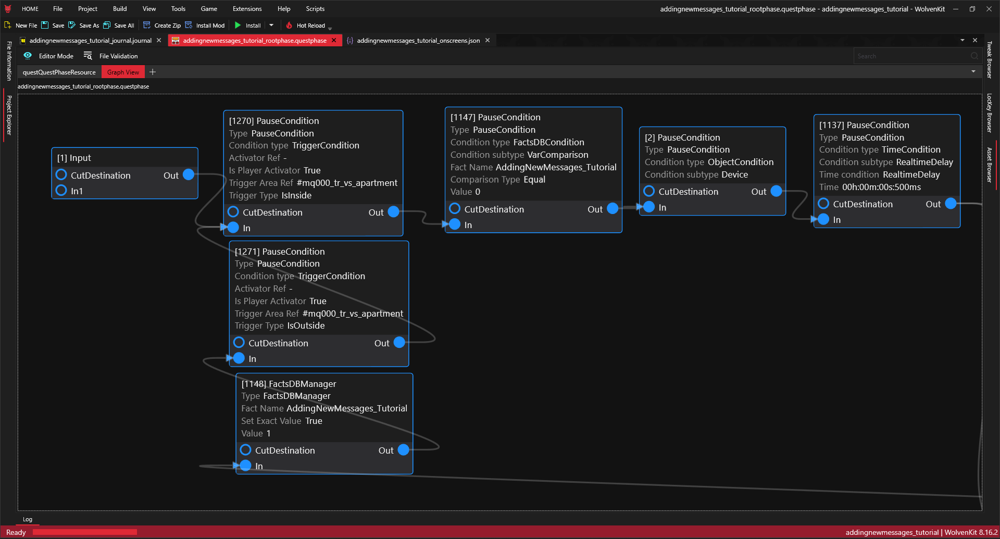
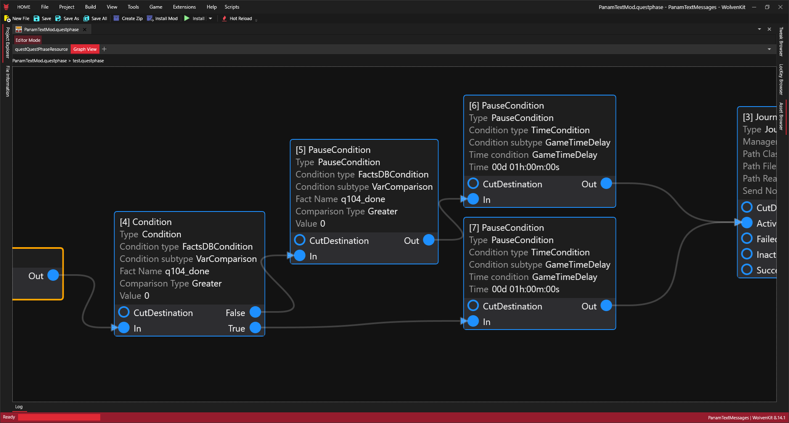
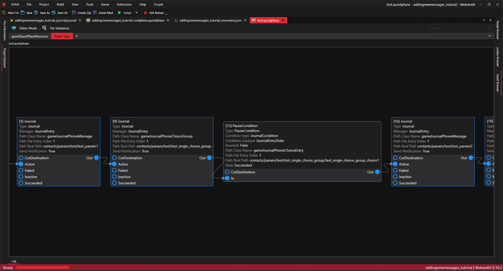
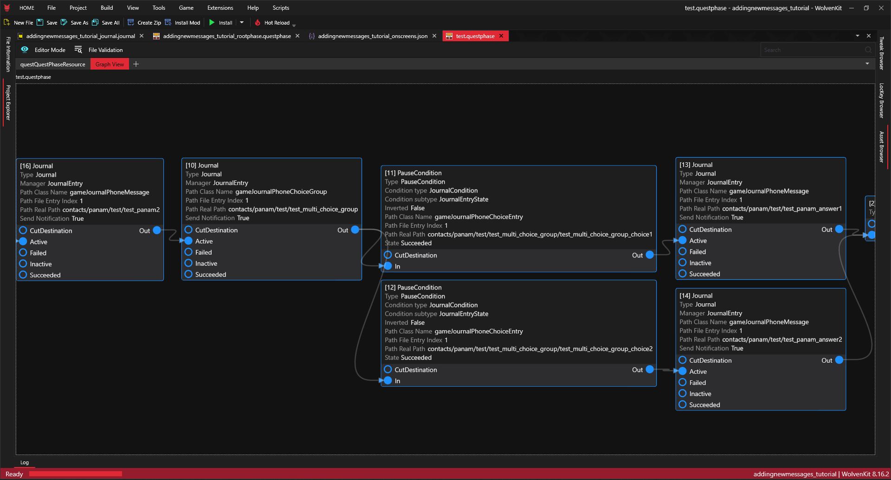

# How to add new text messages thread to Cyberpunk 2077

## Summary&#x20;

Created: Apr 17 2025 by Bill&#x20;

Last documented update: Apr 17 2025 by Bill&#x20;

This page will teach you how to create custom message threads for Cyberpunk 2077.

### General mod structure

To keep the project modular, it is good to use the following structure that basically mimics game structure:

* **mod** – root directory for mods
  *   **MOD\_NAME** – folder in root directory that will store everything for the mod;

      * **images** – folder that will store assets related to the images;
      * **journal** – folder that will only store journal file;
      * **onscreens** - folder that will store text files;
      * **quest** - folder that will store anything related to quest progression (phases, scenes etc).


<figure><figcaption><p>General structure of project tree</p></figcaption></figure>

When it comes to the structure of the **quest** folder, I prefer to split it based on the rank of the quests, threads will be attached to:

* **main** – in that folder questphases for the threads related to the main quests;
* **minor** – in that folder questphases for the threads related to the minor quests (mostly fixer jobs, gigs or hidden mission like JinGuji);
* **side** – in that folder questphases for the threads related to the side quests (for example Peralez’ questline, Judy questline, Panam questline etc);
* **romance** – in that folder questphases for the threads related to the romance line with chosen character;
* **phantom\_liberty** – in that folder questphases for the threads related to Phantom Liberty expansion;
  \
  In the **quest** folder, there are already two questphases:
* **addingnewmessages\_tutorial\_rootphase.questphase** – the main questphase of the mod that will be linked to the game via ArchiveXL.

As can be seen, every subfolder already has one questphase that is root for new questphases related to chosen quests.

### Structure of the addingnewmessages\_tutorial\_rootphase.questphase

<figure><figcaption><p>General structure of the <strong>addingnewmessages_tutorial_rootphase.questphase</strong></p></figcaption></figure>

#### Mod initialization and reset loop phase

<figure><figcaption><p>Mod initialization and reset loop phase of the <strong>addingnewmessages_tutorial_rootphase.questphase</strong></p></figcaption></figure>

It mainly consists of three nodes:

1. **\[1270] Pause condition** - waits for the player to be inside H10 apartment;
2. **\[1271] Pause condition** - waits for the player to be outside H10 apartment;
3. **\[1147] Pause condition** – waits for the certain custom Fact (it must be unique for every created mod) to be equal to 0; it will only launch if it was never installed before or if you reset the mod via CET; it prevents the game starting the mod every time you are in initialization area;
4. **\[2] Pause condition** – waits for the mod activation trigger which can be pretty much everything, i.e.: activation in certain area, activation by interaction with object – here it waits until V interacts with TV in H10 apartment;
5. **\[1137] Pause condition** – time based condition used only as security measure to avoid pausing the game mid character animation.

#### Phantom Liberty section

<figure><figcaption><p>Phantom Liberty section of the <strong>addingnewmessages_tutorial_rootphase.questphase</strong></p></figcaption></figure>

**\[1268] Condition** node - checks if Phantom Liberty is active for the player

* **if yes** – it goes straight to the main phantom liberty messages phase (**\[995] Phase** node)
* **if no** – it waits until expansion is installed (**\[1269] Pause condition** node) before accessing the main Phantom Liberty messages phase (**\[995] Phase** node)

#### Activation confirmation section

<figure><figcaption><p>Activation confirmation section of the <strong>addingnewmessages_tutorial_rootphase.questphase</strong></p></figcaption></figure>

Here user gets:

* pop-up screen with the confirmation that the mod has been installed properly (**\[1152] UIManager** node); after accepting the popup **\[1148] FactsDBManager** node sets the fact responsible for blocking the mod from unwanted mod activation once again while watching TV, after that signal is sent back to **\[1271] Pause condition** node

<figure><figcaption><p>In-game screenshot of the confirmation popup</p></figcaption></figure>

* text messages with the confirmation that the mod has been installed properly (**\[9] Journal** and **\[10] Journal** nodes in Activation confirmation section of the a**ddingnewmessages\_tutorial\_rootphase.questphase**):

<figure><figcaption><p>In-game screenshot of the messages</p></figcaption></figure>

#### Main phases of the mod

After some short delay (**\[1141] PauseCondtition** node) after receiving last message new main phases (marked on Figure \ref{phasestructure}) can be attached.

### Example phase with message thread (test.questphase)

<figure><figcaption><p>Example questphase with messages thread</p></figcaption></figure>

* It is important that underlined socket names of the **\[1] Input** and **\[2] Output** nodes _**MUST BE**_ the same as the phase in the main graph (see Main body section on the image above).
* Nodes can be added in the graph view (right click on the free space and select from available selection) but must be edited in **questQuestPhaseResource** tab.
* Connections between nodes can be removed by alt+left click on the socket (it will remove all of the connections)

#### Example of condition section in questphase with messages thread

<figure><figcaption><p>Example of condition section in questphase with messages thread</p></figcaption></figure>

In this case game checks if "Life During Wartime" from (Ghost Town mission chain) have been completed:

* If yes it waits 1 in-game hour (**\[7] PauseCondition** node) before next step;
* If no it waits until player completes the mission (**\[5] PauseCondition** node), then waits 1 in-game hour (**\[6] PauseCondition** node) before next step;

When it comes to activation triggers (**\[4] Condition** and **\[5] PauseCondition** nodes), they’re in most cases quest completion triggers and can be found in the main phase of given quest.

#### Example of single clickable choice message

<figure><figcaption><p>Example of single clickable choice messages</p></figcaption></figure>

* **\[3] Journal** - points to the path in journal where the single message from NPC is stored;
* **\[9] Journal** - points to the path in journal where the Choice group is stored - they can store multiple entries of choices;
* **\[15] PauseCondtion** - waits until the message choice is made by player;

#### Example of multiple clickable choices messages

<figure><figcaption><p>Example of single clickable choice messages</p></figcaption></figure>

* **\[16] Journal** - points to the path in journal where the single message from NPC is stored;
* **\[10] Journal** - points to the path in journal where the Choice group is stored;
* **\[11] PauseCondtion** - waits until the message choice is made by player;
* **\[12] PauseCondtion** - waits until the message choice is made by player;
* **\[13] Journal** - points to the path in journal where answer from NPC to **\[11] PauseCondtion** is stored;
* **\[14] Journal** - points to the path in journal where answer from NPC to **\[12] PauseCondtion** is stored;

### Connection between questphase path and journal structure

Real path – it is the path to the entry in **journal** file, i.e.:

<figure><figcaption><p>Connection between questphase path and journal structure</p></figcaption></figure>

* **secondaryKey** – links the entry from the onscreens to journal entry; it is the same for every language;
* **realPath** – links the entry from the journal to quest node
* **femaleVariant –** is default text variant for all subtitles, onscreen texts

<figure><figcaption><p>Connection between journal structure and onscreens entry</p></figcaption></figure>

### ArchiveXL file

Structure of the ArchiveXL file:

* **quest** - attatches main questphase of the mod to the base game: `base\quest\cyberpunk2077.quest` or standalone Phantom Liberty: `ep1\quest\cyberpunk2077_ep1_standalone.quest`;
* **journal** - attatches custom journal to the game;
* **localization** - attatches custom onscreen texts to the game; _**en-us**_ - default languge - if it is the only one set the game will use this text file for every language version.

```yaml
quest:
  phases:
    - path: mod\addingnewmessages_tutorial\quest\addingnewmessages_tutorial_rootphase.questphase
      parent: base\quest\cyberpunk2077.quest
    - path: mod\addingnewmessages_tutorial\quest\addingnewmessages_tutorial_rootphase.questphase
      parent: ep1\quest\ep1_standalone.quest
journal:
    - mod\addingnewmessages_tutorial\journal\addingnewmessages_tutorial_journal.journal
localization:
  onscreens:
    en-us: mod\addingnewmessages_tutorial\onscreens\en-us\addingnewmessages_tutorial_onscreens.json
    fr-fr: mod\addingnewmessages_tutorial\onscreens\fr-fr\addingnewmessages_tutorial_onscreens.json
```

## Bonus: Linking custom image with messages

Images are linked with messages via imageId as shown in the picture:

<figure><figcaption><p>Bonus: Linking custom image with messages</p></figcaption></figure>

TweakDB entry:

```yaml
UIJournalIcons.addingnewmessages_tutorial_example_photo:
  $type: gamedataJournalIcon_Record
  atlasResourcePath: mod\addingnewmessages_tutorial\images\example_photo.inkatlas
  atlasPartName: example_photo_full
```
