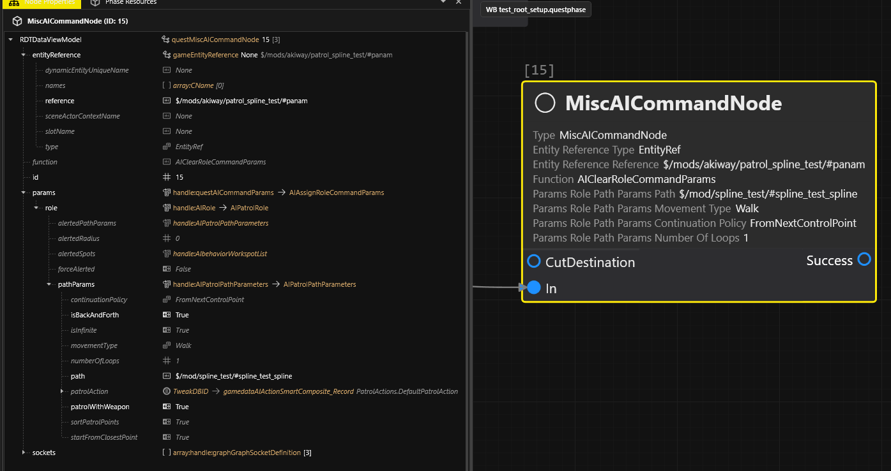

# How to make NPCs patrol

## Summary

**Published:** Aug 28 2026 by [mana vortex](https://app.gitbook.com/u/NfZBoxGegfUqB33J9HXuCs6PVaC3 "mention")\
**Last documented edit:** Sep 12 2026 by [Akiway](https://github.com/Akiway)

This page shows you how to use WorldBuilder's Patrol Spine feature. There is a video guide!

### Requirements

#### Tools

<table data-header-hidden><thead><tr><th width="192.4783485575026"></th><th></th></tr></thead><tbody><tr><td>WorldBuilder</td><td><a href="https://github.com/Akiway/CP77_entSpawner/releases">Akiway's fork, ≥ 1.5.0</a></td></tr><tr><td>WolvenKit</td><td>≥ 8.20 | <a href="https://github.com/WolvenKit/WolvenKit/releases">stable</a> | <a href="https://github.com/WolvenKit/WolvenKit-nightly-releases/releases">nightly</a></td></tr></tbody></table>


[Akiway's fork of World Builder](https://github.com/Akiway/CP77_entSpawner/releases/latest) is a more advanced version that put the focus on **Quality of Life**.

The version **a.1.5.0** introduces the Patrol Spline feature.


#### **Knowledge**

* Create a spline in World Builder
* Exporting a project
* The Community node: entries, phases and periods. (you only need one entry with one NPC)

## Patrol spline: step by step

A `worldPatrolSplineNode` contain two things :&#x20;

* a **path**, exactly like a basic spline, used by an NPC as the preferred path to walk.
* an ordered list of **patrol points**, these are spots where the NPC is going to stand for some time before moving on.

The node itself never spawns anybody. It is a route sitting in the world waiting to be used, and a Community entry points its NPCs at it by a [<mark style="color:purple;">node ref</mark>](#user-content-fn-1)[^1] <i class="fa-hashtag" style="color:purple;">:hashtag:</i> .

### In World Builder

1. Create your spline, as usual
2. Add your Workspots&#x20;


Make sure to disable `Is Infinite`  in every workspot !


3. Assign your workspots in the spline patrol points


The NPC preview only works with the path. The workspots and look-ats are not previewed.


### In WolvenKit

1. Export your WorldBuilder project into WolvenKit\
   _&#x53;ee World Editing ->_ [exporting-from-object-spawner.md](../world-editing/object-spawner/exporting-from-object-spawner.md "mention") _on how to do that_
2. Open a .questphase file
3. Create a `MiscAICommandNode`
4. Assign the patrol spline to a NPC.

<figure><figcaption></figcaption></figure>


To manipulate a spline with Redscript or CET, use this command : [AIMoveOnSplineCommand](https://nativedb.red4ext.com/c/2051432266991459)


## Video showcase

{% embed url="https://files.gitbook.com/v0/b/gitbook-x-prod.appspot.com/o/spaces%2F4gzcGtLrr90pVjAWVdTc%2Fuploads%2FeK1TArhNJVvxIXm1O0Ix%2Fworldbuilder_npc_spline.mp4?alt=media&token=36ad2234-583c-430e-906a-8406c54ab27d" %}

## Common mistakes

| Issue                                                 | Mistake                                                              | Fix                                                                                                                                                                                 |
| ----------------------------------------------------- | -------------------------------------------------------------------- | ----------------------------------------------------------------------------------------------------------------------------------------------------------------------------------- |
| Export stops; spline missing from the Patrol picker   | Spline has no NodeRef                                                | Type one, or click the [<mark style="color:purple;">generate</mark>](#user-content-fn-2)[^2] <i class="fa-rotate-exclamation" style="color:purple;">:rotate-exclamation:</i> button |
| NPC walks to the first workspot and stays there       | AI Spot has `Is Infinite` set to `true`                              | Set it to `false`                                                                                                                                                                   |
| Path empty, `Spline Length` 0.00m                     | Spline points in a group under a different root group                | The points group must sit under the same root group as the spline                                                                                                                   |
| NPC stares at the same spot for the rest of the route | `LookAt` with no matching `ClearLookAt`                              | Add a `ClearLookAt` point where it should let go                                                                                                                                    |
| Looks perfect, does nothing in game                   | Using the NPC preview                                                | The preview walks the path only. Workspots and look-ats cannot be previewed                                                                                                         |
| NPC spawns and stands there                           | Community entry with no Patrol initializer (if you used a community) | The spline does nothing on its own, the entry has to point at it                                                                                                                    |

[^1]: **A node reference is an unique identifier**, it is not a path.\
    To avoid modding conflicts, make sure to set a ref that follows a pattern of your own.\
    Example : `#/author/modName/group/#myObjectidentifier`

[^2]: <mark style="color:purple;">Auto-generation</mark> <i class="fa-rotate-exclamation" style="color:purple;">:rotate-exclamation:</i> uses the current group structure and element name to create a node ref. The reference unicity cannot be guaranteed with the other mods, so it is recommended to set a custom value.
