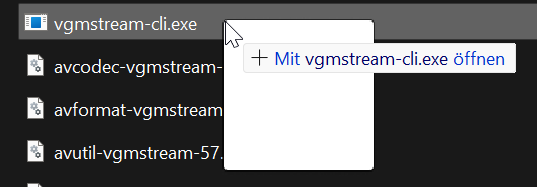

# Converting .wem to .wav

## Summary

Published: 31 March, 2025 by [TrackLab](https://tracklab.github.io/)

This page shows you how to convert the .wem audio files into a useable .wav file.

### Wait, this is not what I want!

* if you'd rather replace audio files, go to [replacing-sounds-effects.md](replacing-sounds-effects.md "mention")


The extracted audio files from Cyberpunk 2077 come in a .wem format, which is not useable like a conventional audio file.

## Getting the Tool

To convert it into a .wav, this [Blog Post](https://www.gaminghouse.community/en/guides-tutorials-1003/how-to-play-convert-wem-files-ogg-mp3-67#toc-3) demonstrates a quick way on how to.

1. Using [vgmstream](https://github.com/vgmstream/vgmstream/). Download the latest [release from GitHub ](https://github.com/vgmstream/vgmstream/releases)for your OS.
2. Extract the archive. For a quick one-time use, simply put the files in the same directory where your WEM files are located.

## Using the Tool

### Singular File

Once you have vgmstream ready, you can drag and drop the WEM files over the executable file (vgmstream-cli.exe in Windows)

<figure><figcaption><p>Dragging and Dropping a .WEM file onto the vgmstream executable</p></figcaption></figure>

### Multiple Files

If you have a folder full of files, you can create a run.bat file in the folder, and give it the following content&#x20;

```bash
for %%f in (*.wem) do "./vgmstream-cli.exe" -o %%f.wav %%f
pause
```

This will, once executed, convert every WEM file in this folder into a WAV. Given that the vgmstream executable is in the same folder.

"By default the bitrate will be of 768kbps." - gaminghouse.community

