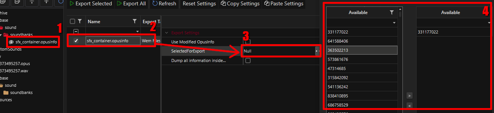

# Replacing sounds effects

## Summary

**Published:** June 9, 2024 **by** Zhincore

This guide covers how to export and import sound effects using WolvenKit by modifying opusinfo/opuspaks.&#x20;


This method is not compatible with other mods that change sounds this way, that's why you should prefer using [REDmod for muting or adding sounds](../../for-mod-creators-theory/modding-tools/redmod/audio-modding.md) or [Audioware](https://www.nexusmods.com/cyberpunk2077/mods/12001) (custom audio backend).



[audio-modding.md](../../for-mod-creators-theory/modding-tools/redmod/audio-modding.md)


## Exporting SFX

### 1. Obtaining opusinfo

In order to be able to export sound effects, you must first add `sfx_container.opusinfo` to your project. Find that file in the Asset browser using [the search](https://wiki.redmodding.org/wolvenkit/wolvenkit-app/usage/wolvenkit-search-finding-files) and double click it to add it.&#x20;

### 2. Selecting hashes


_Hash_ is basically an ID of a sound. To find the hashes you need, you can use the [SoundDB web tool](https://sounddb.redmodding.org/sfx).


Once you have opusinfo in your project <mark style="color:red;">(1)</mark>, it should appear in the Export tool (top menu -> Tools -> Export tool), if not, try pressing the Refresh button. Select the sfx\_container <mark style="color:red;">(2)</mark> and in the options on the right click the three dots next to "Selected for Export" <mark style="color:red;">(3)</mark>. A new window will popup <mark style="color:red;">(4)</mark>, there you choose what hashes/sounds you want to export.

<figure><figcaption></figcaption></figure>

For a little more detailed walk-through see:


[Import/Export: Sound effects](https://app.gitbook.com/s/-MP\_ozZVx2gRZUPXkd4r/wolvenkit-app/usage/import-export/import-export-sound-effects)


### 3. Exporting it

> And by "it", haha, well... Let's justr say... Sound effects.

Once you've selected your hashes and pressed "Finish", you can press the Export button. Once that's done you will now have your sounds exported in the raw folder of your project. You will two files per hash/sound, one is `.opus` and second is `.wav`. You can now modify the .wav sound to your liking, just preserve it's name and location!

## Importing SFX


Using this method you can only replace existing sounds. To add new ones use the [REDmod method](../../for-mod-creators-theory/modding-tools/redmod/audio-modding.md) or [Audioware](https://www.nexusmods.com/cyberpunk2077/mods/12001).


Importing sound effects is mostly straightforward. Simply put your sounds in your project's `raw\base` folder. The sound must be in `.wav` format and it's file name must be exact hash of an existing sound. Best bet is [exporting it first](replacing-sounds-effects.md#exporting-sfx).&#x20;

1. Open the Import tool  (top menu -> Tools -> Import tool).
2. Select your sounds you want to import.
3. Press "Import selected" (or all, whichever suits you)

<figure><figcaption>
The Import Tool with the previously exported files on the left.
</figcaption></figure>

You can usually leave the default settings as is. And your mod is done! Test it out.


Mods made this way are incompatible with each other! You should prefer using [the REDmod method](../../for-mod-creators-theory/modding-tools/redmod/audio-modding.md) if possible.

