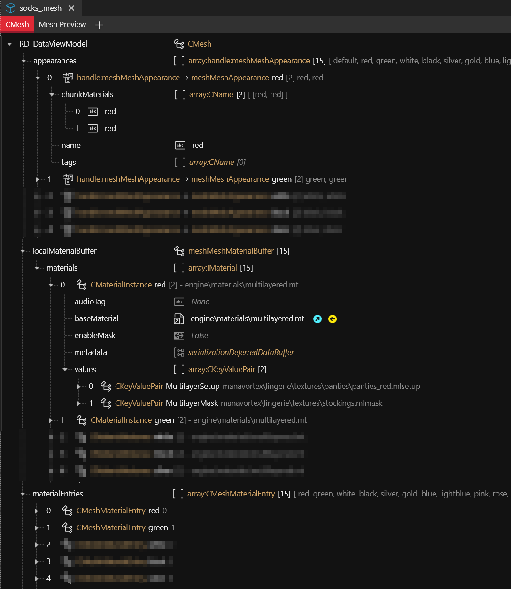
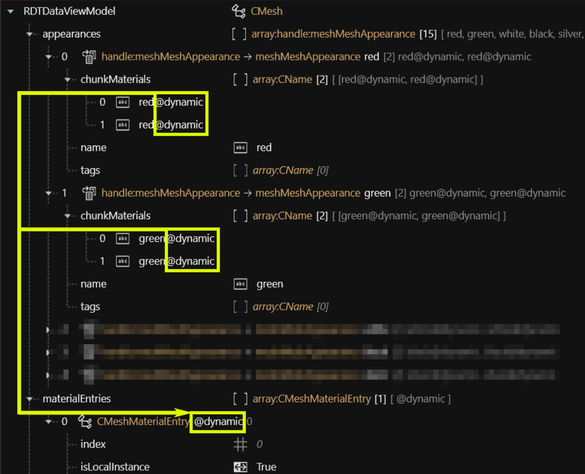
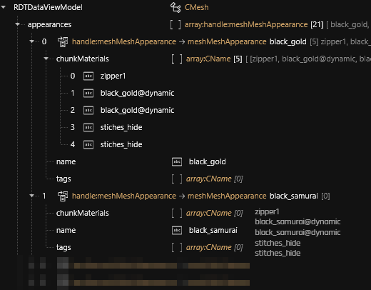
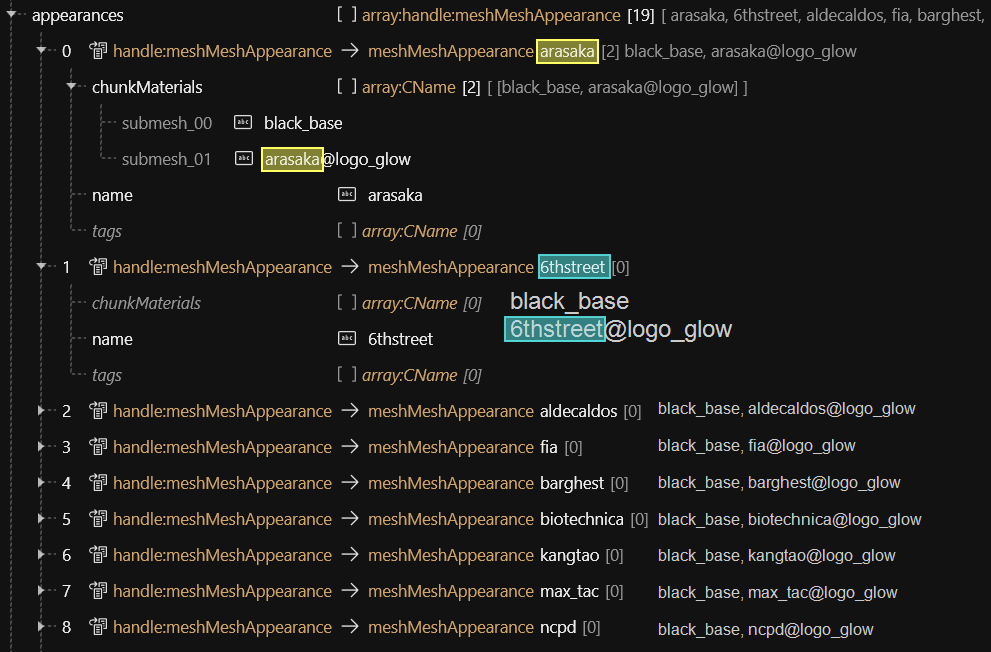

# ArchiveXL: dynamic materials

## Summary

**Published:** May 01 2024 by [mana vortex](https://app.gitbook.com/u/NfZBoxGegfUqB33J9HXuCs6PVaC3 "mention")\
**Last documented update:** May 01 2024 by [mana vortex](https://app.gitbook.com/u/NfZBoxGegfUqB33J9HXuCs6PVaC3 "mention")

## Prerequistes

* [ArchiveXL](https://www.nexusmods.com/cyberpunk2077/mods/4198) >= 1.13 — this will **not work** with older versions

### Assumed skill level

* You have a general understanding of how materials work (or read up on it under [#material-assignment](../../for-mod-creators-theory/files-and-what-they-do/file-formats/3d-objects-.mesh-files/#material-assignment "mention"))
* You have a Wolvenkit project and a mesh as well as a bunch of .mlsetups

## Why is this better than [.mi files](../../for-mod-creators-theory/files-and-what-they-do/file-formats/materials/re-using-materials-.mi.md)?

Because it's even lazier: For a mesh with 15 appearances, you need...

|                         | legacy | dynamic materials                   |
| ----------------------- | ------ | ----------------------------------- |
| Appearances             | 15     | 15                                  |
| mlmask files            | 1      | 1                                   |
| mlsetup fil,es          | 15     | 15                                  |
| #`materialEntries`      | 15     | <mark style="color:green;">1</mark> |
| #`CMaterialInstances`   | 15     | <mark style="color:green;">1</mark> |
| #`chunkMaterials` lists | 15     | <mark style="color:green;">1</mark> |


To be **even lazier**, check out [archivexl-resource-patching.md](../../for-mod-creators-theory/core-mods-explained/archivexl/archivexl-resource-patching.md "mention") and [archivexl-resource-linking.md](../../for-mod-creators-theory/core-mods-explained/archivexl/archivexl-resource-linking.md "mention")!


## The problem

Normally, your materials look like this: a bunch of different appearances with the same `.mlmask`, but one `.mlsetup` file for each colour:

<figure><figcaption></figcaption></figure>

The more variations you have, the more duplication you have, because you need to register a `materialEntry`  for each material, and then create a material for each of those. Traditionally, you do that by duplicating the last entry and changing the depot path. Tedious and not fun, right?

This is where the new technique kicks in.

## Step 1: Dynamic material assignments

We start by changing our `chunkMaterial` names. By appending the suffix `@dynamic`, we're telling ArchiveXL to map them to the `CMeshMaterialEntry` with the same name.

Instead of 15 `materialEntries`, we're down to one.

<figure><figcaption></figcaption></figure>

## Step 2: the material instance

Now, we need to adjust the material instances. We can delete all but one, since our `@dynamic` will contain everything that we need.&#x20;


The Flags for any dynamic material must be set to `Soft`, and the depot path must start with a \*. [File Validation](https://app.gitbook.com/s/-MP_ozZVx2gRZUPXkd4r/wolvenkit-app/file-validation) will warn you about this.


Since that one won't change, we can leave the `MultilayerMask` alone. For the MultilayerSetup, we need to change both the `DepotPath`:

<figure><figcaption></figcaption></figure>

* By making the depot path start with a `*`, we tell ArchiveXL that this is a dynamic material
* The value for `{material}` will be passed from the appearance, like this:

<figure><figcaption></figcaption></figure>

... and the rest just works.


You can use dynamic interpolation in pretty much everything — base material paths or material properties. Just remember to set your Flags to `Soft`, or it will fail.


## Step 3: Appearance expansion

But wait, there's more. After using dynamic materials, we've been able to reduce the number of material entries and instances, but there is still a lot of repetition between the appearances - if you've followed this guide so far, each of your appearances has a `chunkMaterials` list that looks the same as all the others except for the different material name. It would be great if we could get rid of that repetition, and we can, with Appearance Expansion.

And it's very simple to do. You simply assign empty `chunkMaterials` lists to all your appearances except the first one, and ArchiveXL will automatically use the first appearance as a template and generate the `chunkMaterials` list by substituting the appearance name:

<div align="left"><figure><figcaption></figcaption></figure></div>

Now, you only have to maintain one chunk list, and the rest of your appearances are simplified down to a single name and nothing else.

## Additional intel

### Dynamic materials and .mi files

To use `{material}` substitution inside .mi files, the reference must be sent to `Soft`. This works even if you do not use substitution in the path to the .mi file!


[File Validation](https://app.gitbook.com/s/-MP_ozZVx2gRZUPXkd4r/wolvenkit-app/file-validation "mention") may warn you about the soft references. However, in this case, its warning can be ignored.



## Mesh Appearance: Auto Expansion

We've eliminated a lot of repetition with those dynamic material paths, but can we take it even further? We still have to define an appearance with chunkMaterials, and while Search\&Replace certainly helps, can't we do away with those altogether?

The answer is a clear **yesn't**: You still need to define mesh appearances, but we can eliminate (most of) the chunk materials.

Any appearances **without `chunkMaterials`** that come directly after the first one will use that as a template for **appearance expansion**.&#x20;

Internally, ArchiveXL will **copy the `chunkMaterials`**, then **replace the appearance name**.

<figure><figcaption></figcaption></figure>

### Examples

```
arasaka                          6thstreet
  - black_base                     - black_base
  - arasaka@logo_glow              - 6thstreet@logo_glow
  - third_chunk_material           - third_chunk_material           
  
arasaka                          6thstreet
  - black_base                      - black_base
  - arasaka_logo@logo_glow          - 6thstreet_logo@logo_glow  
  - third_chunk_material           - third_chunk_material           
```
