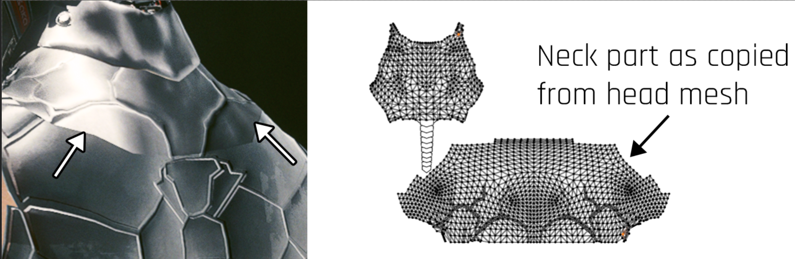
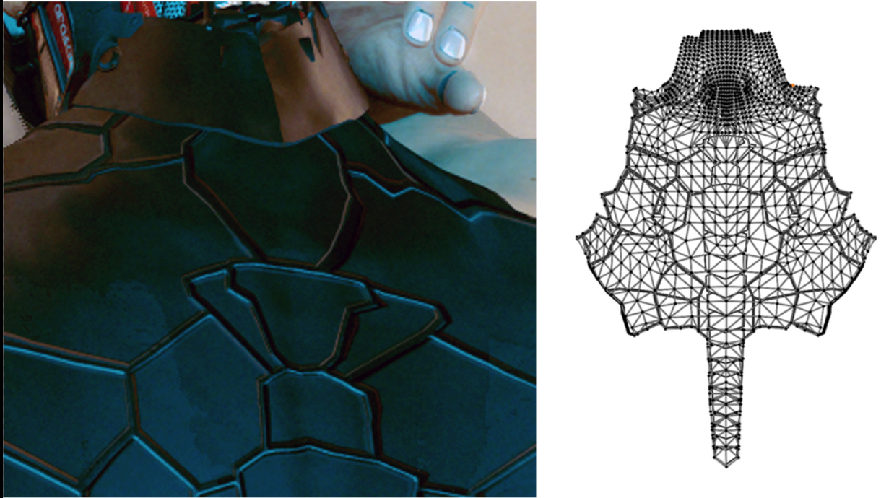

# Troubleshooting normal maps

## Import settings

The texture has to be imported without the `isGamma` flag. Import **over** an already-existing normal map to rule out this as a source of error. See [this conversation on Discord](https://discord.com/channels/717692382849663036/1039320529255026829/1041478803584733276) for more detail.

## UV scaling

Cyberpunk actually considers the UV map's scaling when calculating the weight of the normal maps:

<figure><figcaption>
the problem
</figcaption></figure>

Since the neck part is scaled much larger than the chest, this will make the parts of the mesh visibly distinct.

<figure><figcaption>
The solution
</figcaption></figure>

### Inverted shading, especially in the up/down direction

Cyberpunk uses DirectX normal map shading, not OpenGL; the two differ in how the Y axis is interpreted. If you're using Blender to bake normal maps, use +X, -Y, and +Z, like so:

<figure><figcaption>
Note G is using -Y, not +Y as default
</figcaption></figure>

If you have a normal map you've already baked and want to fix, simply invert the <mark style="color:green;">green</mark> layer in Photoshop/[photopea](https://www.photopea.com/).
