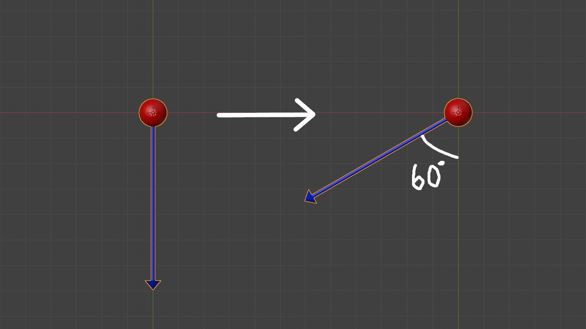
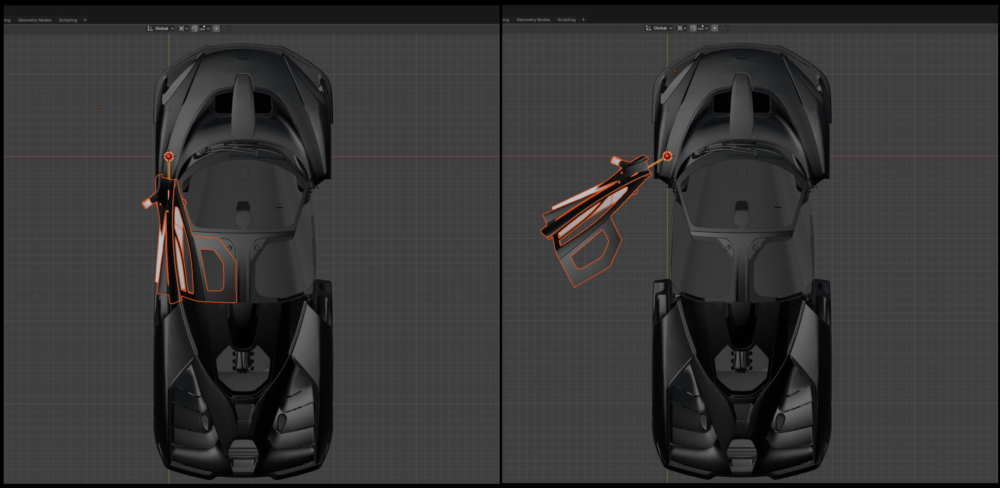

# Readjusting the export position

> So, your mesh is correctly positioned relative to the body of the car but when the animation plays, the mesh is clipping into the body, floating in the air or not moving how you wanted to?

What you need to do:&#x20;

* Open the Blender project we previously created&#x20;
* Move your mesh into a new export position by displacing it in either the X,Y and/or Z axis&#x20;
* Re-export it again and then import it into Wolvenkit
* Follow [Step 3](./#finding-the-x-y-z-values) from the previous page with the new X,Y,Z values

To understand how you need to move your mesh into this new export position, we will visualize the bone that the mesh is parented to and how the export position affects the animation in-game.

***

<h2 align="center">Understanding the Bone-Mesh Relationship</h2>

Suppose this red sphere below is the _**door\_front\_left\_a**_ bone as we are looking at it through the Z axis (top view) with the blue arrow helping us understand how the bone is rotating.&#x20;


Let's consider the normal, common door opening animation found in the porsche 911, the herrera outlaw and most of the cars in the game where the door rotates around a fixed point where it's connected to the car body

The left part of the image is the starting point before the door opens and the right part is the last frame of the animation where the door has fully opened, rotating 60° around the z axis which is passing through the origin


<figure><figcaption></figcaption></figure>

Now let's see how the door mesh will move in relation to the car body as it's following the rotation of the bone. In this case, the door export position chosen for this example is clearly _**too far away**_ from the origin in the Y axis (green) meaning that the Y value is too low:

<figure><figcaption></figcaption></figure>

> <h3 align="center"><em>How would this look inside the game?</em></h3>

<figure><figcaption></figcaption></figure>


Before the animation plays, regardless of the export position, the door is in the correct place relative to the body (left image) if you have followed [Step 3](./#finding-the-x-y-z-values) from the previous page

However, as the door starts to open, it gets farther and farther away from the car, until it's floating in the air without making any contact with the body (right image) which is not what we want


***

<h2 align="center"></h2>

<h2 align="center">Methodology</h2>

> In order to know how to readjust the export position in Blender, we will have to think backwards. We will look at the door when it's fully open in the game and decide how it needs to be moved, to prevent it from visibly clipping into the body or floating in the air when the animation plays

To do this, we will use the Appearance Menu Mod that allows us to open and close the car doors from a distance, letting us observe the animation in the opening and closing stage:

<figure><figcaption></figcaption></figure>

Aim your crosshairs at your car and open the door with AMM. Now we can examine how the animation plays and how our door is positioned when it's open. You can even enter photomode to take pictures from different angles so that you can look at them later and decide what adjustment you need to make:

<figure><figcaption>
This is just an example image. You can take screenshots from above, the side or at any angle you want to help you understand how your mesh needs to be moved in  the X,Y or Z axis
</figcaption></figure>

<h2 align="center"></h2>

***

<h2 align="center">Looking at Examples</h2>

Keep this information in mind as it is critical:

<figure><figcaption></figcaption></figure>



Obviously, the point the door rotates around (red sphere) will not be visible inside the game so we will have to closely examine how the animation plays and use our imagination to visualize it



<h3 align="center">Example 1: mesh is floating</h3>

Let's say that your door is visibly floating in the air as the opening animation plays, how would you fix it&#x20;

Below, is an example of how the door would be positioned relative to the body inside the game in this specific example for this particular export position chosen:

<figure><figcaption></figcaption></figure>

> 
<em><strong>Observe the Right image where the door is in its open state!</strong></em>

When the door is open, it is not positioned correctly relative to the car. To fix it, we need to:&#x20;

* Move it forwards `(+ y value)`, closer to the point of rotation (red sphere)&#x20;
* Also move it to the right `(+ x value)`


So, in this case, we would need to increase the X and Y value of the export position of the door in Blender, re-export it and go through [Step 3](./#finding-the-x-y-z-values) again to reposition it with the right boneTransforms values in the .rig file



Something to keep in mind is that when you move your mesh into a new export position, the point of rotation (red sphere) will also change position relative to the body&#x20;

This means that, after you made the X,Y value adjustment in this scenario, the red sphere will have also moved to a new place, applying the rotation to the mesh and moving it differently than before


***

<h3 align="center">Example 2: mesh is clipping</h3>

In this scenario, your door is clipping into the body of the car as it opens. When it's fully open, we see that it's positioned too close to the front of the car, resulting in clipping. What do you need to do?

<figure><figcaption></figcaption></figure>

In this case, the door needs to be positioned backwards towards the rear of the car and to the left. So, you would need to do the following to your door in the export position in Blender to fix this:

* Decrease the Y value, moving the door backwards
* Increase the X value

Then export it from Blender, import it in Wkit and repeat [Step 3](./#finding-the-x-y-z-values) from the previous page

***

<h2 align="center">Making the right adjustment for your case</h2>


These are just examples to help you understand how you would need to change the XYZ values of your mesh's export position. It all depends on how the mesh is positioned relative to the origin (bone) in the export position that you picked in Blender. You might have to increase or decrease the X or Y value depending on your case!


> In Example 1, the export position that was picked in that case resulted in the door floating in the air when the animation played in-game. However, you might have picked an export position that has the same issue but requires a different adjustment!

To understand this, take a look at the following example where the export position that was chosen results in the door floating in the air but requires a different adjustment than Example 1:

<figure><figcaption></figcaption></figure>

In this case, we would need to:

* Increase the Y value to move it closer to the front of the car
* Decrease the X value very slightly if at all, to move the door towards the left


Increasing the Y value will move the door towards the top right quadrant in the XY plane **in the right image** above, while decreasing the X value will move it towards the top left quadrant!!


This whole process unfortunately requires some trial and error where opening the game, checking the result and readjusting is common and something that you will have to get used to when car modding.

