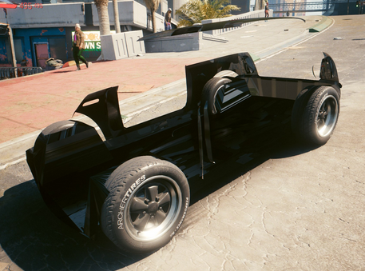
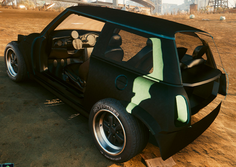
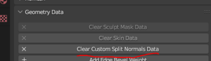
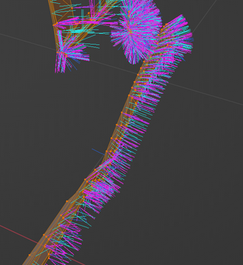
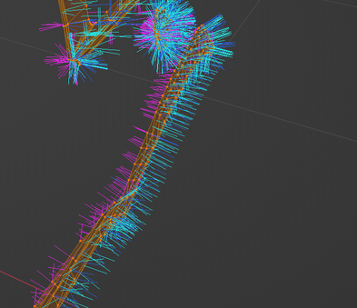
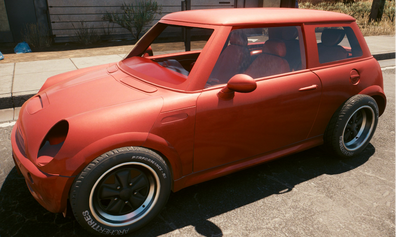
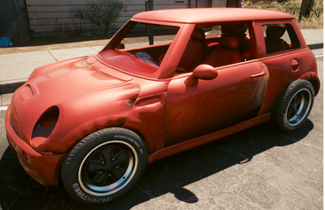
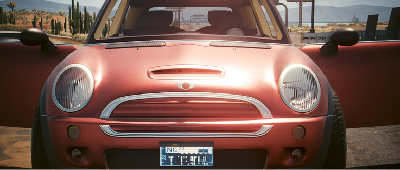
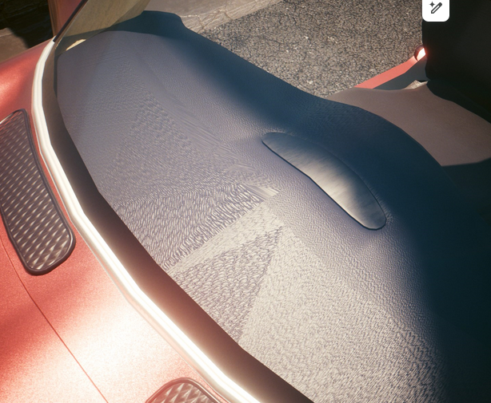

# 🚗 Boe6's vehicles: Manually Importing Meshes to Wkit

### Importing the first .mesh

In **Wkit**, open the `.app` file and navigate to the default appearance. Open the components and find “`body_01`” and expand it. Look for the “`mesh`” value, and add it to your project.&#x20;


If you used the blender script when exporting to blender, this file will already be in your project explorer.


Example:

<figure><figcaption></figcaption></figure>

Use the **export tool** as we did with the proxy mesh to convert it to a `.glb` file.&#x20;

Import this `body.glb` file into the blender project.

Prepare your custom body mesh and ensure the replacement is one object. Join relevant objects together if needed.


Make sure your body mesh is less than `65,635 vertices`. If any `.glb` file has more than this, the import into the game will fail.


You can check the face count in the top left of your blender window:

<figure><figcaption></figcaption></figure>


This number counts all visible objects in blender. Turning off an object’s visibility removes it from the count


As a general rule, keep the count low if you can to preserve performance in-game. Higher polygon count will increase quality, but decrease game performance.

You can use the **decimate** modifier (or other methods) as one method to reduce the face count if needed.

Example adding decimate modifier:

<figure><figcaption></figcaption></figure>

For simplicity, we’ll join all the parts of the body into one object for exporting. We can split them as submeshes later, when we want to indicate separate materials within a mesh.

With the body object selected, go to **File > Export > Export Selection to GLB for Cyberpunk**:

<figure><figcaption></figcaption></figure>

Save it to a new folder for your project’s `.glb` files.

Copy the `.glb` file into the folder with the original exported body mesh.

<figure><figcaption></figcaption></figure>

Copy the original file’s name, delete it, and rename your new part with the old file’s name.

Open the import tool in wkit, find the correct body `.glb` and import it into the game.

Select the updated `.mesh` file in the **Project Explorer**, and it will open in the **File Information** window. It should show your new mesh. \
Example:

<figure><figcaption></figcaption></figure>

Rename your new `.mesh` file to a project-specific name, and move it to a custom folder. \
Example:

“`boe6\mini_cooper\meshes\boe6_mini_cooper_body.mesh`”

Update your .app file with the path to the new body file. You’ll need to update it in 2 places:

* `RDTDataViewModel > appearances > 0 > components > body_01 > mesh`
* `RDTDataViewModel > appearances > 0 > components > AppearanceVisualController > appearanceDependancy > body_01 > mesh`

Test the mod in-game. It should look very wrong since we only replaced one mesh. \
Example:

<figure><figcaption></figcaption></figure>

Optionally, we can make all other visible components invisible while we’re modeling.

Easiest way to mark components as invisible is to break the `entPhysicalMeshComponent` appearances path.&#x20;

* `RDTDataViewModel > appearances > 0 > components > entMeshComponent/entPhysicalMeshComponent > meshname > mesh`

I do this by renaming the file with an added “`-disabled`” in the name. This breaks the file path, and notes that it is disabled for reference later. example:

<figure><figcaption>
disregard "entVisualController". See note below
</figcaption></figure>


Note: This method used to use the entVisualController to disable visibility. Thanks to **TheSpliffz** who corrected this method to the physical component path.


You may receive a warning in the log when saving the .mesh if you use this method, be aware:

<figure><figcaption></figcaption></figure>

Save and test in-game. The renamed component should now not render in-game. \
Example:

<figure><figcaption></figcaption></figure>


Note that this only removes the visual mesh. The interaction UI & function still exist.


Continue to change components until all except the modded body and wheels remain. Start with the major parts, bumpers, doors, etc. Test in-game frequently. Only disable parts that render in-game.

Once you have disabled all the other components, you can see your model clearly and notice any initial problems. Expect the textures to be broken. Opposite sides may not render as we still need to add an interior. Example:

<figure><figcaption>
Notice the far side of the vehicle does not render. This is due to the mesh's normals facing outwards.
</figcaption></figure>

Some model issues may show themselves at this point. Check out the [“Fixing Body Glitches”](https://docs.google.com/document/d/1a5Xvviw_GQxcvbxEwc3GoboaNk0igxlhiyS7ux34sIs/edit#heading=h.ftp5gbi7im8z) section of this document below.

You can use the `body_01` instructions for creating most non-moving parts. (engine, trim, chassis, etc)

Repeat the above instructions as many times as needed.

### Adding Glass meshes

For the non-moving windows, we’ll start by enabling the vanilla mesh by removing the “`-disabled`” tag. Then we can add the mesh to our project. Move/rename your files as appropriate. \
Example:


Moving windows, such as the front door windows, can be created after the "Rigging" section of this guide.


“`boe6\mini_cooper\meshes\boe6_mini_cooper_window_f.mesh`”

Update the `.app` file with both `.mesh` paths for the component.

Export it to `.glb`, replace it with your model’s window, and import it back.&#x20;

Save and Test.

Repeat for each non-moving window.

* Similar materials can be copy/pasted as meshes, and then import/exported, and entered into the `.app` file. This is instead of importing from the original car that is being mirrored. This saves time on moving files.

Save and test.

### Adding new components to your .app file

To add a new component instead of replacing a default one, you can duplicate the `entVisualControllerDependency` of the most similar component by right-clicking and selecting “`Duplicate Item in Array/Buffer`”. \
Example:

<figure><figcaption></figcaption></figure>

Edit the new component’s “`componentName`”, here I use “`body_02`”, as it is for exterior trim bodywork.

Edit the “`mesh`” value to the correct new `.mesh` file. \
Example:

“`boe6\mini_cooper\meshes\boe6_mini_cooper_body_trim.mesh`”

You also need to duplicate the `entPhysicalMeshComponent` of the part you are copying. Rename it with the “`name`” value to the one you used earlier, (`body_02`). Set the “`mesh`” value to the same mesh path. \
Example:

<figure><figcaption></figcaption></figure>

<figure><figcaption></figcaption></figure>

### Common Mesh Bugs

Read through these to see if you can address these issues before moving on to the next page.

#### Inverted Mesh Normals

If your model is rendering the wrong side of the model, (outside parts are only rendering looking from inside to out), then you’ll need to flip the normals in blender. (edit mode > normals > flip)

&#x20;Broken example:

<figure><figcaption></figcaption></figure>

#### Wrong Shadow Angles

If your model is not getting light correctly, despite the normals being flipped, it may be due to the split normals and regular normals being opposite.

This causes render issues where texture color and layers show extra dark, and in blender Edit Mode if you enable displaying normals, they show up on different sides of the same face. Example:

<figure><figcaption></figcaption></figure>

You can fix this by selecting the object, going to Object Data Properties, and under Geometry Data, click “Clear Custom Split Normals Data”.

<figure><figcaption></figcaption></figure>

<figure><figcaption>
After: Clear Custom Split Normals Data
</figcaption></figure> <figure><figcaption>
Before: Clear Custom Split Normals Data
</figcaption></figure>

You may have to flip the normals as described above, in case the reset faces the wrong way.

If you reset the normals you’ll likely have a “pixelated” look, due to no mesh smoothing. In Edit Mode, select Mesh > Shading > Smooth Faces. You may have to do this a couple times to get fully smooth. See the text below on normal shading

#### "Rounded" normals shading effect

If your models have odd edge shading, it is caused by normal maps in blender, typically from the normal map smoothing feature.

Before/after fix example:

<figure><figcaption>
After
</figcaption></figure> <figure><figcaption>
Before
</figcaption></figure>

After resetting a model’s normals, instead of smoothing with Mesh > Normals > Smooth Vectors, you should use Mesh > Shading > Smooth Faces.

#### Offset Lense Texture

If your lenses are refracting oddly, it may be due to UV mapping on the lens’s mesh. Example:

<figure><figcaption>
left lens refracting light from the wrong perspective
</figcaption></figure>

If this occurs, it is caused my misaligned UV maps. These are further discussed in the Textures & Materials section further on. You can safely ignore this issue for now.

#### Warped UV Maps

If your UV maps are incorrect, they may look unbalanced like this:

<figure><figcaption></figcaption></figure>

This is a common issue and is fixed with UV mapping. This is described later in the Textures & Materials section further on. You can safely ignore this issue for now.

