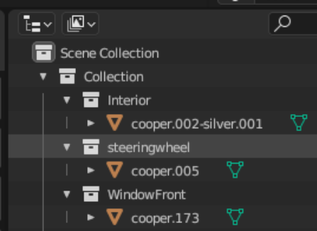

# Boe6's vehicles: Manually Exporting Meshes to Blender


To import vehicles models from **Wolvenkit** into **Blender**, use [**THIS GUIDE**](https://wiki.redmodding.org/wolvenkit/modding-community/exporting-to-blender/exporting-vehicles) .

This update method allows for import all components and rigs together as one model. I recommend following it before continuing with this guide, as it has more valuable information.


## Firstly, Read This Disclaimer

See the link above for exporting vehicles to blender. This page is an outdated manual method. Read the guide above, then continue to the next page after this.

## Add the proxy mesh to the project.

To add our models for the different parts, we’ll be looking mostly in the `.app` file, under our main appearance.

Open the “`AppearanceVisualController`” in the appearance’s item list. It should be the last item in the list. Then select the “`meshProxy`” value.

<figure><figcaption></figcaption></figure>

Go ahead and add this mesh to the project by clicking the yellow arrow.

This mesh is used at distance, before your vehicle is loaded fully. We’ll be using it as a reference for our modeling in blender, as it is a low poly, complete model with wheels and all.&#x20;

Open the **Export Tool**, under the **Tools** menu on the top of **wkit**.

Hit **refresh** to load all items, and select your proxy mesh you just added, then hit “**Export Selected**”. This should have created a `.glb` and `.json` file under the new “`raw`” folder above the resources in the **Project Explorer**.&#x20;

Example:

<figure><figcaption></figcaption></figure>

Open a new project in blender, delete the base cube. Hit `File > Import > Cyberpunk GLTF` and load the `proxymesh.glb`

Your proxy mesh should now load in blender.&#x20;

Example:

<figure><figcaption></figcaption></figure>

You can now import your source 3d models for your vehicle.&#x20;

The proxy mesh will initially be positioned offset from other vanilla meshes. This is due to the vehicle’s `.rig` file settings(will be discussed later).&#x20;

Example showing the offset:

<figure><figcaption></figcaption></figure>

To get the exact offset, open the `.rig` file located at this path in the `.ent` file:

* `RDTDataViewModel > components > deformation_rig > rig`

Open the `boneNames` list and look for the index (number to the left) of “`Base`”, in this case 2:\

<figure><figcaption></figcaption></figure>

Then close `boneNames` and open `boneTransforms`. Open the same index value as “`Base`” and look at the translation values:

<figure><figcaption></figcaption></figure>

(Values that are set at “`_.___E-17`” are in scientific notation, and if the `E` number is negative as they are here, the number is close to 0)

Look at the `Z` value and noticee how it is `0.4399999` in the example. (\~0.44) This is the number we will translate the proxy mesh by. Return to blender and select the proxymesh object. Translate it by the same value just found in the `.rig` file by using the `Transform Location` values in the `Object Properties` menu: (positive to negative)

<figure><figcaption></figcaption></figure>

Repeat the translation for all objects in the proxymesh collection:

<figure><figcaption></figcaption></figure>

The proxy mesh can be used as a reference in blender for scale. Note the porsche is especially convenient, as it has real-world dimensions available online. If you don’t know your source car’s size, (length, wheelbase, width) You can compare in-game between it and the Porsche, then convert those numbers as appropriate.

Import the source 3D model for your mod into the same project.

Your model will likely be scaled incorrectly.

Find the correct scale of your vehicle in reference to the proxy mesh.

* Example: A mini cooper has a wheelbase of 97.1”, and a porsche 911 has a wheelbase of 89.45”. So, Mini cooper wheelbase should be 8.55% longer in Blender once scaled correctly.

Fix positioning with the **move**, **rotate**, and **scale tools**. “**Numpad 5**” can be used for orthographic perspective, which is useful for comparing wheelbase accurately. I recommend matching the wheel bottoms at the same height, and matching the driver seat position as close as you can. This will save some steps later for poses.

Example with both rendered:

<figure><figcaption></figcaption></figure>

**Apply all transformations to all objects in blender.** This is required after any blender changes, if you skip this before exporting from Blender into WolvenKit, any positioning changes will not be saved.&#x20;


Always Remember to apply all after modifying something in Blender.


Disable visibility on the proxy mesh for now, but leave it in the project as we’ll need it later.

Now we can setup the model so it can be converted into meshes for Cyberpunk.

Depending on your source model, you may need to either split or join your model into groups for different meshes in game. These “groups” are the components list/array in the `.app` file.

Here’s a quick reference for the major groupings to look for:

* 2 tire models, one for font and back (left and right mirror the model)
* 2 wheel/rim models, see ↑
* Body
* Engine
* Window front & window back
* Chassis
* Various lights, backleft, backright, body, reverse, break,
* Wipers
* Door left & door right, front/back
* Window left & right, front/back
* Hood
* Trunk
* Interior
* Mirror
* Steering wheel
* License plate
* Bumper front / back


May be more or less of different components. Depends on source model.


Make a backup of your blender project often while editing. I suggest keeping multiple copies as you work with your model. While splitting/joining objects you might not realize certain components need to be different until later on in the mod project, and an older project file will be very helpful.

I recommend creating “collections” or folders in blender, one for each component. Split and join the files as necessary to organize them together.

Example of Collection/Folder/Object structure in Blender:

<figure><figcaption></figcaption></figure>

For each component in the vehicle, you’ll want a separate collection to organize meshes together. Each mesh will need a separate object in Blender for each material layer.

Here are the major mesh groupings you will want in your project:

<figure><figcaption>
(courtesy of Carryhan)
</figcaption></figure>

Split and join objects as needed to organize the Blender project structure.

Join objects by selecting multiple, and using **Object > Join**:

<figure><figcaption></figcaption></figure>
