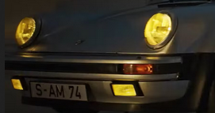
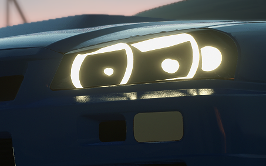
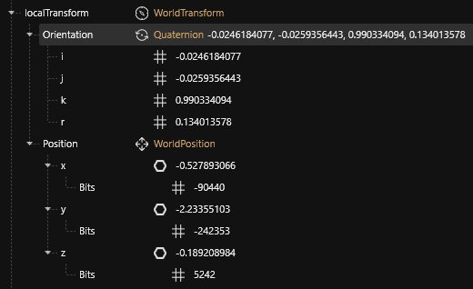
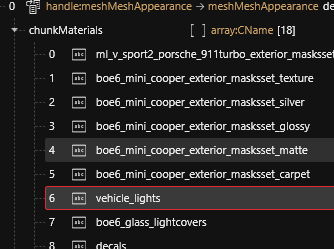
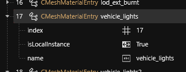
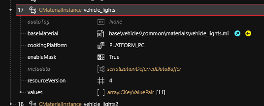
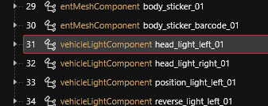
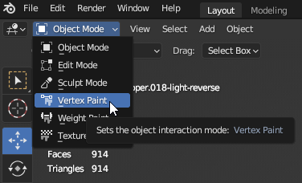
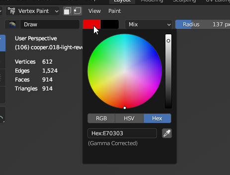
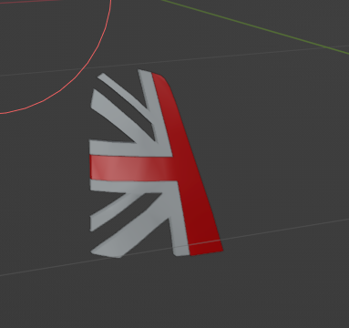

# 🚨 Boe6's vehicles: Add lights


Lights are using **emissive** (glowing) and **glass** materials. For more documentation about that, you can check [configuring-materials](../../../for-mod-creators-theory/materials/configuring-materials/ "mention").


Many lights, such as the headlights on the porsche, are reflective lights, with headlight lenses. These lenses require lots of lighting settings, such as `IOR`, `RefractionDepth`, `FresnelBias`, and more. \
Example:

<figure><figcaption></figcaption></figure>

The other common option, is to use solid lights, as many modded cars do. These lights avoid using the complex light options, and instead opt to use block-style lights. These are done by creating a custom mesh, setting it as a light material, and covering it with blank normal map lenses or glass. (IOR=1.0 & RefractionDepth<0.2) \
Example:

<figure><figcaption><p>(credit: ctxrlsec, Nissan Skyline GT-R R34)</p></figcaption></figure>

Here is an explanation of some light options, based on my own experience. Note that these values are not fully understood currently. If you learn something about these values, please share!

* **`IOR`** : “Index of Refraction”. This seems to be an on/off switch for enabling refraction. Values greater than 1 enable refraction.
* **`RefractionDepth`**
* **`FresnelBias`** : Unknown. (does nothing?)
* **`NormalStrength`** : Strength of normal map on the mesh
* **`NormalMapAffectsSpecular`** : Strength of normal map on reflected light
* **`Normal`** : Path to normal map
* **`GlassRoughnessBias`** : n/a
* **`BlurRadius`** : n/a

For the emitted light beam, there are “`vehicleLightComponent`”s in the `.app` file components list. The `localTransform` can be edited by the position `xyz` bit values. Orientation will control which direction the light is aimed. \
Example `LightComponent` localTransform values:

<figure><figcaption></figcaption></figure>

To create a new light in a mesh that doesn’t have one already, you can duplicate the material in the mesh settings. Make sure to update the `localMaterialBuffer` or `preloadLocalMaterialInstances`, `materialEntries`, and `appearance chunkMaterials`.\
See:

<figure><figcaption></figcaption></figure>

<figure><figcaption></figcaption></figure>

<figure><figcaption></figcaption></figure>

Once the vehicle\_lights material is linked in the mesh, it also need to be linked to a `vehicleLightComponent` in the `.app` file. You can use an existing `lightComponent` or duplicate a new one. The component has a `parentTransform` entry, and a `bindName` value which is used to set what mesh it is a part of. \
Example:

<figure><figcaption></figcaption></figure>

<figure><figcaption></figcaption></figure>

For lights like brakes, headlights, or reverse lights - you need to edit the vertex paint in **Blender**. Select the light emitting object in **blender** and switch to "**Vertex Paint"** mode. \
Example:

<figure><figcaption></figcaption></figure>

Set the color to one that enables the brake behavior, for brakes this is red in hex:

<figure><figcaption></figcaption></figure>

You must use these specific hex colors for lights to be activated properly:

* Headlights: `#7C0101`&#x20;
* Taillights: `#e7010`
* Reverse lights: `#cb0000`


Use the **Draw tool** in **Vertex Paint** mode to draw on the color to the entire part. \
Example:

<figure><figcaption></figcaption></figure>

Lights should now be fully working.


### Change headlight colors

Headlight colors are controlled in your vehicle's tweak file. You need to add this entry to your main `Vehicle` record:

```
headlightColor:
  - 0
  - 0
  - 255
  - 255
```

The values are RGBA respectively so the above changes the headlight color to blue

Adjusting the tweak file from the previous section, here's how it should all look like:

```
UIIcon.Mini_Logo:
    $type: UIIcon_Record
    atlasPartName: porsche
    atlasResourcePath: base\gameplay\gui\common\icons\weapons_manufacturers.inkatlas

Vehicle.Mini:
    $type: VehicleManufacturer_Record
    enumName: Mini_Logo

Vehicle.boe6_mini_cooper_data:
    $type: VehiculeUIData
    productionYear: 2003
    info: LocKey#boe6_mini_cooper_info

UIIcon.boe6_mini_cooper_icon:
    $type: UIIcon_Record
    atlasResourcePath: base\gameplay\gui\common\icons\weapons_manufacturers.inkatlas
    atlasPartName: porsche_911turbo_basic_johnny

Vehicle.boe6_mini_cooper_red:
    $base: Vehicle.v_sport2_porsche_911turbo
    appearanceName: boe6_mini_cooper_red
    displayName: boe6_mini_cooper_name
    player_audio_resource: v_car_mizutani_shion_nomad
    entityTemplatePath: boe6\mini_cooper\boe6_mini_cooper_basic.ent
    manufacturer: Vehicle.Mini
    icon: UIIcon.boe6_mini_cooper_icon
    vehicleUIData: Vehicle.boe6_mini_cooper_data
    headlightColor:
      - 0
      - 0
      - 255
      - 255

Vehicle.boe6_dominus_purchasable.dealerPrice: 55000
Vehicle.boe6_dominus_purchasable.dealerCred: 10

#Vehicle.boe6_dominus_purchasable.dealerAtlasPatch: "boe6_mini_cooper_cardealer.inkatlas"
#Vehicle.boe6_dominus_purchasable.dealerPartName: "1"

Vehicle.vehicle_list.list:
  - !append Vehicle.boe6_mini_cooper
```
