# Boe6's vehicles: .inkwidget and .inkstyle - Animated UI


.inkwidget and .inkstyle files are not currently well documented. (3/11/25)\
This guide will only show how to edit an existing vehicle speedometer / gauge cluster for a vehicle.

If you find additional information, please [document it!](https://wiki.redmodding.org/cyberpunk-2077-modding/the-wiki)


### Learning .inkwidget files

Moving Interior UI, like the speedometer are controlled through various ink files; .inkatlas, .inkwidget, & .inkstyle.

The .inkwidget is linked in a WorldWidgetComponent, alongside meshes and lights. It has a “widgetResource” that links to the car’s .inkwidget file. Add it to your project and rename/move it.

Update the path in the .app file, example:

<figure>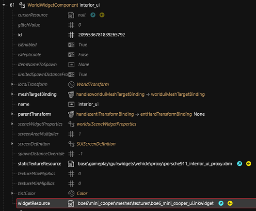<figcaption></figcaption></figure>

The .inkwidget file takes the parts from the inkatlas and moves them into position for motion. You can view a preview of the .inkwidget’s output via the “Widget Preview” panel.

<figure>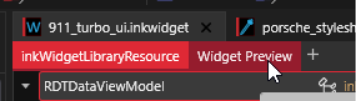<figcaption></figcaption></figure>

Note; the .inkwidget output is the texture layout that the UI mesh will reference, so it needs to be lined up with the UV map as defined in blender.

Example:

<div align="center"><figure>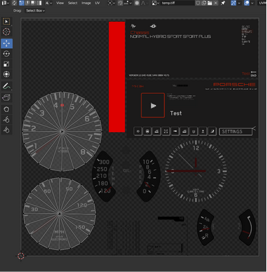<figcaption><p>UV Map showing mesh position over Widget "texture"</p></figcaption></figure> <figure>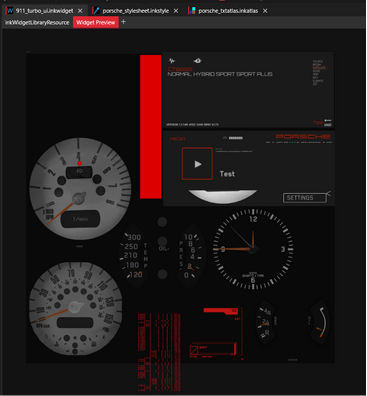<figcaption><p>Widget Preview as seen in WolvenKit</p></figcaption></figure></div>

Parts are configured in the .inkwidget at this path:

```
RDTDataViewModel > libraryItems > 0 > packageData > 0 > rootWidget > children > children > [part]
```

Each “inkCanvasWidget” is it’s own part container. Each “inkCanvasWidget” can be its own part, and can also contain multiple parts within it.

Nested parts are located inside the inkCanvasWidget at this path:

```
[root inkCanvasWidget] > children > children > [nested inkCanvasWidget]
```

An inkCanvasWidget can be moved under “layout > margin”.

Example:

<figure>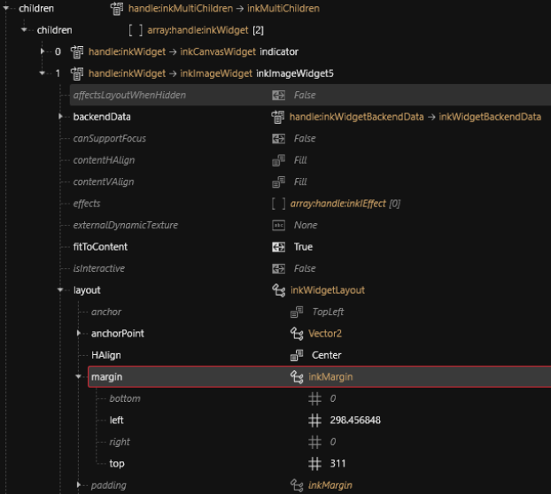<figcaption></figcaption></figure>

The important values to look for are "anchor", "anchorPoint", and "margin".


* "anchor"
  * the point on your UV map that the inkwidget starts calculating the position. This will be some preset values, TopLeft, CenterRight, BottomLeft, etc. wkit provides the correct options for this value in the editor.
* "margin"
  * the final location of the part. Starting at the anchor, applying the anchorPoint offset, then set “left” as your X offset, and “top” as your Y offset. “bottom” and “right” can be left at 0.
* "anchorPoint"
  * the part offset from it’s origin. An X value of 1 will move the part left by 100% of the part size (as defined in the .inkatlas). A typical speedometer will have both X and Y set at 0.5, as this sets the center of the image as the origin, allowing an arrow in the middle to rotate around the center. (see example below, notice the texture moved down and right by 0.5 units)

<div><figure>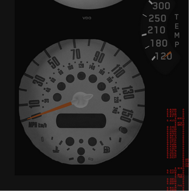<figcaption><p>anchorPoint X,Y offset of Zero</p></figcaption></figure> <figure>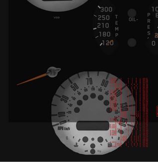<figcaption><p>anchorPoint X,Y offset of 0.5 each</p></figcaption></figure></div>


### The .inkatlas file

The .inkatlas file maps an atlas.xbm texture file into small parts for the .inkwidget to position and control. It is referenced by the .inkwidget in its dependencies.

<figure>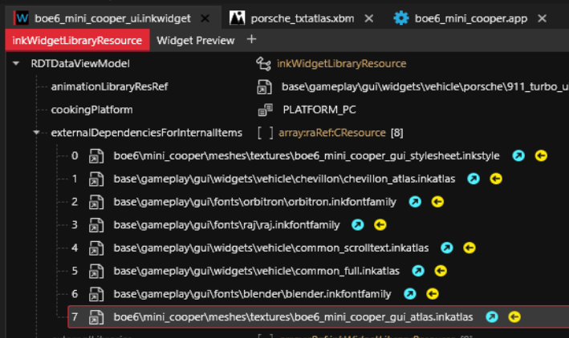<figcaption></figcaption></figure>

Duplicate, rename, move, and change file paths for your own .inkatlas file.

The .inkatlas file separates and maps a .xbm texture into parts.

Xbm path:

```
RDTDataViewModel > slots > 0/1/2 > texture
```

The .inkatlas controls the part mapping from the texture via the inkTextureAtlasMapper

```
RDTDataViewModel > slots > 0/1/2 > parts > [part name] > clippingRectInUVCoords
```


The 1 and 2 slots are 1080p and 720p. We’ll ignore them for now, they'll be updated to match later.


<figure>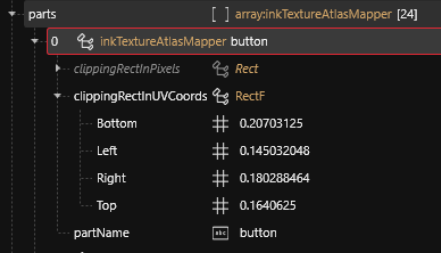<figcaption></figcaption></figure>

These Bottom/Left/Right/Top values are the limits for the part image. It is entered as a float from 0 to 1, with the value being a percent for how far the left/right distance is from the left, or how far the top/bottom is from the top.

A .xbm texture file is linked via the slot’s texture path in the .inkatlas file:

```
RDTDataViewModel > slots > 0 > texture > [path.xbm]
```

<figure><figcaption></figcaption></figure>

.xbm files that are used for a .inkwidget can be edited, but need a preserved alpha channel. This means .png will not work. .tga files can be easily edited by both photoshop and paint.net, and work well.

Example in photoshop layers:

<figure>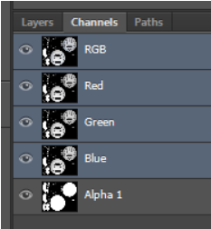<figcaption></figcaption></figure>

Images are used in the .inkwidget file under the “root > \[children] > \[children] > x” path:

```
RDTDataViewModel > libraryItems > 0 / Root > packageData > 0 > rootWidget > children > children > 0/X > children > children > 1 / inkImageWidget
```

In the .inkwidget file, an “inkImageWidget” structure is similar to the “inkCanvasWidget”. It has the same layout values to configure, and has the same parent/child structure.

To link an inkImageWidget to a part from the .inkatlas, two values are used:

```
… children > children > inkImageWidget > textureAtlas 
```


Links to the .inkatlas file


```
… children > children > inkImageWidget > texturePart
```


Links to partName in the .inkatlas


<figure>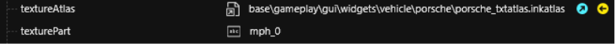<figcaption><p>.inkwidget</p></figcaption></figure>

<figure>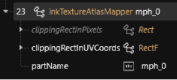<figcaption><p>.inkatlas</p></figcaption></figure>

The new .inkatlas path must be updated for every inkImageWidget.

<figure>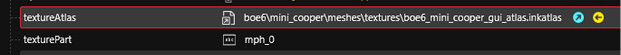<figcaption></figcaption></figure>

Parts that move/animate on an angle rotation are centered around the inkCanvasWidget’s origin.

For an angle rotation part, like a dashboard rpm needle, there are a few values to change.

When editing a moving/animated angle inkCanvasWidget, like a rpm needle, under “logicController” is a MaxRotation and MinRotation. These are the angles the needle will bend between. 0° is left from center.

Example:

<figure>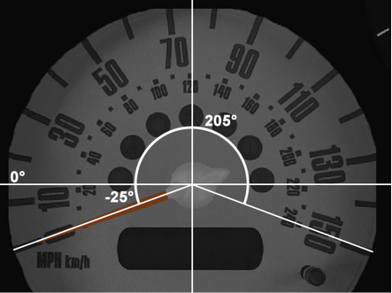<figcaption><p>In this example; -25° is the starting angle, 0 speed. 205° is the max point, full speed.</p></figcaption></figure>

The starting and ending angles are set in the .inkwidget inkCanvasWidget’s “logicController”.

Example:

<figure>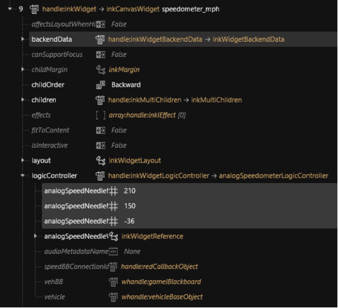<figcaption></figcaption></figure>

Value definitions for inside the logicController:

* analogSpeedNeedleMaxValue:
  * Max driving speed of the gauge, used in speedometer for MPH value.
* analogSpeedNeedleMinRotation:
  * Starting angle of the needle (see example gauge above).
* analogSpeedNeedleMaxRotation:
  * End/Max angle of the needle.

Some children elements may override this with a default value as a starting position, so this needs to be changed as well. It’s located in the “renderTransform > rotation” value in the child inkCanvasWidget.

Example:

<figure>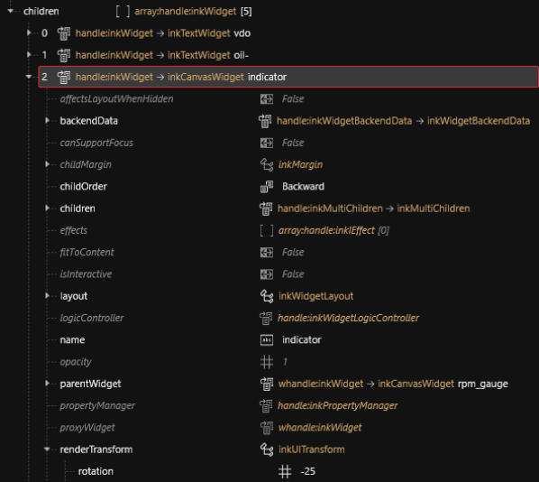<figcaption></figcaption></figure>

The .inkstyle file sets the color/overlay of parts. It is linked through an .inkwidget via it’s rootWidget “style” value, and its “externalDependenciesForInternalItems” array.

Add it to your project, rename, and move it. Examples:

<figure>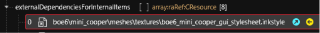<figcaption><p>Path: RDTDataViewModel > externalDependanciesForInternalItems</p></figcaption></figure>

<figure>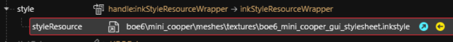<figcaption><p>Path: RDTDataViewModel > libraryItems > Root > packageData > 0 > rootWidget > style</p></figcaption></figure>


### The .inkstyle file

Inside the .inkstyles file, the “styles” value contains style groupings, which you can preview in the .inkWidget’s preview to what they change.

<figure>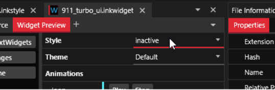<figcaption></figcaption></figure>

In each style, there’s a properties array containing each inkStyleProperty.

<figure>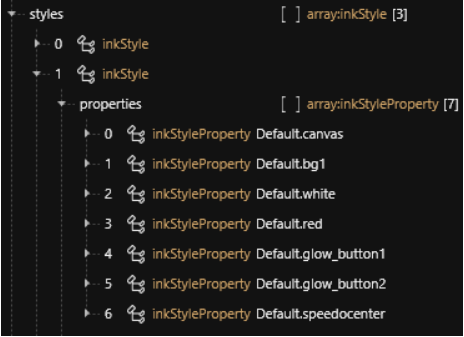<figcaption></figcaption></figure>

Each can be set to their own RGB/A value:

<figure>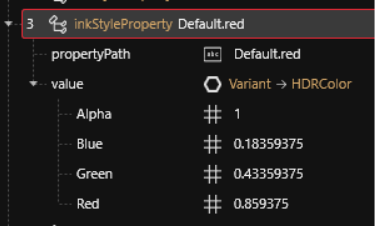<figcaption></figcaption></figure>

If you wish to use a colored texture, simply set all values to 1.

The inkStyleProperty is referenced by the .inkWidget file, inside the inkImageWidget.

Example path:

```
children > children > inkImageWidget > propertyManager > bindings > 0 > [values]
```

propertyName is “tintColor”. stylePath is the propertyPath value set by the .inkstyle.

<figure>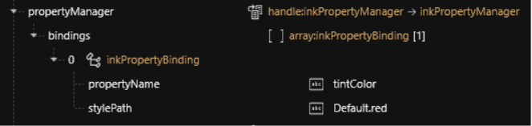<figcaption></figcaption></figure>


