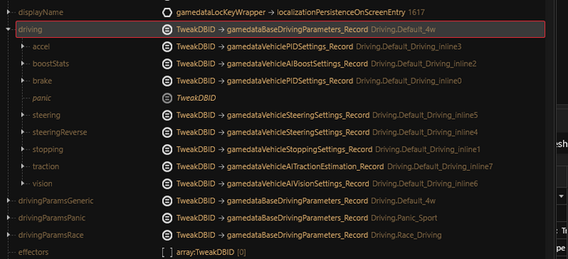

# Boe6's vehicles: Extra Details


### Wheel Audio Components

Each wheel on your vehicle has it’s own audio component for sound. Position data path:

```
.ent file > RDTDataViewModel > components > WheelAudioEmitterFL/FR/BL/BR
```

### Vehicle Exhaust Alignment

Vehicles use FX emitters on the exhaust for visual effects. These positioning values need to be configured as well.

```
.ent file > RDTDataViewModel > components > FX_slots > slots > fx_exhaust_x

```

### Engine Damage FX Smoke

FX emitters need to be positioned for smoke effects when vehicle damage occurs

```
.ent file > RDTDataViewModel > components > FX_slots > slots > fx_engine 
```

### Wheel Fire FX position

Each Wheel has a fire FX position to be configured

```
.ent file > RDTDataViewModel > components > FX_slots > slots > fire_fr/fl
```

### Vehicle Handling

Needs more research. Some control is set in tweaks.

Check Tweaks: `gamedataBaseDrivingParameters_Record` under `driving`

<figure><figcaption></figcaption></figure>


