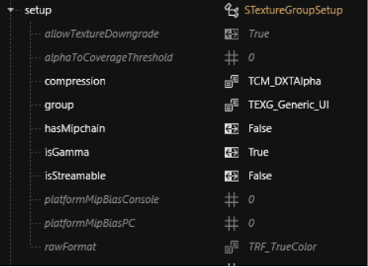
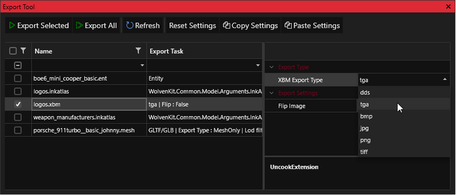
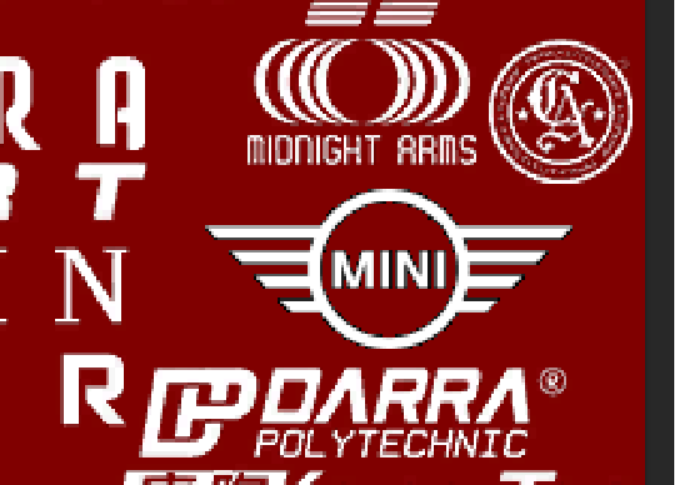
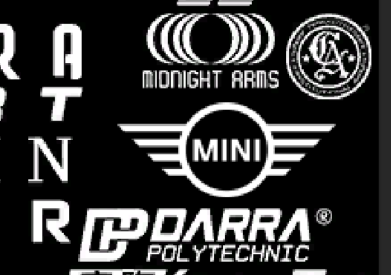
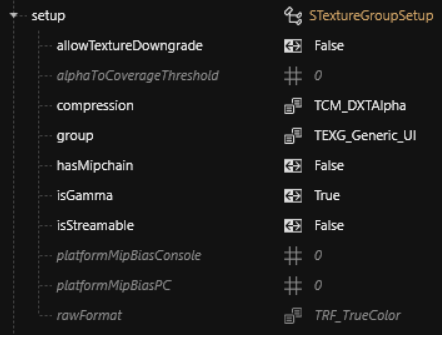
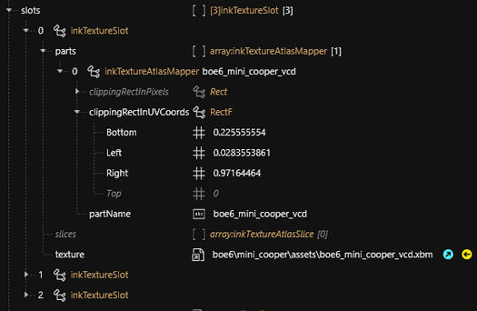

# 🖼️ Boe6's vehicles: GUI Images

Next we get to create the GUI images for the vehicle. This includes the call menu, dealership website, and the vehicle’s manufacturer logo.

First we’ll update the vehicle brand’s logo.

Locate the file referenced in your `UIIcon.Brand_Logo:` record and add it to the project.

Example: `base\gameplay\gui\common\icons\weapon_manufacturers.inkatlas`

Open the .inkatlas file, and navigate to: `“RDTDataViewModel > slots > 1/0 > texture”`


Both the first default and the “1080”.xbm can be changed to reference the same image file.


Add the first “weapon\_manufacturers.xbm” file to your project.

Move and rename both .inkatlas and .xbm to appropriate paths.

Examples:&#x20;

`boe6\mini_cooper\assets\logos.inkatlas`&#x20;

`boe6\mini_cooper\assets\logos.xbm`

Update Mini\_Logo Tweak .yaml Record, example:

```
atlasResourcePath: boe6\mini_cooper\assets\logos.inkatlas
```

Update .inkatlas > slots > texture. Example:

<figure><figcaption></figcaption></figure>

Save and test. Please note you’ll see this texture when scanning the car. It should show as the new car’s default logo.

Now we update the .xbm file.

Open the .xbm in wKit, and open the “setup” path.

Example:

<figure><figcaption></figcaption></figure>

Please note that you’ll need these settings for properly importing and exporting .xbm files shortly.

Export your logos.xbm file as a .tga file.


.png will not preserve transparency, as cyberpunk requires alpha layers.


Export example:

<figure><figcaption><p>The .tga format is useful for it's alpha transparency layer support.</p></figcaption></figure>

.tga files can be edited by any photo editor that supports the alpha channels. I use Photoshop, and I believe paint.net is also supported.

You’ll need a logo source that is black and white, black being transparent. Ensure your logo is 100% solid white.

Aim to replace a similarly shaped logo in the existing image. Make sure you update both the RGB and alpha channels.

Examples:

<div><figure><figcaption><p>alpha layer shown in red</p></figcaption></figure> <figure><figcaption></figcaption></figure></div>

Save the .tga file, and make sure to not use compression.

Open the Import Tool (under Tools) and refresh.

Select the edited .tga file, and set the import settings to mirror those in the “setup” options in the .xbm file. We viewed this earlier.

In my case, I changed Compression to `TCM_DXTAlpha`

Save and test that the mirror car’s brand still renders when scanned.

Open the .inkatlas in wkit and switch the tab to “Part Mapping”


You may have to close the .inkatlas and reopen for the Part Mapping to update.


Find and select your logo, example:

<figure><figcaption><p>Notice the 'yaiba' text. This is what we will update next.</p></figcaption></figure>

Edit the inkTextureAtlas > RDTDataViewModel > slots 0/1 > parts > logo replacing. Change the partName to your brand. Example:

<figure><figcaption></figcaption></figure>

Delete other logo maps under "parts" to clean up the file.

Example of clean slots:

<figure><figcaption></figcaption></figure>

Open “clippingRectInUVCoords” to fix the bounds of your logo on the Part Mapping.

Updated clipping example:

<figure><figcaption><p>Notice how the edges of the rectangle match the limits of the logo width/height</p></figcaption></figure>

Update UIIcon.Brand\_Logo: Tweak, atlasPartName: Brand.

Example:

```
atlasPartName: mini
```

Save and test.

Logo should now show as the updated image when scanned in-game. Example:

<figure><figcaption></figcaption></figure>

### Call Menu and Virtual Car Dealer Images

The call menu vehicle icon, or the dealerAtlasPath is similar to other UI atlas textures.

Verify your .xbm image has the right setup/import attributes:

<figure><figcaption></figcaption></figure>

Link the .xbm to the .inkatlas with updated file paths and update the .inkatlas clipping values.

<figure><figcaption></figcaption></figure>

### Update Virtual Car Dealer Tweaks

Don't forget to update your .yaml tweaks as well. Example:

```
Vehicle.boe6_mini_cooper.dealerPrice: 63000
Vehicle.boe6_mini_cooper.dealerCred: 8
Vehicle.boe6_mini_cooper.dealerAtlasPath: "boe6/mini_cooper/assets/boe6_mini_cooper_vcd.inkatlas"
Vehicle.boe6_mini_cooper.dealerPartName: "boe6_mini_cooper_vcd"
```


dealerPrice sets the total cost on the Virtual Car Dealer website

dealerCred sets the required Street Cred level of the player to be able to purchase the vehicle

dealerAtlasPath relative game path to the inkatlas with your xbm icon(s)

dealerPartName id of the icon used in the .inkatlas file


The images should display properly on both the vehicle call menu, and the virtual car dealer website.

<div><figure><figcaption></figcaption></figure> <figure><figcaption></figcaption></figure></div>

