# 🎨 Boe6's vehicles: Paint colors & Varients

Due to how variants appearances are handled in cyberpunk, it is best to not focus on adding color or other variants until the base vehicle is 100% complete. Once new appearances are added, each component needs to be updated for each variation. So if you add 16 colors, all future edits will take 16x effort. This is why I recommend saving it until the end.

### Appearance Prep

First, prepping the files throughout our vehicle project is needed, so they can be duplicated easily.

Starting with the .yaml and your tweak settings, create another Vehicle tweak entry based on your main vehicle tweak entry. All settings can be copied from the original vehicle entry by referencing it as a $base reference:

```
Vehicle.boe6_mini_cooper.red:
  $base: Vehicle.boe6_mini_cooper
```

Simply adding a “.red” at the end, it also needs its own appearanceName that will change for each variation, as well as call menu icons and dealer website images. The final tweak code should be similar to this example:

```
Vehicle.boe6_mini_cooper.red:
  $base: Vehicle.boe6_mini_cooper
  appearanceName: basic_red
  icon:
    atlasResourcePath: boe6\mini_cooper\assets\boe6_vehicle_icons.inkatlas
    atlasPartName: boe6_mini_cooper_icon_red

Vehicle.boe6_mini_cooper.red.dealerAtlasPath: "boe6/mini_cooper/assets/boe6_mini_cooper_vcd.inkatlas"
Vehicle.boe6_mini_cooper.red.dealerPartName: "boe6_mini_cooper_vcd
```

Establish a naming convention for the appearances across your project, as it will be used across multiple files and can get confusing if left unmanaged. “Basic\_red” can be easily changed to “basic\_blue”, and so on.

The dealer values need to be added in lines after the vehicle tweak is defined in the .yaml, simply follow the example above and swap for your custom paths.

Since dealerAtlasPath is now controlled by each appearance, it can be removed from the dealerPrice and dealerCred settings. Below this a “dealerVariants” is needed. This is done with a .yaml list, which is done by adding 2 spaces, a dash (-), another space, and the value. See below.

We also need to change the !append line to the updated vehicle tweak.

For example, I updated the mini cooper from “!append Vehicle.boe6\_mini\_cooper”, to “!append Vehicle.boe6\_mini\_cooper.red”.

Example after adding 2 color variations for Virtual Car Dealer to offer:

```
Vehicle.boe6_mini_cooper.dealerPrice: 63000
Vehicle.boe6_mini_cooper.dealerCred: 8
Vehicle.boe6_mini_cooper.dealerVarients:
  - "Vehicle.boe6_mini_cooper.red"
  - "Vehicle.boe6_mini_cooper.blue"

Vehicle.vehicle_list.list:
  - !append Vehicle.boe6_mini_cooper.red
  - !append Vehicle.boe6_mini_cooper.blue
```

Once the .yaml is updated, the .ent can be updated to match the current appearanceName value.

Since the Mini Cooper is using “basic\_red”, it is updated in the appearances list:

<figure>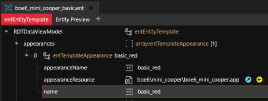<figcaption></figcaption></figure>

Note, “name” is the value that the .yaml is referencing. “appearanceName” is linked to the .app file. Update this value as well to match, and open the .app file to appearances, and update the “name” value. See:

<figure>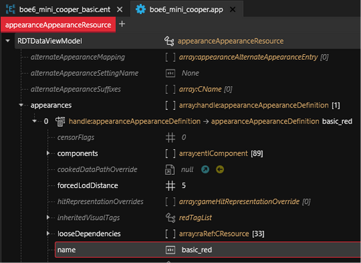<figcaption></figcaption></figure>

Look through the .app appearance components, and write a list of each MeshComponent that uses the color changes you need. In my case, I am only changing the exterior paint color so I have a list of the body, both doors, bumpers, hood, and trunk. Each of these will need changes to the material paths.

For each MeshComponent in the .app appearance, there is a “meshAppearance” value. This will typically be “default” automatically. Update it to the name of your appearance.

<figure><figcaption></figcaption></figure>

It also needs to be updated at this location:

```
“appearances > X > components > AppearanceVisualController > appearanceDependency > [componentName] > appearanceName”
```

<figure>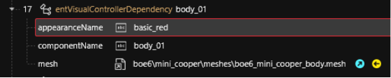<figcaption></figcaption></figure>

The .mesh also need to be updated to this appearance name, under “appearance > X > name”

<figure>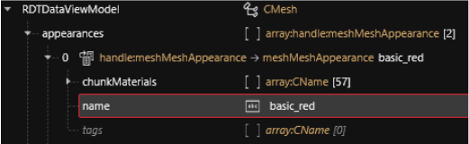<figcaption></figcaption></figure>

Create a new .mlsetup that contains each color variation wanted on seperate layers. Once you have a proper material selected with correct tiling and roughness settings, copy/paste all attributes by right-clicking the layer in MlsetupBuilder.

Name it and move it appropriately.

<figure>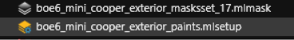<figcaption></figcaption></figure>

Now to set a color variation, we are able to set the material to use this new .mlsetup, and change the .mlmask to use different layers and colors for appearances.

Change or create a .mesh > appearances > chunkMaterials CName value for the paint.

Example:

<figure><figcaption></figcaption></figure>

Set a matching materialEntries value:

<figure>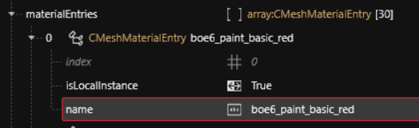<figcaption></figcaption></figure>

Now open the localMaterialBuffer and find the CMaterialInstance for the new paint color.

Navigate to it’s MultilayerMask and MultilayerSetup files, and update the paths to the new paint color .mlsetup file.

Example:

<figure>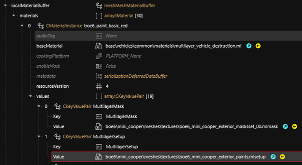<figcaption></figcaption></figure>

Save and test that the first appearance still works in game.

Now is a good time to remove excess components to clear out clutter from the .app file. Look through the components list and see which are unnecessary and can be removed. If any still use the “-disabled” method from earlier in this guide, they can be deleted now. Create a backup of your .app first just in case you delete something important.

<figure>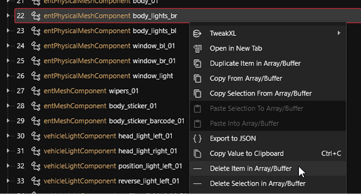<figcaption></figcaption></figure>

Test that everything is still working and show up in game.

### Creating More Appearances

Next we can start duplicating our 1st appearance into a 2nd.

Initially for the .yaml, simply copy paste the red Vehicle.xyz and dealer paths and update the appearanceName:

```
Vehicle.boe6_mini_cooper.blue:
  $base: Vehicle.boe6_mini_cooper
  appearanceName: basic_blue
  icon:
    atlasResourcePath: boe6\mini_cooper\assets\boe6_vehicle_icons.inkatlas
    atlasPartName: boe6_mini_cooper_icon_blue

Vehicle.boe6_mini_cooper.blue.dealerAtlasPath: "boe6/mini_cooper/assets/boe6_mini_cooper_vcd.inkatlas"
Vehicle.boe6_mini_cooper.blue.dealerPartName: "boe6_mini_cooper_vcd
```

Be sure the variant is added to the dealerVariants list and vehicle\_list:

```
Vehicle.boe6_mini_cooper.dealerVarients:
  - "Vehicle.boe6_mini_cooper.red"
  - "Vehicle.boe6_mini_cooper.blue"

Vehicle.vehicle_list.list:
  - !append Vehicle.boe6_mini_cooper.red
  - !append Vehicle.boe6_mini_cooper.blue
```

Update the .ent file appearances by right-clicking and duplicating the appearance:

<figure>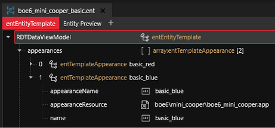<figcaption></figcaption></figure>

Update the .app with a duplicated appearance and update names:

<figure>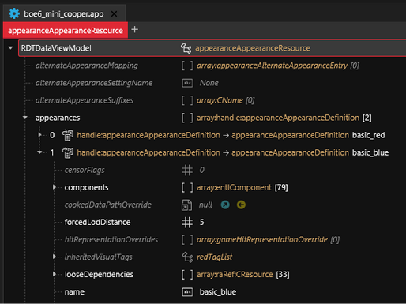<figcaption></figcaption></figure>

For every mesh component that has color change, update the meshAppearance in the component list, and it’s AppearanceVisualController entry:

<figure><figcaption></figcaption></figure>

<figure>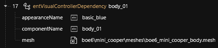<figcaption></figcaption></figure>

Once all meshes are updated in the .app, we’ll update every necessary .mesh file we just updated.

Duplicate the appearance entry in the .mesh:

<figure>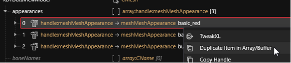<figcaption></figcaption></figure>

Change both, the appearance “name” value to the appearance set in the .app:

<figure>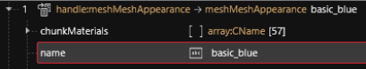<figcaption></figcaption></figure>

Change the chunkMaterials paint entry with what will be the new color:

<figure>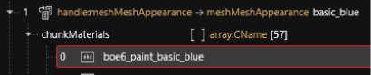<figcaption></figcaption></figure>

For materialEntries, right-click on the first color material and select “copy from”:

<figure>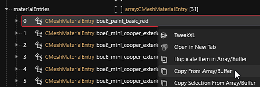<figcaption></figcaption></figure>

Then, select the materialEntries list itself, right-click, and select “paste into”:

<figure>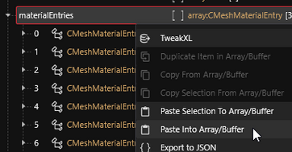<figcaption></figcaption></figure>

Duplicating with copy/paste this way ensures it will be added to the list at the end.

Find the new entry at the bottom of materialEntries, edit the “name” to the name set in the .mesh appearance, and undate the “index” to match the index number to the left of the entry (its index/number in the list):

<figure>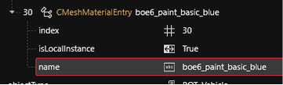<figcaption></figcaption></figure>

Open the localMaterialBuffer (or preloadLocalMaterialInstances) and duplicate the color variation with the copy-from/paste-into method that was just used:

<figure>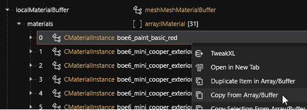<figcaption></figcaption></figure>

Lastly, the new material will need it’s MultilayerMask path updated with the .mlmask that uses the correct color.

<figure><figcaption></figcaption></figure>

Save all and test in-game.

You should be able to select color options in VirtualCarDealer (but photos wont be updated yet), and be able to use AMM(Appearance Mod Menu) to view different “models”(appearances).

<figure>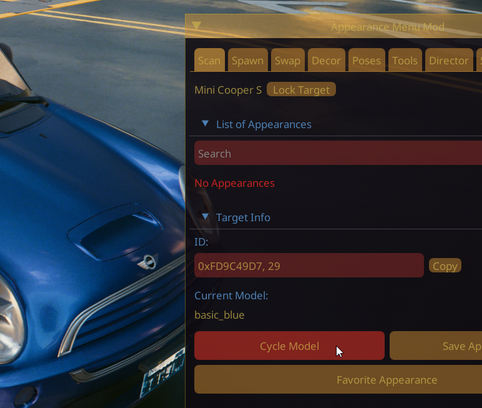<figcaption></figcaption></figure>


While not looking at a vanilla car, “Cycle Model” will select a random appearance, including current appearance. Cycling multiple times may be necessary to see both models


Once both are working independently, you can safely duplicate each appearance for the number of variations wanted, in my case 16. Virtual Car Dealer images and call menu images can be updated as well.


