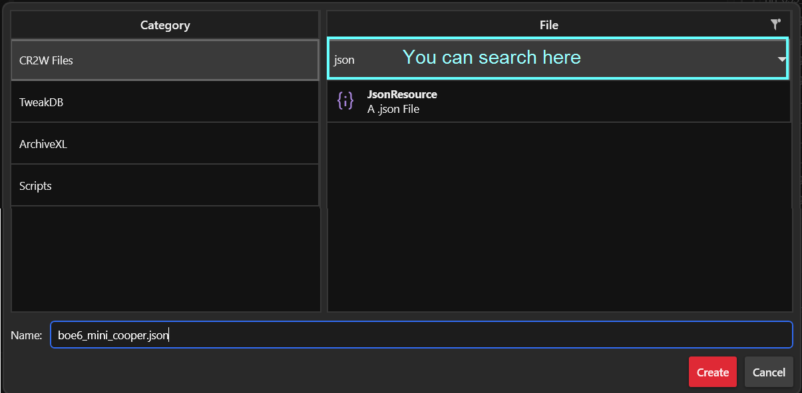
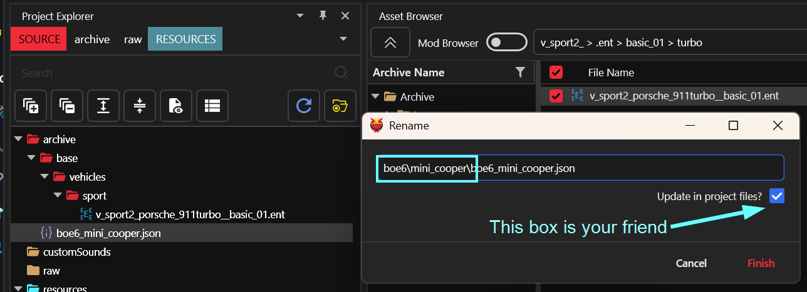
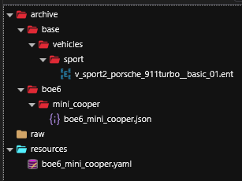
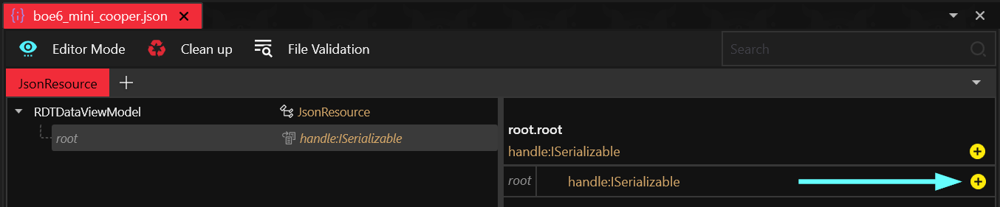
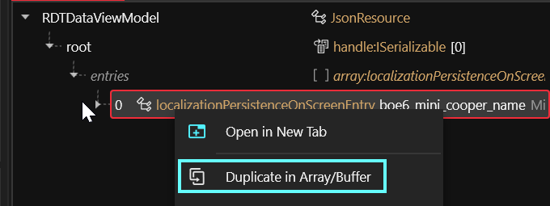
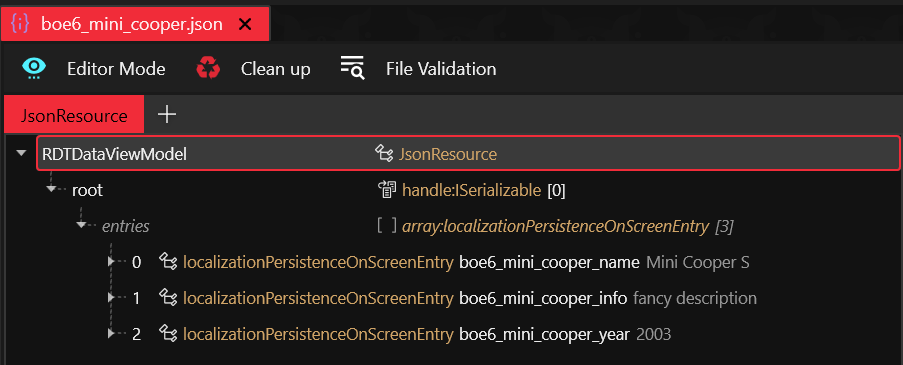
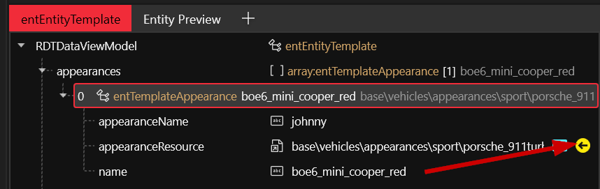
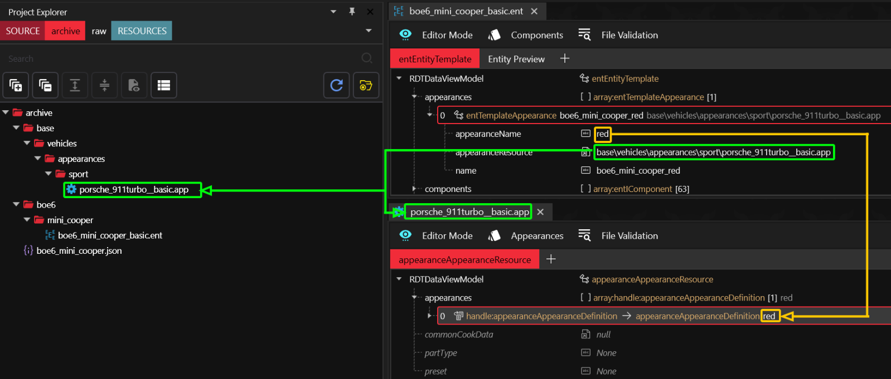
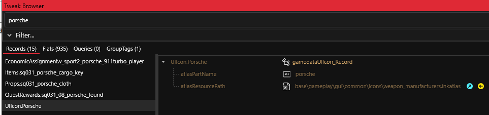

# Boe6's vehicles: Create base files

## Summary

This section will walk you through the following steps:

* [ ] [#create-a-new-tweakxl-.yaml-file](create-base-files.md#create-a-new-tweakxl-.yaml-file "mention")
* [ ] [#create-a-.json-file](create-base-files.md#create-a-.json-file "mention")
* [ ] [#add-the-.app-file](create-base-files.md#add-the-.app-file "mention")
* [ ] [#add-the-.xl-file](create-base-files.md#add-the-.xl-file "mention")

## Prerequirements

* [ ] You have Wolvenkit [installed](https://app.gitbook.com/s/-MP_ozZVx2gRZUPXkd4r/getting-started/eli5-getting-started) and set up
* [ ] &#x20;[Create a new project](https://app.gitbook.com/s/-MP_ozZVx2gRZUPXkd4r/wolvenkit-app/usage/wolvenkit-projects#create-a-new-wolvenkit-mod-project) in **WolvenKit** (wKit)
* [ ] Keep your favourite text editor ready (or get [Notepad++](https://notepad-plus-plus.org/downloads/) if you don't have one)

You need the following mods:&#x20;

* [ ] [TweakXL](https://www.nexusmods.com/cyberpunk2077/mods/4197)
* [ ] [**Cyber Engine Tweaks**](https://www.nexusmods.com/cyberpunk2077/mods/107)

## Create a new tweakXL `.yaml` file


This file contains the [tweak, ](../../../for-mod-creators-theory/core-mods-explained/tweakxl/tweakxl-changing-game-records/)which will register your car with the game's database.



The `.yaml` language organizes things by their **level of indent** - the number of spaces at the beginning of a line. This is easy to get wrong. To check your file for errors, you can use a syntax checker such as [yamllint.com](https://www.yamllint.com/).



Create a new tweakXL file by going to “**New File**” in the top left of **wkit**, just next to the **HOME** button.

<figure><figcaption></figcaption></figure>

Select **TweakDB** and **TweakXL file**. Name it something specific to your mod.\
example: `boe6_mini_cooper.yaml`

<figure><figcaption></figcaption></figure>


This file will be kept in your project's [**Resources**](https://app.gitbook.com/s/-MP_ozZVx2gRZUPXkd4r/wolvenkit-app/editor/project-explorer#resources) section.


Open the `.yaml` file in your favorite text editor. I used [**notepad++**](https://notepad-plus-plus.org/downloads/).

#### Create a new tweak entry

Put the following file contents. Don't change anything here but the first line, since we'll do that together later:

```yaml
Vehicle.boe6_mini_cooper_red:
    $base: Vehicle.v_sport2_porsche_911turbo
    appearanceName: boe6_mini_cooper_red
    displayName: boe6_mini_cooper_name
    player_audio_resource: v_car_mizutani_shion_nomad
    entityTemplatePath: base\vehicles\sport\v_sport2_porsche_911turbo__basic_01.ent
```

### What do these tweaks do?

#### `$base`:

This is the tweak record that your car will mirror.\
Chose the existing vehicle that most resembles the car you want to create. For a small sports car, that is the Porsche, for a truck, it's the Mackinaw. Later steps of this guide will show you how to fine-tune your record further.

You can look up tweak names in two ways:&#x20;

* on the [vehicles.md](../../../for-mod-creators-theory/references-lists-and-overviews/vehicles/vehicles.md "mention") page
* in Wolvenkit's Tweak Browser by searching for `Vehicle.v_NAME`. You know that you found the right entry when its first property is a `gamedataVehicle_Record`


example: `Vehicle.v_sport2_porsche_911turbo`


#### `entityTemplatePath`:

Your vehicle's [root entity](create-base-files.md#the-root-entity) file. We haven't added it yet.


we'll do this in a later step and only write it down here - you can find it as `entityTemplatePath` in your chosen tweak record, or on the [vehicles.md](../../../for-mod-creators-theory/references-lists-and-overviews/vehicles/vehicles.md "mention") page.


#### `appearanceName`:

Used to pick the appearance name (vehicle variant) in your vehicle's .ent file.&#x20;

#### `displayName:`

We haven't done this step yet - this has to match the `secondary key` in your `json` file. Keep reading!

#### `player_audio_resource`:

This line is not necessary yet. It can be swapped for another vehicle’s engine sound later with whichever sounds closest to your desired vehicle.

### Make it a player vehicle

Add your new vehicle tweak to the `vehicle_list` tweak, so the game can find it.

```yaml
Vehicle.vehicle_list.list:
  - !append Vehicle.boe6_mini_cooper
```


Note the 2 spaces, followed by a dash, followed by another space, then the `!entry`. Syntax is very important for `.yaml` files!


## Create a `.json` file


This file contains the translation strings, such as your car's name and description.


Create a `.json` file in your project and name it after your car. The process is the same as for creating the `.yaml`:

<figure><figcaption></figcaption></figure>

The option is about half way down the “**CR2W Files**” category. Name it the same as your vehicle (e.g. `boe6_mini_cooper.json`)


After creation, you can find it in your Wolvenkit project's [Archive](https://app.gitbook.com/s/-MP_ozZVx2gRZUPXkd4r/wolvenkit-app/editor/project-explorer#archive "mention") tab.


### Custompathing your files

To avoid collisions with existing game files, you need to **keep your files in their own folder**. (This process is called custompathing - you can find a guide about it [here](../../items-equipment/custompathing-assets.md).)

The easiest way fo doing that is to select your .json file in the project explorer and use [Wolvenkit's Rename dialog](https://app.gitbook.com/s/-MP_ozZVx2gRZUPXkd4r/wolvenkit-app/editor/project-explorer#rename) (Hotkey: f2), then enter your destination folder at the beginning of the file name.

Mine is `boe6/mini_cooper/`.

<figure><figcaption></figcaption></figure>

Your project file structure should now be similar to this:

<figure><figcaption></figcaption></figure>

### Adding translation entries

Open the `.json` in **wKit** by double clicking.&#x20;


Wolvenkit's [cr2w editor](https://app.gitbook.com/s/-MP_ozZVx2gRZUPXkd4r/wolvenkit-app/editor) has neither an autosave nor an undo function.&#x20;

You can (and should) frequently save your changes with `Ctrl+S` \
To reset the file to the last time you saved, you can press `Ctrl+R`


Now, we need to add a new translation entry:

<figure><figcaption></figcaption></figure>

1. Select the `root` entry in the tree view on the left
2. In the right panel, click on the yellow button next to `handle:ISerializable`
3. In the pop-up, filter for `localizationPersistenceOnScreenEntries` and select the entry
4. Click `Create`

In the left-hand tree view, the `root` entry has now become expandable.&#x20;

5. Click on the new `entries` array
6. Click the button on the right panel again to add a translation entry

#### Customize the new entry

This is your future vehicle name's translation key.

1. Select it in the tree view on the left
2. In the panel on the right, configure its options:
   * `femaleVariant``:` This is the actual display string - in this case, your vehicle's name. Put something like `Mini Cooper S`.
   * `maleVariant:` Leave this empty - `femaleVariant` is the default, and cars don't use it anyway.
   * `primaryKey:`  Leave this at `0`, it will be autogenerated later
   * `secondaryKey:` This will be referenced by your `.yaml` and must be globally unique. Give it a name that no other modder will pick, for example `boe6_mini_cooper_name` .

#### Creating the other required entries

We need two more entries. To create them, we'll simply duplicate the existing entry two times:

<figure><figcaption></figcaption></figure>

Configure the new entries as follows:

**2nd:**

`secondaryKey: boe6_mini_cooper_info`

`femaleVariant: fancy description`

**3rd:**

`secondaryKey: boe6_mini_cooper_year`

`femaleVarient: 2003`

Your final `.json` should look like this:

<figure><figcaption></figcaption></figure>

### Double-check your .yaml

Return to your `.yaml` file and make sure your vehicle’s `displayName` is your `secondaryKey` entry (see [#create-a-new-tweak-entry](create-base-files.md#create-a-new-tweak-entry "mention")).

## Test. Your. Mod.

You haven't done anything but created a new **record**, but you should be able to spawn it.

### Why we do this

Repeatedly testing your mod will let you notice the moment you break something. It's much faster to find the mistake you made in one step of the tutorial than to check an entire subsection.

For that reason, **repeat this often** (I even do it after changing a single file sometimes).

### How we do this

Complete the following steps:

1. In the Wolvenkit Toolbar, click the [Install and Launch](https://app.gitbook.com/s/-MP_ozZVx2gRZUPXkd4r/wolvenkit-app/menu/toolbar#install-and-launch) button
2. Load a save where your car wasn't added to the player yet
3.  Take the command below, and swap boe6\_mini\_cooper for the name of your vehicle:\


    ```
    Game.GetVehicleSystem():EnablePlayerVehicle('Vehicle.boe6_mini_cooper', true, false)
    ```
4. Use the [**Cyber Engine Tweaks**](https://www.nexusmods.com/cyberpunk2077/mods/107) console to run the command
5. Call the vehicle via the summon menu. (It should show up as TEST)
6. The vehicle should drive up to you with the model specified under `$base`


If your test was successful, you should create a backup of the entire Wolvenkit Project. You don't need to keep all those backups, but they might save you hours of work!


### Troubleshooting

#### The car isn't working at all

Here's what you can do:

* use [yamllint.com](https://www.yamllint.com/) to check your tweak file for syntax errors
* check the TweakXL log under [`Game Directory`](../../../for-mod-users/users-modding-cyberpunk-2077/the-cyberpunk-2077-game-directory/)`\red4ext\plugins\TweakXL`&#x20;
* check the ArchiveXL log under  [`Game Directory`](../../../for-mod-users/users-modding-cyberpunk-2077/the-cyberpunk-2077-game-directory/)`\red4ext\plugins\ArchiveXL`&#x20;

The log files won't give you much detail, but they help narrowing down the problem.

#### The car isn't added to the vehicle call list

Check if the Tweak Records have been saved correctly:

* Open the CET overlay
* Change to the TweakDB Editor
* Search for your vehicle's name
* Look for the `Vehicle.name` Record

#### The car's scan details are wrong!

Yes, we haven't hooked them up yet. Keep reading.

## The root entity

In the Asset Browser, find the base vehicle's .ent file from the [#what-do-these-tweaks-do](create-base-files.md#what-do-these-tweaks-do "mention") section, and add it to your Wolvenkit Project.

```yaml
Vehicle.boe6_mini_cooper_red:
    $base: Vehicle.v_sport2_porsche_911turbo
    appearanceName: boe6_mini_cooper_red
    displayName: boe6_mini_cooper_name
    player_audio_resource: v_car_mizutani_shion_nomad
    entityTemplatePath: base\vehicles\sport\v_sport2_porsche_911turbo__basic_01.ent
```

Move it to your custom folder (see [#custompathing-your-files](create-base-files.md#custompathing-your-files "mention")). This should already update your `.yaml` file, but let's check just to be sure:

```yaml
Vehicle.boe6_mini_cooper_red:
    $base: Vehicle.v_sport2_porsche_911turbo
    appearanceName: boe6_mini_cooper_red
    displayName: boe6_mini_cooper_name
    player_audio_resource: v_car_mizutani_shion_nomad
    entityTemplatePath: boe6\mini_cooper\boe6_mini_cooper_basic.ent
```


This is an excellent moment to test your mod.


### Remove game appearances

1. Open the .ent file in wkit by double-clicking
2. Expand the `appearances` array in the tree view on the left
3. Delete all but one appearance:&#x20;
   1. Select the appearance you want to keep
   2. Right-click to open the context menu
   3. Press the Shift-key
   4. Select "Delete all but Selection"

We’ll duplicate this appearance later when we add different colors.

4. In the panel on the right, change the value for `name`  to your `appearanceName`  from your yaml file (`boe6_mini_cooper_red`)
5. Test. Your. Mod.

## Add the `.app` file

This file contains your car's **components** for the individual appearances. You can (but don't have to) learn more about it under [appearance-.app-files](../../../for-mod-creators-theory/files-and-what-they-do/file-formats/appearance-.app-files/ "mention").

1. In your `.ent` file's `appearance` on the left side, find the `appearanceResource` field
2. Hit the yellow arrow on the right to add the file to your project

<figure><figcaption></figcaption></figure>

### Clean appearances

The appearances in this file are picked based on the `appearanceName` field in your .ent file. If you are confused now, check the image below:

1. In the `.app` file
   1. delete all appearances but one
   2. rename the last appearance to whatever you want it to be (e.g. `red`)
2. In the `.ent` file
   1. change the appearanceName field so that it matches the name from the `.app`

<figure><figcaption></figcaption></figure>

3. Test. Your. Mod.

Notice the `components` list inside the appearance settings. These are the main parts of your vehicle, and all 3D model parts are referenced through here, with a `.mesh` file.

### Custompath your file

Move your `.app` file and rename it to a relevant name, e.g. `boe6\mini_cooper\boe6_mini_cooper.app` .  See [#custompathing-your-files](create-base-files.md#custompathing-your-files "mention") for a reminder.

If you have checked the box in the dialogue, then your .ent file will have updated automatically, but double-check it regardless.

### Test your mod.

## Finish setting up tweaks.

### Add a brand icon

We’ll start with adding a logo record for the vehicle’s brand/manufacturer.

Open up your .yaml file and add a `UIIcon` Tweak Record, with a `$type: UIIcon_Record`, `atlasPartName`, and `atlasResourcePath`.\
Example:

```yaml
UIIcon.Mini_Logo:
    $type: UIIcon_Record
    atlasPartName: porsche
    atlasResourcePath: base\gameplay\gui\common\icons\weapons_manufacturers.inkatlas
```

Copy the part name and path from your mirror car’s `UIIcon_Record` Tweak, which you can find in the **tweak browser** in **wKit**:

<figure><figcaption></figcaption></figure>

We’ll update these to custom file names/paths soon.

Next create a Tweak in the `.yaml` for the vehicle’s brand. This needs `$type: VehicleManufacturer_Record`, and an `enumName`.\
Example:

```yaml
Vehicle.Mini
    $type: VehicleManufacturer_Record
    enumName: Mini_Logo
```

Now we need a gui data Tweak Record for our vehicle, with `$type: VehicleUIData`, `productionYear`, and `info: LocKey#[vehicle]_info`.\
Example:

```yaml
Vehicle.boe6_mini_cooper_data:
    $type: VehicleUIData
    productionYear: 2003
    info: LocKey#boe6_mini_cooper_info
```


The LocKey# references your entry in the `.json` file.


### Add a UI icon for the vehicle menu

Now we create a `UIIcon Record` for the vehicle’s image in the call menu, titled `vehicle_icon` or similar.\
Example:

```yaml
UIIcon.boe6_mini_cooper_icon:
    $type: UIIcon_Record
    atlasResourcePath: base\gameplay\gui\common\icons\weapons_manufacturers.inkatlas
    atlasPartName: porsche_911turbo_basic_johnny

```

Now these items can be referenced in the main vehicle tweak record. Add:

* `icon: UIIcon.[your_vehicle]_icon`
* `manufacturer: Vehicle.[brand]`

Example:

```yaml
    icon: UIIcon.boe6_mini_cooper_icon
    manufacturer: Vehicle.Mini
    vehicleUIData: Vehicle.boe6_mini_cooper_data
```

### Customize Virtual Car Dealer

Add **Virtual Car Dealer** Tweak Values. Main settings are `dealerPrice`, `dealerCred`, `dealerAtlasPath`, and `dealerPartName`. We’ll just do the first 2 for now until we create the images for **Virtual Car Dealer**. These are added to you main vehicle.\
Example:

```yaml
Vehicle.boe6_dominus_purchasable.dealerPrice: 55000
Vehicle.boe6_dominus_purchasable.dealerCred: 10
```


Note that Tweak record order is important. Those that are referenced by another record need to be defined earlier in the document.


Recommended order:

* `UIIcon.Brand_Logo:`
* `Vehicle.Brand:`
* `Vehicle.vehicle_data:`
* `UIIcon.vehicle_icon:`
* `Vehicle.vehicle:`
* `Vehicle.vehicle.[dealer settings]`
* `Vehicle.vehicle_list.list:`

Example of currently finished `.yaml`:

<pre class="language-yaml"><code class="lang-yaml">UIIcon.Mini_Logo:
    $type: UIIcon_Record
    atlasPartName: porsche
    atlasResourcePath: base\gameplay\gui\common\icons\weapons_manufacturers.inkatlas

Vehicle.Mini:
    $type: VehicleManufacturer_Record
    enumName: Mini_Logo

Vehicle.boe6_mini_cooper_data:
    $type: VehicleUIData
    productionYear: 2003
    info: LocKey#boe6_mini_cooper_info

UIIcon.boe6_mini_cooper_icon:
    $type: UIIcon_Record
    atlasResourcePath: base\gameplay\gui\common\icons\weapons_manufacturers.inkatlas
    atlasPartName: porsche_911turbo_basic_johnny

Vehicle.boe6_mini_cooper_red:
    $base: Vehicle.v_sport2_porsche_911turbo
    appearanceName: boe6_mini_cooper_red
    displayName: boe6_mini_cooper_name
    player_audio_resource: v_car_mizutani_shion_nomad
    entityTemplatePath: boe6\mini_cooper\boe6_mini_cooper_basic.ent
    manufacturer: Vehicle.Mini
<strong>    icon: UIIcon.boe6_mini_cooper_icon
</strong>    vehicleUIData: Vehicle.boe6_mini_cooper_data

Vehicle.boe6_dominus_purchasable.dealerPrice: 55000
Vehicle.boe6_dominus_purchasable.dealerCred: 10

#Vehicle.boe6_dominus_purchasable.dealerAtlasPatch: "boe6_mini_cooper_cardealer.inkatlas"
#Vehicle.boe6_dominus_purchasable.dealerPartName: "1"

Vehicle.vehicle_list.list:
  - !append Vehicle.boe6_mini_cooper
</code></pre>


## Add the `.xl` file

Now we will create the `.xl` file, which lets the game know to use our `.json` file as localization.


You should call the file `your_mod_name.archive.xl`,  so that it will stay close to the packed mod.


Create a new file in **wkit** as done before. Under the **ArchiveXL** category, select “**ArchiveXL file**”.&#x20;

This file will be in your project's resources section, and should automatically open in your default text editor.&#x20;

Put the following content to load your translation file:

```json
localization:
    onscreens:
        en-us: boe6\mini_copper\boe6_mini_cooper.json
```

### Save and test

The vehicle’s call menu should now show the vehicle’s name as specified in the `.json`, as well as the description info text.


Note that any/all `.xl` and `.yaml` files in the resources folder of your project will automatically load in-game.


## To the next step!

In this step, we have&#x20;

* added a new car to the game by adding a tweak record
* added a new car manufacturer to the game by adding a tweak record
* made sure that our new car uses our own custom files and is independent from other mods
* added it to Virtual Car Dealer
* added custom UI icons

Now we'll proceed with adding a custom 3d model. Read on under [3d-body-modeling-import-export-meshes.md](3d-body-modeling-import-export-meshes.md "mention")
