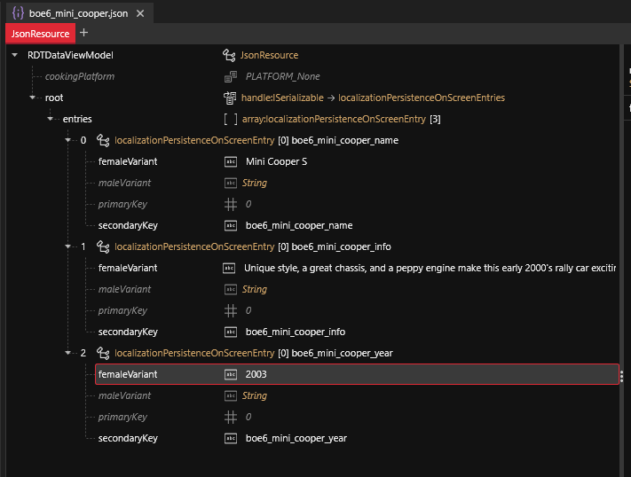
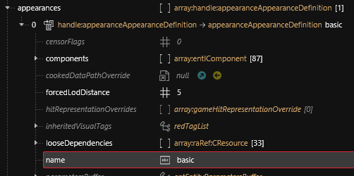

# 🗃️ Boe6's vehicles: Create base files

#### Summary

This page will show you how to create the base .yaml, .json, & .xl files that will tell your game about the new car.

* [ ] [Create a new project](https://app.gitbook.com/s/-MP_ozZVx2gRZUPXkd4r/wolvenkit-app/usage/wolvenkit-projects#create-a-new-wolvenkit-mod-project) in **WolvenKit** (wKit).


Make sure you installed TweakXL.


### Create a new tweakXL `.yaml` file


This file contains the [tweak ](../../../for-mod-creators-theory/core-mods-explained/tweakxl/tweakxl-changing-game-records/)which will register your car with the game's database.

After creation, you can find it in your Wolvenkit project's [resources](https://app.gitbook.com/s/-MP_ozZVx2gRZUPXkd4r/wolvenkit-app/editor/project-explorer#resources) tab.


Create a new tweakXL file by going to “**New File**” in the top left of **wkit**, just next to the **HOME** button.

<figure><figcaption></figcaption></figure>

Select **TweakDB** and **TweakXL file**. Name it something specific to your mod.\
example: “`boe6_mini_cooper.yaml`”

<figure><figcaption></figcaption></figure>

Open the `.yaml` file in your favorite text editor. I used **notepad++**.

Create a new tweak entry for your model.

```yaml
Vehicle.boe6_mini_cooper_red:
    $base: Vehicle.v_sport2_porsche_911turbo
    appearanceName: boe6_mini_cooper_red
    displayName: boe6_mini_cooper_name
    player_audio_resource: v_car_mizutani_shion_nomad
    entityTemplatePath: boe6\mini_cooper\boe6_mini_cooper_basic.ent
```

#### Explanation of each tweak:

#### `$base`:

* This should be set to the most similar in-game vehicle to your project. This is the tweak record that your car will mirror unless you set your own. You can find tweak names in the wKit tweak browser, search for the source car in the search bar on top. Look for `Vehicle.v_NAME`, it’s first entry should be “`gamedataVehicle_Record`”
  * example: “`Vehicle.v_sport2_porsche_911turbo`”
* Choose an existing vehicle in Cyberpunk 2077 that most resembles the vehicle you want to create. For a small sports car, the Porsche is closest. While if you're making a truck, consider the Mackinaw. Whichever you choose, this will become the base vehicle that we will edit into becoming the vehicle we desire.

#### `appearanceName`:

* Needs to be set to the appearance name in the vehicle’s `.ent` file. The `.ent` file can be found inside your source vehicle’s tweak records. Locate the vehicle’s tweaks like before, `Vehicle.v_sport2_porsche_911turbo` for example, and scroll down for an entry titled “`entityTemplatePath`”. It should have an entry similar to this:
  * “`Base\vehicles\sport\v_sport2_porsche_911turbo__basic_01.ent`”
  * Save this .ent file path for later.

#### `displayName:`

* Set to match your `json` file as done below.

#### `player_audio_resource`:

* This line is not necessary yet. It can be swapped for another vehicle’s engine sound later with whichever sounds closest to your desired vehicle.

#### `entityTemplatePath`:

* This is the file we just added in the `appearanceName` step earlier. To easily get this: in the project explorer, right click on the file and hit **rename**, or press **F2**. In the open window you can copy the path starting at `base/…` You can also copy the relative path by right clicking the file and selecting “_copy relative path_”. Now you can paste it into the `.yaml` entry.

Add your new vehicle tweak to the `vehicle_list` tweak, so the game can find it.

```yaml
Vehicle.vehicle_list.list:
  - !append Vehicle.boe6_mini_cooper
```


Note the 2 spaces, followed by a dash, followed by another space, then the `!entry`. Syntax is very important for `.yaml` files


### Create a `.json` file


This file contains the translation strings, such as your car's name and description.

After creation, you can find it in your Wolvenkit project's [Archive](https://app.gitbook.com/s/-MP_ozZVx2gRZUPXkd4r/wolvenkit-app/editor/project-explorer#archive "mention") tab.


Create a `.json` file in your project, the same as creating the `.yaml`. The option is about half way down the “**CR2W Files**” category. Name it the same as your vehicle (e.g. “`boe6_mini_cooper.json`”)

<figure><figcaption></figcaption></figure>

You’ll want to create your own project path at this point. With your mouse over the new `.json` file, on the right side hit the yellow “**open in explorer**” button to find the `.json` file in your file explorer, you should see just your `.json` file and a “`base`” folder. Create a new folder/path for your project files here. I created “`boe6/mini_cooper/`”. Now in **wkit**, move your `.json` into the new folder.

Your project file structure should now be similar to this:\\

<figure><figcaption></figcaption></figure>

Open the `.json` in **wKit** by double clicking.

Under `RDTDataViewModel`, click on “`root`” : `handle:ISerializable`.

“`root.root`” will appear on the right side. Next to `handle:ISerializable`, click the yellow “**Create Handle**” button.

In the window that opens, click on the bottom text box to type in the following:

“`localizationPersistenceOnScreenEntries`”

You can use the autofill. Click “**create**”


Notice that you have to manually save items in this window. Ctrl+S works. Same rule applies for `.ent` files, `.app` files, and any other files edited directly in **wkit**.


Now under `RDTDataViewModel`, “`root`” is expandable. Click on the entries array under “`root`”.

Now on the right side, click “**Create Item In Array**”

Now we'll customize the new entry. Expand the item options and complete it to these values:

* “`primaryKey`” can be left at `0`, and “`maleVarient`” can be left blank.
* “`secondaryKey`” is what your `.yaml` is referencing. This is the name given that will link to the `.yaml`.\
  Example: “`boe6_mini_cooper_name`”
* “`femaleVariant`” is the actual display string. In this case, the vehicle’s name as it should be shown in the menus. Example: “`Mini Cooper S`”

Create 2 more entries in the array by right clicking the first array entry we just created, and hit “d**uplicate item in array/buffer**” as shown:\\

<figure><figcaption></figcaption></figure>

Swap the 2nd and 3rd string values for your vehicle’s `year` and `description` text.

example:

**2nd:**

`secondaryKey: boe6_mini_cooper_info`

`femaleVariant: fancy description`

**3rd:**

`secondaryKey: boe6_mini_cooper_year`

`femaleVarient: 2003`

\\

Final `.json` should look similar this:

<figure><figcaption></figcaption></figure>

Return to your `.yaml` file and make sure your vehicle’s “`displayName`” is your `secondaryKey` entry. See earlier `.yaml` screenshot.

At this point you can test your mod to see if it loads in-game correctly. In general, you’ll want to launch the game and test as often as you can. I recommend changing one file at a time and testing each along the way to easily diagnose issues.

In **wKit**, at the end of the same line as “**New File**”, there is an “**Install**” button. For ease of testing, click the down arrow to show options and switch to “**Install and Launch**”. Now press “**Install and Launch**” to test the mod in-game.

Once in-game, you can use the [**Cyber Engine Tweaks**](https://www.nexusmods.com/cyberpunk2077/mods/107) console to add the vehicle to your inventory. Swap “`boe6_mini_cooper`” for your vehicle’s Tweak Record.

Command Example:

```
Game.GetVehicleSystem():EnablePlayerVehicle('Vehicle.boe6_mini_cooper', true, false)
```

It should show up as “**TEST**” in the vehicle call menu, as we haven't linked the json file to our mod yet. Once you call it, it should drive up with the model you are mirroring.


If at any point the result is not the one expected you can find the TweakXL log in \`(Game Dir)\red4ext\plugins\TweakXL\` and the ArchiveXL log in \`(Game Dir)\red4ext\plugins\ArchiveXL\`. It may not tell you what's wrong in great detail, but it will help you narrow down and fix the issue, or verify that there is none.


If the command does not add your vehicle to the vehicle call list, check if the `Tweak Records` have been saved correctly. To do this, open the **TweakDB Editor** in the **CET** overlay. Search for your vehicle’s name, and look for the `Vehicle.name` Record.


Note that the vehicle’s scan details will not be correct yet. The vehicle model and description will display as loading.


Grab the base vehicle's .ent file we found earlier (when doing tweaks). Add it to your Wolvenkit Project files.

Move the source vehicle’s `.ent` file into your custom path. Copy the file’s new path and update your `.yaml` tweak record so `entityTemplatePath` is linking to that new path.

Example:

```yaml
Vehicle.boe6_mini_cooper_red:
    $base: Vehicle.v_sport2_porsche_911turbo
    appearanceName: boe6_mini_cooper_red
    displayName: boe6_mini_cooper_name
    player_audio_resource: v_car_mizutani_shion_nomad
    entityTemplatePath: boe6\mini_cooper\v_sport2_porsche_911turbo__basic_01.ent
```

Save the file, and test again by using the **Install and launch** button. Load a save from before you’ve used the summon command in **CET** console.

Rename the `.ent` file and update the tweak in `.yaml`, like last step.

Example:

“`boe6\mini_cooper\boe6_mini_cooper_basic.ent`”

```yaml
Vehicle.boe6_mini_cooper_red:
    $base: Vehicle.v_sport2_porsche_911turbo
    appearanceName: boe6_mini_cooper_red
    displayName: boe6_mini_cooper_name
    player_audio_resource: v_car_mizutani_shion_nomad
    entityTemplatePath: boe6\mini_cooper\boe6_mini_cooper_basic.ent
```

Now we’ll clean up the `.ent` file. Open it in **wkit** by double clicking. Under “`RDTDataViewModel`”, open the “`appearances`” array.

Find the appearance you’re currently mirroring and make note of it. Then select all the other appearances with ctrl+click, then right click and hit “**Delete Selection in Array/Buffer**”. This will leave you with one appearance. We’ll duplicate this later when we get to adding different paint colors.

Edit the “`name`” value to edit the array item. In my case, I change it from “`porsche_911turbo__basic_johnny`” to “`boe6_mini_cooper_basic`”

Also update your `.yaml` tweak to this for the `appearanceName` value.

Save, **Install and Launch**, test that it still works.

### Add the `.app` file


This file contains your car's **components** for the individual appearances. You can read up about [appearance-.app-files](../../../for-mod-creators-theory/files-and-what-they-do/appearance-.app-files "mention") at the link.


Add the `.app` file to your project. Find it by navigating to the `appearanceResource` in your main appearance, which links to an `.app` file. Hit the yellow “**Add File to Mod**” button.

You’ll want to clean the appearances from this file as well. In the `.ent` file, note the `appearanceName` value. Then look at the `.app` file for the matching item in the list. That is the appearance we want to keep. The other appearances can be deleted as you did with the `.ent` file.

Now we can edit the appearanceName to an appropriate value related to our car.

Example:

<figure><figcaption></figcaption></figure>

And update it in your `.app` file as well in the “`name`” value:

<figure><figcaption></figcaption></figure>

Save and test. Get in the habit of testing often!

Notice the “`components`” list inside the appearance settings. These are the main parts of your vehicle, and all 3D model parts are referenced through here, with a `.mesh` file.

Move your `.app` file and rename it to a relevant name.\
Example:

“`boe6\mini_cooper\boe6_mini_cooper.app`”

Update your `.ent` file so the `appearanceResource` value matches the new file name & path.

Install & Test.

### Finish setting up tweaks.

We’ll start with adding a logo record for the vehicle’s brand/manufacturer.

Open up your .yaml file and add a `UIIcon` Tweak Record, with a `$type: UIIcon_Record`, `atlasPartName`, and `atlasResourcePath`.\
Example:

```yaml
UIIcon.Mini_Logo:
    $type: UIIcon_Record
    atlasPartName: porsche
    atlasResourcePath: base\gameplay\gui\common\icons\weapons_manufacturers.inkatlas
```

\\

Copy the part name and path from your mirror car’s `UIIcon_Record` Tweak, which you can find in the **tweak browser** in **wKit**:

<figure><figcaption></figcaption></figure>

We’ll update these to custom file names/paths soon.

Next create a Tweak in the `.yaml` for the vehicle’s brand. This needs `$type: VehicleManufacturer_Record`, and an `enumName`.\
Example:

```yaml
Vehicle.Mini
    $type: VehicleManufacturer_Record
    enumName: Mini_Logo
```

Now we need a gui data Tweak Record for our vehicle, with `$type: VehicleUIData`, `productionYear`, and `info: LocKey#[vehicle]_info`.\
Example:

```yaml
Vehicle.boe6_mini_cooper_data:
    $type: VehicleUIData
    productionYear: 2003
    info: LocKey#boe6_mini_cooper_info
```


The LocKey# references your entry in the `.json` file.



Now we create a `UIIcon Record` for the vehicle’s image in the call menu, titled `vehicle_icon` or similar.\
Example:

```yaml
UIIcon.boe6_mini_cooper_icon:
    $type: UIIcon_Record
    atlasResourcePath: base\gameplay\gui\common\icons\weapons_manufacturers.inkatlas
    atlasPartName: porsche_911turbo_basic_johnny

```

Now these items can be referenced in the main vehicle tweak record. Add:

* `icon: UIIcon.[your_vehicle]_icon`
* `manufacturer: Vehicle.[brand]`

Example:

```yaml
    icon: UIIcon.boe6_mini_cooper_icon
    manufacturer: Vehicle.Mini
    vehicleUIData: Vehicle.boe6_mini_cooper_data
```


Add **Virtual Car Dealer** Tweak Values. Main settings are `dealerPrice`, `dealerCred`, `dealerAtlasPath`, and `dealerPartName`. We’ll just do the first 2 for now until we create the images for **Virtual Car Dealer**. These are added to you main vehicle.\
Example:

```yaml
Vehicle.boe6_dominus_purchasable.dealerPrice: 55000
Vehicle.boe6_dominus_purchasable.dealerCred: 10
```


Note that Tweak record order is important. Those that are referenced by another record need to be defined earlier in the document.


Recommended order:

* `UIIcon.Brand_Logo:`
* `Vehicle.Brand:`
* `Vehicle.vehicle_data:`
* `UIIcon.vehicle_icon:`
* `Vehicle.vehicle:`
* `Vehicle.vehicle.[dealer settings]`
* `Vehicle.vehicle_list.list:`

Example of currently finished `.yaml`:

<pre class="language-yaml"><code class="lang-yaml">UIIcon.Mini_Logo:
    $type: UIIcon_Record
    atlasPartName: porsche
    atlasResourcePath: base\gameplay\gui\common\icons\weapons_manufacturers.inkatlas

Vehicle.Mini:
    $type: VehicleManufacturer_Record
    enumName: Mini_Logo

Vehicle.boe6_mini_cooper_data:
    $type: VehicleUIData
    productionYear: 2003
    info: LocKey#boe6_mini_cooper_info

UIIcon.boe6_mini_cooper_icon:
    $type: UIIcon_Record
    atlasResourcePath: base\gameplay\gui\common\icons\weapons_manufacturers.inkatlas
    atlasPartName: porsche_911turbo_basic_johnny

Vehicle.boe6_mini_cooper_red:
    $base: Vehicle.v_sport2_porsche_911turbo
    appearanceName: boe6_mini_cooper_red
    displayName: boe6_mini_cooper_name
    player_audio_resource: v_car_mizutani_shion_nomad
    entityTemplatePath: boe6\mini_cooper\boe6_mini_cooper_basic.ent
    manufacturer: Vehicle.Mini
<strong>    icon: UIIcon.boe6_mini_cooper_icon
</strong>    vehicleUIData: Vehicle.boe6_mini_cooper_data

Vehicle.boe6_dominus_purchasable.dealerPrice: 55000
Vehicle.boe6_dominus_purchasable.dealerCred: 10

#Vehicle.boe6_dominus_purchasable.dealerAtlasPatch: "boe6_mini_cooper_cardealer.inkatlas"
#Vehicle.boe6_dominus_purchasable.dealerPartName: "1"

Vehicle.vehicle_list.list:
  - !append Vehicle.boe6_mini_cooper
</code></pre>


### Add the `.xl` file

Now we will make our `.xl` file.

This file lets the game know to use our `.json` file as localization.

Create a new file in **wkit** as done before. Under the **ArchiveXL** category, select “**ArchiveXL file**”. It should automatically open in your default text editor. Edit it with just 3 lines, a file structure for the `.json` file.\
Example:

```json
localization:
    onscreens:
        en-us: boe6\mini_copper\boe6_mini_cooper.json
```

Save and test.

The vehicle’s call menu should now show the vehicle’s name as specified in the `.json`, as well as the description info text.

Rename your `.xl` file to something appropriate. Files can cause issues if you use the same file name as another mod. Example:

“`resources\boe6_mini_cooper.xl`”


Note that any/all `.xl` and `.yaml` files in the resources folder of your project will automatically load in-game.


