# 🦴 Boe6's vehicles: Rigging; Making meshes move


The `.rig` file ("armature" or "skeleton") is what makes your mesh move in the game. You can find more information about that on the [meshes-and-armatures-rigging](../../../for-mod-creators-theory/3d-modelling/meshes-and-armatures-rigging/ "mention") page.


Parts that require a `.rig` file will not import the same as other meshes. For example, the bumper’s 3D models are not positioned in-line with the `body_01` object in **blender**. Bumpers are centered around the **origin** of the 3D space. The part is then lined up correctly with the `.rig` file, which is linked in the `.ent` file.&#x20;

To model the front bumper, we’ll first export the base game bumper as `.glb`, and import into our **blender** project. As you can see, the game model is positioned around the origin, unlike the custom bumper.


If you already import the entire vehicle with the Blender script, you can skip some of this guide. Make sure to be extra careful about the object's origin, as that is what controls the rotation center. Read more below.


<figure><figcaption>
Note the origin marker at the cross between the red and green axis lines.
</figcaption></figure>

Move it with the move tool, so the corner of the bumper is at the origin and **apply all transforms**.

<figure>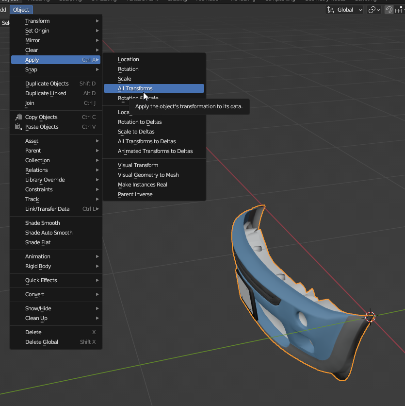<figcaption></figcaption></figure>

If you do not have the rig file already, you can now add it to the project. Open your vehicle’s `.ent` file and open this path: `RDTDataViewModel > components > deformation_rig > rig`&#x20;

Add the file to the project, and rename/move it. \
Example: “`boe6\mini_cooper\boe6_mini_cooper.rig`”&#x20;

Update the `.ent` rig path with the new file:

<figure>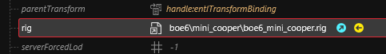<figcaption></figcaption></figure>

You can also update the .rig path in your vehicle’s .anims file, as well as the rig references here:

* `.ent file > RDTDataViewModel > resolvedDependencies > 0 > .anims file path`
* `.ent file > RDTDataViewModel > components > vehicle_rig > animations > gameplay > 0 > animSet`
* `.ent file > RDTDataViewModel > components > deformation_rig > animations > gameplay > 0 > animSet`

Add it to your project, rename and move it as usual. Then in the `.anims` file, set the rig path to the new one we just created:

<figure>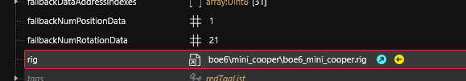<figcaption>
<code>.anims file > RDTDataViewModel > rig</code>
</figcaption></figure>

Additionally update these paths to your `.anims` file.

Open the .rig file and notice these 3 arrays:

<figure>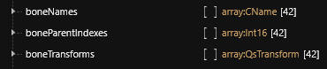<figcaption></figcaption></figure>

These map all the position data of each `.mesh` file. \
`boneNames` tells you which index value is each item, `boneParentIndex` tells you what each bone’s parent is (example; `wheel_back_left` is a child of `suspension_back_left`. If you change suspension position, wheel will move with it.), and `boneTransforms` is the positional and rotational values for each bone.&#x20;

For a reference of where the bones are in a model, you can export the vehicle’s `.anims` file to `.glb` and import it into **blender**. You can select each bone to see their name and properties. \
Example:

<figure>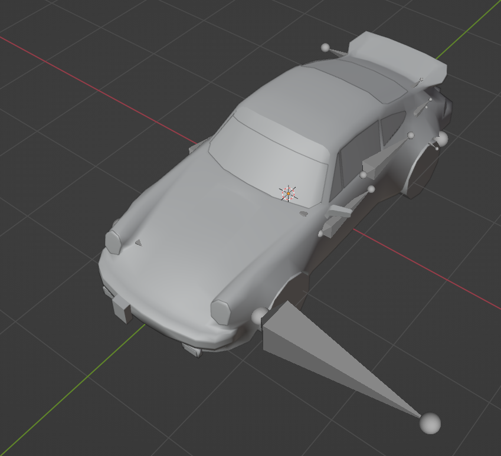<figcaption></figcaption></figure> <figure><figcaption></figcaption></figure>

Your `0,0,0` position should be in the center of the vehicle. Here is the translation data for each of the suspension wheels of a vanilla car (porsche):

<figure>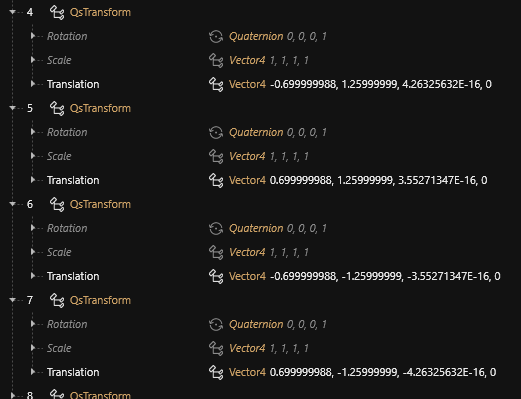<figcaption></figcaption></figure>

These are `frontLeft`, `frontRight`, `backLeft`, and `backRight` respectively. The Translation values are `XYZ` values:

* &#x20;`(-) x` = left of car, driver side
* `(+) x` = right of car, passenger side
* &#x20;`(-) y` = back of car
* `(+) y` = front of car
* &#x20;`(-) z` = bottom of car
* `(+) z` = top of car.

It may help to visualize the car as if from a top-down ariel view, left is `-x`, right is `+x`, up is `+y`, down is `-y`.

You’ll need to update the `.mlmask` and `.mlsetup` files in these `.mesh` files as well, however they may show up at a different location. If they are not listed under “`localMaterialBuffer`”, check under the “`preloadLocalMaterialInstances`” array. The masks set should be in there instead.

Modify the existing `X Y Z` values for the bumper, changing one value at a time to see the amount changed. I suggest starting with a value of +/- 0.1.&#x20;

For moving parts, such as hoods and doors, we start by replacing the 3D model. Notice the rotation point in-game is a pivot along the origin in 3d space:

<figure><figcaption></figcaption></figure>

In my case, I have my hood aligned forward, as the axis should be further behind in the real vehicle.

Your part will not align at first. If it is a large distance, try to adjust the 3D model first. Keep in mind the pivot will be the origin, so only adjust in the axis you can edit without messing with how the part will move(left/right for hood/trunk, up/down for doors). Once it’s close, you can adjust the `.rig` file as well to get it positioned correctly:

<figure>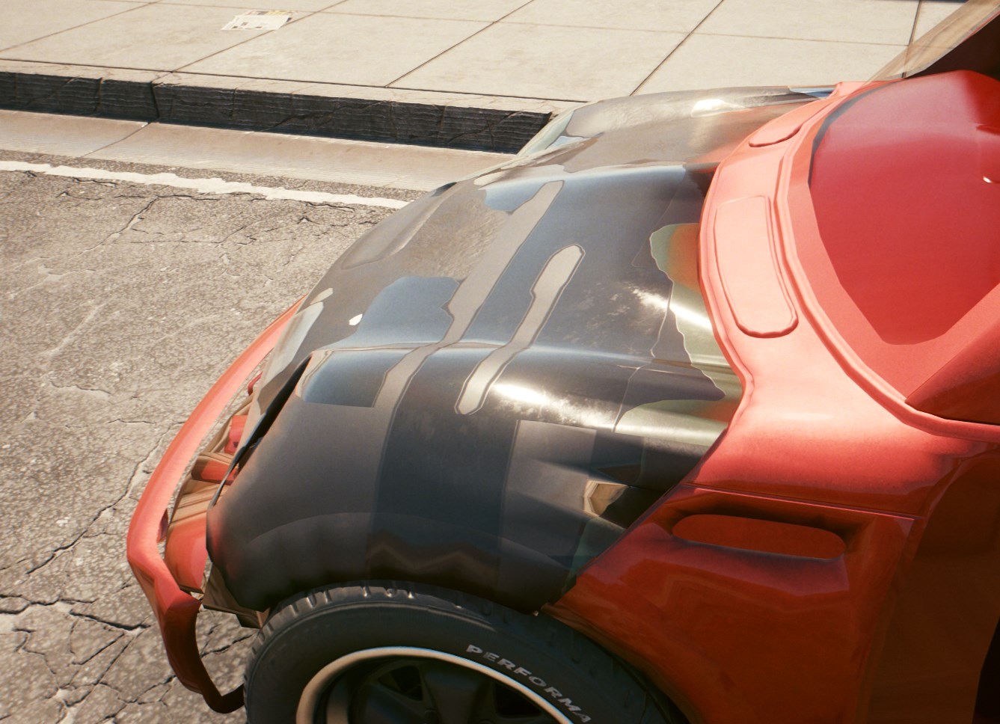<figcaption>
Before
</figcaption></figure>

<figure><figcaption>
After
</figcaption></figure>

Swap the `.mesh`’s `.mlmask` and `.mlsetup` to the same as your `body_01` has set. (or to whatever other file you need)

You can also change how components are connected in the vehicle rig.

* For components that don’t have their own movement or bones, they are attached to another component that does. This can be changed to attach a model to another model’s movement.
* `.app` file “`RDTDataViewModel > appearances > 0 > components > entPhysicalMeshComponent > parentTransform > bindName`” \
  Example:

<figure>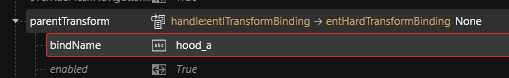<figcaption></figcaption></figure>

* Components that do have their own bones are set to the bindName “`vehicle_slots`”, and their `slotName` is set to a `boneName` value in the `.rig` file. \
  Example of `body_01` in `.app`:

<figure>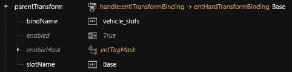<figcaption></figcaption></figure>

If a component is linked to another component, we cannot use the `.rig` file to move it. Instead, in the `.app` file is each component’s `localTransform`. This can be used to change the position and orientation relative to the parent component. \
Example:

<figure>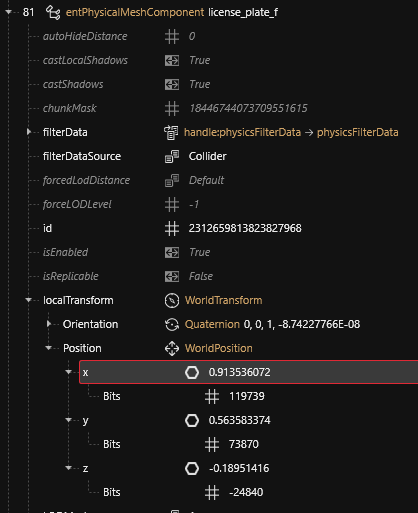<figcaption></figcaption></figure>

Notice that the x,y,z position is saved as `Bits`, instead of as a `float`. To edit the positon data here, we need to convert from a float value to a fixed bit value.


The latest release of Wolvenkit nightly seems to do the conversion automatically for you now.


The code for this conversion was written by _Loomy(Loomy#3375)_ on the modding discord, [here.](https://discord.com/channels/717692382849663036/803201431657250857/817474706973392906)

This can be run in a python console:

* `int( ( n * pow(2,32) ) ) >> 15`

Where “n” is a float value.

<figure>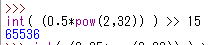<figcaption></figcaption></figure>

If you do not have **python** installed, you can try an online console, such as [here.](https://www.programiz.com/python-programming/online-compiler/) (paste the command into the “shell” side on the right, and hit enter)

Rigging wheels requires a 2nd `.rig` file that is used for vehicle handling. It is referenced here:

* `.ent file > RDTDataViewModel > components > vehicle_rig > rig (path to wheelbase rig)`

You can add this new rig to your project and rename/move it.&#x20;

Notice that the new rig file only has wheel related bones:

<figure><figcaption></figcaption></figure>

This is the rig file that is referenced for vehicle wheel handling. It controls where the wheels/suspension are located. This file overwrites the values in the `deformation_rig` created earlier.

To update the wheels, generally you want to modify the suspension bones. Since the `wheel_front_left`, `wingarm_front_left`, and `break_front_left` are all parented to `suspension_front_left`, updating the location for suspension also keeps the brakes and swingarms in the correct position relative to the wheel.

If the suspension values are updated/changed in the `vehicle_rig`, the `deformation_rig` may cause issues in some cases. To avoid this, rename the `boneNames` in the `deformation_rig` that are the same as the `vehicle_rig`. This ensures that the vehicle only uses the `vehicle_rig` values. Do not rename front wheel suspension in the `deformation_rig`, as it will break wheel turning.


Some users report success with renaming and edits when only editing the Y value of suspension. X and Z changes will likely break vehicle turning. Try at your own risk.


For the **Mini Cooper**, I edited all 4 suspension positions in the `vehicle_rig` to update wheel positions, so I renamed the 2 front in the `deformation_rig` (excluding the front, as described above):

<figure>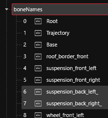<figcaption></figcaption></figure>

You can update the wheels by first replacing all the wheel and tire meshes with ones to match your vehicle. This is similar to how the doors, windows, and hood function.

For the wheel to rotate properly, make sure to have the center of the wheel as the mesh’s origin. \
Example:

<figure>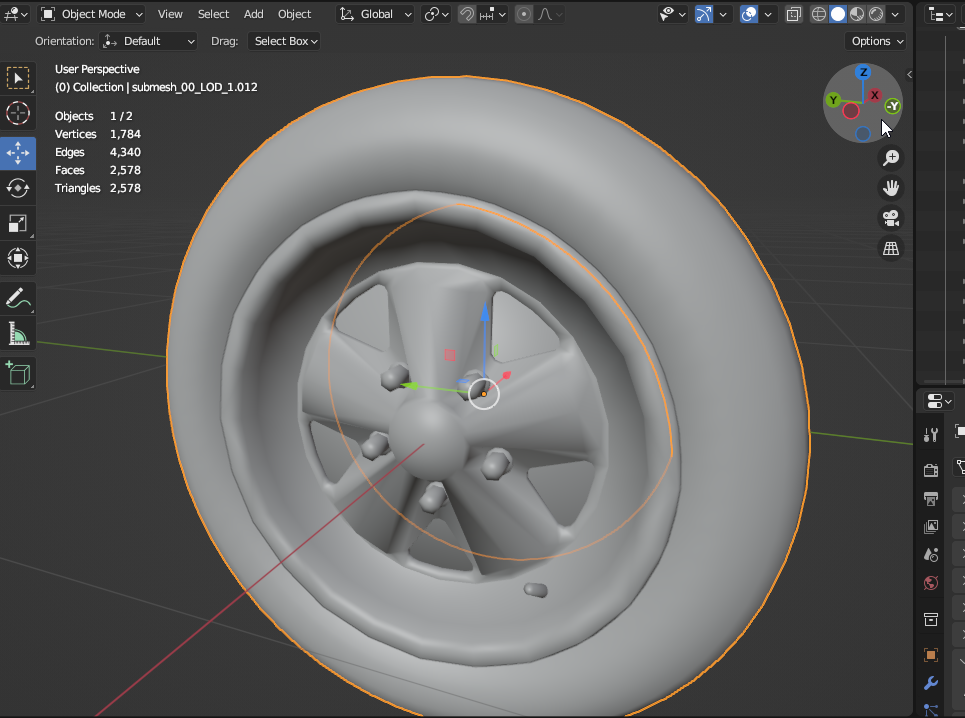<figcaption></figcaption></figure>

Once the wheel model is updated, you need to update size data of the wheels.

This is set in your vehicle's tweaks. `vehWheelDimentionsSetup` contains both front and back settings. Update rimRadius, tireRadius, tireWidth, & wheelOffset to match your model's size.&#x20;


These values should macth 1:1 with meters. \*not confirmed.


<figure>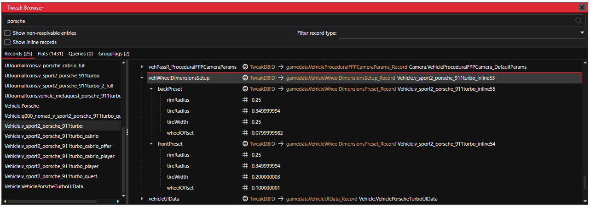<figcaption>
Example base game vehWheelDimensions tweaks
</figcaption></figure>


Thanks to MAX\_SA5 for finding these controls!


Save and test!


Below is an older method which is no longer recommended. In all vanilla vehicles, the scale factor is set to 1.0 and is not used to control wheel size. CDPR (and myself) recommend using tweaks.

It has been kept documented here as a reference and for niche use cases.


As an additional method of controlling the wheel size, you can update the `.rig` files.

In both the `deformation_rig` and `vehicle_rig`, find the wheel bones (`wheel_back_left`, `wheel_front_right`, etc.) and update the `Scale` values. \
Example:

<figure><figcaption></figcaption></figure>

<figure><figcaption></figcaption></figure>

The wheels should now be making proper contact with the ground!
