# 🖌️ Boe6's vehicles: Textures & Materials

## Summary

Published: Nov 5, 2023 by Meta Pixel\
Last documented edit: Oct 15 2024 by [manavortex](https://app.gitbook.com/u/NfZBoxGegfUqB33J9HXuCs6PVaC3 "mention")

This guide is part of [.](./ "mention") and covers the material part of it.


By default, cars use the [multilayered shader](../../../for-mod-creators-theory/materials/multilayered/). You can find guides about editing multilayered material linked at the top of the documenation page that may help you if you get stuck.


### Wait, this is not what I want!

To learn more about materials, you can browse [cheat-sheet-materials.md](../../../for-mod-creators-theory/references-lists-and-overviews/cheat-sheet-materials.md "mention") and its sub-pages.

This guide assumes you've followed the previous pages, and have working 3D vehicle models imported into the game. (with broken textures)

## Let's get started

### `.mlmask` , .`mlmaskset` & `.masklist`

To fix the odd textures that appear after importing your custom models, we have to edit the `.mlmask` layers.

Find the `.mlmask` corresponding file by opening a `.mesh` in **wkit** to edit. Go to the path:

* `RDTDataViewModel > localMaterialBuffer > materials > 0 (...maskset) > values > 0 > value`

Add the `.mlmask` to the project.

Rename and move the `.mlmask` file into your project filepath. \
Example:

“`boe6\mini_cooper\meshes\textures\boe6_mini_cooper_exterior_maskset.mlmask”`

Export the `.mlmask` file. It should result in a `.masklist` file and a folder with `.png` files inside:

<figure><figcaption></figcaption></figure>

Notice the first white image, and the remaining black images with white cutouts.

These textures don’t map onto the new vehicle’s mesh correctly. These can be edited to add more detail to your model.&#x20;

As a temporary solution, we can edit the first image to be pure white, and the rest to be pure black. Example:

<figure>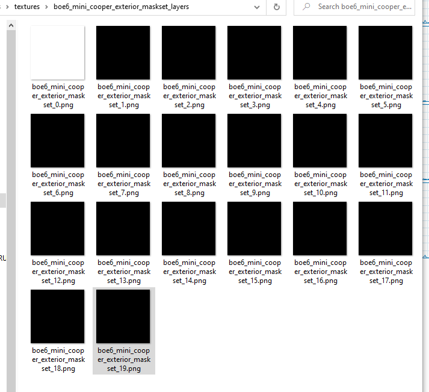<figcaption></figcaption></figure>

Import the `.masklist` file

Update your `.mesh` file with the new `.mlmask` name/path file:

* `RDTDataViewModel > localMaterialBuffer > materials > 0 (...maskset) > values > 0 > value`


Note that you will need every .mesh file to have a corrected .mlmask path.


Your vehicle should now be much smoother.

<figure>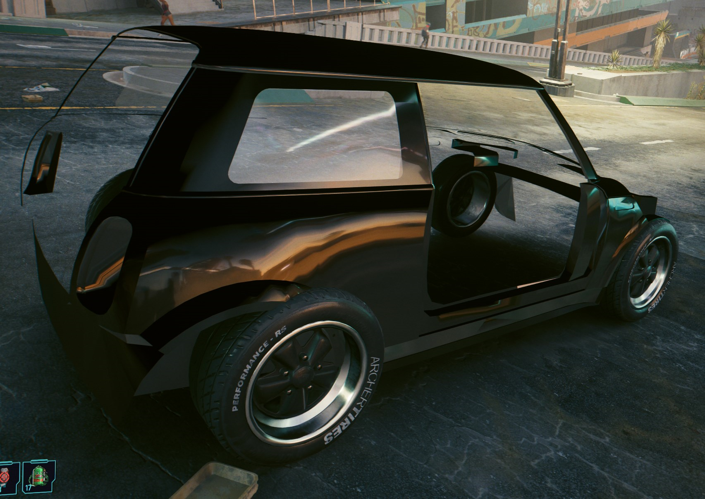<figcaption></figcaption></figure>

### Basics of .mlsetup and MLsetupBuilder


This Guide will keep information specific to vehicle modding. For a more in-depth guide on MLSB, check out the dedicated wiki page: [https://wiki.redmodding.org/cyberpunk-2077-modding/for-mod-creators-theory/modding-tools/mlsetup-builder](https://wiki.redmodding.org/cyberpunk-2077-modding/for-mod-creators-theory/modding-tools/mlsetup-builder)


To change paint color, we need to edit the `.mlsetup` file.

You will need the **MLsetupBuilder** plugin for editing these files. Install it in **wkit**:

* **HOME button** (top left) **> Plugins** (left list) **> MLsetupBuilder**, right side, install.
* Once installed, hit open. It will open a folder with a “**MlsetupBuilder.exe**” executable. Run it to open the program.

The `.mlsetup` file we need is linked in the `.mesh` file, similar to the `.mlmask`:

* &#x20;`RDTDataViewModel > localMaterialBuffer > materials > 0 / masksset > values > MultilayerSetup > Value`

Add this `.mlsetup` file to the project. Rename and move it. \
Example:

“`boe6\mini_cooper\meshes\textures\boe6_mini_cooper_exterior.mlsetup`”

Convert the `.mlsetup` file into `.json` by right clicking:

<figure>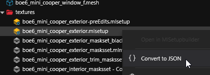<figcaption></figcaption></figure>

Open **MlsetupBuilder**.

Import the `.mlsetup.json` file by hitting the arrow in the top left:

<figure><figcaption></figcaption></figure>


You can also right-click on the .mlsetup.json file and choose "Open in MlSetupbuilder". The file will be automatically loaded when it opens.


Once you open the file, a window will appear on the left with a list of materials. These are the texture layers of your mesh.&#x20;


Note that layers 0,1,2,etc are linked the .mlmask layers.


At the top is a large orange button titled “**Import the Multilayer Setup >>**”. Click it to load the `.mlsetup` file into the editor. It should populate the Layers list:

<figure>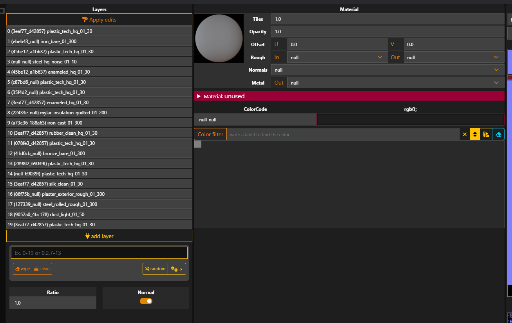<figcaption></figcaption></figure>

Now, assuming you created a `.mlmask` file similar to our previous steps, with all but 1 black image (see below), we know only the first layer, Layer 0, is the only one that will currently render on our `.mesh`

<figure>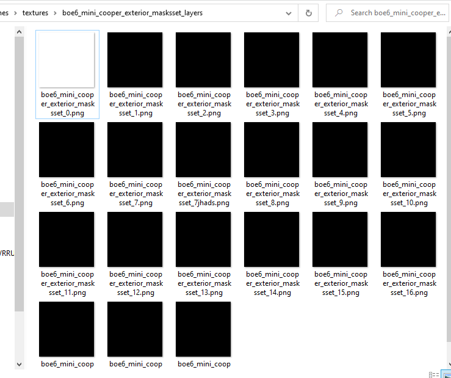<figcaption></figcaption></figure>

Since Layer 0 is the visible layer, select it and it will load in the **Material view**:

<figure>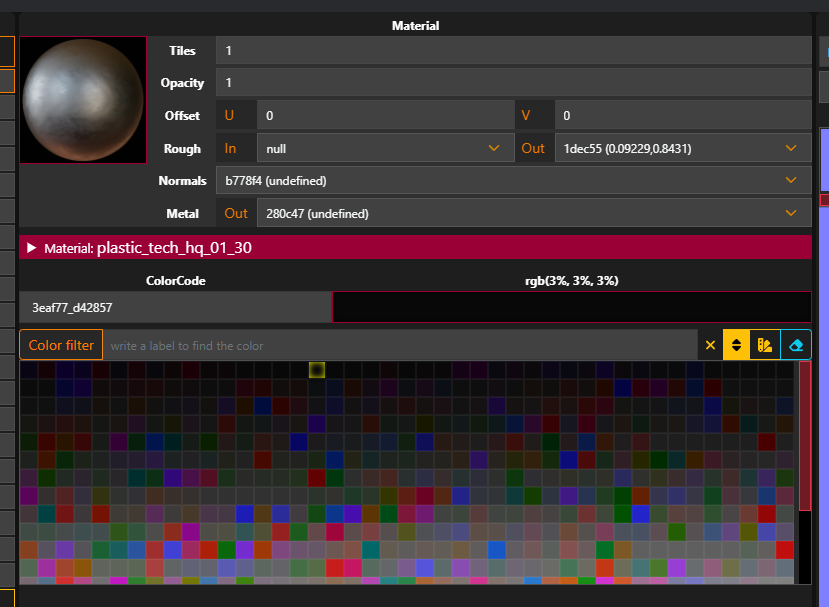<figcaption></figcaption></figure>

This is where we edit the layer. If you only want to change the color to a common one, choose one from the lower color palette. Here I have chosen blue:

<figure>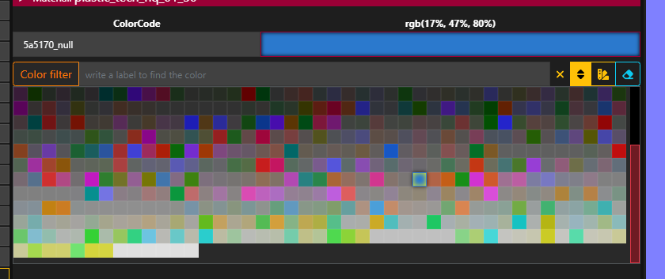<figcaption></figcaption></figure>

You can also change to another material texture here by clicking the preview ball:

<figure>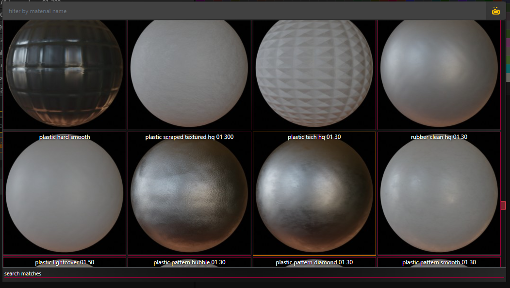<figcaption></figcaption></figure>

This can be used to create different paint finishes, cloth texture, etc.

Once you have finished editing a layer, you can save it by clicking “**Apply edits**” at the top of the **Layers** panel:

<figure><figcaption></figcaption></figure>

Then you can select another layer and edit the next one if needed. If you select a new layer without applying the edits, the changes will be lost.

Once finished, you can **Export** to save it to your file explorer, and then load it in **wkit** by right clicking the `.json` and selecting “**convert from JSON**”. \
Example:

<figure>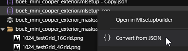<figcaption></figcaption></figure>

Save and Test in game

Working color:

<figure>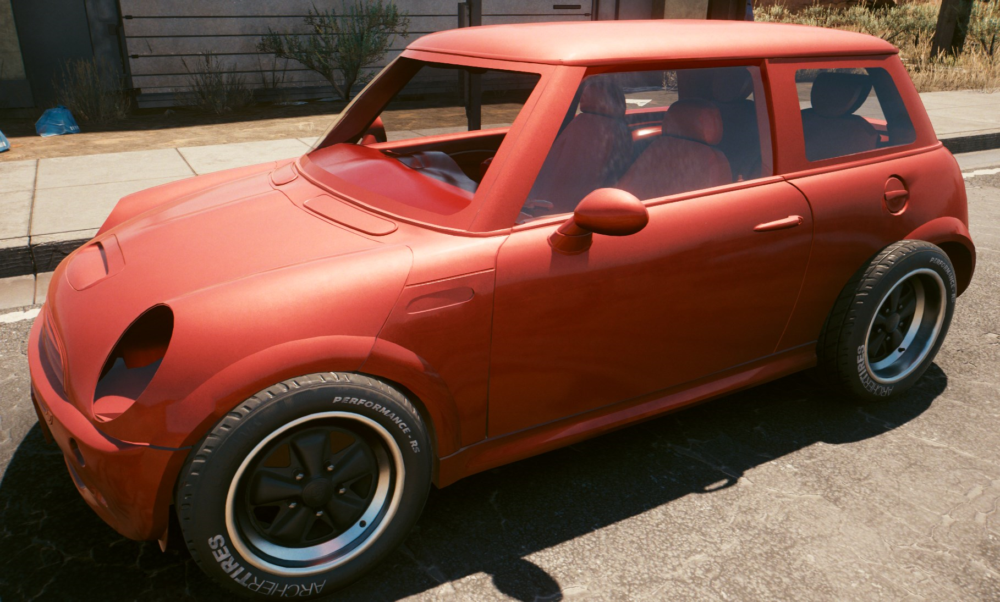<figcaption></figcaption></figure>

Custom RGB value colors can be set with a custom `.mltemplate` file. Here we will only set RGB values, but this file can control other material settings/textures as well.

Find the material you want to have a custom RGB value for in **MlsetupBuilder**, and click on the material name to show it’s file path. \
Example:

<figure>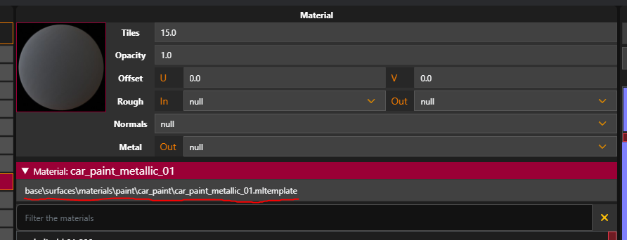<figcaption></figcaption></figure>

Add that file to the project, rename, and move it. Once it’s in place, you can copy it’s relative path and paste it into **MlsetupBuilder** for that layer:

<figure>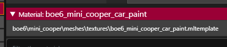<figcaption></figcaption></figure>

Open the `.mltemplate` file in **wkit** and navigate to the `colorScale` array:

* `RDTDataViewModel > overrides > colorScale`

This array contains all colors in the material. Open one of the `Multilayers` and it’s “`v`” values, which control the RGB values:

<figure><figcaption></figcaption></figure>

First, you can verify the color in  . Copy the “`n`” value here, and paste it into MlsetupBuilder in the Color filter:

<figure>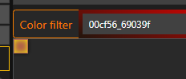<figcaption></figcaption></figure>

Select the color, and it’s rgb values should match the values in the “`v`” `colorScale` in the `.mltemplate`:

<figure>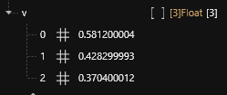<figcaption></figcaption></figure> <figure>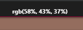<figcaption></figcaption></figure>

Edit the 0,1,2 (R,G,B) values to the color values needed and save. Make sure to save the .mlsetup as well with the layer set to the same color code as before.(“n” value, \[00cf56\_69039f])

Save and test.

### Multiple materials

To have multiple materials in a single .mesh file, the .glb export requires separate submeshes all selected in blender. Separate your blender .mesh into parts, and group them based on material.

First separate/split your meshes into small components, and then join them into groups:

<figure>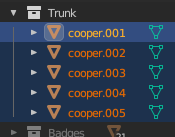<figcaption></figcaption></figure> <figure>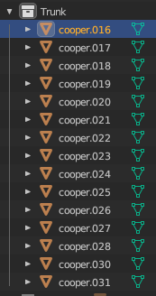<figcaption></figcaption></figure>

For example, mine are grouped by body paint, silver trim, reflective black, matte black, and grey fabric. Take note, the order in your blender selection will be the order each submesh is called by the `.mesh` file settings. This order is important.

With all the objects selected in blender, export it to `.glb` and import it as you normally would.

<figure>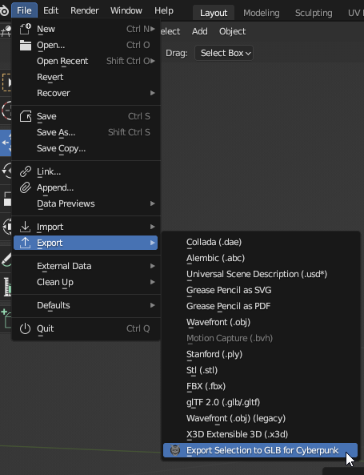<figcaption></figcaption></figure>

You can save and test. If it worked properly, only the first object included in the blender export will render properly at the moment.

<figure><figcaption>
Corrected
</figcaption></figure> <figure>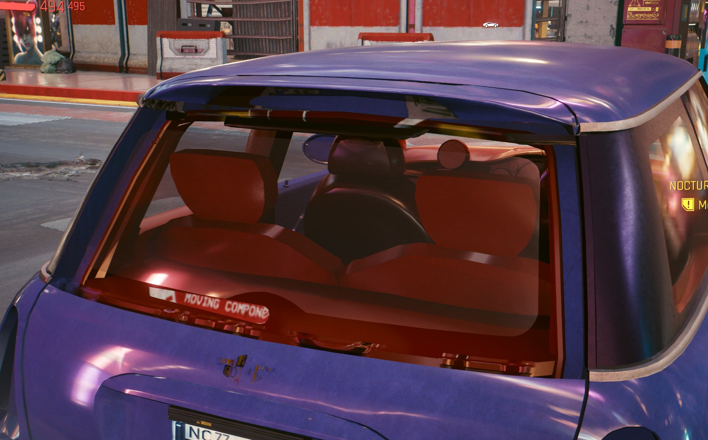<figcaption>
Broken
</figcaption></figure>

Example of a finished body mesh in blender:

<figure>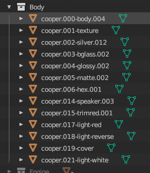<figcaption></figcaption></figure>

Currently the other submeshes will not render properly. This is due to submesh materials being controlled by the chunkMaterials in your appearance settings (`.app` file).

To correct this, start by duplicating an item in the `chunkMaterials` list. Path:

* `.mesh > RDTDataViewModel > appearances > 0 > chunkMaterials`
*

    <figure>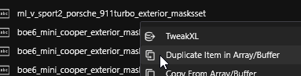<figcaption></figcaption></figure>

Make sure to edit the name to a unique name, as we are creating new `materialEntries`. Repeat as needed. In my case I needed 6 extra layers:

<figure>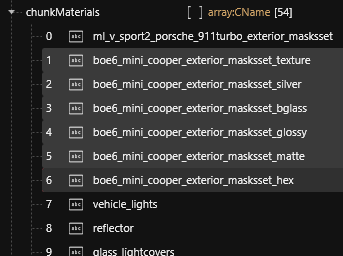<figcaption></figcaption></figure>

Next, navigate to `RDTDataViewModel > materialEntries`

This list controls the names and index of each item in the `localMaterialBuffer`, which we’ll edit soon. You’ll want to duplicate an item with similar qualities. If you are adding a plastic material, duplicate another plastic or solid material in the list. If you are adding glass, duplicate from a `vehicle_lights` material, then edit as needed. Duplicate one for each new material.

Make sure to update the index values of each item in the materialEntries array. They must all be the same as their index in their current array. 4 to 4, and so on:

<figure>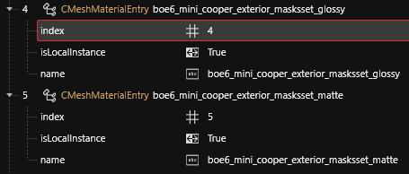<figcaption></figcaption></figure>


ALL items in the list update the index of both new items, and old ones that moved down the list


Next we’ll update the `materialBuffer` with new `.mlsetup` and `.mlmask` files. Keep in mind the `.mlmask` files can be edited to match the model to a texture. However we’ll be working around that by using the same method used previously, to have a `.mlmask` file with one additional white layer.&#x20;


Note the 0 layer will always be white.


Example:

<figure>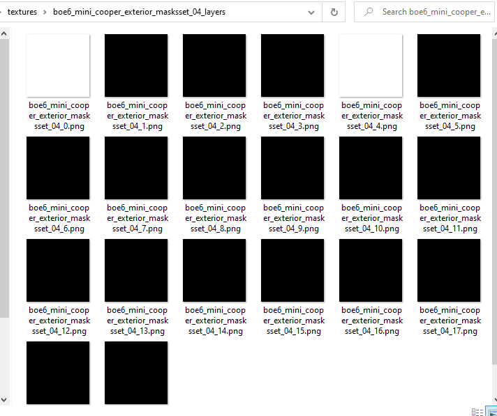<figcaption></figcaption></figure>

Notice how I have a `.mlmask` file dedicated to the 4th layer, so all other layers are muted. I have 20 (0 through 19) unique `.mlmask` files, each selecting a different layer from a `.mlsetup` file.

Speaking of `.mlsetup`, I have created a `.mlsetup` file with MlsetupBuilder. Layers 0 through 7 are used for the new materials:

<figure>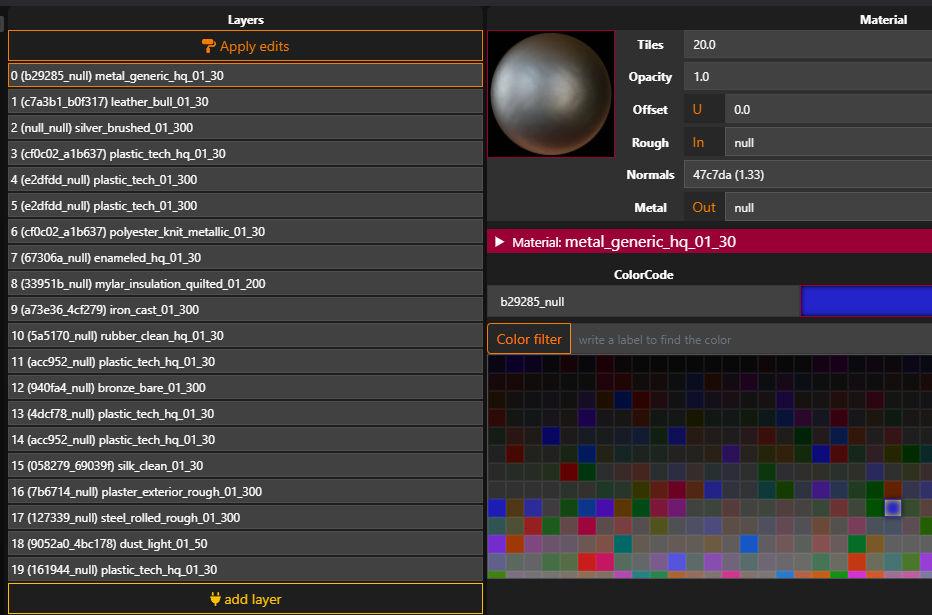<figcaption></figcaption></figure>

Now to finish the materials setup, open the following `.mesh` path:

* `.mesh > RDTDataViewModel > localMaterialBuffer > materials`

This array contains every `CMaterialInstance` for the `.mesh` file. This array has it’s items named via the `materialEntries` list we just edited. Since we added items to that list, those names now show in this `localMaterialBuffer > materials` list. However the data in each item is still it’s original.&#x20;

For example, in this picture, the array hasn’t been updated yet, however the names are updated. This means the index 1 item, …”`masksset_texture`” has the properties of “`reflector`”, which would normally be the 2nd item.

<figure>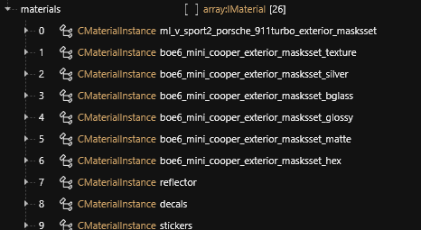<figcaption></figcaption></figure>

To fix this, duplicate the appropriate items, similar to before, once for each new material. Once done, the previous index 1 item will now be higher, but matched correctly. In my files, I duplicated “`ml_v_sport2_porsche_911turbo_exterior_masksset`” 6 times, and they each pasted directly below the 1st.

You can tell if the materials are correct by opening them, and looking into the “`values`” array. Each will have similar `keyValuePairs` related to the material type. `Glass` mentions `GlassSpecular`, normal paint has many map layers, stickers dont have much, etc:

<figure><figcaption></figcaption></figure> <figure>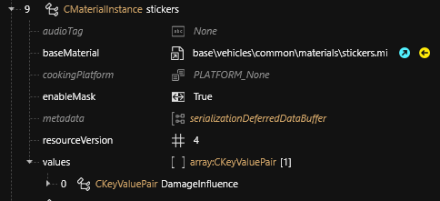<figcaption></figcaption></figure> <figure>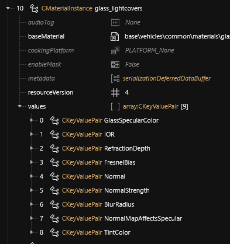<figcaption></figcaption></figure>

For each new material layer, update the paths:

* `CMaterialInstance > values > MultilayerMask > value`
* `CMaterialInstance > values > MultilayerSetup > value`

For `mlsetup`, I use the previously mentioned file, with layers setup for individual materials.

For the `mlmask`, use the “`masksset_00`” for the layer you want to enable.

<figure>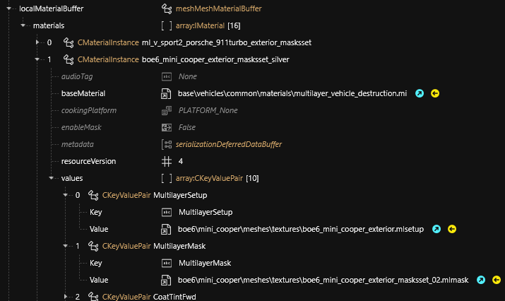<figcaption></figcaption></figure>

Submeshes should now load in order with matched materials.

### Fix broken UVs

Editing UV maps may be necessary for some meshes if they do not display correctly, or for custom editing. Broken & Fixed UV map example:

<figure>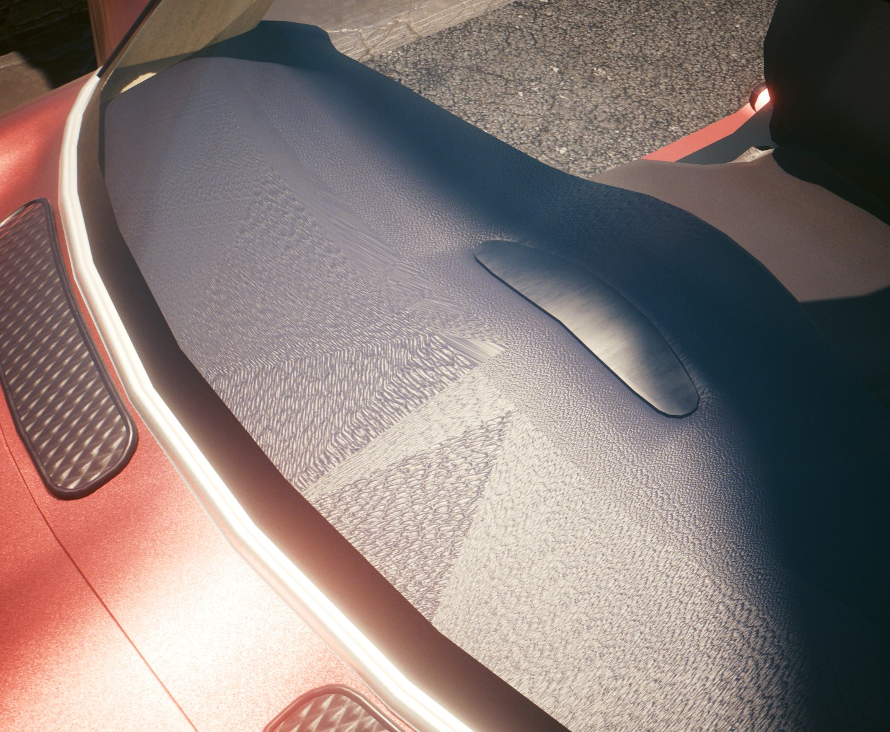<figcaption>
Broken
</figcaption></figure> <figure>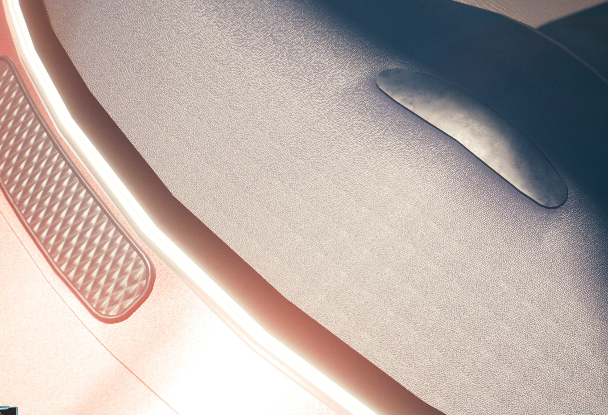<figcaption>
Fixed
</figcaption></figure>

To edit UV maps in **blender**, select your object to modify and enter the **UV Editing** workspace:

<figure>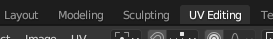<figcaption></figcaption></figure>

The current UV map should display on the left:

<figure>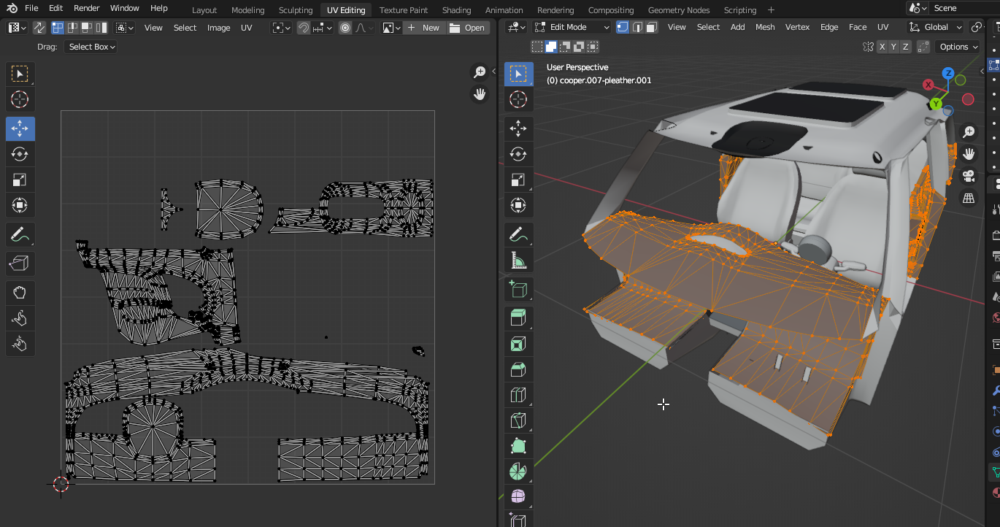<figcaption></figcaption></figure>

In the right window in **Edit Mode**, select all vertices (“**a**” key in blender), and hit “**U**” for the UV mapping dialog. Select “**Smart UV Project**”, and hit **OK**:

<figure>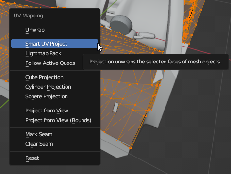<figcaption></figcaption></figure> <figure>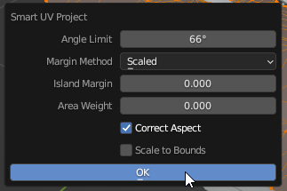<figcaption></figcaption></figure>

This should update the UV mapping to an even spread map:

<figure>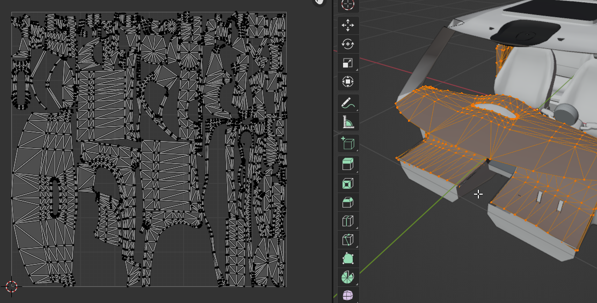<figcaption></figcaption></figure>

Save and test. Your meshes should have even material mapping now.

Some objects are better with different UV projection options. For example, a tire can be cleanly mapped by using the orthographic view and selecting Sphere Projection. Try some of these options to see what fits best for your use case.
