# Chassis Modifications

## Summary

**Created:** Aug 15 2024 by TheTacticalNuke\
**Last documented edit:** Aug 15 2024 by manavortex


This guide features the steps I discovered to extend the chassis to fit my custom car. If you know of a simpler/smarter way of modifying the chassis, please do suggest a change in the  `#mod-dev-chat` on the [redmodding Discord server](https://discord.gg/redmodding), or [sign up](https://app.gitbook.com/invite/-MP5ijqI11FeeX7c8-N8/H70HZBOeUulIpkQnBLK7) and improve it!



This guide assumes you have been following [Boe6's Guide](https://wiki.redmodding.org/cyberpunk-2077-modding/modding-guides/vehicles/boe6s-guide-new-car-from-a-to-z) and have read through "Boe6's vehicles: Import/export meshes" chapter. This will teach you how to import and export parts to WolvenKit from Blender.


## Step 1: Importing the chassis into Blender

From your vehicle's `.app` file, access the chassis file by following this path and clone it to your project directory:

```
RDTDataViewModel > appearances > 0 > components > entSkinnedMeshComponent chasis > mesh
```

Rename this mesh to suit your needs and export this to the raw directory using the export tool. This will be exported as a `.glb` file.

Import the mesh into blender using the `Cyberpunk GLTF` add-on. For this tutorial, I will be using the Chevillon Thrax chassis:

<figure>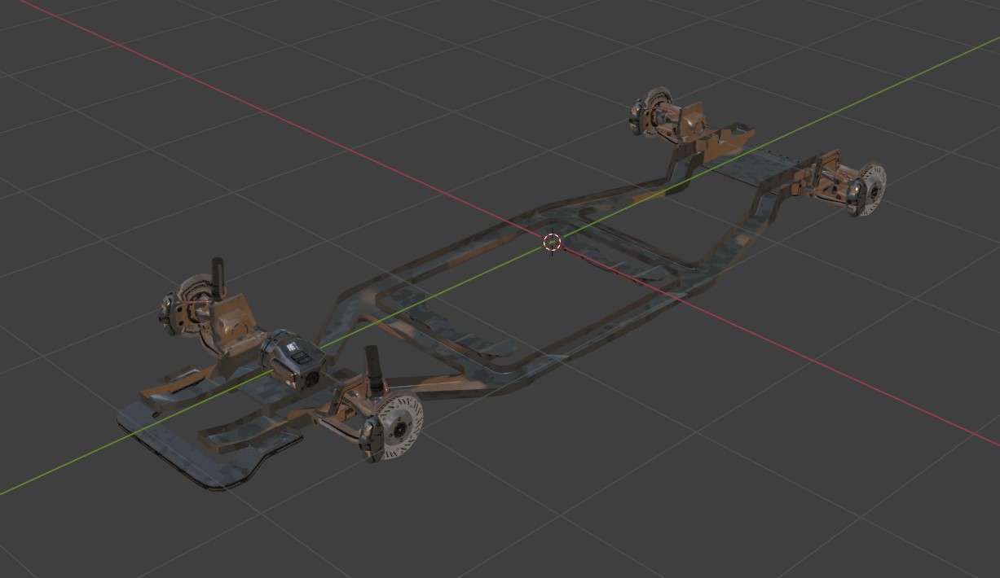<figcaption><p>Chevillon Thrax Chassis</p></figcaption></figure>

## Step 2: Extending the chassis

Make sure your custom car is scaled properly to the dimensions of the original car. You can do this easily by importing the main body of the base car. Align the wheel arch of your custom car to the wheel arch of your base car:

<figure>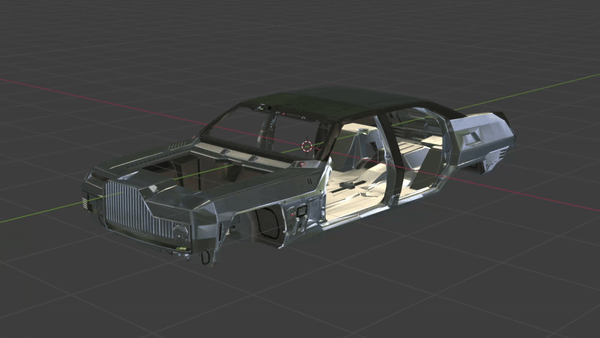<figcaption><p>Custom body scaled and aligned to the base car</p></figcaption></figure>

This will cause the front axle of the chassis to be aligned with the front section of the car from the beginning. Once the chassis has been imported and the body is made visible, it should look similar to this:

<figure>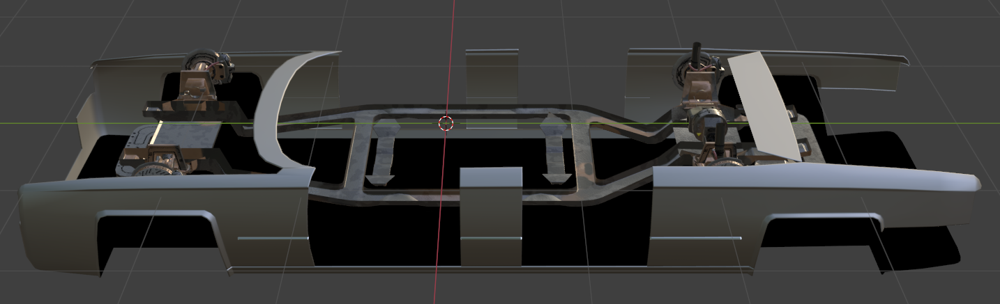<figcaption><p>Body of custom car with the unmodified chassis</p></figcaption></figure>


Do not shift the chassis down to fit it with the main body. Like many meshes that have animations attached, the chassis must remain where it is when it is imported.


We can see that the front axle is already in the correct position. However, the back axle falls short of where it is meant to be. We will need to extend the back half of the chassis to make it fit with the full length of the car. This can be done in the following way as visualised below:

### Step 2.1: Bisect mesh and seperate

<figure>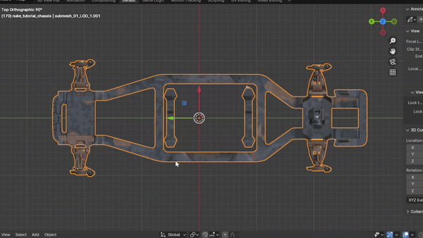<figcaption><p>Bisect and Sepereate</p></figcaption></figure>

Using the bisect tool, split the chassis down the center and seperate them by selecting one half of all vertices, pressing `P` and seperating by selection. Make sure X-Ray is turned on to select all vertices that are also hidden from view.&#x20;

The chassis itself contains multiple meshes, but only one of them actually runs down the middle. If you have multiple meshes like this, bisect them as well. There are meshes that hold the texture which can be split easily, simply go into edit mode and select and split by selection. Do this for all such meshes:

<figure>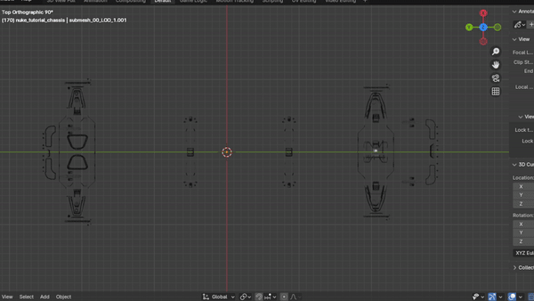<figcaption><p>Separate texture meshes</p></figcaption></figure>

You should now be able to move the front and back half of the chassis with all corresponding meshes indepedently.

### Step 2.2: Moving back half of chassis to correct position

Now select all of the back meshes and start moving it to fit with the back wheel arch of the car:

<figure><figcaption><p>Moving back half of chassis into position</p></figcaption></figure>


Make sure you make a note of how much you moved the chassis back. You will need to modify the rig by this number to match the physics of the car to the new chassis.


Now merge the half meshes back together by joining them. You should now have the same number of meshes as you started with, but with a gap in the middle.


Make sure the Data attribute of the meshes follows the correct name format `*_LOD_1`


### Step 2.3: Merge the body of the chassis by adding edges and filling

Go into edit mode and connect all corresponding vertices with an edge by pressing `F`. Then select all vertices and edges and press `F` again. Make sure to select all faces and triangulate them.

<figure>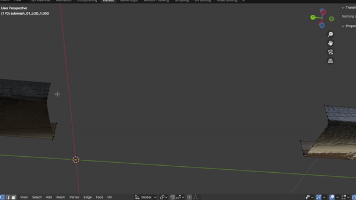<figcaption><p>Connecting vertices back and creating connecting faces</p></figcaption></figure>

Great! We have now created a chassis that matches the full length of our car. But we cannot simply export this into the game yet, as I will explain in the next section.

<figure>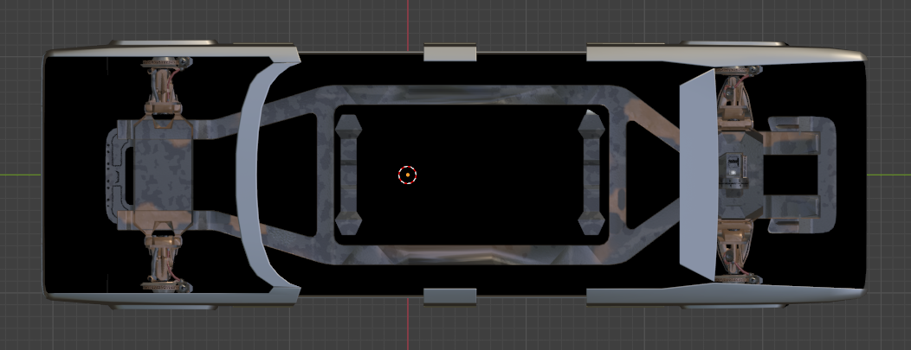<figcaption><p>Extended Chassis</p></figcaption></figure>

## Step 3: Reverting the rig associated faces to the original location

### The Problem

If we simply export this chassis and replace the original with it, we will run into a rather amusing problem when we use the car in game:

<figure><figcaption><p>Not exactly how a brake disc is meant to turn</p></figcaption></figure>

The reason this happens is that while we shifted the chassis mesh back, the actual animation that rotates the mesh is still in the same place!&#x20;


From my experience so far, changing the armature to make it fit with the new chassis does not do anything to fix this problem.


### Step 3.1: Selecting the mesh faces associated with the rig animation

Lets go back to Blender. Under the data pane we can see a few vertex groups that are associated with different pieces of the mesh:

<figure>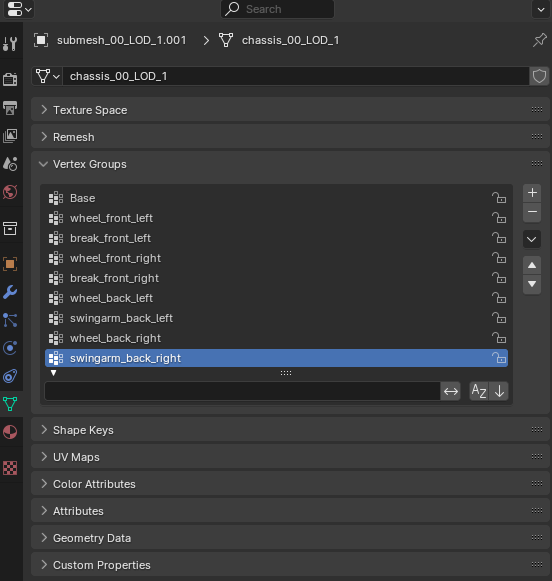<figcaption><p>Vertex Groups</p></figcaption></figure>

Each vertex group defines a specific part of the mesh which the rig file will use to act upon. The rig file contains entries that share the same names as these vertex groups. It is used to define where each part of the car goes.&#x20;

However, it assumes that the center of the animation is at the center of the mesh it acts upon. We have actually offset the mesh away from this center point, which is why our entire brake disc is rotating around this point rather than spinning in position. We will have to return these specifc vertex groups to the original position for the mesh and animation to be aligned.

### Step 3.2 Returning each vertex group back to its original position

Re-import the original chassis back into Blender. Select a mesh in your chassis collection and within the vertex groups pane, select all vertex groups relating to the back portion of the chassis:

<figure>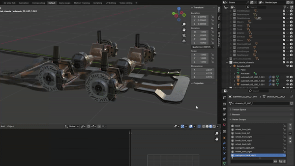<figcaption><p>Choosing relevant vertext groups</p></figcaption></figure>

Now move the faces in the opposite direction you moved them when you where extending the chassis. Use the value you noted down before to return it back into its exact place:

<figure>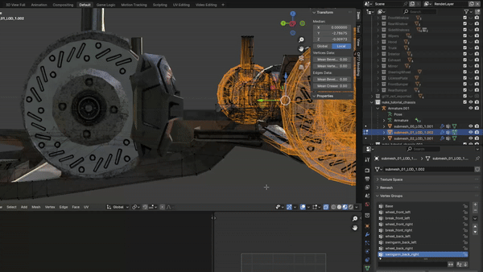<figcaption><p>Moving faces to original position</p></figcaption></figure>

Do this for all the meshes that are associated with your chassis. You will now have a chassis with the back axle looking very skewed forward:

<figure>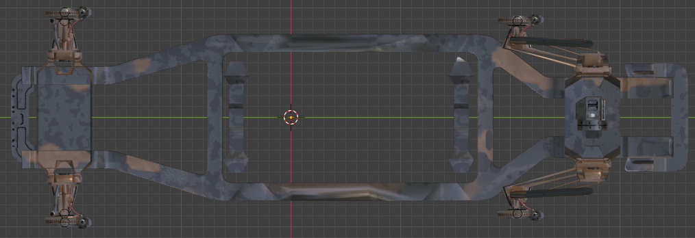<figcaption><p>Modified chassis with axle parts in original place</p></figcaption></figure>

## Step 4: Exporting the extended chassis to WolvenKit

Now select the collection containing your chassis meshes and hit export. Make sure to disable Static Prop. Import the new chassis back into WolvenKit. Verify the chassis using the preview pane:

<figure>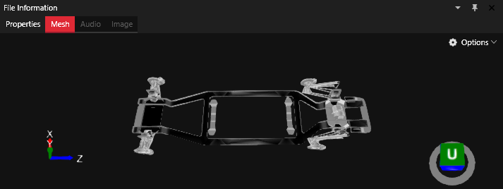<figcaption><p>New chassis in WolvenKit</p></figcaption></figure>

Within your `.app` file, replace the original chassis path with the path your new chassis is located at. Now let's launch the game and see how it looks:

<figure>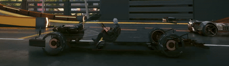<figcaption><p>Now thats how a brake disc should work</p></figcaption></figure>

Success! Our chassis is now rotating as intended. However, we still have to move the back axle back in order to fit our car. This is done in the rig file.

## Step 5: Modifying the rig to work with the new chassis


This part of the guide is already mentioned in Boe6's Rigging chapter. However, I will go into detail as to how to modify the suspension settings to match the car.


There are two rig files you will need to clone. These are located within the `.ent` file of our custom car and is under the following directories:

`RDTDataViewModel > components > entAnimatedComponent deformation_rig > rig`

`RDTDataViewModel > components > entAnimatedComponent vehicle_rig > rig`

Clone this to your project directory and modify the file path to your new rig files.

### Step 5.1 Modifying the suspension settings

The `deformation_rig` looks at all the parts of the car while the `vehicle_rig` specifically handles the wheel physics. As mentioned in Boe6's guide, in the `deformation_rig` file, change the back suspension attribute names to `suspension_back_left_` and `suspension_back_right_`.

### Step 5.2 Changing the suspension variables by our offset

Open the `vehicle_rig` file and take a look at the back suspension variables:

<figure>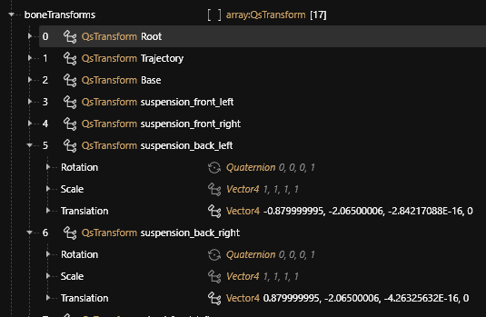<figcaption><p>Back suspension variables</p></figcaption></figure>

Open the Translation attribute and you will see 4 fields W, X, Y, Z. When we moved the chassis back, we were translating it in the Y axis in the negative direction. We will need to subtract our offset from the Y value. Do this for both the left and right back suspension.

## Conclusion

Now lets open up the game and see how our chassis is running:

<figure><figcaption><p>Chassis without body</p></figcaption></figure>

<figure><figcaption><p>Chassis with body</p></figcaption></figure>

Congratulations! You have successfully made a custom chassis for your own custom car!

