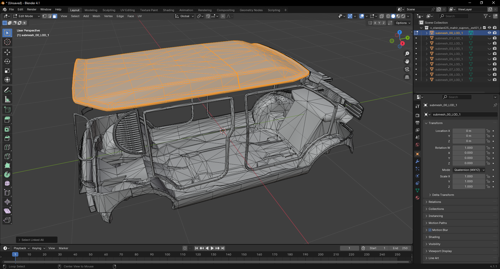
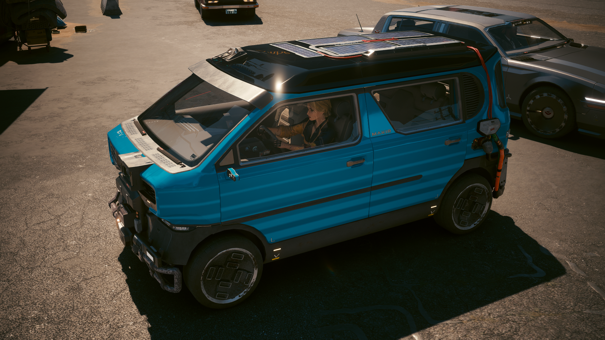

# 🛖 Customizing the roof

Once we have created our customization mechanism we can create as many options as we want and extend this to any sub-part of the vehicle.

It would be a great addition to allow the roof to use a glossy black plastic finish don't you think ?

## Submesh the roof

First duplicate the mesh file of the `body_01_painted_custom` component. Modify its file name suffix from `_painted` to `_roof`. Then export both the `body_01` mesh file and this new file.

Then import the `body_01` mesh file into Blender so we can submesh it.

<figure><figcaption><p>Submesh the roof component</p></figcaption></figure>

Select all the faces of the roof component then press `P` and select `Selection` to create the new submesh. Export this submesh alone into the new roof mesh file. Then export all the other submeshes to the `body_01` mesh file.

Then import both mesh files back into WolvenKit. Now in the APP file duplicate the `body_01_painted_custom` component into a new one named `body_01_roof_custom`.

Assign your new mesh file to it. Also duplicate its widget named `visual_customization_body_01_painted_custom` into a new one named `visual_customization_body_01_roof_custom`. This widget will allow us to eventually apply paint or coating on the roof.

Then into this new widget modify the `meshTargetBinding > bindName` and `parentTransform > bindName` with the new component name.


If you test your mod you will see that the roof will now be synchronized with all the other painted components. Although this is a cool feature, this is not exactly what we want.


What we want is to be able to choose what to do with the roof. So we need to append something to our script and to mod settings.


You must update the `AppearanceVisualController` list when you create a new component or if you modify its name, mesh appearance or mesh file path.

[Refer to this paragraph](creating-a-new-customizable-component.md#update-the-appearancevisualcontroller) to do so.


## Add a new feature to the script

First we want to allow the user to choose the roof appearance. Append this code snippet into your `SettingsPackage` class at the end of it. Notice that I have added a new translation entry for the `Black` value at line 13.

<pre class="language-swift" data-line-numbers data-full-width="true"><code class="lang-swift">/////////////////////////
// BODY
/////////////////////////

@runtimeProperty("ModSettings.mod", "MyModName")
@runtimeProperty("ModSettings.category", "MyNickName-MyModName-body-cat")
@runtimeProperty("ModSettings.category.order", "2")
@runtimeProperty("ModSettings.displayName", "MyNickName-MyModName-body-roof")
@runtimeProperty("ModSettings.description", "MyNickName-MyModName-body-roof-desc")
@runtimeProperty("ModSettings.displayValues.Standard", "MyNickName-MyModName-enum-standard")
@runtimeProperty("ModSettings.displayValues.Coated", "MyNickName-MyModName-enum-coated")
@runtimeProperty("ModSettings.displayValues.Painted", "MyNickName-MyModName-enum-painted")
<strong>@runtimeProperty("ModSettings.displayValues.Black", "MyNickName-MyModName-enum-black")
</strong>public let roofAppearance: EMeshAppearanceCC = EMeshAppearanceCC.Standard;
</code></pre>

As usual replace the secondary keys prefix and the mod name with yours. You can see that the `roofAppearance` field is using the `EMeshAppearanceCC` type which is the list of available appearances we have defined before.

We want to allow the roof to use a glossy black material, so add a `Black` value to the `EMeshAppearanceCC` type.

<pre class="language-swift"><code class="lang-swift">enum EMeshAppearanceCC {
  Standard = 0,
  Coated = 1,
  Painted = 2,
<strong>  Black = 3
</strong>}
</code></pre>

Now in the `Utils.CustomizeMesh` method, we need to add some intelligence in order to treat each customizable component independently from the others. At least for some of them. Replace the first `switch` block by this new one.

Replace the vehicle model at line 2 if necessary. You can see that we are looking for a specific component named `body_01_roof_custom`, so we can make the link with its corresponding mod setting.

For all the other components we use the `else` block that works like before. Now if you look closely at line 5 you can see that if CrystalCoat is disabled we force the roof appearance to be standard. If CrystalCoat is enabled we use the mod setting value.

<pre class="language-swift" data-line-numbers data-full-width="true"><code class="lang-swift">switch vehicleModel {
<strong>  case ESupportedVehicle.Supron:
</strong>
    if Equals(meshComp.name, n"body_01_roof_custom") {
<strong>      meshAppearance = ToString(ccEnabled ? MyModSettings.Get(gi).settings.roofAppearance : EMeshAppearanceCC.Standard);
</strong>    }
    else {
      if ccEnabled {
        meshAppearance = ToString(MyModSettings.Get(gi).settings.paintAspectEnabled ? EMeshAppearanceCC.Painted : EMeshAppearanceCC.Coated);
      }
      else {
        meshAppearance = ToString(EMeshAppearanceCC.Standard);
      }
    }
    break;

  default:
    return null;
    break;
}
</code></pre>

## Add new translation data

As we have created a new mod setting and a new mesh appearance we need to add new localized strings into our `en-us.json` file and also in any other language file you have defined. Right-click on your `en-us.json` file and choose `Convert to JSON`.

Edit the clear-copy created in the `raw` folder and add these new entries into it. Replace the secondary keys prefix with yours.

```yaml
{
  "$type": "localizationPersistenceOnScreenEntry",
  "femaleVariant": "Black",
  "maleVariant": "",
  "primaryKey": "0",
  "secondaryKey": "MyNickName-MyModName-enum-black"
},
{
  "$type": "localizationPersistenceOnScreenEntry",
  "femaleVariant": "Supron / Body",
  "maleVariant": "",
  "primaryKey": "0",
  "secondaryKey": "MyNickName-MyModName-body-cat"
},
{
  "$type": "localizationPersistenceOnScreenEntry",
  "femaleVariant": "Roof",
  "maleVariant": "",
  "primaryKey": "0",
  "secondaryKey": "MyNickName-MyModName-body-roof"
},
{
  "$type": "localizationPersistenceOnScreenEntry",
  "femaleVariant": "Choose what appearance you want to apply on the roof.",
  "maleVariant": "",
  "primaryKey": "0",
  "secondaryKey": "MyNickName-MyModName-body-roof-desc"
}
```

Then right-click on the `en-us.json.json` file from the `raw` folder and choose `Convert from JSON` to save your changes.

## Define a new mesh appearance and material

Finally we need to edit the roof mesh file to add the new black appearance into it and to create the corresponding material. Open the file and duplicate one of the existing appearances. Then name it `black` and rename its chunk to `black`.

<figure><figcaption><p>Create the black appearance</p></figcaption></figure>

Now into the `materialEntries` array duplicate the last item and name it `black`. In the `localMaterialBuffer > materials` array right-click on the `glossy` entry and choose `Copy From Array/Buffer`. Then right-click on the array and choose `Paste Into Array/Buffer` in order to append it to the end.

We are using the `glossy` material because it is the closest to the one we want to create as we want to create a glossy black material. But we need to edit two parameters to get a better result `CoatTintFwd` and `CoatTintSide`. We should set colors that are close to the one we want. As we are creating a black material set `CoatTintFwd = (red:0, green:0, blue:0, alpha:255)` and `CoatTintSide = (red:77, green:77, blue:77, alpha:255)`.

Also as this material is not colorable by CrystalCoat, use the basic multilayer file in the base material field.

```
baseMaterial = base\vehicles\common\materials\multilayer_vehicle_destruction.mi
```

Now duplicate the `glossy.mlsetup` file and name it `black.mlsetup`. Then assign it to the material into its MultilayerSetup parameter. Right-click on the `black.mlsetup` file and convert it to JSON. Open it in MlsetupBuilder by right-clicking on it.

We are going to use only the first layer and turn all the other ones invisible by setting their opacity to 0. By chance the glossy paint layer #0 is already configured properly. Simply export the file using `File > Mlsetup > Export` and erase the JSON file. Then import it back into mlsetup in WolvenKit.

<figure><figcaption><p>Disable all layers except the first one</p></figcaption></figure>

You can use either `painted.mlmask` or the original mlmask file of the vehicle for this material because both files use the layer 0. In any case we will ignore the other layers because their opacity is null. We only need a mlmask that uses the layer 0, and this layer is used by all mlmask files because the layer 0 is the base layer.


For a better clarity I recommend you to use the original mlmask file when it is possible so if you come back later to modify your mod you won't be asking yourself why you would have used that mlmask.


## Add the roof to deformable parts

As the roof component comes from the `body_01` component it must be added to the list of deformable parts of the vehicle. [Follow this paragraph](creating-a-new-customizable-component.md#update-deformable-parts) to do so. Except that you will add a `_2` suffix to your new elements in the YAML file.

The `_1` suffix is already being used for `body_01_painted_custom` component.

Now you can test your mod and play with the new mod setting so you can see how it behaves.

<figure><figcaption><p>Customizable roof using the black appearance</p></figcaption></figure>

> Wait ! What if I want to have a customized roof while CrystalCoat is turned off ?

## Customize the vehicle without CrystalCoat

Well this raises the question of customizing the vehicle for two contexts: with and without CrystalCoat. It is possible to do this with some modifications to the script.

First rename the `roofAppearance` field to `roofAppearanceCC` using a case-sensitive replacement. This `CC` suffix means that it concerns the CrystalCoat ON state. You should have replaced **2 occurrences**.

Next, modify your existing secondary keys for this field so they have a `-on-` part into them.

```swift
@runtimeProperty("ModSettings.displayName", "MyNickName-MyModName-body-on-roof")
@runtimeProperty("ModSettings.description", "MyNickName-MyModName-body-on-roof-desc")
```

Modify your secondary keys in your languages JSON files too and add new keys for the OFF state.

```yaml
{
  "$type": "localizationPersistenceOnScreenEntry",
  "femaleVariant": "Roof",
  "maleVariant": "",
  "primaryKey": "0",
  "secondaryKey": "MyNickName-MyModName-body-on-roof"
},
{
  "$type": "localizationPersistenceOnScreenEntry",
  "femaleVariant": "Choose what appearance you want to apply on the roof when CrystalCoat™ is enabled.",
  "maleVariant": "",
  "primaryKey": "0",
  "secondaryKey": "MyNickName-MyModName-body-on-roof-desc"
},
{
  "$type": "localizationPersistenceOnScreenEntry",
  "femaleVariant": "Roof (CrystalCoat™ OFF)",
  "maleVariant": "",
  "primaryKey": "0",
  "secondaryKey": "MyNickName-MyModName-body-off-roof"
},
{
  "$type": "localizationPersistenceOnScreenEntry",
  "femaleVariant": "Choose what appearance you want to apply on the roof when CrystalCoat™ is disabled.",
  "maleVariant": "",
  "primaryKey": "0",
  "secondaryKey": "MyNickName-MyModName-body-off-roof-desc"
}
```

Import your JSON files back into CR2W. Now add a new `roofAppearance` field by duplicating the existing one and change the secondary keys of it so they have a `-off-` part into them.


**Wait !**

We are defining a new mod setting for the CrystalCoat OFF state but the values `Coated` and `Painted` can be chosen by the user. These values make no sense if CrystalCoat is turned off.


To fix this we need to create a second enumerated type that excludes these values.

```swift
// Will be used for CrystalCoat ON state
enum EMeshAppearanceCC {
  Standard = 0,
  Coated = 1,
  Painted = 2,
  Black = 3
}

// Will be used for CrystalCoat OFF state
enum EMeshAppearanceStandard {
  Standard = 0,
  Black = 1
}
```

Create the new mod setting for CrystalCoat OFF state.

<pre class="language-swift" data-full-width="true"><code class="lang-swift">@runtimeProperty("ModSettings.mod", "MyModName")
@runtimeProperty("ModSettings.category", "MyNickName-MyModName-body-cat")
@runtimeProperty("ModSettings.category.order", "2")
@runtimeProperty("ModSettings.displayName", "MyNickName-MyModName-body-off-roof")
@runtimeProperty("ModSettings.description", "MyNickName-MyModName-body-off-roof-desc")
<strong>@runtimeProperty("ModSettings.displayValues.Standard", "MyNickName-MyModName-enum-standard")
</strong><strong>@runtimeProperty("ModSettings.displayValues.Black", "MyNickName-MyModName-enum-black")
</strong>public let roofAppearance: EMeshAppearanceStandard = EMeshAppearanceStandard.Standard;
</code></pre>

Then into the `Utils.CustomizeMesh` method in the `if` block that concerns the `body_01_roof_custom` component change the line by this one (line 2).

<pre class="language-swift" data-line-numbers data-full-width="true"><code class="lang-swift">if Equals(meshComp.name, n"body_01_roof_custom") {
<strong>  meshAppearance = ccEnabled ? ToString(MyModSettings.Get(gi).settings.roofAppearanceCC) : ToString(MyModSettings.Get(gi).settings.roofAppearance);
</strong>}
</code></pre>

Now you can test your mod and configure the roof appearance for both the CrystalCoat ON and OFF states.

<figure><figcaption><p>Customize the roof for both CrystalCoat states</p></figcaption></figure>

> This is really great ! I think the sun visor feels cheap ! Can you do something for this ?
