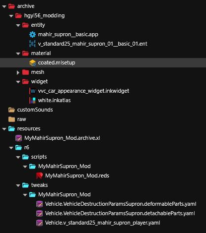
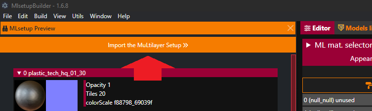
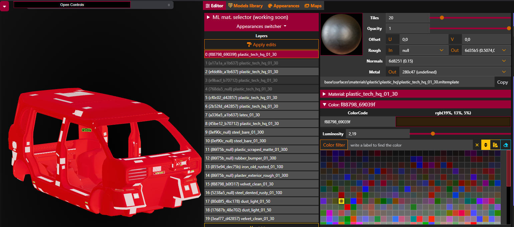
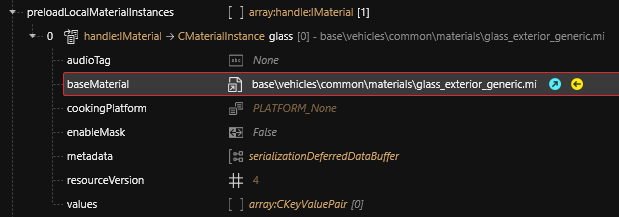

# Improving the appearance

## Modifying the base paint color

CrystalCoat consists of displaying a colored widget above a mesh. The problem is that the mesh itself uses a multilayered material definition defined in a mlsetup file.

This file defines the material layers applied on associated mask layers (mlmask file) to get the final result we have on the screen for this mesh. Each layer also uses a color.

The Mahir Supron uses a yellow / light brown color for the painted areas of the vehicle. We need to modify this color and to use a gray color instead so it will be neutral for any CrystalCoat tint.

### Edit the mlsetup

Generally all the painted parts of the vehicle use the same mlsetup / mlmask combination. For the Mahir Supron you can find these files in the material definition in the parameters `MultilayerMask` and `MultilayerSetup`.

```
mlmask = base\vehicles\standard\v_standard25_mahir_supron\entities\meshes\textures\mahir_supron__ext01_body_01_masksset.mlmask
mlsetup = base\vehicles\standard\v_standard25_mahir_supron\entities\meshes\textures\supron_poor_06.mlsetup
```

Add the mlsetup file to your project and place it into your unique folder. Then rename it with a simple name like `coated.mlsetup`. Then assign it to all your `*_painted_custom` components in their respective `coated` material definition: `localMaterialBuffer > materials > coated > MultilayeredSetup`.

<figure><figcaption><p>Copy the material setup into your project</p></figcaption></figure>

Then right-click on the file and convert it to JSON. You must install the MlsetupBuilder plugin for WolvenKit in order to modify a mlsetup file.

To do so go into HOME in the menu bar and then `Plugins` to display the plugins menu. Install MlsetupBuilder and restart WolvenKit. Follow [this tutorial](https://wiki.redmodding.org/cyberpunk-2077-modding/for-mod-creators/modding-tools/mlsetup-builder#extract-a-partial-depot) to properly setup this tool.

Then right-click on the `coated.mlsetup.json` file and choose `Open in MlsetupBuilder`. Import the layers into the editor by clicking on the orange button.

<figure><figcaption><p>Import layers into the editor</p></figcaption></figure>

If you have correctly setup MlsetupBuilder you can display a 3D model of the vehicle in the tool. To do so click on the `Models library` tab then search for "Supron" and click on the body part.

Go back into the `Editor` tab and click on each layer until you find the one that corresponds to the painted areas. Layers are ordered from 0 (top) to 19 (bottom) and are added on top of each other (1 is applied above 0, etc). Each layer is linked with the mask that uses the same number of the mlmask file.

If layer 0 and layer 1 cover the same areas then layer 1 will cover layer 0. Sometimes the paint-related layer is the layer 0 that always covers everything, but then all additional layers will cover non-painted areas of the vehicle so in the end, by substracting these layers area to the layer 0 you get the painted areas. In this case we would be interested by the layer 0 to modify the paint color.

You can also look at the color used by the layer to find the relevant one. We know that the Mahir Supron uses a yellowish/brown paint.

For the Mahir Supron the layer responsible for the painted areas is the layer 0.

<figure><figcaption><p>Layer 0 is responsible for painted areas for this vehicle</p></figcaption></figure>

We shall use a dark gray or a somewhat black color to replace the base vehicle color.

For this particular case we want to keep the stripes on the sides of the vehicle so we need to have a lighter gray color for layer 0 and a darker gray color for layer 2.

You can use the code `720cfa_d42857` for layer 0 and `3eaf77_69039f` for layer 2. Enter these codes into the text input next to the colored rectangle for each layer then immediately hit ENTER to validate the new color and immediately click on `Apply edits` at the top of the layers list before working on the next layer.

If you want to keep everything else identical you can just export the file using `File > Mlsetup > Export` and erase the JSON file and then convert it back into mlsetup in WolvenKit.


On some computers when exiting MlsetupBuilder tool the computer may crash with a [BSoD](https://en.wikipedia.org/wiki/Blue_screen_of_death). In order to avoid this crash I have experienced that using CTRL + R to reload the instance and then using the menu to exit `File > Exit` tends to avoid crashes.


> Wait ! My vehicle still has rust and garbage all over it ! This is bad work !

### Clean the painted components

As we are modifying the material definition we can also clean the painted parts.

The different rust marks on the vehicle are part of some layers. In order to remove them we only need to change the opacity of the relevant layers to 0. Click on each layer to identify messy ones and modify their `Opacity` slider to 0 then click on `Apply edits` before working with another layer.

This is the list of layers to make invisible: 7, 8, 13, 15, 16, 17, 18.

Export the file using `File > Mlsetup > Export` and erase the JSON file. Finally convert it back into mlsetup in WolvenKit.

The paint is now fixed to keep a neutral color that will suit any CrystalCoat tint. I have also cleaned the rust and dust.

<figure><figcaption><p>Fixed paint</p></figcaption></figure>

> Wait ! Are you kidding ? My windows are covered with crap !

## Fixing the windows

You may have noticed that windows are still dirty and their tint feels a bit too clear. In order to fix this we need to add all the window mesh files into the project and then modify their material definition.

Window components are the following:

* `body_01_window_bl_01`
* `body_01_window_br_01`
* `window_bl`
* `window_br`
* `window_fl`
* `window_fr`
* `window_f`
* `trunk_a_window_01`
* `trunk_b_window_01`

Assign your custom files to these components and then open the `window_fl` mesh file. Go into the `preloadLocalMaterialInstances` array and look into the `glass` material definition.

<figure><figcaption><p>window_fl material definition</p></figcaption></figure>

This mesh is using a MI file as the base material. MI files are instances of a MT file bundled with predefined parameters so it can be reused easily on multiple components.

Add this MI file to your project and rename it `window_glass.mi`. Then edit the file and change these parameters into it.

```
Opacity = 0,920000017
OpacityBackFace = 0,920000017
MaskOpacity = 0
TintColor = (red 179, green 180, blue 183, alpha 255)
TintSurface = (red 197, green 191, blue 177, alpha 255)
```

Then save the file and assign it to all your window mesh files. Also remove any existing parameter present in the `values` array of the material definition. To quickly empty an array right-click on it and select `Delete All Items in Array/Buffer`.

Your windows are now clean and have a tint that feels more realistic / more visible.

<figure><figcaption><p>Fixed windows</p></figcaption></figure>

> Wait ! When I choose the color it says "CrystalCoat by Rayfield" and a sports car is displayed !
>
> Also secondary color does not work !
