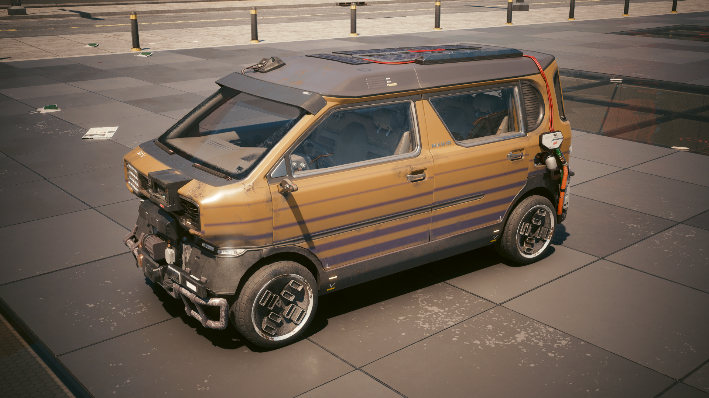
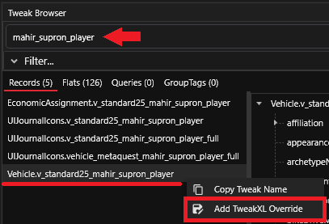
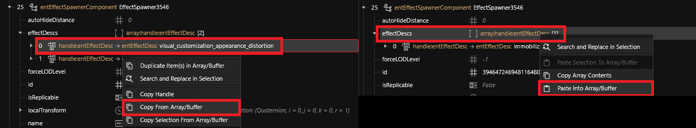
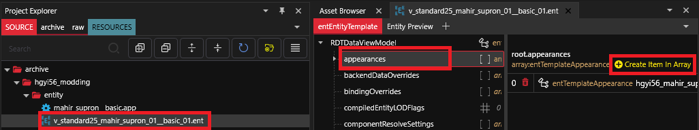
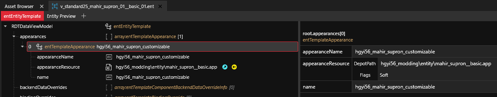
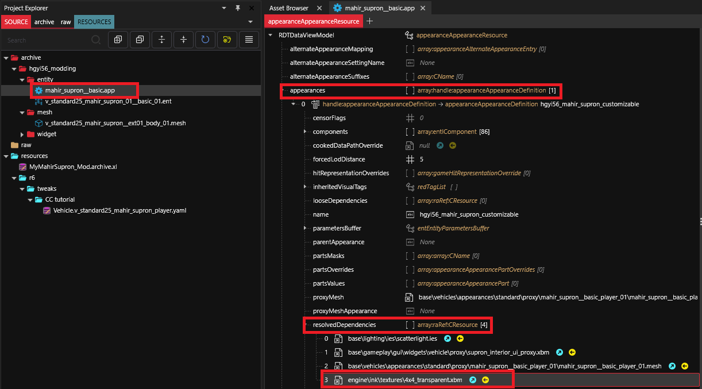

# Project setup

## Create a new WolvenKit project

In this section I will explain the minimal steps required in order to enable the feature on the vehicle. I will use the Mahir Supron vehicle as an example. You can buy this vehicle at the autofixer.

<figure><figcaption><p>Mahir Supron FS3</p></figcaption></figure>

## Enable the feature

First you need to make your vehicle entity aware of the CrystalCoat feature. To do this you need to use TweakXL. Open WolvenKit and look into the Tweak Browser. Type your vehicle record name and right-click on it. Then create a TweakXL Override.

<figure><figcaption><p>Create a TweakXL Override</p></figcaption></figure>

This will generate a new YAML file with the record name into your project at `resources/r6/tweaks`. Open it and write this content. If needed, replace the vehicle record name at line 1 with yours. We will fill the `customizableAppearance` field later.

<pre class="language-yaml" data-line-numbers><code class="lang-yaml"><strong>Vehicle.v_standard25_mahir_supron_player:
</strong>  $type: gamedataVehicle_Record
<strong>  customizableAppearance: &#x3C;Here you will use the new appearance name>
</strong>  hasVisualCustomization: True
  tags:
    - !append CrystalCoat_2_12
</code></pre>

This will tell the game to allow this vehicle to toggle CrystalCoat and to display the color picker widget. Now in the vehicle entity (`*.ent`) file you need to create a new appearance dedicated to CrystalCoat for your vehicle.

## How do appearances work ?

The game will load the vehicle using its base appearance that is defined in the vehicle record at the field `appearanceName`. This is what it does for all entities.

If the vehicle supports CrystalCoat, the game will assemble the entity during loading by swapping the appearance **silently** with the `customizableAppearance`.

What is important to note is that the appearance being used will still be the base appearance. But the components being loaded and visually present on the screen will be the customizable ones.

This is why I am saying that the `customizableAppearance` is being used **silently**.

## Enable the visual distortion effect

When you toggle the CrystalCoat feature the game plays a distortion effect on the vehicle. This must be appended into the ENT file in the `components > EffectSpawner3546 > effectDescs` array.

The easiest way is to copy the effect entry from the Rayfield Caliburn's ENT file and paste it into yours.

```
base\vehicles\sport\v_sport1_rayfield_caliburn__basic_01.ent
```

<figure><figcaption><p>Copy the effect from the Rayfield Caliburn file</p></figcaption></figure>

## Create a new entity appearance


If you are editing an existing vehicle of the game, add the ENT file into your project and place it into a folder with a unique name to prevent collision with other mods.

Create a root folder named `<mynickname>_modding` and place everything into it.


Open the ENT file in WolvenKit. Click on the `appearances` array and then create a new appearance on the right.

<figure><figcaption><p>Create a new entity appearance</p></figcaption></figure>

Now define a unique name for the CrystalCoat appearance and write it down into the two fields:

* appearanceName
* name

<figure><figcaption><p>Define the appearance details</p></figcaption></figure>

It is not mandatory to use the same name in both fields but it will make things more simple. I would advise you to define a name that will not collide with another mod. You could for example use your nickname followed by the vehicle model followed by a CrystalCoat suffix:

```
mynickname_mahir_supron_customizable
```


Don't forget to write this appearance name into your YAML file in the `customizableAppearance` field ! This field corresponds to the `name` field of the entity appearance (not `appearanceName`).


You must also set the path to the APP file of the vehicle which contains the actual appearance definition. The `appearanceName` field must correspond to the appearance name that you will define into the APP file.

### Additional steps for an existing vehicle

If you are modifying an existing vehicle of the game you should not replace the ENT file of the base game with yours or this will prevent other modders from adding new appearances to this vehicle.

Instead you shall use ArchiveXL to append your entity appearance to the base game ENT file dynamically. Create a new XL file by using the WolvenKit menu `File > New File`. Click on ArchiveXL then select the XL file type.

This will create a new file into `resources` folder. Add this content into it.

```yaml
resource:
  patch:
    mynickname_modding\v_standard25_mahir_supron_01__basic_01.ent: base\vehicles\standard\v_standard25_mahir_supron_01__basic_01.ent
```

On the left side you must use the relative path to your own ENT file. Right-click on your ENT file in WolvenKit and copy its relative path then paste it here.

On the right side you must use the relative path to the base game ENT file. Find it using the Asset Browser and copy-paste its relative path.

## Create a new APP appearance

Now you have created the top-level appearance you need to actually define it. This part is done into the APP file. Find the APP file using the Asset Browser and add it to your project. Then place it into your unique folder.

You shall duplicate the base appearance of the vehicle and change its name with what you have defined previously in the `appearanceName` field of the entity appearance. Then remove all appearances from the file leaving only the one you have just created.

Then you shall add `engine\ink\textures\4x4_transparent.xbm` into the `resolvedDependencies` array of the appearance.

<figure><figcaption><p>Add the new resource dependency into the appearance</p></figcaption></figure>
