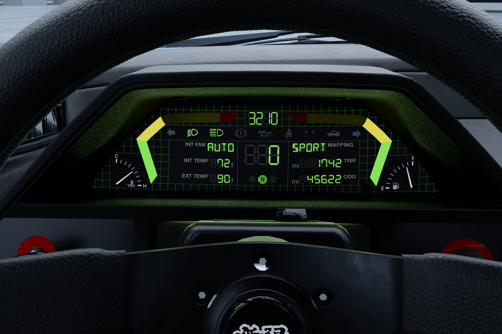

# inkWidgets On Vehicles

The information on this page is intended for modders who have already created one or two vehicle mods and are interested in the inner workings and advanced styling of `.inkwidgets`. Knowledge of [Boe6](https://www.nexusmods.com/profile/Boe6/mods)'s [basic car tutorial](https://wiki.redmodding.org/cyberpunk-2077-modding/modding-guides/vehicles/boe6s-guide-new-car-from-a-to-z/boe6s-vehicles-.inkwidget-and-.inkstyle-animated-ui) is required. The basic car tutorial explains how to set up an `.inkwidget` in the `.app` and link it to the `.mesh` the widget is going to be displayed on and contains more info on analog gauges.

#### Functional elements of vehicle inkWidgets

* Analog speedometer - Rotating needle on circular scale
* Analog tachometer - Rotating needle on circular scale
* Digital tachometer, line - A horizontal or vertical line that scales up with rising RPM. Can be a solid line, made up of dots or lines, or other shapes. Can be bent into any shape by using UV mapping. On vanilla cars, this is only available for the tachometer, not the speedometer.
* Digital tachometer, numbers - RPM displayed as numbers ("6000")
* Digital speedometer, numbers - Speed displayed as numbers ("100")
* Gear indicator - Icons for R(everse) N(eutral), and D(rive). The opacity of each individual icon is set to `0.01` by default and changes to `1` when its gear is active.
* Headlight indicator - Icon that changes opacity from `0.01` to `1` when the headlights are on
* Damage indicator - Icon that changes opacity from `0.01` to `1` when reaching the damage state of the car where flames first emerge from the engine.
* Radio station - Name of the currently selected radio station ("89.7 Growl FM")
* Animated equaliser - Animation starts once a radio station has been selected. Animation is unrelated to the music itself.
* Clock
* Color themes day/night - unused in the vanilla game and as such unreliable.
* Animations There is no one single vehicle in the game that implements all of these at once. I don't know how to create these from scratch and have been combining them by using multiple `.inkwidgets` and multiple `.mesh` files they're bound to. Here are some examples of gauges featured in vanilla vehicles:

| Car → Gauge ↓                | 911 | MaiMai | Tanishi | Thrax | Shion | R7 |
| ---------------------------- | --- | ------ | ------- | ----- | ----- | -- |
| Analog speedometer           | ✅   |        | ✅       |       |       |    |
| Analog tachometer            | ✅   |        | ✅       |       |       |    |
| Digital tachometer, line     |     | ✅      |         | ✅     | ✅     | ✅  |
| Digital tachometer, numbers  |     |        | ✅       | ✅     | ✅     |    |
| Digital speedometer, numbers |     | ✅      | ✅       | ✅     | ✅     | ✅  |
| Gear indicator               |     | ✅      |         |       | ✅     | ✅  |
| Headlight indicator          |     | ✅      |         |       |       | ✅  |
| Damage indicator             |     | ✅      |         |       |       | ✅  |
| Radio station                | ✅   | ✅      | ✅       | ✅     | ✅     | ✅  |
| Animated equaliser           |     |        | ✅       | ✅     | ✅     | ✅  |
| Clock                        |     | ✅      | ✅       | ✅     | ✅     | ✅  |
| Color themes day/night       | ✅   | ✅      |         | ✅     | ✅     | ✅  |

#### Types of widget containers

**Canvas**

* The `inkCanvasWidget` is the first type of widget you will encouter. This one is a collection of multiple individual widgets or other `inkCanvasWidgets`.
* Other types of widgets use this one as a parent. Settings of the parent affect the children. This is especially important for the `layout`, `size`, and `scale` of the `inkCanvasWidget` as this will become the new canvas size for its `children`. Their placement is relative to the position of the `inkCanvasWidget`.
* For example, if an `inkCanvasWidget` is placed 100 pixels to the left edge of your entire `.inkwidget`, any `children` within the `inkCanvasWidget` placed at 0 will be 100 pixels to the left edge of your entire `.inkwidget`.
* More information on `layout`, `size`, and `scale` are further down on this page. These settings are present for each type of widget.

**Text**

* `inkTextWidgets` contain, as the name might suggest, text. This can either be arbitrary strings of text ("Hello world!") or dynamically inserted information by the game (speed, rpm, and so on). This information is governed `logicControllers` attached to each `inkTextWidget`. This is how the majority of the functional widgets described above function.
* Some functional widgets show placeholder text when they have no information to display yet. This is the case for the radio and the clock. The radio will show placeholder text when no radio station is selected and the radio is off. The clock will show placeholder text for the first in-game minute after entering the car because the clock needs to update once before correctly displaying the actual time. For both widgets, the placeholder text can be arbitrarily defined with the `text` property of each `inkTextWidget`. The Porsche, for example, uses no text for the radio to hide the radio widget when the radio is off. The longest string your radio widget should be able to display is "107.3 Morro Rock Radio".
* There are several different ways to handle text overflow, none of which I have looked into. If the text within your `inkWidget` doesn't fit within its `size`, it can be truncated, scrolled, or wrapped. If you have more info on this or know how this works in detail, please add it here.
* Before using a font for an `inkTextWidget`, it must be defined within the `externalDependenciesForInternalItems`. If the font you'd like to use isn't there already, duplicate an entry and add its file path there. The file path is also how the `fontFamily` is set for each `inkTextWidget`.
* When switching to the Widget Preview and your font isn't defined in the `externalDependenciesForInternalItems` or your `inkTextWidget` is using a `fontStyle` not featured within the `.inkfontfamily`, WolvenKit will either display a lengthy error in the Log or crash. If this happens, know that this is the cause.
* Fonts are found in `base\gameplay\gui\fonts\`, their file type is `.inkfontfamily`
* Fonts feature different `fontStyles` (`Regular`, `Bold`, etc.). Which `fontStyle` is available for each font can be checked by opening the `.inkfontfamily` and expanding the `fontStyles` dropdown.
* If a font doesn't feature an Italic `fontstyle`, the `shear` option within the `renderTransform` settings of an `inkTextWidget` can be used. Negative values for `X` point the shearing toward the right (an uppercase "I" will look like this forward slash: / ).
* Text justification is surprisingly complicated. If you need text to start at the right edge of the display, you need to set `textHorizontalAlignment` to `Right`, and `justification` to `Right`. Additionally, it might be necessary to disable `fitToContent` and adjust the `layout` like this: `anchor: CenterRight`, `anchorPoint: X = 1`, `HAlign: Right`.

**Images**

* Adding images to an `.inkwidget` works the same way as it does for icons such as the preview of your vehicle in the Call Menu.
* Each individual image is collaged into a single image file managed by the `.inkatlas`.
* Each `.inkatlas` file used in your `.inkwidget` must be defined within the `externalDependenciesForInternalItems` before it can be used in an `inkImageWidget`. To add your file path, duplicate any of the pre-existing entries and replace the vanilla file path with yours.
* When switching to the Widget Preview and your `inkImageWidget` uses an `.inkatlas` not defined in the `externalDependenciesForInternalItems`, WolvenKit will either display a lengthy error in the Log or crash. If this happens, know that this is the cause. There are no warnings or errors about a `texturePart` not being present in the `.inkatlas`.
* To use an image within an `inkImageWidget`, add the file path to the `.inkatlas` that contains your image to the `textureAtlas DepotPath`. Then, add the `partName` of your image to the `texturePart` text field within the `inkImageWidget`.
* Contrary to the preview rendered by WolvenKit, `inkImageWidgets` do support full colour images.
* Images can be displayed at their original size by enabling the `fitToContent` toggle for the `inkImageWidget`.
* Images can be resized or stretched to a specific size by disabling the `fitToContent` toggle for the `inkImageWidget` and setting a specific size in the `size` setting or `scale` in the `renderTransform` options.
* Use images for anything that isn't a functional element. Yes, even for static text. Using an image with the same canvas size as the `.inkwidget` allows for precise positioning. This circumvents inaccurate placement and size in the WolvenKit editor which saves a lot of time and annoying trial and error. More on that later.

**Panel**

* `inkHorizontalPanelWidgets` and `inkVerticalPanelWidgets` are collections of individual widgets or groups of widgets that are aligned horizontally or vertically, respectively.
* These are for example used on vanilla vehicles for rows or columns of icons like the gear box.
* The distance between the individual widgets or groups of widgets inside of a `…PanelWidget` is defined via the `childMargin` setting.
* When hiding individual widgets or groups of widgets within a `…PanelWidget`, the other widgets or groups within the `…PanelWidget` can either remain stationary, or move up to fill the now empty space left by the hidden widgets or groups. This is controlled via the `affectsLayoutWhenHidden` setting for each widget or group. Enabling it will make the other widgets or groups fill the space.

The list of widgets present here is incomplete. If you know more about the widgets not listed here, please add the information.

#### Global settings

**Positioning & UV mapping**

* Positioning and size of any widget works via the `layout`, `renderTransform`, and `size` settings, as well as the `fitToContent` toggle.
* `layout` defines how the widget relates to its parent, whether it is horizontally and or vertically centred (`anchor`, `HAlign`, `VAling`) and where its `margin` starts. This is what the `anchorPoint` setting is for. Setting it to `X = 1` will apply the `margin` at the right edge of the widget. `margin` itself is the distance between the current widget and the boundaries of its parent.
* `renderTransform` are transformations applied to the current widget. You can for example rotate it or `scale` it. `shear` has been explained in the section for `inkTextWidgets` above.
* The `.inkwidget` editor preview often gets position and size of `inkTextWidgets` wrong, especially if they (or their parents) use the `scale` option within the `renderTransform` setting. Place widgets somewhat close to where they're supposed to be using WolvenKit and fine-tune their size and position using the inkWidget Inspector in [Red Hot Tools](https://github.com/psiberx/cp2077-red-hot-tools). More on that later.
* To UV map your 3D object onto the `.inkwdiget`, WolvenKit allows exporting the preview of the `.inkwidget` as a `.tiff` file.
* The `.tiff` file exports of inkWidget previews don't line up with what's shown in game. Thus, they need to be edited before using them for accurate UV mapping. Open the `.tiff` in your favourite image editing software and move the entire image up by 24 pixels. It is now at the exact same position as it is in game. This number is the same for both `.inkwidgets` with a canvas size of 1024x1024 or 2048x2048 pixels.

**`propertyManager` & `.inkstyle`**

* The `propertyManager` controls style information such as `tintColor`, and `opacity`. These take priority over the corresponding settings for each individual `inkWidget` and render anything set there ineffective.
* The style information accessed by the `propertyManager` is set in the `.inkstyle` file. There, different `states` with alternating `properties` are defined. For example, the `tintColor` is stored in the `.inkstyle` under a certain name. This name is then referenced in the `propertyManager` in the `.inkwidget`.
* There are usually four `states`: `inactive`, `day`, `night`, and `damage`.
* `inactive` is unused as far as I can tell. `damage` is used when crashing the car and the dashboard UI glitches. Although the most prominent feature of a glitch is its animation, not its colour.
* `day` and `night` can, in theory, be used to set different colour schemes during day- and nighttime. This functionality is unused for vanilla cars and doesn't work well for modded ones. For bikes however, manually setting the time to night has reliably changed the appearance of the dashboard for me for this type of vehicle. Switching appearances from day to night on cars involves a different combination of loading from save or restarting the game when either inside or outside of the car. I don't know which combination actually does the trick. The feature is very unreliable since it's unused on vanilla cars, as previously mentioned.
* The `.inkstyle` also defines separate colour themes for the `.inkwidget` regardless of time of day that are used to set colours globally for the entire `.inkwidget` across widgets that feature a `propertyManager`. I haven't looked at how this works in detail. For example, this functionality is used for the `.inkstyle` of the Thrax, which holds six total `inkStyle` entries, two more than the default four outlined above. If you have more information about this, please add it here.
* If you want to offer mod users different colour schemes for your `.inkwidget`, you could create multiple `.archive` files that each hold an `.inkstyle` file with different colors for the `day` `inkStyle` entries.
* When adding a new entry to the `properties` within the `.inkstyle`, it must be added to all `states` present in the `.inkstyle`.
* Adding a new entry via the "Add New Element" button in WolvenKit doesn't allow specification of the type of `property` you'd like to add. New entries of a specific type can only be created by duplicating or copy-pasting an existing `property` of the same type.
* The WolvenKit editor doesn't save changes made to `Variant → Float` `properties`. This `Variant` is used for example to control `opacity` on the Quadra R7. To change this `property`, convert the `.inkstyle` to `.json`. Open the file in your favourite text editor and use its search function to search for the name of the `propertyPath`. Change the `"Value"` there, save the file and convert it from `.json` back to `.inkstyle`.
* `tintColor` is defined as an `HDRColor` within the `.inkwidget`. As such, `tintColors` set within the `.inkstyle` should be of the type `Variant → HDRColor`. Although `Variant → Color` is used in the `.inkstyle` of vanilla vehicles as well. The ARCH Nazaré is one example.
* `Variant → Color` uses regular RGB values on a scale from 0 to 255. `Variant → HDRColor` uses RGBPercent on a scale from 0 to 1. You can convert colours to RGBPercent using online converters such as [ConvertingColors.com](https://convertingcolors.com/rgbpercent-color-100_100_100.html?search=RGBPercent\(100%,%20100%,%20100%\)).

**Colours**

* Colours are defined via the `tintColor` setting for each individual widget (see above).

**Animations**

* Animations are defined in the `.inkanim` file. They feature different sets of animations for different parts of the `.inkwidget`. For example, animations for the animated equaliser are often called `eq_loop`. Animations work by running through different sets of instructions that transform the widget they are linked to. This can be "scale this to 1.5 times the size on the X axis for this amount of time".
* Changing the scale of an animation is easily done by converting the `.inkanim` file to `.json` and running a find and replace on the text file for the value of the scale, such as `"X": 1.5,` in the example above. This can be useful if the display on the radio of your car has different dimensions than the vanilla car your `.inkwidget` originates from.
* The animation is linked to the widget by the path to the widget within the tree structure of the inkWidget. For example, the equaliser on the Chevillion Thrax is found at the following path: `libraryItems > 0 Root > package > inkWidgetLibraryItemInstace > rootWidget > children > children> 8 12_radio > 0 radio_eq_waves`. If you duplicate any of the `children` in `12_radio` and move it to positon `0` where `radio_eq_waves` used to be, your duplicated widget will be animated instead of `radio_eq_waves`. This also applies to the children of the `rootWidget`. `12_radio` needs to stay at position `8` within the list of `children` for the animations to remain functional for `radio_eq_waves`.
* The link between a specific animation and the widget it animates is established within the `targets` dropdown in the `.inkanim` file. This dropdown is found under `RDTDataViewModel > sequences > name_of_animation > targets`. Continuing with using the Thrax as our example, the `name_of_animation` of the first `sequence` is `radio_eq_wave`. Its `targets` are defined as `[8, 0, 0]`, `[8, 0, 1]`, `[8, 0, 2]` and so on. These are the positions of the widgets within the tree structure of the `.inkwidget` as outlined above. `[8, 0, 0]` refers to child number 8 of the `rootWidget`, which is `12_radio` in our example. Then, child number 0 of `12_radio`, which is `radio_eq_waves`, and lastly, child number 0 of `radio_eq_waves`, which is `waves_left_3` . There are six `targets` within the `eq_loop` animation, each targeting one of the six children of `radio_eq_waves`.

#### Creating an `.inkwidget`

* To create the inkWidget for your vehicle, first find reference images of what the dashboard on your vehicle looks like in real life. Then, find the `.inkwidget` file(s) that contain(s) all the functional elements required to accurately replicate the dashboard of your vehicle. Usually, using the `.inkwidget` of the Porsche will suffice. It features an analog speedometer and tachometer, as well as the currently selected radio station. For anything more than that, consult the table above. In this example, we will be using the `.inkwidget` of the Mizutani Shion.
* UV unwrap the 3D object of your dashboard in Blender and create an image file out of the UV layout.
* This image file should have the same canvas size as your chosen `.inkwidget`. So either 1024x1024 or 2048x2048 pixels. Choosing the same canvas size means anything you place on the canvas of your mockup will be in the exact same position in the `.inkwidget`. This saves a lot of time and work arranging and aligning your elements.
* Then, import the image file of your UV layout into your favourite image editing software and create a mockup image. On top the UV layout, create all the individual elements, graphics, and icons you need and arrange them to fit within the image of the UV layout.
* These elements should be structured in the same way in your image editing software as they will be in the WolvenKit `.inkwidget` editor. For example, you could have a background image, some UI elements on top of that and some icons on top of that. Layers!

After saving each of your layers you should end up with images that look something like this:

| Mockup in Photoshop                                           | Exported Layers                                               |
| ------------------------------------------------------------- | ------------------------------------------------------------- |
|  |  |

The exported images have the exact same canvas size. In addition to the individual images, also save your entire mockup as one whole image, same canvas size as well.

* After generating the `.inkatlas` from your images using the WolvenKit generator, add the file path to your `.inkatlas` in the `externalDependenciesForInternalItems` of your `.inkwidget`. We'll get back to the `.inkatlas` later.
* Navigate to `libraryItems > Root > package > inkWidgetLibraryItemInstance > rootWidget > children > children`.
* Clear out every element from the `.inkwidget` you don't need by removing the checkmark next to `visible`. This will hide the elements and clean up your canvas without messing up the actual structure of the `.inkwidget`. As outlined above, this is important for animations to continue functioning.
* Hide the first `inkCanvasWidget` from the bottom and check the Widget Preview which part of the `.inkwidget` you've hidden. Repeat this throughout the hierarchy until the only widgets left on the canvas are the functional ones required for your dashboard (speedometer, tachometer, clock, radio, and so on).
* Then, go through your functional widgets and reset the `layout`, `propertyManager`, `renderTransform` and every other unwanted setting, especially those that might affect the position, size, and scale of your mockup. Use your own discretion to decide which settings you might still want to use.
* Take caution when it comes to animated widgets like the tachobar, gearbox or equaliser. Settings like `renderTransformPivot` and `size` are important for them to animate properly.

The following screenshots are a before and after of cleaning out the `.inkwidget` for the Mizutani Shion. The only other change besides the cleanup was making the tachometer, tachobar, and gearbox visible against the background.

| Mizutani Shion UI - before                                    | Mizutani Shion UI - after                                     |
| ------------------------------------------------------------- | ------------------------------------------------------------- |
|  |  |

* Now, add your mockup image to the almost empty canvas. This can be done by re-using an already existing `inkImageWidget` you don't need. Go through the hierarchy of the previously hidden `inkCanvasWidgets` and look for an `inkCanvasWidget` that contains a lot of `inkImageWidgets`. We'll re-use these to hold the individual images our dashboard is made up of.
* First, we'll start with the mockup itself because we'll use it to to position the functional elements correctly
* Copy the file path to your `.inkatlas` into the `textureAtlas` text field of the `inkImageWidget` and the `partName` of your mockup to the `texturePart` text field.
* Reset the `layout`, `propertyManager`, `renderTransform` and every other setting that might affect the position, size, and scale of your mockup. Enable `fitToContent` if it isn't already. Just to be sure, set the `size` to the pixel dimensions of your canvas (1024x1024 or 2048x2048).
* Repeat this for all parents, if possible. This should position your mockup at the exact centre of the `.inkwidget` and fill it completely.
* If resetting position(s) and dimension(s) for the parent(s) shouldn't be possible for whatever reason and your mockup is offset, keep in mind that it is. You will need to recreate this offset in all of your widgets.
* Switch to the Widget Preview and hit "Clear cache" in the top right. Your `.inkwidget` will now look like a chaotic mess:

<figure><figcaption></figcaption></figure>

* Continue by moving your functional widgets to roughly where they are in your mockup.

<figure><figcaption></figcaption></figure>

* [Install Red Hot Tools](https://github.com/psiberx/cp2077-red-hot-tools?tab=readme-ov-file#installation)
* Fine tune the position and size of your functional widgets in-game using the Red Hot Tools Ink Inspector:
  * Enter your vehicle so that your `.inkwidget` is visible on-screen.
  * In the Inspect tab on the Ink Inspector, open the inkWorldLayer and navigate the same hierarchy as in WolvenKit to get to your widgets.
  * The Ink Inspector will helpfully highlight the widget you're hovering over with your cursor.
  * The Ink Inspector has all the same text fields and options available as the WolvenKit `.inkwidget` editor and it works pretty much the same.
  * Copy all the changes you've made in the Ink Inspector into the WolvenKit editor.
  * Notice that the positions of the widgets are inaccurate in the WolvenKit preview, but they do fit in-game, which is the only part that matters.

<figure><figcaption></figcaption></figure>

* Congratulations, your `.inkwidget` is now fully functional, so let's move on to the styling!
* Return to the `inkCanvasWidget` that holds your mockup.
* Use the other `inkImageWidgets` there to add the rest of your images from your `.inkatlas`.
* The same thing as before applies here, too: Reset the `layout`, `propertyManager`, `renderTransform` and every other setting that might affect the position, size, and scale of your mockup. Enable `fitToContent` if it isn't already. Set the `size` to the pixel dimensions of your canvas (1024x1024 or 2048x2048). This should position your images at the exact centre of the `.inkwidget` and fill it completely. They will overlay each other and together reproduce your dashboard the way you've imagined it.

<figure><figcaption></figcaption></figure>

* Once all the images are added and placed correctly, all that's left to do is to set their colours and opacities.
* Opacity is displayed significantly darker in the WolvenKit editor than it is in-game. Use the Red Hot Tools Ink Inspector to find the correct values.
* The following two screenshots show the finished `.inkwidget` in the WolvenKit editor and in-game:

| WolvenKit Preview                                             | In-Game                                                  |
| ------------------------------------------------------------- | -------------------------------------------------------- |
|  |  |
