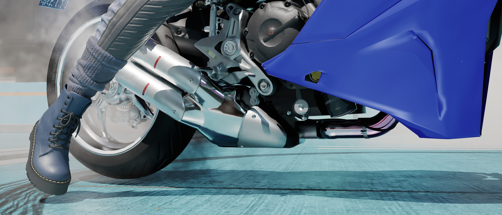

# Overheating Parts on Vehicles

To add further detail to your vehicle mods, you can add the overheating effect often seen on the exhaust pipes of Nomad cars onto your own vehicles.

<table data-full-width="true"><thead><tr><th>Enzo Ferrari</th><th>Lotus Esprit</th><th>Ducati Supersport</th></tr></thead><tbody><tr><td></td><td></td><td></td></tr></tbody></table>

## Theory

The overheating effect requires several pieces to work. As an effect, it requires an `EntEffectSpawnerComponent` to trigger and control the animation. On the mesh itself, the shader works similarly to [decal shaders](https://wiki.redmodding.org/cyberpunk-2077-modding/modding-guides/items-equipment/editing-existing-items/adding-decals), which means that it gets drawn onto whatever geometry is immediately below the overheating mesh. So, for the effect to work, you need a base mesh, for example an exhaust pipe, and a slightly bigger copy of that pipe. Both meshes need to be separate `.mesh` files. The base one uses a [Multilayer](https://wiki.redmodding.org/cyberpunk-2077-modding/for-mod-creators-theory/materials/multilayered) setup for its materials, while the slightly bigger one uses the overheating shader which is controlled by the `EntEffectSpawnerComponent` and styled by properties inside the `.mesh` file.

## Finding Donor Files

### The Mesh File

* Open WolvenKit's Asset Browser and enter "overheat" into its search field.
* Add `v_standard2_thorton_galena_q000__engine_overheating.mesh` to your project.
* Move it to a folder of your choice and rename it to something more managable. In this example, we'll use "supersport\_engine\_overheat".
* Open the file and navigate to `preloadLocalMaterialInstances > overheat > values > MaskTexture`.
* Add `base\vehicles\standard\v_standard2_thorton_galena\entities\meshes\textures\galena_engine_overheat_d01.xbm` to your project.
* [Export](https://wiki.redmodding.org/wolvenkit/wolvenkit-app/tools/tools-import-export) the `.mesh` file to `.glb` and the `.xbm` used by the `MaskTexture` mentioned above to `.png`.

<figure><figcaption></figcaption></figure>

### Adding The Mesh To The App

* Open the `.app` file of your vehicle and navigate to the `components` array of the appearance you want to add the overheating effect to.
* Add a new mesh `component` to the `.app` file of your vehicle by duplicating an existing one.
* Give it an easy to remember name, it'll be important later. Here, we'll use "engine\_overheating".
* If needed, reset necessary values such as the `meshAppearance`, `chunkMask`, and the `localTransform` array. Adjust the settings for the shadows as well and generate a new `CRUID`.
* In this case, we'll be adding the overheating effect to the exhaust pipe which is attached to the body of a motorbike. As such, the `bindName` of the `parentTransform` of the `component` needs to be set to `body_a_01` as that is the name of the `component` of the body.
* Copy the relative path to your `.mesh` file into the `mesh DepotPath` of your `component`.

<figure><figcaption></figcaption></figure>

### The Effect Spawner

* Back inside the Asset Browser, right click on `v_standard2_thorton_galena_q000__engine_overheating.mesh` again and select "Find files using this".
* Right click `v_standard2_thorton_galena__ext01_body_q000_01.ent` and select "Open without adding to project".
* Open its `components` array and scroll down to entry #18 titled `EffectSpawner6660`.
* Right click it and select "Copy from Array/Buffer".
* Go back to the `.app` file of your vehicle, right click the `components` array and select "Paste into Array/Buffer".
* Open the newly created `EntEffectSpawnerComponent` and expand the `effectDescs` dropdown.
* Delete all `entEffectDesc` entries except the one called `overheating`.
* Navigate all the way down to `entEffectDesc overheating > compiledEffectInfo > componentNames`
* Here, you need to enter the name of the `mesh component` which will be overheating. In the tutorial above, the name has been set as "engine\_overheating" and as such doesn't need to be changed inside the `EntEffectSpawnerComponent`.

<figure><figcaption></figcaption></figure>

## Creating The Mesh

<figure><figcaption></figcaption></figure>

### Separating Vertices

* In Blender while in Object Mode, select the Object which contains the exhaust pipe of your vehicle.
* Switch to Edit Mode and select all the vertices of the exhaust pipe.
* Hit `Shift + D` on your keyboard to duplicate them
* Hit `P` and then `Enter` to separate the vertices into a new submesh.
* Scale the separated mesh slightly up for example by using a Shrinkwrap Modifier.

<figure><figcaption></figcaption></figure>

### Add New Material

* Switch to Object Mode and then go to the Shading Workspace and make sure your duplicated exhaust pipe is selected.
* If necessary, remove any materials used by the mesh.
* Create a new material. This should add a Principled BSDF and a Material Output node to the Shader Editor.
* Hit `Shift + A` on your keyboard to add a new Image Texture node.
* Choose `galena_engine_overheat_d01.png`, which we've exported earlier and connect the Color link from the Image Texture Node to the Base Color link on the Principled BSDF node.

<figure><figcaption></figcaption></figure>

### UV Editing

* Switch to the UV Editing Workspace
* Inside the UV Editor on the left, click the dropdown to select an image as the background for the UV Editor and choose `galena_engine_overheat_d01.png`.
* In the 3D Viewport on the right, make sure your overheating mesh is selected and that the Viewport is in Edit Mode.
* Unwrap the UV of the overheating map and place the UV Island of the pipe over a gradient on the image.

White means that the overheating effect is fully applied. The part of the mesh which is white in the Viewport will receive full discoloration. The light grey parts receive no discoloration. The gradient between the two shades fades out the overheating effect. The goal here is to spread the effect evenly across the pipe and to exclude parts which shouldn't overheat. This requires a lot of back and forth between checking how it looks in-game and repositioning/scaling in Blender.

<figure><figcaption></figcaption></figure>

<figure><figcaption>
close up of the UV Island
</figcaption></figure>

* In Blender, export the mesh to `.glb`, overwriting the file we've exported earlier and import it in WolvenKit.
* Open the `.mesh` and navigate to `preloadLocalMaterialInstances > overheat > values` again.
* Leave the values as they are if you want your exhaust pipe to have a smouldering effect. If you only want discoloration, adjust the look of the effect as follows:
  * `Temperature` dictates where the overheating effect on the gradient of the `MaskTexture` starts. Leave it at `25`.
  * `EmissiveEV` is the brightness of the light emitted by the smouldering. setting it to `0` will prevent the pipe from emitting light, which means it'll only be discoloured.
  * `HSV_Mod` allows setting the Hue (X), Saturation (Y), and Value (Z) of the discolouration. Setting X to the hue `0.899999976` and Y to a saturation of `0.660000026` will give it a red-purple-ish tint.
  * `EmissiveAlphaContrast` dictates at what brightness of the `HeatDistribution` image the smouldering effect starts. Setting it to something like 4 removes the smouldering effect.
* Again, a lot of trial and error is required.

<figure><figcaption></figcaption></figure>

<figure><figcaption></figcaption></figure>
